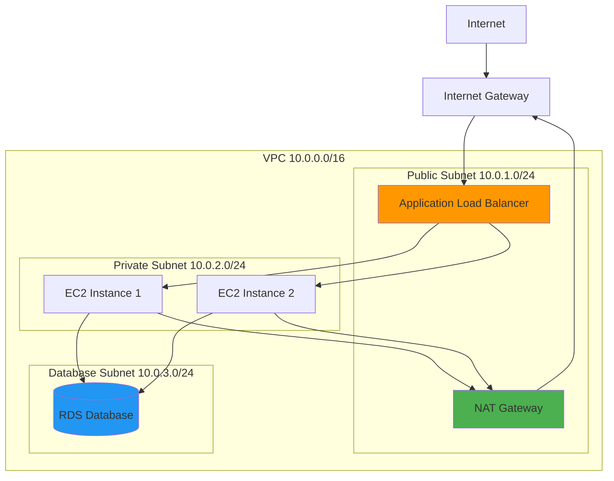
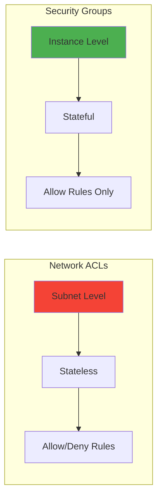

# AWS Cloud Questions ☁️

## Core AWS Services

### 1. Explain the difference between EC2, ECS, EKS, and Lambda

**Answer:**

| Service | Type | Use Case | Management Overhead | Scaling |
|---------|------|----------|-------------------|---------|
| **EC2** | Virtual Machines | General compute, full control | High | Manual/Auto Scaling Groups |
| **ECS** | Container Orchestration | Containerized applications | Medium | Auto Scaling |
| **EKS** | Managed Kubernetes | Complex container workloads | Medium | Kubernetes HPA |
| **Lambda** | Serverless Functions | Event-driven, short tasks | Low | Automatic |

**EC2 (Elastic Compute Cloud):**
```yaml
# EC2 Instance Configuration
instance_config:
  instance_type: "t3.medium"
  ami_id: "ami-0abcdef1234567890"
  security_groups:
    - "web-server-sg"
  user_data: |
    #!/bin/bash
    yum update -y
    yum install -y httpd
    systemctl start httpd
```

**ECS (Elastic Container Service):**
```json
{
  "family": "web-app",
  "networkMode": "awsvpc",
  "requiresCompatibilities": ["FARGATE"],
  "cpu": "256",
  "memory": "512",
  "containerDefinitions": [
    {
      "name": "web-container",
      "image": "nginx:latest",
      "portMappings": [
        {
          "containerPort": 80,
          "protocol": "tcp"
        }
      ]
    }
  ]
}
```

**Lambda Function:**
```python
import json

def lambda_handler(event, context):
    # Process event
    message = event.get('message', 'Hello World')
    
    return {
        'statusCode': 200,
        'body': json.dumps({
            'message': message,
            'timestamp': context.aws_request_id
        })
    }
```

### 2. What are VPC components and how do they work together?

**Answer:**
VPC (Virtual Private Cloud) provides isolated network environment in AWS.



**Core Components:**

**VPC Structure:**
```yaml
vpc_architecture:
  vpc:
    cidr_block: "10.0.0.0/16"
    
  subnets:
    public_subnet_1:
      cidr: "10.0.1.0/24"
      availability_zone: "us-west-2a"
      type: "public"
    
    private_subnet_1:
      cidr: "10.0.2.0/24"
      availability_zone: "us-west-2a"
      type: "private"
    
    database_subnet_1:
      cidr: "10.0.3.0/24"
      availability_zone: "us-west-2a"
      type: "database"
```

**Security Groups vs NACLs:**


**Route Tables:**
```yaml
route_tables:
  public_route_table:
    routes:
      - destination: "0.0.0.0/0"
        target: "internet_gateway"
      - destination: "10.0.0.0/16"
        target: "local"
  
  private_route_table:
    routes:
      - destination: "0.0.0.0/0"
        target: "nat_gateway"
      - destination: "10.0.0.0/16"
        target: "local"
```

**Security Groups vs NACLs:**

| Feature | Security Groups | Network ACLs |
|---------|-----------------|--------------|
| **Level** | Instance level | Subnet level |
| **State** | Stateful | Stateless |
| **Rules** | Allow only | Allow and Deny |
| **Evaluation** | All rules | Rules in order |
| **Default** | Deny all | Allow all |

### 3. Explain AWS IAM concepts and best practices

**Answer:**
IAM (Identity and Access Management) controls access to AWS resources.

**Core Components:**

**Users, Groups, and Roles:**
```json
{
  "IAM_Structure": {
    "Users": "Individual identities for people",
    "Groups": "Collections of users with common permissions",
    "Roles": "Temporary credentials for services/applications",
    "Policies": "JSON documents defining permissions"
  }
}
```

**IAM Policy Example:**
```json
{
  "Version": "2012-10-17",
  "Statement": [
    {
      "Effect": "Allow",
      "Action": [
        "s3:GetObject",
        "s3:PutObject"
      ],
      "Resource": "arn:aws:s3:::my-bucket/*",
      "Condition": {
        "StringEquals": {
          "s3:ExistingObjectTag/Environment": "Production"
        }
      }
    }
  ]
}
```

**IAM Best Practices:**
- **Principle of Least Privilege**: Minimum necessary permissions
- **Use Roles**: For EC2 instances and cross-account access
- **Enable MFA**: Multi-factor authentication for users
- **Regular Audits**: Review and remove unused permissions
- **Use Policy Conditions**: Add additional security constraints

**Cross-Account Role Example:**
```json
{
  "Version": "2012-10-17",
  "Statement": [
    {
      "Effect": "Allow",
      "Principal": {
        "AWS": "arn:aws:iam::ACCOUNT-ID:root"
      },
      "Action": "sts:AssumeRole",
      "Condition": {
        "StringEquals": {
          "sts:ExternalId": "unique-external-id"
        }
      }
    }
  ]
}
```

### 4. What are the different types of load balancers in AWS?

**Answer:**

**Application Load Balancer (ALB):**
- **Layer**: 7 (Application)
- **Protocol**: HTTP/HTTPS
- **Features**: Path-based routing, host-based routing, WebSocket support
- **Use Case**: Web applications, microservices

```yaml
# ALB Target Group Configuration
target_group:
  name: "web-app-targets"
  protocol: "HTTP"
  port: 80
  health_check:
    path: "/health"
    interval: 30
    timeout: 5
    healthy_threshold: 2
    unhealthy_threshold: 3
```

**Network Load Balancer (NLB):**
- **Layer**: 4 (Transport)
- **Protocol**: TCP, UDP, TLS
- **Features**: Ultra-high performance, static IP addresses
- **Use Case**: Gaming, IoT, real-time applications

**Gateway Load Balancer (GWLB):**
- **Layer**: 3 (Network)
- **Protocol**: GENEVE
- **Features**: Transparent network gateway, traffic inspection
- **Use Case**: Firewalls, intrusion detection systems

**Classic Load Balancer (CLB):**
- **Layer**: 4 and 7
- **Protocol**: HTTP, HTTPS, TCP, SSL
- **Status**: Legacy (not recommended for new applications)

### 5. Explain AWS storage services and their use cases

**Answer:**

**S3 (Simple Storage Service):**
```yaml
s3_storage_classes:
  standard:
    use_case: "Frequently accessed data"
    retrieval: "Immediate"
    cost: "Higher storage, no retrieval fee"
  
  standard_ia:
    use_case: "Infrequently accessed data"
    retrieval: "Immediate"
    cost: "Lower storage, retrieval fee"
  
  glacier:
    use_case: "Archive data"
    retrieval: "1-5 minutes to 12 hours"
    cost: "Very low storage, higher retrieval"
  
  glacier_deep_archive:
    use_case: "Long-term archive"
    retrieval: "12-48 hours"
    cost: "Lowest storage, highest retrieval"
```

**EBS (Elastic Block Store):**
```yaml
ebs_volume_types:
  gp3:
    type: "General Purpose SSD"
    iops: "3,000-16,000"
    use_case: "Boot volumes, general workloads"
  
  io2:
    type: "Provisioned IOPS SSD"
    iops: "Up to 64,000"
    use_case: "I/O intensive applications"
  
  st1:
    type: "Throughput Optimized HDD"
    throughput: "Up to 500 MB/s"
    use_case: "Big data, log processing"
```

**EFS (Elastic File System):**
- **Type**: Network File System (NFS)
- **Access**: Multiple EC2 instances simultaneously
- **Use Case**: Content management, web serving, shared application data

## AWS Networking

### 6. How does AWS Direct Connect work?

**Answer:**
Direct Connect provides dedicated network connection from on-premises to AWS.

**Components:**
- **Customer Gateway**: On-premises equipment
- **Direct Connect Location**: AWS partner facility
- **Virtual Interfaces (VIFs)**: Logical connections over physical link
- **Direct Connect Gateway**: Connect to multiple VPCs

**Connection Types:**
```yaml
direct_connect_types:
  dedicated_connection:
    bandwidth: "1 Gbps, 10 Gbps, 100 Gbps"
    customer: "Single customer"
    setup_time: "Weeks to months"
  
  hosted_connection:
    bandwidth: "50 Mbps to 10 Gbps"
    customer: "Shared with AWS partner"
    setup_time: "Days to weeks"
```

**Virtual Interface Configuration:**
```yaml
vif_configuration:
  private_vif:
    purpose: "Access VPC resources"
    routing: "BGP"
    vlan: "Customer specified"
  
  public_vif:
    purpose: "Access AWS public services"
    routing: "BGP with AWS public IP prefixes"
    vlan: "Customer specified"
  
  transit_vif:
    purpose: "Connect to Transit Gateway"
    routing: "BGP"
    scalability: "Multiple VPCs"
```

### 7. What is AWS Transit Gateway and its benefits?

**Answer:**
Transit Gateway acts as a hub that controls how traffic is routed among connected networks.

**Architecture:**
```yaml
transit_gateway_architecture:
  hub_and_spoke:
    center: "Transit Gateway"
    spokes:
      - "VPC-A (Production)"
      - "VPC-B (Development)"  
      - "VPC-C (Shared Services)"
      - "On-premises network"
      - "Partner network"
```

**Benefits:**
- **Simplified Connectivity**: Single point of connection
- **Scalability**: Supports thousands of VPCs
- **Centralized Routing**: Simplified route management
- **Cross-Region Peering**: Connect across AWS regions

**Route Table Configuration:**
```yaml
route_tables:
  production_rt:
    routes:
      - cidr: "10.1.0.0/16"
        target: "vpc-prod"
      - cidr: "192.168.0.0/16"
        target: "vpn-connection"
    
  development_rt:
    routes:
      - cidr: "10.2.0.0/16"
        target: "vpc-dev"
      - cidr: "10.100.0.0/16"
        target: "vpc-shared-services"
```

## AWS Security

### 8. What are AWS security best practices?

**Answer:**

**Identity and Access Management:**
```yaml
iam_security:
  user_management:
    - "Use IAM users for individuals"
    - "Enable MFA for all users"
    - "Regularly rotate access keys"
    - "Use IAM roles for applications"
  
  policy_management:
    - "Apply principle of least privilege"
    - "Use managed policies when possible"
    - "Regular access reviews"
    - "Use policy conditions for additional security"
```

**Network Security:**
```yaml
network_security:
  vpc_security:
    - "Use private subnets for backend resources"
    - "Implement proper security group rules"
    - "Use NACLs for additional layer"
    - "Enable VPC Flow Logs"
  
  encryption:
    - "Encrypt data in transit (TLS/SSL)"
    - "Encrypt data at rest (KMS)"
    - "Use AWS Certificate Manager"
    - "Implement proper key rotation"
```

**Monitoring and Logging:**
```yaml
monitoring_security:
  cloudtrail:
    - "Enable in all regions"
    - "Log to secure S3 bucket"
    - "Enable log file integrity validation"
    - "Set up CloudWatch alarms"
  
  cloudwatch:
    - "Monitor failed login attempts"
    - "Track API usage patterns"
    - "Set up billing alerts"
    - "Monitor resource usage"
```

### 9. Explain AWS KMS and encryption strategies

**Answer:**
KMS (Key Management Service) provides managed encryption keys for AWS services.

**Key Types:**
```yaml
kms_key_types:
  aws_managed:
    description: "Created and managed by AWS"
    rotation: "Automatic annual rotation"
    cost: "No additional charge"
    use_case: "Default encryption for AWS services"
  
  customer_managed:
    description: "Created and managed by customer"
    rotation: "Optional annual rotation"
    cost: "Monthly charge per key"
    use_case: "Custom encryption requirements"
  
  aws_owned:
    description: "Owned and managed by AWS"
    visibility: "Not visible in customer account"
    use_case: "Internal AWS service encryption"
```

**Encryption Implementation:**
```yaml
# S3 Bucket Encryption
s3_encryption:
  server_side_encryption:
    sse_s3:
      description: "S3 managed keys"
      key_management: "AWS S3"
    
    sse_kms:
      description: "KMS managed keys"
      key_management: "AWS KMS"
      additional_features: "CloudTrail logging, key policies"
    
    sse_c:
      description: "Customer provided keys"
      key_management: "Customer"

# EBS Encryption
ebs_encryption:
  encryption_at_rest: "AWS KMS"
  encryption_in_transit: "Application level"
  key_rotation: "Automatic"
```

### 10. What is AWS Organizations and how does it help with security?

**Answer:**
AWS Organizations provides central management of multiple AWS accounts.

**Organizational Structure:**
```yaml
organization_structure:
  root:
    production_ou:
      accounts:
        - "prod-web-account"
        - "prod-db-account"
        - "prod-monitoring-account"
    
    development_ou:
      accounts:
        - "dev-web-account"
        - "dev-testing-account"
    
    security_ou:
      accounts:
        - "audit-account"
        - "log-archive-account"
        - "security-tools-account"
```

**Service Control Policies (SCPs):**
```json
{
  "Version": "2012-10-17",
  "Statement": [
    {
      "Effect": "Deny",
      "Action": [
        "ec2:TerminateInstances"
      ],
      "Resource": "*",
      "Condition": {
        "StringNotEquals": {
          "aws:PrincipalTag/Department": "DevOps"
        }
      }
    },
    {
      "Effect": "Deny",
      "Action": "organizations:LeaveOrganization",
      "Resource": "*"
    }
  ]
}
```

**Security Benefits:**
- **Centralized Billing**: Consolidated billing and cost management
- **Policy Enforcement**: Organization-wide security policies
- **Account Isolation**: Separate accounts for different environments
- **Audit Trail**: Centralized logging and monitoring
- **Compliance**: Easier compliance management across accounts

## AWS Automation and DevOps

### 11. How do you implement Infrastructure as Code with CloudFormation?

**Answer:**
CloudFormation enables defining AWS infrastructure using JSON or YAML templates.

**Template Structure:**
```yaml
# CloudFormation template example
AWSTemplateFormatVersion: '2010-09-09'
Description: 'Web application infrastructure'

Parameters:
  EnvironmentName:
    Description: Environment name prefix
    Type: String
    Default: dev
    AllowedValues: [dev, staging, prod]

Mappings:
  EnvironmentMap:
    dev:
      InstanceType: t3.micro
      MinSize: 1
      MaxSize: 2
    prod:
      InstanceType: t3.medium
      MinSize: 2
      MaxSize: 10

Resources:
  VPC:
    Type: AWS::EC2::VPC
    Properties:
      CidrBlock: 10.0.0.0/16
      EnableDnsHostnames: true
      EnableDnsSupport: true
      Tags:
        - Key: Name
          Value: !Sub ${EnvironmentName}-VPC

  PublicSubnet:
    Type: AWS::EC2::Subnet
    Properties:
      VpcId: !Ref VPC
      CidrBlock: 10.0.1.0/24
      AvailabilityZone: !Select [0, !GetAZs '']
      MapPublicIpOnLaunch: true

  LaunchTemplate:
    Type: AWS::EC2::LaunchTemplate
    Properties:
      LaunchTemplateName: !Sub ${EnvironmentName}-launch-template
      LaunchTemplateData:
        ImageId: ami-0abcdef1234567890
        InstanceType: !FindInMap [EnvironmentMap, !Ref EnvironmentName, InstanceType]
        SecurityGroupIds:
          - !Ref WebServerSecurityGroup
        UserData:
          Fn::Base64: !Sub |
            #!/bin/bash
            yum update -y
            yum install -y httpd
            systemctl start httpd
            systemctl enable httpd

Outputs:
  VPCId:
    Description: VPC ID
    Value: !Ref VPC
    Export:
      Name: !Sub ${EnvironmentName}-VPC-ID

  LoadBalancerDNS:
    Description: Load Balancer DNS Name
    Value: !GetAtt LoadBalancer.DNSName
```

**Best Practices:**
- **Use Parameters**: Make templates reusable
- **Implement Mappings**: Environment-specific configurations
- **Cross-Stack References**: Use Outputs and Imports
- **Nested Stacks**: Break large templates into smaller ones
- **Version Control**: Store templates in Git

### 12. What is AWS CodePipeline and how do you create CI/CD pipelines?

**Answer:**
CodePipeline is a continuous integration and deployment service for AWS.

**Pipeline Configuration:**
```yaml
# CodePipeline definition
pipeline_structure:
  source_stage:
    action_provider: "GitHub"
    configuration:
      repository: "my-app-repo"
      branch: "main"
      oauth_token: "{{resolve:secretsmanager:github-token}}"
  
  build_stage:
    action_provider: "CodeBuild"
    configuration:
      project_name: "my-app-build"
      environment:
        compute_type: "BUILD_GENERAL1_MEDIUM"
        image: "aws/codebuild/amazonlinux2-x86_64-standard:3.0"
  
  deploy_stage:
    action_provider: "CloudFormation"
    configuration:
      action_mode: "CREATE_UPDATE"
      stack_name: "my-app-stack"
      template_path: "infrastructure/template.yaml"
```

**CodeBuild Configuration:**
```yaml
# buildspec.yml
version: 0.2

phases:
  pre_build:
    commands:
      - echo Logging in to Amazon ECR...
      - aws ecr get-login-password --region $AWS_DEFAULT_REGION | docker login --username AWS --password-stdin $AWS_ACCOUNT_ID.dkr.ecr.$AWS_DEFAULT_REGION.amazonaws.com
  
  build:
    commands:
      - echo Build started on `date`
      - echo Building the Docker image...
      - docker build -t $IMAGE_REPO_NAME:$IMAGE_TAG .
      - docker tag $IMAGE_REPO_NAME:$IMAGE_TAG $AWS_ACCOUNT_ID.dkr.ecr.$AWS_DEFAULT_REGION.amazonaws.com/$IMAGE_REPO_NAME:$IMAGE_TAG
  
  post_build:
    commands:
      - echo Build completed on `date`
      - echo Pushing the Docker image...
      - docker push $AWS_ACCOUNT_ID.dkr.ecr.$AWS_DEFAULT_REGION.amazonaws.com/$IMAGE_REPO_NAME:$IMAGE_TAG

artifacts:
  files:
    - '**/*'
```

**Multi-Environment Pipeline:**
```yaml
multi_env_pipeline:
  stages:
    1_source:
      provider: "GitHub"
      output_artifacts: ["source_output"]
    
    2_build:
      provider: "CodeBuild"
      input_artifacts: ["source_output"]
      output_artifacts: ["build_output"]
    
    3_deploy_dev:
      provider: "CloudFormation"
      input_artifacts: ["build_output"]
      configuration:
        stack_name: "myapp-dev"
        parameter_overrides: |
          Environment=dev
          InstanceType=t3.micro
    
    4_manual_approval:
      provider: "Manual"
      configuration:
        notification_arn: "arn:aws:sns:region:account:approval-topic"
    
    5_deploy_prod:
      provider: "CloudFormation"
      input_artifacts: ["build_output"]
      configuration:
        stack_name: "myapp-prod"
        parameter_overrides: |
          Environment=prod
          InstanceType=t3.large
```