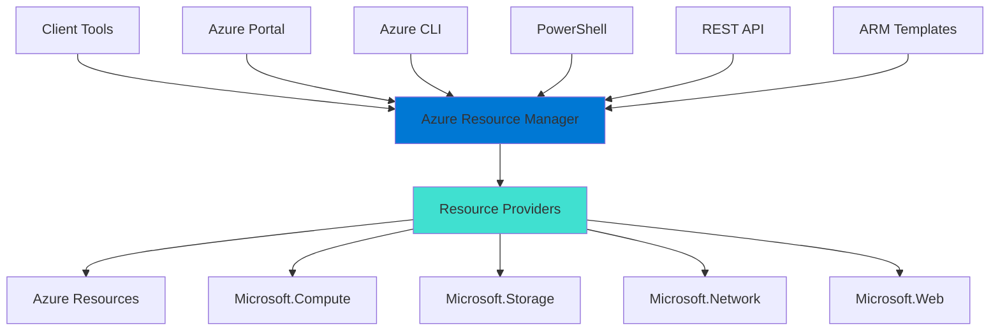
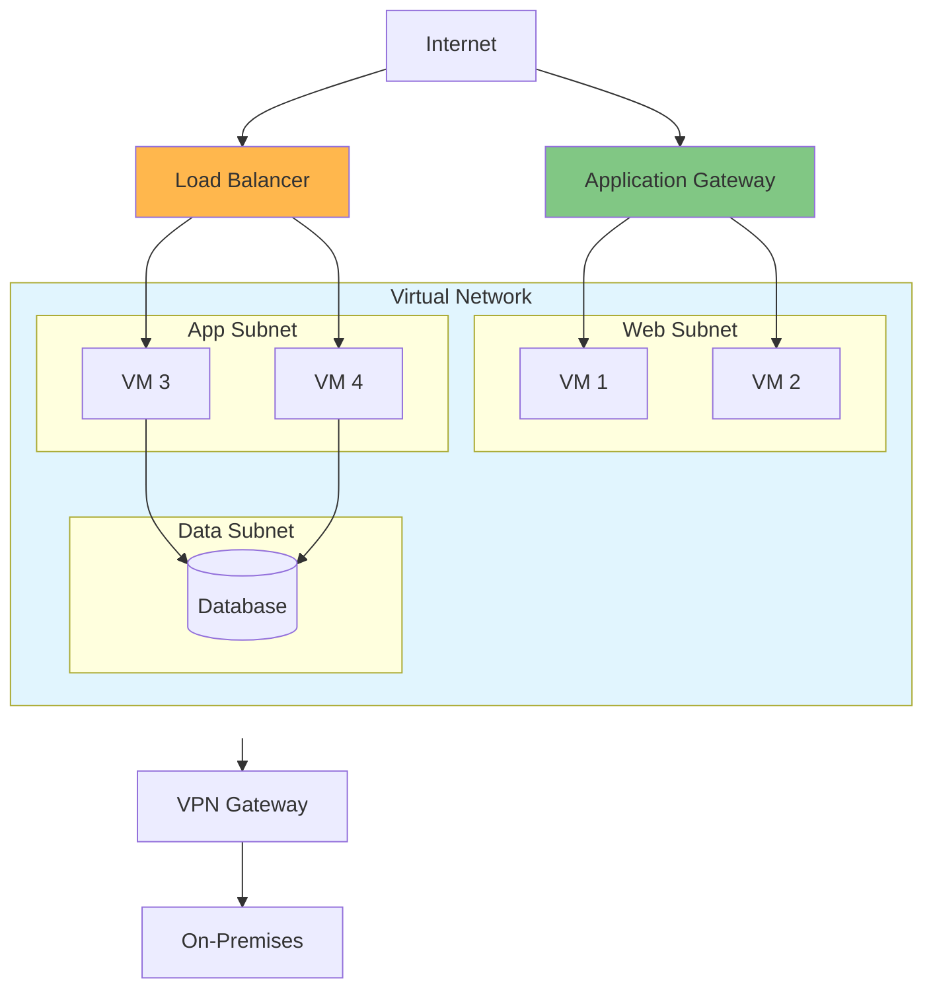
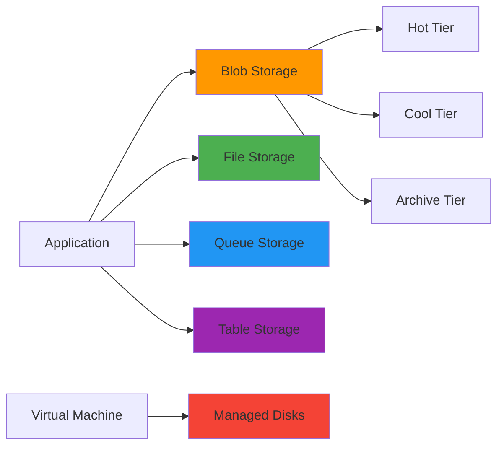
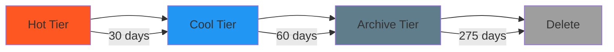
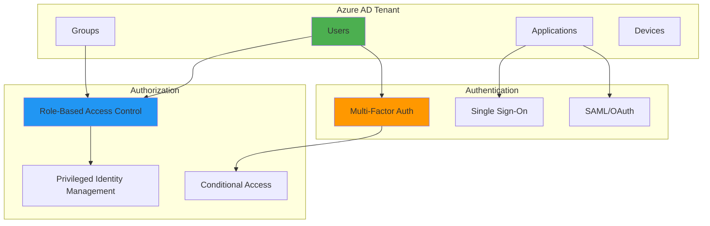
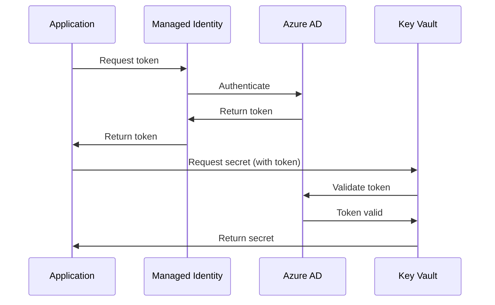
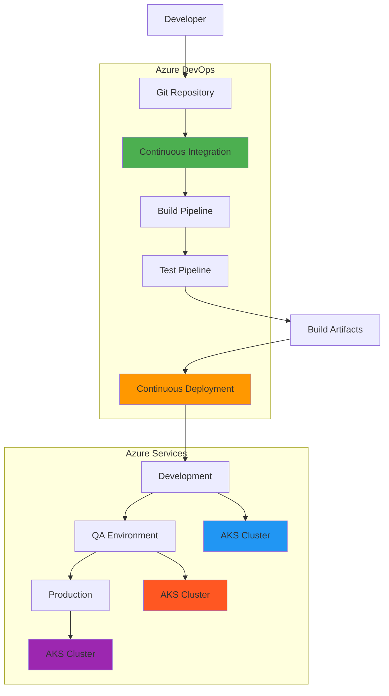
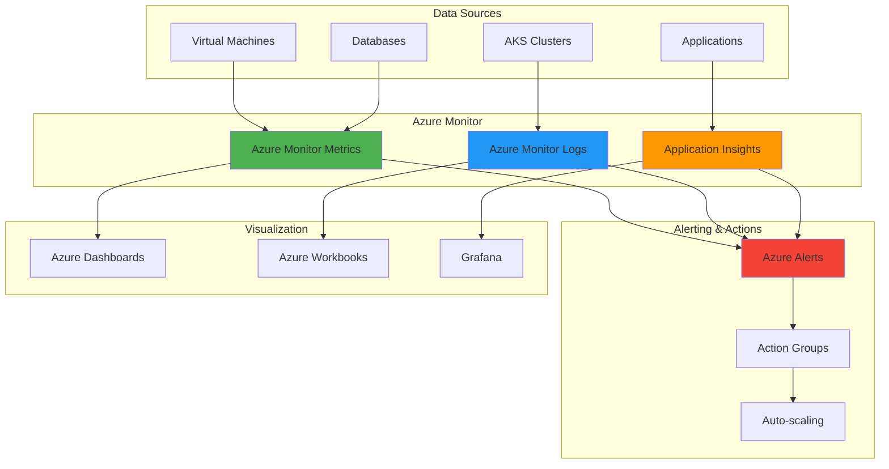
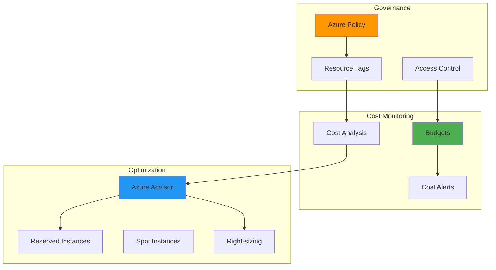
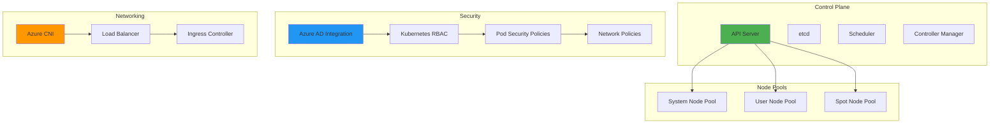

# Microsoft Azure Interview Questions 🌐

## Core Azure Services

### 1. Explain Azure's main compute services and their use cases

**Answer:**

| Service | Type | Use Case | Management | Scaling |
|---------|------|----------|------------|---------|
| **Virtual Machines** | IaaS | Full control, legacy apps | High | VM Scale Sets |
| **App Service** | PaaS | Web apps, APIs | Low | Auto-scaling |
| **Container Instances** | CaaS | Simple containerization | Low | Manual |
| **Kubernetes Service (AKS)** | CaaS | Container orchestration | Medium | HPA/VPA |
| **Functions** | FaaS | Event-driven, serverless | Minimal | Automatic |

**Azure Virtual Machines:**
```yaml
# ARM Template for VM
vm_config:
  vmSize: "Standard_B2s"
  imageReference:
    publisher: "Canonical"
    offer: "0001-com-ubuntu-server-focal"
    sku: "20_04-lts-gen2"
  osProfile:
    computerName: "webserver"
    adminUsername: "azureuser"
    linuxConfiguration:
      disablePasswordAuthentication: true
      ssh:
        publicKeys:
          - path: "/home/azureuser/.ssh/authorized_keys"
            keyData: "ssh-rsa AAAAB3N..."
```

### 2. What is Azure Resource Manager (ARM) and how does it work?

**Answer:**

Azure Resource Manager is the deployment and management service for Azure that provides a management layer for creating, updating, and deleting resources.



**ARM Template Example:**
```json
{
  "$schema": "https://schema.management.azure.com/schemas/2019-04-01/deploymentTemplate.json#",
  "contentVersion": "1.0.0.0",
  "parameters": {
    "storageAccountName": {
      "type": "string",
      "metadata": {
        "description": "Name of the storage account"
      }
    }
  },
  "resources": [
    {
      "type": "Microsoft.Storage/storageAccounts",
      "apiVersion": "2021-02-01",
      "name": "[parameters('storageAccountName')]",
      "location": "[resourceGroup().location]",
      "sku": {
        "name": "Standard_LRS"
      },
      "kind": "StorageV2",
      "properties": {
        "accessTier": "Hot"
      }
    }
  ]
}
```

### 3. Explain Azure networking components and how they work together

**Answer:**

Azure networking provides connectivity between Azure resources, on-premises networks, and the internet.



**Network Security Group Example:**
```json
{
  "type": "Microsoft.Network/networkSecurityGroups",
  "name": "web-nsg",
  "properties": {
    "securityRules": [
      {
        "name": "Allow-HTTP",
        "properties": {
          "protocol": "Tcp",
          "sourcePortRange": "*",
          "destinationPortRange": "80",
          "sourceAddressPrefix": "*",
          "destinationAddressPrefix": "*",
          "access": "Allow",
          "priority": 100,
          "direction": "Inbound"
        }
      },
      {
        "name": "Allow-HTTPS",
        "properties": {
          "protocol": "Tcp",
          "sourcePortRange": "*",
          "destinationPortRange": "443",
          "sourceAddressPrefix": "*",
          "destinationAddressPrefix": "*",
          "access": "Allow",
          "priority": 110,
          "direction": "Inbound"
        }
      }
    ]
  }
}
```

## Azure Storage Services

### 4. Compare Azure Storage types and their use cases

**Answer:**

| Storage Type | Performance | Use Case | Pricing | Redundancy Options |
|--------------|-------------|----------|---------|-------------------|
| **Blob Storage** | Standard/Premium | Object storage, data lakes | Low | LRS, ZRS, GRS, RA-GRS |
| **File Storage** | Standard/Premium | File shares, lift-and-shift | Medium | LRS, ZRS, GRS |
| **Queue Storage** | Standard | Message queuing | Low | LRS, ZRS, GRS |
| **Table Storage** | Standard | NoSQL key-value | Low | LRS, ZRS, GRS |
| **Disk Storage** | Standard/Premium/Ultra | VM disks | Varies | LRS, ZRS |



### 5. How do you implement Azure Blob Storage lifecycle management?

**Answer:**

```json
{
  "rules": [
    {
      "name": "transitionToCool",
      "type": "Lifecycle",
      "definition": {
        "filters": {
          "blobTypes": ["blockBlob"],
          "prefixMatch": ["logs/"]
        },
        "actions": {
          "baseBlob": {
            "tierToCool": {
              "daysAfterModificationGreaterThan": 30
            },
            "tierToArchive": {
              "daysAfterModificationGreaterThan": 90
            },
            "delete": {
              "daysAfterModificationGreaterThan": 365
            }
          }
        }
      }
    }
  ]
}
```



## Azure Identity and Security

### 6. Explain Azure Active Directory and its components

**Answer:**

Azure AD is Microsoft's cloud-based identity and access management service.



**Custom Role Definition:**
```json
{
  "Name": "Virtual Machine Operator",
  "Description": "Can monitor and restart virtual machines",
  "Actions": [
    "Microsoft.Compute/virtualMachines/read",
    "Microsoft.Compute/virtualMachines/start/action",
    "Microsoft.Compute/virtualMachines/restart/action"
  ],
  "NotActions": [
    "Microsoft.Compute/virtualMachines/delete"
  ],
  "AssignableScopes": [
    "/subscriptions/{subscription-id}/resourceGroups/production"
  ]
}
```

### 7. How do you implement Azure Key Vault for secrets management?

**Answer:**

```powershell
# Create Key Vault
az keyvault create \
  --name "myKeyVault" \
  --resource-group "myResourceGroup" \
  --location "East US" \
  --enable-soft-delete \
  --enable-purge-protection

# Store secret
az keyvault secret set \
  --vault-name "myKeyVault" \
  --name "DatabaseConnectionString" \
  --value "Server=myserver;Database=mydb;User=user;Password=pass"

# Grant access to managed identity
az keyvault set-policy \
  --name "myKeyVault" \
  --object-id "{managed-identity-id}" \
  --secret-permissions get list
```



## Azure DevOps and CI/CD

### 8. Design an Azure DevOps CI/CD pipeline architecture

**Answer:**



**Azure Pipeline YAML:**
```yaml
trigger:
  branches:
    include:
      - main
      - develop

pool:
  vmImage: 'ubuntu-latest'

variables:
  buildConfiguration: 'Release'
  imageName: 'myapp'
  containerRegistry: 'myregistry.azurecr.io'

stages:
- stage: Build
  jobs:
  - job: BuildAndTest
    steps:
    - task: DotNetCoreCLI@2
      displayName: 'Build application'
      inputs:
        command: 'build'
        configuration: '$(buildConfiguration)'
    
    - task: DotNetCoreCLI@2
      displayName: 'Run tests'
      inputs:
        command: 'test'
        projects: '**/*Tests.csproj'
    
    - task: Docker@2
      displayName: 'Build and push image'
      inputs:
        containerRegistry: '$(containerRegistry)'
        repository: '$(imageName)'
        command: 'buildAndPush'
        Dockerfile: '**/Dockerfile'

- stage: Deploy
  dependsOn: Build
  jobs:
  - deployment: DeployToAKS
    environment: 'production'
    strategy:
      runOnce:
        deploy:
          steps:
          - task: KubernetesManifest@0
            displayName: 'Deploy to AKS'
            inputs:
              action: 'deploy'
              manifests: '$(Pipeline.Workspace)/manifests/*.yaml'
```

## Azure Monitoring and Logging

### 9. How do you implement comprehensive monitoring in Azure?

**Answer:**



**Application Insights Configuration:**
```json
{
  "ApplicationInsights": {
    "InstrumentationKey": "your-instrumentation-key",
    "EnableAdaptiveSampling": true,
    "EnableQuickPulseMetricStream": true,
    "EnableHeartbeat": true,
    "EnableDiagnosticsTelemetryModule": true
  },
  "Logging": {
    "LogLevel": {
      "Default": "Information",
      "Microsoft": "Warning",
      "Microsoft.Hosting.Lifetime": "Information"
    },
    "ApplicationInsights": {
      "LogLevel": {
        "Default": "Information"
      }
    }
  }
}
```

### 10. Explain Azure Cost Management and optimization strategies

**Answer:**



**Cost Management Strategies:**

1. **Resource Tagging:**
```json
{
  "tags": {
    "Environment": "Production",
    "Project": "WebApp",
    "Owner": "DevTeam",
    "CostCenter": "IT-001",
    "AutoShutdown": "Yes"
  }
}
```

2. **Auto-shutdown Policy:**
```json
{
  "properties": {
    "displayName": "Auto-shutdown VMs",
    "policyRule": {
      "if": {
        "allOf": [
          {
            "field": "type",
            "equals": "Microsoft.Compute/virtualMachines"
          },
          {
            "field": "tags['Environment']",
            "equals": "Development"
          }
        ]
      },
      "then": {
        "effect": "deployIfNotExists",
        "details": {
          "type": "Microsoft.DevTestLab/schedules",
          "name": "[concat('shutdown-computevm-', resourceGroup().name)]"
        }
      }
    }
  }
}
```

## Azure Kubernetes Service (AKS)

### 11. How do you design and implement an AKS cluster with security best practices?

**Answer:**



**AKS Cluster Configuration:**
```yaml
apiVersion: v1
kind: ConfigMap
metadata:
  name: aks-cluster-config
data:
  cluster.yaml: |
    resource_group: "aks-rg"
    cluster_name: "production-aks"
    kubernetes_version: "1.28.0"
    
    node_pools:
      system:
        vm_size: "Standard_DS2_v2"
        node_count: 3
        max_pods: 30
        os_disk_size: 100
        
      user:
        vm_size: "Standard_DS3_v2"
        node_count: 5
        min_count: 3
        max_count: 10
        enable_auto_scaling: true
        
    network:
      network_plugin: "azure"
      service_cidr: "10.0.0.0/16"
      dns_service_ip: "10.0.0.10"
      pod_cidr: "10.244.0.0/16"
      
    security:
      enable_rbac: true
      aad_integration: true
      network_policy: "calico"
      private_cluster: true
```

This comprehensive Azure section covers core services, networking, storage, security, DevOps, monitoring, and Kubernetes. Each question includes practical examples, code snippets, and Mermaid diagrams to illustrate the concepts clearly for interview preparation.