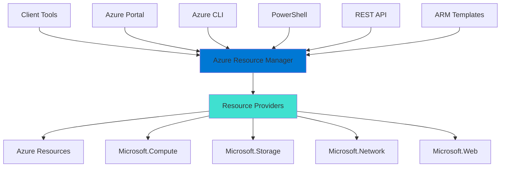
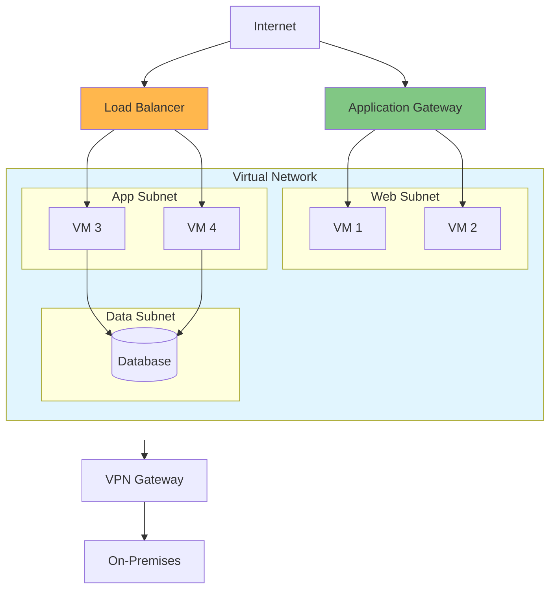
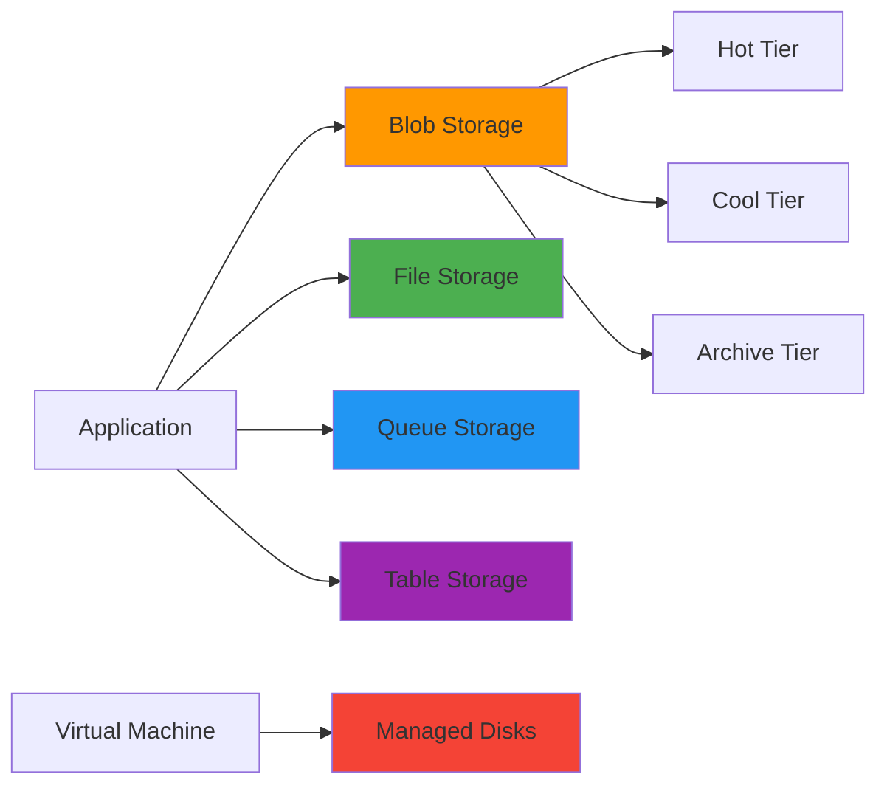
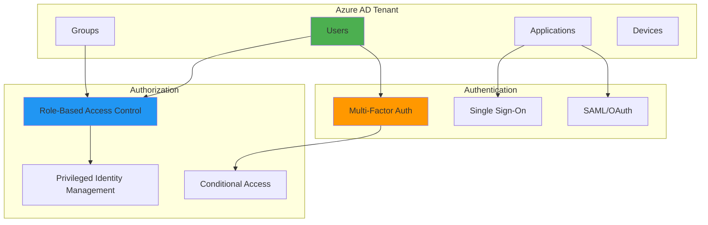
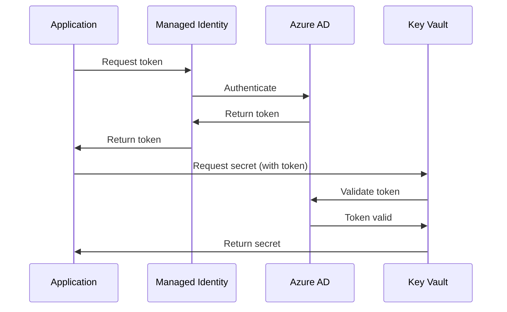
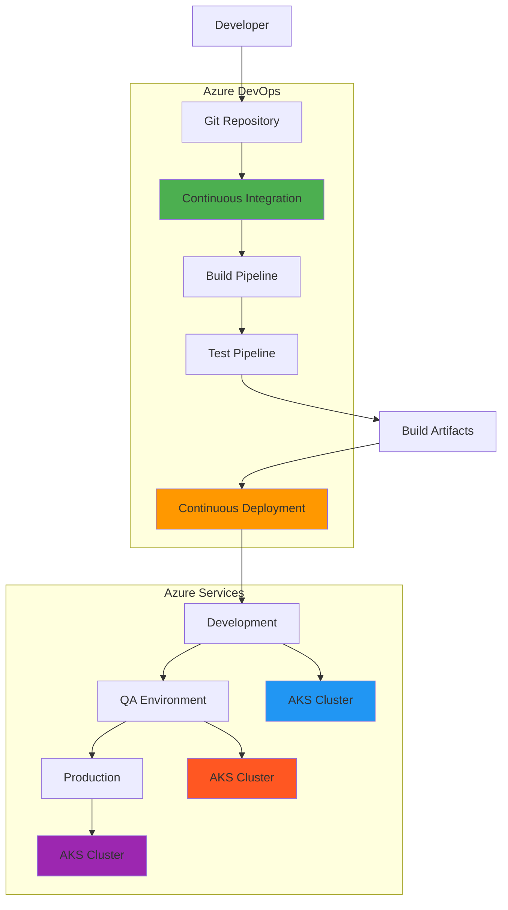
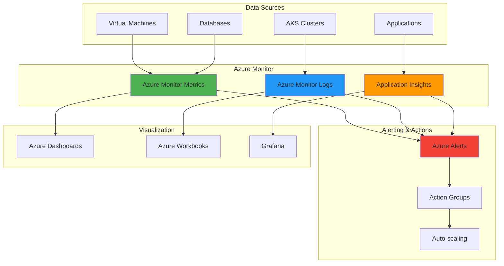
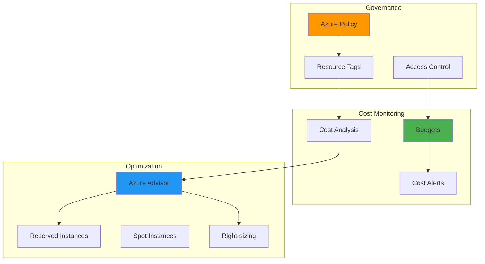
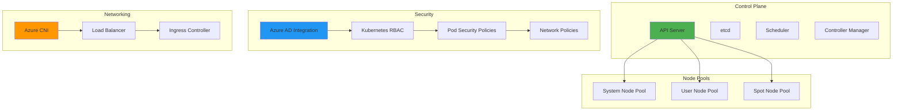

# Microsoft Azure Interview Questions 🌐

## Core Azure Services

### 1. Explain Azure's main compute services and their use cases

**Answer:**

| Service | Type | Use Case | Management | Scaling |
|---------|------|----------|------------|---------|
| **Virtual Machines** | IaaS | Full control, legacy apps | High | VM Scale Sets |
| **App Service** | PaaS | Web apps, APIs | Low | Auto-scaling |
| **Container Instances** | CaaS | Simple containerization | Low | Manual |
| **Kubernetes Service (AKS)** | CaaS | Container orchestration | Medium | HPA/VPA |
| **Functions** | FaaS | Event-driven, serverless | Minimal | Automatic |

**Azure Virtual Machines:**
```yaml
# ARM Template for VM
vm_config:
  vmSize: "Standard_B2s"
  imageReference:
    publisher: "Canonical"
    offer: "0001-com-ubuntu-server-focal"
    sku: "20_04-lts-gen2"
  osProfile:
    computerName: "webserver"
    adminUsername: "azureuser"
    linuxConfiguration:
      disablePasswordAuthentication: true
      ssh:
        publicKeys:
          - path: "/home/azureuser/.ssh/authorized_keys"
            keyData: "ssh-rsa AAAAB3N..."
```

### 2. What is Azure Resource Manager (ARM) and how does it work?

**Answer:**

Azure Resource Manager is the deployment and management service for Azure that provides a management layer for creating, updating, and deleting resources.



**ARM Template Example:**
```json
{
  "$schema": "https://schema.management.azure.com/schemas/2019-04-01/deploymentTemplate.json#",
  "contentVersion": "1.0.0.0",
  "parameters": {
    "storageAccountName": {
      "type": "string",
      "metadata": {
        "description": "Name of the storage account"
      }
    }
  },
  "resources": [
    {
      "type": "Microsoft.Storage/storageAccounts",
      "apiVersion": "2021-02-01",
      "name": "[parameters('storageAccountName')]",
      "location": "[resourceGroup().location]",
      "sku": {
        "name": "Standard_LRS"
      },
      "kind": "StorageV2",
      "properties": {
        "accessTier": "Hot"
      }
    }
  ]
}
```

### 3. Explain Azure networking components and how they work together

**Answer:**

Azure networking provides connectivity between Azure resources, on-premises networks, and the internet.



**Network Security Group Example:**
```json
{
  "type": "Microsoft.Network/networkSecurityGroups",
  "name": "web-nsg",
  "properties": {
    "securityRules": [
      {
        "name": "Allow-HTTP",
        "properties": {
          "protocol": "Tcp",
          "sourcePortRange": "*",
          "destinationPortRange": "80",
          "sourceAddressPrefix": "*",
          "destinationAddressPrefix": "*",
          "access": "Allow",
          "priority": 100,
          "direction": "Inbound"
        }
      },
      {
        "name": "Allow-HTTPS",
        "properties": {
          "protocol": "Tcp",
          "sourcePortRange": "*",
          "destinationPortRange": "443",
          "sourceAddressPrefix": "*",
          "destinationAddressPrefix": "*",
          "access": "Allow",
          "priority": 110,
          "direction": "Inbound"
        }
      }
    ]
  }
}
```

## Azure Storage Services

### 4. Compare Azure Storage types and their use cases

**Answer:**

| Storage Type | Performance | Use Case | Pricing | Redundancy Options |
|--------------|-------------|----------|---------|-------------------|
| **Blob Storage** | Standard/Premium | Object storage, data lakes | Low | LRS, ZRS, GRS, RA-GRS |
| **File Storage** | Standard/Premium | File shares, lift-and-shift | Medium | LRS, ZRS, GRS |
| **Queue Storage** | Standard | Message queuing | Low | LRS, ZRS, GRS |
| **Table Storage** | Standard | NoSQL key-value | Low | LRS, ZRS, GRS |
| **Disk Storage** | Standard/Premium/Ultra | VM disks | Varies | LRS, ZRS |



### 5. How do you implement Azure Blob Storage lifecycle management?

**Answer:**

```json
{
  "rules": [
    {
      "name": "transitionToCool",
      "type": "Lifecycle",
      "definition": {
        "filters": {
          "blobTypes": ["blockBlob"],
          "prefixMatch": ["logs/"]
        },
        "actions": {
          "baseBlob": {
            "tierToCool": {
              "daysAfterModificationGreaterThan": 30
            },
            "tierToArchive": {
              "daysAfterModificationGreaterThan": 90
            },
            "delete": {
              "daysAfterModificationGreaterThan": 365
            }
          }
        }
      }
    }
  ]
}
```


## Azure Identity and Security

### 6. Explain Azure Active Directory and its components

**Answer:**

Azure AD is Microsoft's cloud-based identity and access management service.



**Custom Role Definition:**
```json
{
  "Name": "Virtual Machine Operator",
  "Description": "Can monitor and restart virtual machines",
  "Actions": [
    "Microsoft.Compute/virtualMachines/read",
    "Microsoft.Compute/virtualMachines/start/action",
    "Microsoft.Compute/virtualMachines/restart/action"
  ],
  "NotActions": [
    "Microsoft.Compute/virtualMachines/delete"
  ],
  "AssignableScopes": [
    "/subscriptions/{subscription-id}/resourceGroups/production"
  ]
}
```

### 7. How do you implement Azure Key Vault for secrets management?

**Answer:**

```powershell
# Create Key Vault
az keyvault create \
  --name "myKeyVault" \
  --resource-group "myResourceGroup" \
  --location "East US" \
  --enable-soft-delete \
  --enable-purge-protection

# Store secret
az keyvault secret set \
  --vault-name "myKeyVault" \
  --name "DatabaseConnectionString" \
  --value "Server=myserver;Database=mydb;User=user;Password=pass"

# Grant access to managed identity
az keyvault set-policy \
  --name "myKeyVault" \
  --object-id "{managed-identity-id}" \
  --secret-permissions get list
```



## Azure DevOps and CI/CD

### 8. Design an Azure DevOps CI/CD pipeline architecture

**Answer:**



**Azure Pipeline YAML:**
```yaml
trigger:
  branches:
    include:
      - main
      - develop

pool:
  vmImage: 'ubuntu-latest'

variables:
  buildConfiguration: 'Release'
  imageName: 'myapp'
  containerRegistry: 'myregistry.azurecr.io'

stages:
- stage: Build
  jobs:
  - job: BuildAndTest
    steps:
    - task: DotNetCoreCLI@2
      displayName: 'Build application'
      inputs:
        command: 'build'
        configuration: '$(buildConfiguration)'
    
    - task: DotNetCoreCLI@2
      displayName: 'Run tests'
      inputs:
        command: 'test'
        projects: '**/*Tests.csproj'
    
    - task: Docker@2
      displayName: 'Build and push image'
      inputs:
        containerRegistry: '$(containerRegistry)'
        repository: '$(imageName)'
        command: 'buildAndPush'
        Dockerfile: '**/Dockerfile'

- stage: Deploy
  dependsOn: Build
  jobs:
  - deployment: DeployToAKS
    environment: 'production'
    strategy:
      runOnce:
        deploy:
          steps:
          - task: KubernetesManifest@0
            displayName: 'Deploy to AKS'
            inputs:
              action: 'deploy'
              manifests: '$(Pipeline.Workspace)/manifests/*.yaml'
```

## Azure Monitoring and Logging

### 9. How do you implement comprehensive monitoring in Azure?

**Answer:**



**Application Insights Configuration:**
```json
{
  "ApplicationInsights": {
    "InstrumentationKey": "your-instrumentation-key",
    "EnableAdaptiveSampling": true,
    "EnableQuickPulseMetricStream": true,
    "EnableHeartbeat": true,
    "EnableDiagnosticsTelemetryModule": true
  },
  "Logging": {
    "LogLevel": {
      "Default": "Information",
      "Microsoft": "Warning",
      "Microsoft.Hosting.Lifetime": "Information"
    },
    "ApplicationInsights": {
      "LogLevel": {
        "Default": "Information"
      }
    }
  }
}
```

### 10. Explain Azure Cost Management and optimization strategies

**Answer:**



**Cost Management Strategies:**

1. **Resource Tagging:**
```json
{
  "tags": {
    "Environment": "Production",
    "Project": "WebApp",
    "Owner": "DevTeam",
    "CostCenter": "IT-001",
    "AutoShutdown": "Yes"
  }
}
```

2. **Auto-shutdown Policy:**
```json
{
  "properties": {
    "displayName": "Auto-shutdown VMs",
    "policyRule": {
      "if": {
        "allOf": [
          {
            "field": "type",
            "equals": "Microsoft.Compute/virtualMachines"
          },
          {
            "field": "tags['Environment']",
            "equals": "Development"
          }
        ]
      },
      "then": {
        "effect": "deployIfNotExists",
        "details": {
          "type": "Microsoft.DevTestLab/schedules",
          "name": "[concat('shutdown-computevm-', resourceGroup().name)]"
        }
      }
    }
  }
}
```

## Azure Kubernetes Service (AKS)

### 11. How do you design and implement an AKS cluster with security best practices?

**Answer:**



**AKS Cluster Configuration:**
```yaml
apiVersion: v1
kind: ConfigMap
metadata:
  name: aks-cluster-config
data:
  cluster.yaml: |
    resource_group: "aks-rg"
    cluster_name: "production-aks"
    kubernetes_version: "1.28.0"
    
    node_pools:
      system:
        vm_size: "Standard_DS2_v2"
        node_count: 3
        max_pods: 30
        os_disk_size: 100
        
      user:
        vm_size: "Standard_DS3_v2"
        node_count: 5
        min_count: 3
        max_count: 10
        enable_auto_scaling: true
        
    network:
      network_plugin: "azure"
      service_cidr: "10.0.0.0/16"
      dns_service_ip: "10.0.0.10"
      pod_cidr: "10.244.0.0/16"
      
    security:
      enable_rbac: true
      aad_integration: true
      network_policy: "calico"
      private_cluster: true
```

This comprehensive Azure section covers core services, networking, storage, security, DevOps, monitoring, and Kubernetes. Each question includes practical examples, code snippets, and Mermaid diagrams to illustrate the concepts clearly for interview preparation.

## Azure Automation and DevOps Integration

### 12. Automate Azure deployments with Python and PowerShell

**Answer:**

**Python Azure SDK Automation Framework:**
```python
#!/usr/bin/env python3
# azure_automation.py
import os
import sys
import json
import logging
from typing import Dict, List, Optional, Any
from dataclasses import dataclass
from azure.identity import DefaultAzureCredential, ClientSecretCredential
from azure.mgmt.resource import ResourceManagementClient
from azure.mgmt.compute import ComputeManagementClient
from azure.mgmt.network import NetworkManagementClient
from azure.mgmt.storage import StorageManagementClient
from azure.mgmt.monitor import MonitorManagementClient
from azure.mgmt.containerservice import ContainerServiceClient

# Configure logging
logging.basicConfig(level=logging.INFO, format='%(asctime)s - %(levelname)s - %(message)s')
logger = logging.getLogger(__name__)

@dataclass
class AzureConfig:
    """Configuration for Azure operations"""
    subscription_id: str
    resource_group: str
    location: str
    tenant_id: Optional[str] = None
    client_id: Optional[str] = None
    client_secret: Optional[str] = None

class AzureAutomation:
    """Comprehensive Azure automation class"""
    
    def __init__(self, config: AzureConfig):
        self.config = config
        self.credential = self._get_credentials()
        
        # Initialize Azure clients
        self.resource_client = ResourceManagementClient(
            self.credential, config.subscription_id)
        self.compute_client = ComputeManagementClient(
            self.credential, config.subscription_id)
        self.network_client = NetworkManagementClient(
            self.credential, config.subscription_id)
        self.storage_client = StorageManagementClient(
            self.credential, config.subscription_id)
        self.monitor_client = MonitorManagementClient(
            self.credential, config.subscription_id)
        self.container_client = ContainerServiceClient(
            self.credential, config.subscription_id)
    
    def _get_credentials(self):
        """Get Azure credentials"""
        if self.config.client_id and self.config.client_secret:
            return ClientSecretCredential(
                tenant_id=self.config.tenant_id,
                client_id=self.config.client_id,
                client_secret=self.config.client_secret
            )
        else:
            return DefaultAzureCredential()
    
    def create_resource_group(self) -> Dict[str, Any]:
        """Create Azure Resource Group"""
        logger.info(f"Creating resource group: {self.config.resource_group}")
        
        try:
            rg_result = self.resource_client.resource_groups.create_or_update(
                self.config.resource_group,
                {
                    'location': self.config.location,
                    'tags': {
                        'environment': 'automation',
                        'created_by': 'python_script'
                    }
                }
            )
            logger.info(f"Resource group created: {rg_result.name}")
            return {'success': True, 'resource_group': rg_result.name}
        except Exception as e:
            logger.error(f"Failed to create resource group: {e}")
            return {'success': False, 'error': str(e)}
    
    def deploy_virtual_network(self, vnet_name: str, address_space: str = "10.0.0.0/16") -> Dict[str, Any]:
        """Deploy Azure Virtual Network with subnets"""
        logger.info(f"Creating virtual network: {vnet_name}")
        
        try:
            # Create VNet
            vnet_params = {
                'location': self.config.location,
                'address_space': {
                    'address_prefixes': [address_space]
                },
                'subnets': [
                    {
                        'name': 'default',
                        'address_prefix': '10.0.1.0/24'
                    },
                    {
                        'name': 'aks-subnet',
                        'address_prefix': '10.0.2.0/24'
                    },
                    {
                        'name': 'database-subnet',
                        'address_prefix': '10.0.3.0/24'
                    }
                ]
            }
            
            vnet_result = self.network_client.virtual_networks.begin_create_or_update(
                self.config.resource_group,
                vnet_name,
                vnet_params
            ).result()
            
            logger.info(f"Virtual network created: {vnet_result.name}")
            return {'success': True, 'vnet_id': vnet_result.id}
            
        except Exception as e:
            logger.error(f"Failed to create virtual network: {e}")
            return {'success': False, 'error': str(e)}
    
    def create_storage_account(self, account_name: str, account_type: str = "Standard_LRS") -> Dict[str, Any]:
        """Create Azure Storage Account"""
        logger.info(f"Creating storage account: {account_name}")
        
        try:
            storage_params = {
                'location': self.config.location,
                'sku': {'name': account_type},
                'kind': 'StorageV2',
                'access_tier': 'Hot',
                'enable_https_traffic_only': True,
                'minimum_tls_version': 'TLS1_2',
                'allow_blob_public_access': False
            }
            
            storage_result = self.storage_client.storage_accounts.begin_create(
                self.config.resource_group,
                account_name,
                storage_params
            ).result()
            
            logger.info(f"Storage account created: {storage_result.name}")
            return {'success': True, 'storage_account': storage_result.name}
            
        except Exception as e:
            logger.error(f"Failed to create storage account: {e}")
            return {'success': False, 'error': str(e)}
    
    def create_aks_cluster(self, cluster_name: str, node_count: int = 3) -> Dict[str, Any]:
        """Create Azure Kubernetes Service cluster"""
        logger.info(f"Creating AKS cluster: {cluster_name}")
        
        try:
            # Get default subnet for AKS
            vnet_name = f"{self.config.resource_group}-vnet"
            subnet = self.network_client.subnets.get(
                self.config.resource_group, vnet_name, "aks-subnet"
            )
            
            aks_params = {
                'location': self.config.location,
                'dns_prefix': f"{cluster_name}-dns",
                'agent_pool_profiles': [
                    {
                        'name': 'nodepool1',
                        'count': node_count,
                        'vm_size': 'Standard_DS2_v2',
                        'os_type': 'Linux',
                        'vnet_subnet_id': subnet.id,
                        'max_pods': 30
                    }
                ],
                'service_principal_profile': {
                    'client_id': 'msi'  # Use managed identity
                },
                'network_profile': {
                    'network_plugin': 'azure',
                    'service_cidr': '10.0.0.0/16',
                    'dns_service_ip': '10.0.0.10'
                },
                'enable_rbac': True,
                'kubernetes_version': '1.28.0'
            }
            
            aks_result = self.container_client.managed_clusters.begin_create_or_update(
                self.config.resource_group,
                cluster_name,
                aks_params
            ).result()
            
            logger.info(f"AKS cluster created: {aks_result.name}")
            return {'success': True, 'cluster_name': aks_result.name}
            
        except Exception as e:
            logger.error(f"Failed to create AKS cluster: {e}")
            return {'success': False, 'error': str(e)}
    
    def get_resource_costs(self, time_period: str = "30") -> Dict[str, Any]:
        """Get cost analysis for resources"""
        logger.info("Retrieving resource costs...")
        
        try:
            # This is a simplified cost calculation
            # In practice, you'd use the Azure Billing APIs
            resources = self.resource_client.resources.list_by_resource_group(
                self.config.resource_group
            )
            
            cost_breakdown = {}
            total_estimated_cost = 0
            
            for resource in resources:
                # Simplified cost estimation based on resource type
                resource_type = resource.type.split('/')[-1]
                estimated_cost = self._estimate_resource_cost(resource_type)
                cost_breakdown[resource.name] = {
                    'type': resource_type,
                    'estimated_monthly_cost': estimated_cost
                }
                total_estimated_cost += estimated_cost
            
            return {
                'success': True,
                'total_estimated_monthly_cost': total_estimated_cost,
                'currency': 'USD',
                'breakdown': cost_breakdown
            }
            
        except Exception as e:
            logger.error(f"Failed to get cost analysis: {e}")
            return {'success': False, 'error': str(e)}
    
    def _estimate_resource_cost(self, resource_type: str) -> float:
        """Estimate resource cost (simplified)"""
        cost_map = {
            'virtualMachines': 50.0,
            'managedClusters': 100.0,
            'storageAccounts': 5.0,
            'virtualNetworks': 0.0,
            'publicIPAddresses': 3.0,
            'loadBalancers': 20.0
        }
        return cost_map.get(resource_type, 10.0)
    
    def cleanup_resources(self, confirm: bool = False) -> Dict[str, Any]:
        """Cleanup all resources in the resource group"""
        if not confirm:
            logger.warning("Cleanup not confirmed. Use confirm=True to proceed.")
            return {'success': False, 'message': 'Cleanup not confirmed'}
        
        logger.info(f"Cleaning up resource group: {self.config.resource_group}")
        
        try:
            delete_operation = self.resource_client.resource_groups.begin_delete(
                self.config.resource_group
            )
            delete_operation.result()  # Wait for completion
            
            logger.info("Resource group cleanup completed")
            return {'success': True, 'message': 'Cleanup completed'}
            
        except Exception as e:
            logger.error(f"Failed to cleanup resources: {e}")
            return {'success': False, 'error': str(e)}

class AzureInfrastructureManager:
    """High-level infrastructure management"""
    
    def __init__(self, config: AzureConfig):
        self.azure = AzureAutomation(config)
        self.config = config
    
    def deploy_complete_infrastructure(self) -> Dict[str, Any]:
        """Deploy complete infrastructure stack"""
        logger.info("Starting complete infrastructure deployment...")
        
        results = {}
        
        # 1. Create Resource Group
        rg_result = self.azure.create_resource_group()
        results['resource_group'] = rg_result
        
        if not rg_result['success']:
            return results
        
        # 2. Create Virtual Network
        vnet_result = self.azure.deploy_virtual_network(f"{self.config.resource_group}-vnet")
        results['virtual_network'] = vnet_result
        
        # 3. Create Storage Account
        storage_name = f"{self.config.resource_group.replace('-', '')}storage"[:24]
        storage_result = self.azure.create_storage_account(storage_name)
        results['storage_account'] = storage_result
        
        # 4. Create AKS Cluster
        aks_result = self.azure.create_aks_cluster(f"{self.config.resource_group}-aks")
        results['aks_cluster'] = aks_result
        
        # 5. Get cost analysis
        cost_result = self.azure.get_resource_costs()
        results['cost_analysis'] = cost_result
        
        success_count = sum(1 for result in results.values() if result.get('success', False))
        total_operations = len(results)
        
        logger.info(f"Infrastructure deployment completed: {success_count}/{total_operations} operations successful")
        
        results['summary'] = {
            'success_rate': f"{success_count}/{total_operations}",
            'overall_success': success_count == total_operations
        }
        
        return results

def main():
    """Main function for CLI usage"""
    import argparse
    
    parser = argparse.ArgumentParser(description='Azure Infrastructure Automation')
    parser.add_argument('action', choices=['deploy', 'cleanup', 'cost-analysis'],
                       help='Action to perform')
    parser.add_argument('--subscription-id', required=True,
                       help='Azure subscription ID')
    parser.add_argument('--resource-group', required=True,
                       help='Resource group name')
    parser.add_argument('--location', default='East US',
                       help='Azure region')
    parser.add_argument('--confirm-cleanup', action='store_true',
                       help='Confirm resource cleanup')
    
    args = parser.parse_args()
    
    config = AzureConfig(
        subscription_id=args.subscription_id,
        resource_group=args.resource_group,
        location=args.location
    )
    
    if args.action == 'deploy':
        manager = AzureInfrastructureManager(config)
        results = manager.deploy_complete_infrastructure()
        print(json.dumps(results, indent=2, default=str))
    
    elif args.action == 'cleanup':
        azure = AzureAutomation(config)
        result = azure.cleanup_resources(confirm=args.confirm_cleanup)
        print(json.dumps(result, indent=2))
    
    elif args.action == 'cost-analysis':
        azure = AzureAutomation(config)
        result = azure.get_resource_costs()
        print(json.dumps(result, indent=2, default=str))

if __name__ == "__main__":
    main()
```

**PowerShell Azure Resource Management:**
```powershell
# AzureResourceManager.ps1
param(
    [Parameter(Mandatory=$true)]
    [string]$SubscriptionId,
    
    [Parameter(Mandatory=$true)]
    [string]$ResourceGroupName,
    
    [Parameter(Mandatory=$true)]
    [string]$Location,
    
    [Parameter(Mandatory=$false)]
    [ValidateSet("Deploy", "Cleanup", "Monitor")]
    [string]$Action = "Deploy",
    
    [Parameter(Mandatory=$false)]
    [switch]$WhatIf
)

# Import required modules
Import-Module Az.Accounts -Force
Import-Module Az.Resources -Force
Import-Module Az.Storage -Force
Import-Module Az.Network -Force
Import-Module Az.Aks -Force

# Function to write colored output
function Write-ColorOutput {
    param(
        [string]$Message,
        [string]$Color = "White"
    )
    Write-Host $Message -ForegroundColor $Color
}

# Function to log activities
function Write-ActivityLog {
    param(
        [string]$Activity,
        [string]$Status = "INFO"
    )
    $timestamp = Get-Date -Format "yyyy-MM-dd HH:mm:ss"
    Write-ColorOutput "[$timestamp] [$Status] $Activity" -Color $(
        switch ($Status) {
            "INFO" { "Cyan" }
            "SUCCESS" { "Green" }
            "WARNING" { "Yellow" }
            "ERROR" { "Red" }
            default { "White" }
        }
    )
}

# Function to connect to Azure
function Connect-ToAzure {
    try {
        Write-ActivityLog "Connecting to Azure..."
        
        # Check if already connected
        $context = Get-AzContext
        if ($null -eq $context) {
            Connect-AzAccount
        }
        
        # Set subscription context
        Set-AzContext -SubscriptionId $SubscriptionId
        
        Write-ActivityLog "Connected to Azure subscription: $SubscriptionId" -Status "SUCCESS"
        return $true
    }
    catch {
        Write-ActivityLog "Failed to connect to Azure: $($_.Exception.Message)" -Status "ERROR"
        return $false
    }
}

# Function to create resource group
function New-AzureResourceGroup {
    param([string]$Name, [string]$Location)
    
    try {
        Write-ActivityLog "Creating resource group: $Name"
        
        if ($WhatIf) {
            Write-ActivityLog "WHATIF: Would create resource group $Name in $Location" -Status "WARNING"
            return $true
        }
        
        $rg = Get-AzResourceGroup -Name $Name -ErrorAction SilentlyContinue
        if ($null -eq $rg) {
            $rg = New-AzResourceGroup -Name $Name -Location $Location -Tag @{
                Environment = "Automation"
                CreatedBy = "PowerShell"
                CreatedDate = (Get-Date).ToString("yyyy-MM-dd")
            }
        }
        
        Write-ActivityLog "Resource group created/exists: $($rg.ResourceGroupName)" -Status "SUCCESS"
        return $true
    }
    catch {
        Write-ActivityLog "Failed to create resource group: $($_.Exception.Message)" -Status "ERROR"
        return $false
    }
}

# Function to deploy virtual network
function New-AzureVirtualNetwork {
    param(
        [string]$ResourceGroup,
        [string]$VNetName,
        [string]$AddressSpace = "10.0.0.0/16"
    )
    
    try {
        Write-ActivityLog "Creating virtual network: $VNetName"
        
        if ($WhatIf) {
            Write-ActivityLog "WHATIF: Would create VNet $VNetName with address space $AddressSpace" -Status "WARNING"
            return $true
        }
        
        # Create subnets
        $subnet1 = New-AzVirtualNetworkSubnetConfig -Name "default" -AddressPrefix "10.0.1.0/24"
        $subnet2 = New-AzVirtualNetworkSubnetConfig -Name "aks-subnet" -AddressPrefix "10.0.2.0/24"
        $subnet3 = New-AzVirtualNetworkSubnetConfig -Name "database-subnet" -AddressPrefix "10.0.3.0/24"
        
        # Create VNet
        $vnet = New-AzVirtualNetwork -Name $VNetName -ResourceGroupName $ResourceGroup -Location $Location -AddressPrefix $AddressSpace -Subnet $subnet1, $subnet2, $subnet3
        
        Write-ActivityLog "Virtual network created: $($vnet.Name)" -Status "SUCCESS"
        return $true
    }
    catch {
        Write-ActivityLog "Failed to create virtual network: $($_.Exception.Message)" -Status "ERROR"
        return $false
    }
}

# Function to create storage account
function New-AzureStorageAccount {
    param(
        [string]$ResourceGroup,
        [string]$StorageAccountName
    )
    
    try {
        Write-ActivityLog "Creating storage account: $StorageAccountName"
        
        if ($WhatIf) {
            Write-ActivityLog "WHATIF: Would create storage account $StorageAccountName" -Status "WARNING"
            return $true
        }
        
        $storage = New-AzStorageAccount -ResourceGroupName $ResourceGroup -Name $StorageAccountName -Location $Location -SkuName "Standard_LRS" -Kind "StorageV2" -AccessTier "Hot" -EnableHttpsTrafficOnly $true -MinimumTlsVersion "TLS1_2"
        
        Write-ActivityLog "Storage account created: $($storage.StorageAccountName)" -Status "SUCCESS"
        return $true
    }
    catch {
        Write-ActivityLog "Failed to create storage account: $($_.Exception.Message)" -Status "ERROR"
        return $false
    }
}

# Function to create AKS cluster
function New-AzureAKSCluster {
    param(
        [string]$ResourceGroup,
        [string]$ClusterName,
        [int]$NodeCount = 3
    )
    
    try {
        Write-ActivityLog "Creating AKS cluster: $ClusterName"
        
        if ($WhatIf) {
            Write-ActivityLog "WHATIF: Would create AKS cluster $ClusterName with $NodeCount nodes" -Status "WARNING"
            return $true
        }
        
        # Get subnet for AKS
        $vnetName = "$ResourceGroup-vnet"
        $vnet = Get-AzVirtualNetwork -Name $vnetName -ResourceGroupName $ResourceGroup
        $subnet = Get-AzVirtualNetworkSubnetConfig -Name "aks-subnet" -VirtualNetwork $vnet
        
        # Create AKS cluster
        $aks = New-AzAksCluster -ResourceGroupName $ResourceGroup -Name $ClusterName -Location $Location -NodeCount $NodeCount -NodeVmSize "Standard_DS2_v2" -VnetSubnetId $subnet.Id -NetworkPlugin "azure" -ServiceCidr "10.0.0.0/16" -DnsServiceIp "10.0.0.10"
        
        Write-ActivityLog "AKS cluster created: $($aks.Name)" -Status "SUCCESS"
        return $true
    }
    catch {
        Write-ActivityLog "Failed to create AKS cluster: $($_.Exception.Message)" -Status "ERROR"
        return $false
    }
}

# Function to get resource costs
function Get-AzureResourceCosts {
    param([string]$ResourceGroup)
    
    try {
        Write-ActivityLog "Analyzing resource costs for: $ResourceGroup"
        
        $resources = Get-AzResource -ResourceGroupName $ResourceGroup
        $totalCost = 0
        $costBreakdown = @{}
        
        foreach ($resource in $resources) {
            $resourceType = $resource.ResourceType.Split('/')[-1]
            $estimatedCost = switch ($resourceType) {
                "virtualMachines" { 50.0 }
                "managedClusters" { 100.0 }
                "storageAccounts" { 5.0 }
                "virtualNetworks" { 0.0 }
                "publicIPAddresses" { 3.0 }
                "loadBalancers" { 20.0 }
                default { 10.0 }
            }
            
            $costBreakdown[$resource.Name] = @{
                Type = $resourceType
                EstimatedMonthlyCost = $estimatedCost
            }
            $totalCost += $estimatedCost
        }
        
        Write-ActivityLog "Total estimated monthly cost: `$$totalCost" -Status "SUCCESS"
        
        # Display breakdown
        Write-ColorOutput "`nCost Breakdown:" -Color "Yellow"
        foreach ($item in $costBreakdown.GetEnumerator()) {
            Write-ColorOutput "  $($item.Key) ($($item.Value.Type)): `$$($item.Value.EstimatedMonthlyCost)" -Color "Cyan"
        }
        
        return $costBreakdown
    }
    catch {
        Write-ActivityLog "Failed to analyze costs: $($_.Exception.Message)" -Status "ERROR"
        return @{}
    }
}

# Function to cleanup resources
function Remove-AzureResourceGroup {
    param([string]$ResourceGroup)
    
    try {
        Write-ActivityLog "Cleaning up resource group: $ResourceGroup" -Status "WARNING"
        
        if ($WhatIf) {
            Write-ActivityLog "WHATIF: Would remove resource group $ResourceGroup" -Status "WARNING"
            return $true
        }
        
        $confirmation = Read-Host "Are you sure you want to delete resource group '$ResourceGroup' and all its resources? (yes/no)"
        if ($confirmation.ToLower() -eq "yes") {
            Remove-AzResourceGroup -Name $ResourceGroup -Force
            Write-ActivityLog "Resource group cleanup completed" -Status "SUCCESS"
            return $true
        }
        else {
            Write-ActivityLog "Cleanup cancelled by user" -Status "WARNING"
            return $false
        }
    }
    catch {
        Write-ActivityLog "Failed to cleanup resources: $($_.Exception.Message)" -Status "ERROR"
        return $false
    }
}

# Function to monitor resources
function Watch-AzureResources {
    param([string]$ResourceGroup)
    
    try {
        Write-ActivityLog "Monitoring resources in: $ResourceGroup"
        
        $resources = Get-AzResource -ResourceGroupName $ResourceGroup
        
        Write-ColorOutput "`nResource Status:" -Color "Yellow"
        foreach ($resource in $resources) {
            $status = switch ($resource.ResourceType) {
                "Microsoft.Compute/virtualMachines" {
                    $vm = Get-AzVM -ResourceGroupName $ResourceGroup -Name $resource.Name -Status
                    $vm.Statuses | Where-Object { $_.Code -like "PowerState/*" } | Select-Object -ExpandProperty DisplayStatus
                }
                "Microsoft.ContainerService/managedClusters" {
                    $aks = Get-AzAksCluster -ResourceGroupName $ResourceGroup -Name $resource.Name
                    $aks.ProvisioningState
                }
                default { "Running" }
            }
            
            Write-ColorOutput "  $($resource.Name) ($($resource.ResourceType)): $status" -Color "Cyan"
        }
        
        return $true
    }
    catch {
        Write-ActivityLog "Failed to monitor resources: $($_.Exception.Message)" -Status "ERROR"
        return $false
    }
}

# Main execution
function Main {
    Write-ColorOutput "Azure Resource Manager PowerShell Script" -Color "Green"
    Write-ColorOutput "=========================================" -Color "Green"
    
    # Connect to Azure
    if (-not (Connect-ToAzure)) {
        exit 1
    }
    
    switch ($Action) {
        "Deploy" {
            Write-ActivityLog "Starting infrastructure deployment..."
            
            $success = $true
            $success = $success -and (New-AzureResourceGroup -Name $ResourceGroupName -Location $Location)
            $success = $success -and (New-AzureVirtualNetwork -ResourceGroup $ResourceGroupName -VNetName "$ResourceGroupName-vnet")
            
            $storageAccountName = ($ResourceGroupName -replace '-', '').ToLower()
            if ($storageAccountName.Length -gt 24) {
                $storageAccountName = $storageAccountName.Substring(0, 24)
            }
            $storageAccountName += "storage"
            
            $success = $success -and (New-AzureStorageAccount -ResourceGroup $ResourceGroupName -StorageAccountName $storageAccountName)
            $success = $success -and (New-AzureAKSCluster -ResourceGroup $ResourceGroupName -ClusterName "$ResourceGroupName-aks")
            
            if ($success) {
                Write-ActivityLog "Infrastructure deployment completed successfully!" -Status "SUCCESS"
                Get-AzureResourceCosts -ResourceGroup $ResourceGroupName
            }
            else {
                Write-ActivityLog "Infrastructure deployment had some failures" -Status "ERROR"
            }
        }
        
        "Cleanup" {
            Remove-AzureResourceGroup -ResourceGroup $ResourceGroupName
        }
        
        "Monitor" {
            Watch-AzureResources -ResourceGroup $ResourceGroupName
        }
    }
}

# Execute main function
Main
```

**Bash Script for Azure CLI Automation:**
```bash
#!/bin/bash
# azure-automation.sh
set -e

# Configuration
SUBSCRIPTION_ID=""
RESOURCE_GROUP=""
LOCATION="East US"
ACTION=""

# Colors for output
RED='\033[0;31m'
GREEN='\033[0;32m'
YELLOW='\033[1;33m'
BLUE='\033[0;34m'
NC='\033[0m'

# Logging function
log() {
    echo -e "${GREEN}[$(date +'%Y-%m-%d %H:%M:%S')]${NC} $1"
}

error() {
    echo -e "${RED}[ERROR]${NC} $1" >&2
}

warning() {
    echo -e "${YELLOW}[WARNING]${NC} $1"
}

info() {
    echo -e "${BLUE}[INFO]${NC} $1"
}

# Function to check prerequisites
check_prerequisites() {
    log "Checking prerequisites..."
    
    # Check if Azure CLI is installed
    if ! command -v az &> /dev/null; then
        error "Azure CLI is not installed"
        exit 1
    fi
    
    # Check if logged in
    if ! az account show &> /dev/null; then
        error "Not logged in to Azure. Run 'az login' first"
        exit 1
    fi
    
    log "Prerequisites check passed"
}

# Function to set subscription
set_subscription() {
    if [[ -n "$SUBSCRIPTION_ID" ]]; then
        log "Setting subscription to: $SUBSCRIPTION_ID"
        az account set --subscription "$SUBSCRIPTION_ID"
    fi
}

# Function to create resource group
create_resource_group() {
    log "Creating resource group: $RESOURCE_GROUP"
    
    az group create \
        --name "$RESOURCE_GROUP" \
        --location "$LOCATION" \
        --tags environment=automation created_by=bash_script
    
    log "Resource group created successfully"
}

# Function to deploy virtual network
deploy_virtual_network() {
    local vnet_name="${RESOURCE_GROUP}-vnet"
    
    log "Creating virtual network: $vnet_name"
    
    az network vnet create \
        --resource-group "$RESOURCE_GROUP" \
        --name "$vnet_name" \
        --address-prefix 10.0.0.0/16 \
        --subnet-name default \
        --subnet-prefix 10.0.1.0/24
    
    # Create additional subnets
    az network vnet subnet create \
        --resource-group "$RESOURCE_GROUP" \
        --vnet-name "$vnet_name" \
        --name aks-subnet \
        --address-prefix 10.0.2.0/24
    
    az network vnet subnet create \
        --resource-group "$RESOURCE_GROUP" \
        --vnet-name "$vnet_name" \
        --name database-subnet \
        --address-prefix 10.0.3.0/24
    
    log "Virtual network created successfully"
}

# Function to create storage account
create_storage_account() {
    local storage_name=$(echo "${RESOURCE_GROUP}storage" | tr -d '-' | tr '[:upper:]' '[:lower:]')
    
    # Ensure storage name is not too long
    if [[ ${#storage_name} -gt 24 ]]; then
        storage_name=${storage_name:0:24}
    fi
    
    log "Creating storage account: $storage_name"
    
    az storage account create \
        --resource-group "$RESOURCE_GROUP" \
        --name "$storage_name" \
        --location "$LOCATION" \
        --sku Standard_LRS \
        --kind StorageV2 \
        --access-tier Hot \
        --https-only \
        --min-tls-version TLS1_2 \
        --allow-blob-public-access false
    
    log "Storage account created successfully"
}

# Function to create AKS cluster
create_aks_cluster() {
    local cluster_name="${RESOURCE_GROUP}-aks"
    local vnet_name="${RESOURCE_GROUP}-vnet"
    
    log "Creating AKS cluster: $cluster_name"
    
    # Get subnet ID
    local subnet_id=$(az network vnet subnet show \
        --resource-group "$RESOURCE_GROUP" \
        --vnet-name "$vnet_name" \
        --name aks-subnet \
        --query id -o tsv)
    
    az aks create \
        --resource-group "$RESOURCE_GROUP" \
        --name "$cluster_name" \
        --location "$LOCATION" \
        --node-count 3 \
        --node-vm-size Standard_DS2_v2 \
        --vnet-subnet-id "$subnet_id" \
        --network-plugin azure \
        --service-cidr 10.0.0.0/16 \
        --dns-service-ip 10.0.0.10 \
        --enable-addons monitoring \
        --generate-ssh-keys
    
    log "AKS cluster created successfully"
}

# Function to get cost analysis
analyze_costs() {
    log "Analyzing resource costs..."
    
    info "Getting resource list..."
    az resource list --resource-group "$RESOURCE_GROUP" --output table
    
    # Simple cost estimation
    local vm_count=$(az vm list --resource-group "$RESOURCE_GROUP" --query "length(@)" -o tsv)
    local storage_count=$(az storage account list --resource-group "$RESOURCE_GROUP" --query "length(@)" -o tsv)
    local aks_count=$(az aks list --resource-group "$RESOURCE_GROUP" --query "length(@)" -o tsv)
    
    local estimated_cost=0
    estimated_cost=$((estimated_cost + vm_count * 50))
    estimated_cost=$((estimated_cost + storage_count * 5))
    estimated_cost=$((estimated_cost + aks_count * 100))
    
    info "Estimated monthly cost: \$${estimated_cost}"
}

# Function to cleanup resources
cleanup_resources() {
    warning "This will delete the entire resource group and all resources!"
    read -p "Are you sure you want to continue? (yes/no): " confirmation
    
    if [[ "$confirmation" == "yes" ]]; then
        log "Cleaning up resource group: $RESOURCE_GROUP"
        az group delete --name "$RESOURCE_GROUP" --yes --no-wait
        log "Cleanup initiated (running in background)"
    else
        info "Cleanup cancelled"
    fi
}

# Function to monitor resources
monitor_resources() {
    log "Monitoring resources in: $RESOURCE_GROUP"
    
    echo ""
    info "Resource Group Status:"
    az group show --name "$RESOURCE_GROUP" --output table
    
    echo ""
    info "Virtual Machines:"
    az vm list --resource-group "$RESOURCE_GROUP" --show-details --output table
    
    echo ""
    info "AKS Clusters:"
    az aks list --resource-group "$RESOURCE_GROUP" --output table
    
    echo ""
    info "Storage Accounts:"
    az storage account list --resource-group "$RESOURCE_GROUP" --output table
}

# Function to deploy complete infrastructure
deploy_infrastructure() {
    log "Starting complete infrastructure deployment..."
    
    create_resource_group
    deploy_virtual_network
    create_storage_account
    create_aks_cluster
    
    log "Infrastructure deployment completed!"
    analyze_costs
}

# Usage function
usage() {
    echo "Usage: $0 -s SUBSCRIPTION_ID -g RESOURCE_GROUP -l LOCATION -a ACTION"
    echo ""
    echo "Options:"
    echo "  -s  Azure subscription ID"
    echo "  -g  Resource group name"
    echo "  -l  Azure location (default: East US)"
    echo "  -a  Action: deploy, cleanup, monitor, cost-analysis"
    echo ""
    echo "Examples:"
    echo "  $0 -s 12345-67890 -g my-rg -a deploy"
    echo "  $0 -s 12345-67890 -g my-rg -a cleanup"
    echo "  $0 -s 12345-67890 -g my-rg -a monitor"
}

# Parse command line arguments
while getopts "s:g:l:a:h" opt; do
    case $opt in
        s) SUBSCRIPTION_ID="$OPTARG" ;;
        g) RESOURCE_GROUP="$OPTARG" ;;
        l) LOCATION="$OPTARG" ;;
        a) ACTION="$OPTARG" ;;
        h) usage; exit 0 ;;
        *) usage; exit 1 ;;
    esac
done

# Validate required parameters
if [[ -z "$RESOURCE_GROUP" || -z "$ACTION" ]]; then
    error "Missing required parameters"
    usage
    exit 1
fi

# Main execution
log "Azure Automation Script Starting..."
log "Subscription: ${SUBSCRIPTION_ID:-default}"
log "Resource Group: $RESOURCE_GROUP"
log "Location: $LOCATION"
log "Action: $ACTION"

check_prerequisites
set_subscription

case "$ACTION" in
    "deploy")
        deploy_infrastructure
        ;;
    "cleanup")
        cleanup_resources
        ;;
    "monitor")
        monitor_resources
        ;;
    "cost-analysis")
        analyze_costs
        ;;
    *)
        error "Unknown action: $ACTION"
        usage
        exit 1
        ;;
esac

log "Script execution completed!"
```