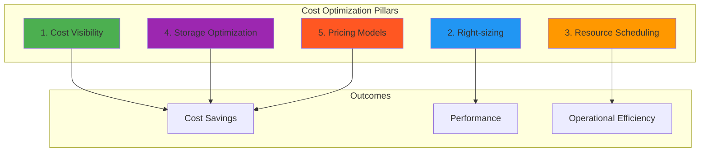
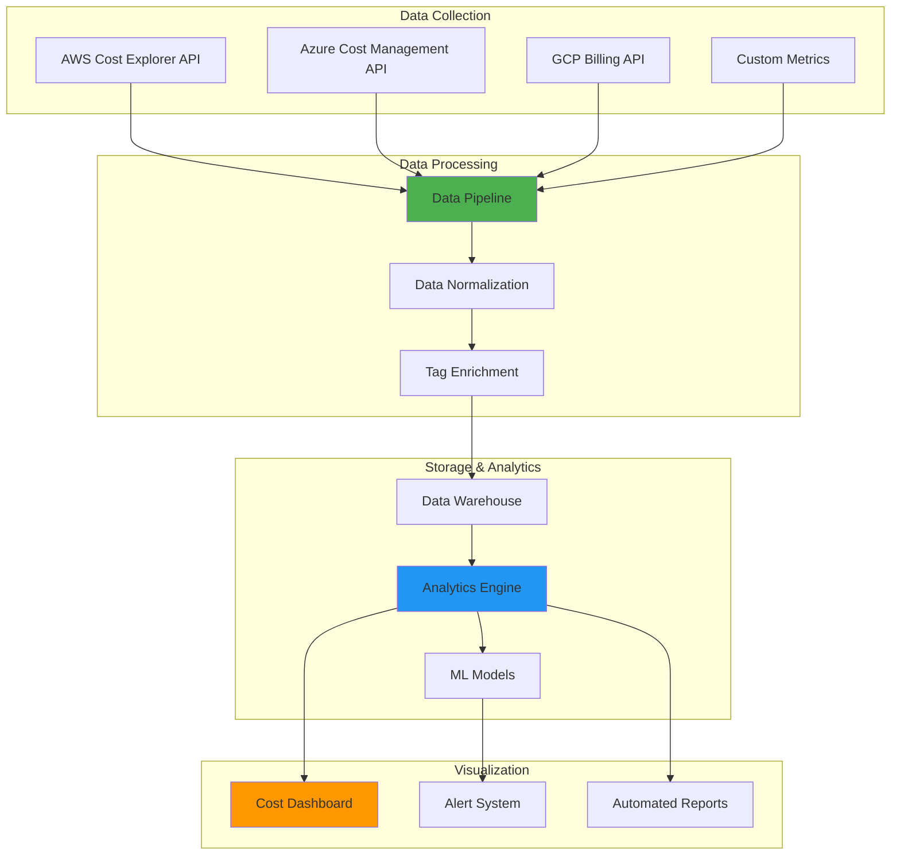
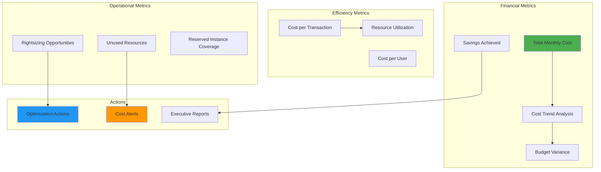

# Cloud Cost Optimization 💰

## Cost Management Fundamentals

### 1. What are the core principles of cloud cost optimization?

**Answer:**

**The 5 Pillars of Cost Optimization:**



**1. Cost Visibility:**
```yaml
visibility_requirements:
  tagging_strategy:
    mandatory_tags:
      - "Environment: prod/dev/test"
      - "Project: project-name"
      - "Owner: team-email"
      - "CostCenter: department-code"
      - "Application: app-name"
    
  reporting:
    frequency: "Daily, Weekly, Monthly"
    granularity: "Service, Resource, Tag"
    forecasting: "3-6 months ahead"
    
  alerting:
    budget_thresholds: [50%, 80%, 90%, 100%]
    anomaly_detection: "Enabled"
    notification_channels: ["Email", "Slack", "Teams"]
```

**2. Right-sizing:**
```yaml
rightsizing_approach:
  metrics_analysis:
    - "CPU utilization (avg, max)"
    - "Memory utilization"
    - "Network I/O"
    - "Storage I/O"
    - "Application performance"
  
  recommendations:
    underutilized: "Downsize or terminate"
    overutilized: "Upgrade or scale out"
    seasonal: "Auto-scaling or scheduling"
  
  implementation:
    testing: "Non-production first"
    monitoring: "Performance impact"
    rollback: "Automated rollback plan"
```

### 2. How do you implement comprehensive cost monitoring?

**Answer:**

**Multi-Cloud Cost Dashboard:**
```yaml
dashboard_components:
  real_time_metrics:
    - "Current spend rate"
    - "Budget burn rate"
    - "Resource utilization"
    - "Cost per service/application"
  
  historical_analysis:
    - "Month-over-month trends"
    - "Year-over-year comparison"
    - "Seasonal patterns"
    - "Cost allocation trends"
  
  predictive_analytics:
    - "Forecast next 3 months"
    - "Budget variance prediction"
    - "Growth trend analysis"
    - "Optimization opportunities"
```

**Cost Monitoring Architecture:**


**Implementation Example:**
```python
# Cost monitoring with Python
import boto3
import pandas as pd
from datetime import datetime, timedelta
import matplotlib.pyplot as plt

class MultiCloudCostAnalyzer:
    def __init__(self):
        self.aws_client = boto3.client('ce')  # Cost Explorer
        # Add Azure and GCP clients
    
    def get_aws_costs(self, start_date, end_date, granularity='DAILY'):
        """Retrieve AWS cost and usage data"""
        response = self.aws_client.get_cost_and_usage(
            TimePeriod={
                'Start': start_date,
                'End': end_date
            },
            Granularity=granularity,
            Metrics=['BlendedCost', 'UsageQuantity'],
            GroupBy=[
                {'Type': 'DIMENSION', 'Key': 'SERVICE'},
                {'Type': 'TAG', 'Key': 'Environment'}
            ]
        )
        
        costs = []
        for result in response['ResultsByTime']:
            date = result['TimePeriod']['Start']
            for group in result['Groups']:
                service = group['Keys'][0]
                environment = group['Keys'][1] if len(group['Keys']) > 1 else 'Unknown'
                amount = float(group['Metrics']['BlendedCost']['Amount'])
                
                costs.append({
                    'Date': date,
                    'Service': service,
                    'Environment': environment,
                    'Cost': amount
                })
        
        return pd.DataFrame(costs)
    
    def analyze_cost_trends(self, df):
        """Analyze cost trends and identify anomalies"""
        # Daily cost trend
        daily_costs = df.groupby('Date')['Cost'].sum()
        
        # Calculate moving average
        daily_costs.rolling(window=7).mean()
        
        # Identify cost spikes (>20% above average)
        avg_cost = daily_costs.mean()
        spikes = daily_costs[daily_costs > avg_cost * 1.2]
        
        return {
            'daily_trend': daily_costs,
            'cost_spikes': spikes,
            'average_daily': avg_cost
        }
    
    def generate_recommendations(self, df):
        """Generate cost optimization recommendations"""
        recommendations = []
        
        # Identify high-cost services
        service_costs = df.groupby('Service')['Cost'].sum().sort_values(ascending=False)
        top_services = service_costs.head(5)
        
        for service, cost in top_services.items():
            if cost > 1000:  # Threshold for high-cost services
                recommendations.append({
                    'type': 'High Cost Service',
                    'service': service,
                    'cost': cost,
                    'recommendation': f'Review {service} usage and consider optimization'
                })
        
        # Identify environments with high costs
        env_costs = df.groupby('Environment')['Cost'].sum()
        if 'dev' in env_costs and env_costs['dev'] > env_costs.get('prod', 0) * 0.3:
            recommendations.append({
                'type': 'Environment Cost',
                'service': 'Development',
                'cost': env_costs['dev'],
                'recommendation': 'Consider auto-shutdown for dev environments'
            })
        
        return recommendations

# Usage example
analyzer = MultiCloudCostAnalyzer()
start_date = (datetime.now() - timedelta(days=30)).strftime('%Y-%m-%d')
end_date = datetime.now().strftime('%Y-%m-%d')

cost_data = analyzer.get_aws_costs(start_date, end_date)
trends = analyzer.analyze_cost_trends(cost_data)
recommendations = analyzer.generate_recommendations(cost_data)
```

## AWS Cost Optimization

### 3. What are the key AWS cost optimization strategies?

**Answer:**

**Compute Optimization:**
```yaml
ec2_optimization:
  instance_types:
    general: "T3/T4g for variable workloads"
    compute: "C5/C6i for CPU-intensive"
    memory: "R5/R6i for memory-intensive"
    storage: "I3/I4i for I/O intensive"
  
  pricing_models:
    on_demand: "Unpredictable workloads"
    reserved: "Steady-state workloads (up to 75% savings)"
    spot: "Fault-tolerant workloads (up to 90% savings)"
    savings_plans: "Flexible commitment (up to 72% savings)"
  
  optimization_techniques:
    - "Auto Scaling based on metrics"
    - "Scheduled scaling for predictable patterns"
    - "Mixed instance types in Auto Scaling Groups"
    - "Hibernation for infrequent use instances"
```

**Storage Optimization:**
```yaml
storage_strategies:
  s3_optimization:
    standard: "Frequently accessed data"
    ia: "Infrequently accessed (30+ days)"
    glacier: "Archive data (90+ days)"
    deep_archive: "Long-term archive (180+ days)"
    intelligent_tiering: "Automatic cost optimization"
  
  lifecycle_policies:
    - "Transition to IA after 30 days"
    - "Move to Glacier after 90 days"
    - "Delete after retention period"
    - "Abort incomplete multipart uploads"
  
  ebs_optimization:
    - "Use GP3 instead of GP2 volumes"
    - "Right-size volume capacity"
    - "Enable EBS optimization for instances"
    - "Use snapshots lifecycle policies"
```

**Serverless Cost Optimization:**
```yaml
lambda_optimization:
  memory_tuning:
    - "Monitor memory utilization"
    - "Test different memory configurations"
    - "Use power tuning tools"
    - "Balance cost vs performance"
  
  execution_optimization:
    - "Minimize cold starts"
    - "Optimize package size"
    - "Use provisioned concurrency for predictable loads"
    - "Implement connection pooling"
  
  cost_monitoring:
    - "Track invocations and duration"
    - "Monitor memory usage patterns"
    - "Analyze cost per function"
    - "Set billing alarms"
```

**Networking Cost Optimization:**
```terraform
# CloudFront for content delivery optimization
resource "aws_cloudfront_distribution" "cost_optimized" {
  origin {
    domain_name = aws_s3_bucket.content.bucket_regional_domain_name
    origin_id   = "S3-${aws_s3_bucket.content.id}"
    
    s3_origin_config {
      origin_access_identity = aws_cloudfront_origin_access_identity.oai.cloudfront_access_identity_path
    }
  }
  
  enabled = true
  
  default_cache_behavior {
    allowed_methods        = ["DELETE", "GET", "HEAD", "OPTIONS", "PATCH", "POST", "PUT"]
    cached_methods         = ["GET", "HEAD"]
    target_origin_id       = "S3-${aws_s3_bucket.content.id}"
    compress               = true
    
    forwarded_values {
      query_string = false
      cookies {
        forward = "none"
      }
    }
    
    viewer_protocol_policy = "redirect-to-https"
    min_ttl                = 0
    default_ttl            = 3600
    max_ttl                = 86400
  }
  
  # Use cost-effective edge locations
  price_class = "PriceClass_100"  # Use only US, Canada, Europe
  
  tags = {
    Environment = "production"
    CostOptimization = "enabled"
  }
}

# VPC Endpoints to reduce NAT Gateway costs
resource "aws_vpc_endpoint" "s3" {
  vpc_id            = aws_vpc.main.id
  service_name      = "com.amazonaws.region.s3"
  vpc_endpoint_type = "Gateway"
  route_table_ids   = [aws_route_table.private.id]
  
  tags = {
    Name = "s3-endpoint"
    CostOptimization = "nat-gateway-reduction"
  }
}
```

### 4. How do you implement AWS Reserved Instance management?

**Answer:**

**Reserved Instance Strategy:**
```yaml
ri_strategy:
  analysis_phase:
    tools:
      - "AWS Cost Explorer"
      - "AWS Trusted Advisor"
      - "Third-party tools (CloudCheckr, Cloudability)"
    
    metrics:
      - "Historical usage patterns"
      - "Instance family utilization"
      - "Regional distribution"
      - "Seasonal variations"
  
  purchasing_strategy:
    commitment_levels:
      no_upfront: "Lower discount, no upfront cost"
      partial_upfront: "Medium discount, some upfront"
      all_upfront: "Highest discount, full upfront"
    
    terms:
      one_year: "Flexibility, moderate savings"
      three_year: "Maximum savings, long commitment"
    
    flexibility:
      standard: "Fixed instance type, size, AZ"
      convertible: "Can change instance attributes"
```

**RI Management Automation:**
```python
import boto3
import pandas as pd
from datetime import datetime, timedelta

class RIManager:
    def __init__(self):
        self.ec2 = boto3.client('ec2')
        self.ce = boto3.client('ce')
    
    def analyze_usage_patterns(self, days=90):
        """Analyze EC2 usage patterns for RI recommendations"""
        end_date = datetime.now()
        start_date = end_date - timedelta(days=days)
        
        # Get cost and usage data
        response = self.ce.get_cost_and_usage(
            TimePeriod={
                'Start': start_date.strftime('%Y-%m-%d'),
                'End': end_date.strftime('%Y-%m-%d')
            },
            Granularity='DAILY',
            Metrics=['UsageQuantity'],
            GroupBy=[
                {'Type': 'DIMENSION', 'Key': 'INSTANCE_TYPE'},
                {'Type': 'DIMENSION', 'Key': 'REGION'}
            ],
            Filter={
                'Dimensions': {
                    'Key': 'SERVICE',
                    'Values': ['Amazon Elastic Compute Cloud - Compute']
                }
            }
        )
        
        usage_data = []
        for result in response['ResultsByTime']:
            date = result['TimePeriod']['Start']
            for group in result['Groups']:
                instance_type = group['Keys'][0]
                region = group['Keys'][1]
                usage = float(group['Metrics']['UsageQuantity']['Amount'])
                
                usage_data.append({
                    'Date': date,
                    'InstanceType': instance_type,
                    'Region': region,
                    'Usage': usage
                })
        
        df = pd.DataFrame(usage_data)
        return self.generate_ri_recommendations(df)
    
    def generate_ri_recommendations(self, df):
        """Generate RI purchase recommendations"""
        recommendations = []
        
        # Calculate average daily usage by instance type and region
        avg_usage = df.groupby(['InstanceType', 'Region'])['Usage'].mean()
        
        for (instance_type, region), avg_hours in avg_usage.items():
            # Recommend RI if consistent usage > 50% of the time
            if avg_hours >= 12:  # 50% of 24 hours
                recommendation = {
                    'instance_type': instance_type,
                    'region': region,
                    'recommended_quantity': int(avg_hours // 24) + 1,
                    'estimated_savings': self.calculate_savings(
                        instance_type, avg_hours
                    ),
                    'utilization_rate': avg_hours / 24
                }
                recommendations.append(recommendation)
        
        return sorted(recommendations, 
                     key=lambda x: x['estimated_savings'], 
                     reverse=True)
    
    def calculate_savings(self, instance_type, hours_per_day):
        """Calculate estimated savings from RI purchase"""
        # Simplified calculation - use actual pricing data
        pricing = {
            't3.micro': {'on_demand': 0.0104, 'reserved': 0.0062},
            't3.small': {'on_demand': 0.0208, 'reserved': 0.0125},
            't3.medium': {'on_demand': 0.0416, 'reserved': 0.0250},
            # Add more instance types
        }
        
        if instance_type not in pricing:
            return 0
        
        monthly_hours = hours_per_day * 30
        on_demand_cost = monthly_hours * pricing[instance_type]['on_demand']
        reserved_cost = monthly_hours * pricing[instance_type]['reserved']
        
        return (on_demand_cost - reserved_cost) * 12  # Annual savings

# Usage
ri_manager = RIManager()
recommendations = ri_manager.analyze_usage_patterns()

for rec in recommendations[:5]:  # Top 5 recommendations
    print(f"Instance: {rec['instance_type']}")
    print(f"Region: {rec['region']}")
    print(f"Quantity: {rec['recommended_quantity']}")
    print(f"Annual Savings: ${rec['estimated_savings']:.2f}")
    print("---")
```

## Azure Cost Optimization

### 5. What are Azure-specific cost optimization techniques?

**Answer:**

**Azure Cost Management Features:**
```yaml
azure_cost_tools:
  cost_management:
    - "Azure Cost Management + Billing"
    - "Cost analysis and budgets"
    - "Cost alerts and recommendations"
    - "Spending limits for subscriptions"
  
  advisor_recommendations:
    - "Right-size virtual machines"
    - "Eliminate unprovisioned ExpressRoute circuits"
    - "Use Standard Storage for VM disks"
    - "Configure auto-shutdown for VMs"
  
  reserved_instances:
    - "Azure Reserved VM Instances"
    - "SQL Database reserved capacity"
    - "Cosmos DB reserved capacity"
    - "Storage reserved capacity"
```

**Azure VM Optimization:**
```yaml
vm_optimization:
  sizing_recommendations:
    - "Use Burstable B-series for variable workloads"
    - "A-series for entry-level workloads"
    - "D-series for general purpose"
    - "F-series for compute intensive"
  
  cost_saving_features:
    - "Auto-shutdown scheduling"
    - "Spot VMs for fault-tolerant workloads"
    - "Hybrid Benefit for Windows licensing"
    - "Azure Reserved VM Instances"
  
  storage_optimization:
    - "Use Standard SSD for better price/performance"
    - "Implement disk encryption"
    - "Use managed disks with snapshots"
    - "Configure backup retention policies"
```

**Azure Cost Optimization Script:**
```powershell
# Azure Cost Optimization PowerShell Script
param(
    [string]$SubscriptionId,
    [string]$ResourceGroup = "All"
)

# Connect to Azure
Connect-AzAccount
Set-AzContext -SubscriptionId $SubscriptionId

function Get-UnderutilizedResources {
    param([string]$ResourceGroupName)
    
    $recommendations = @()
    
    # Get all VMs
    if ($ResourceGroupName -eq "All") {
        $vms = Get-AzVM
    } else {
        $vms = Get-AzVM -ResourceGroupName $ResourceGroupName
    }
    
    foreach ($vm in $vms) {
        # Get VM metrics for last 7 days
        $endTime = Get-Date
        $startTime = $endTime.AddDays(-7)
        
        $cpuMetrics = Get-AzMetric -ResourceId $vm.Id `
            -MetricName "Percentage CPU" `
            -StartTime $startTime `
            -EndTime $endTime `
            -TimeGrain "01:00:00"
        
        $avgCpu = ($cpuMetrics.Data | Measure-Object -Property Average -Average).Average
        
        if ($avgCpu -lt 10) {
            $recommendations += [PSCustomObject]@{
                ResourceType = "Virtual Machine"
                ResourceName = $vm.Name
                ResourceGroup = $vm.ResourceGroupName
                Issue = "Low CPU utilization"
                AverageCPU = [math]::Round($avgCpu, 2)
                Recommendation = "Consider downsizing or deallocating"
                EstimatedMonthlySavings = (Get-VMCostEstimate -VMSize $vm.HardwareProfile.VmSize) * 0.5
            }
        }
    }
    
    # Check for unused disks
    $unusedDisks = Get-AzDisk | Where-Object {$_.OwnerId -eq $null}
    foreach ($disk in $unusedDisks) {
        $diskCost = Get-DiskCostEstimate -DiskSizeGB $disk.DiskSizeGB -DiskType $disk.Sku.Name
        $recommendations += [PSCustomObject]@{
            ResourceType = "Managed Disk"
            ResourceName = $disk.Name
            ResourceGroup = $disk.ResourceGroupName
            Issue = "Unattached disk"
            Recommendation = "Delete if not needed"
            EstimatedMonthlySavings = $diskCost
        }
    }
    
    return $recommendations
}

function Get-VMCostEstimate {
    param([string]$VMSize)
    
    # Simplified cost estimation - use actual Azure pricing API
    $vmPricing = @{
        "Standard_B1s" = 7.59
        "Standard_B2s" = 30.37
        "Standard_D2s_v3" = 70.08
        "Standard_D4s_v3" = 140.16
        # Add more VM sizes
    }
    
    return $vmPricing[$VMSize] ?? 50.00
}

function Get-DiskCostEstimate {
    param(
        [int]$DiskSizeGB,
        [string]$DiskType
    )
    
    $pricing = @{
        "Standard_LRS" = 0.045
        "StandardSSD_LRS" = 0.075
        "Premium_LRS" = 0.15
    }
    
    $pricePerGB = $pricing[$DiskType] ?? 0.075
    return $DiskSizeGB * $pricePerGB
}

function Set-AutoShutdownPolicy {
    param(
        [string]$ResourceGroupName,
        [string]$VMName,
        [string]$ShutdownTime = "19:00",
        [string]$TimeZone = "UTC"
    )
    
    $vm = Get-AzVM -ResourceGroupName $ResourceGroupName -Name $VMName
    
    # Create auto-shutdown schedule
    $properties = @{
        status = "Enabled"
        taskType = "ComputeVmShutdownTask"
        dailyRecurrence = @{
            time = $ShutdownTime
        }
        timeZoneId = $TimeZone
        targetResourceId = $vm.Id
    }
    
    New-AzResource -ResourceType "Microsoft.DevTestLab/schedules" `
        -ResourceName "shutdown-computevm-$VMName" `
        -ResourceGroupName $ResourceGroupName `
        -Location $vm.Location `
        -Properties $properties `
        -Force
}

# Main execution
$recommendations = Get-UnderutilizedResources -ResourceGroupName $ResourceGroup

# Display recommendations
$recommendations | Format-Table -AutoSize

# Calculate total potential savings
$totalSavings = ($recommendations | Measure-Object -Property EstimatedMonthlySavings -Sum).Sum
Write-Host "Total Estimated Monthly Savings: $($totalSavings.ToString('C'))" -ForegroundColor Green

# Optionally implement auto-shutdown for all VMs
$implementAutoShutdown = Read-Host "Implement auto-shutdown for all VMs? (y/n)"
if ($implementAutoShutdown -eq "y") {
    $vms = Get-AzVM
    foreach ($vm in $vms) {
        Set-AutoShutdownPolicy -ResourceGroupName $vm.ResourceGroupName -VMName $vm.Name
        Write-Host "Auto-shutdown configured for $($vm.Name)"
    }
}
```

## Google Cloud Cost Optimization

### 6. What are GCP cost optimization best practices?

**Answer:**

**GCP Cost Management Tools:**
```yaml
gcp_cost_tools:
  billing_features:
    - "Cloud Billing reports"
    - "Budget alerts and notifications"
    - "Cost breakdown by project/service"
    - "Committed use discounts"
  
  optimization_tools:
    - "Recommender API for suggestions"
    - "Active Assist for automated optimization"
    - "Cloud Asset Inventory for resource tracking"
    - "Operations Suite for monitoring"
  
  pricing_models:
    sustained_use: "Automatic discounts for consistent usage"
    committed_use: "1 or 3-year commitments for discounts"
    preemptible: "Up to 80% savings for fault-tolerant workloads"
```

**Compute Engine Optimization:**
```yaml
compute_optimization:
  machine_types:
    general: "N1, N2, E2 series"
    compute_optimized: "C2 series"
    memory_optimized: "M1, M2 series"
    accelerator: "A2 series with GPUs"
  
  rightsizing:
    - "Use Recommender API for suggestions"
    - "Monitor CPU, memory, and disk utilization"
    - "Consider custom machine types"
    - "Use preemptible instances for batch workloads"
  
  scheduling:
    - "Auto-scaling with managed instance groups"
    - "Scheduled scaling for predictable patterns"
    - "Instance scheduling for dev/test environments"
```

**GCP Cost Optimization with Python:**
```python
from google.cloud import billing
from google.cloud import compute_v1
from google.cloud import monitoring_v3
import pandas as pd
from datetime import datetime, timedelta

class GCPCostOptimizer:
    def __init__(self, project_id):
        self.project_id = project_id
        self.billing_client = billing.CloudBillingClient()
        self.compute_client = compute_v1.InstancesClient()
        self.monitoring_client = monitoring_v3.MetricServiceClient()
    
    def get_billing_data(self, days=30):
        """Retrieve billing data for analysis"""
        # Note: This requires the Cloud Billing API
        # Simplified example - use actual billing export data
        
        project_name = f"projects/{self.project_id}"
        
        # Get billing account
        billing_accounts = self.billing_client.list_billing_accounts()
        billing_account = next(billing_accounts)
        
        # Query billing data (simplified)
        # In practice, use BigQuery with billing export
        return self.analyze_bigquery_billing_data()
    
    def analyze_bigquery_billing_data(self):
        """Analyze billing data from BigQuery export"""
        # Example BigQuery SQL for cost analysis
        sql_query = """
        SELECT
            service.description as service_name,
            sku.description as sku_description,
            project.id as project_id,
            location.location as location,
            usage_start_time,
            usage_end_time,
            cost,
            usage.amount as usage_amount,
            usage.unit as usage_unit
        FROM `{project_id}.billing_export.gcp_billing_export_v1_{billing_account_id}`
        WHERE usage_start_time >= TIMESTAMP_SUB(CURRENT_TIMESTAMP(), INTERVAL 30 DAY)
            AND project.id = '{project_id}'
        ORDER BY cost DESC
        """.format(
            project_id=self.project_id,
            billing_account_id="YOUR_BILLING_ACCOUNT_ID"
        )
        
        # Execute query and return results
        # This would use BigQuery client in practice
        return pd.DataFrame()  # Placeholder
    
    def get_underutilized_instances(self):
        """Identify underutilized Compute Engine instances"""
        instances = []
        
        # List all zones
        zones_request = compute_v1.ListZonesRequest(project=self.project_id)
        zones = self.compute_client.list(request=zones_request)
        
        for zone in zones:
            # List instances in each zone
            instances_request = compute_v1.ListInstancesRequest(
                project=self.project_id,
                zone=zone.name
            )
            zone_instances = self.compute_client.list(request=instances_request)
            
            for instance in zone_instances:
                # Get CPU utilization metrics
                cpu_utilization = self.get_instance_cpu_utilization(
                    instance.name, zone.name
                )
                
                if cpu_utilization < 10:  # Less than 10% average CPU
                    instances.append({
                        'name': instance.name,
                        'zone': zone.name,
                        'machine_type': instance.machine_type.split('/')[-1],
                        'status': instance.status,
                        'cpu_utilization': cpu_utilization,
                        'recommendation': 'Consider downsizing or stopping'
                    })
        
        return instances
    
    def get_instance_cpu_utilization(self, instance_name, zone):
        """Get CPU utilization for an instance"""
        project_name = f"projects/{self.project_id}"
        
        # Time range for the last 7 days
        end_time = datetime.now()
        start_time = end_time - timedelta(days=7)
        
        # Create time interval
        interval = monitoring_v3.TimeInterval({
            "end_time": {"seconds": int(end_time.timestamp())},
            "start_time": {"seconds": int(start_time.timestamp())}
        })
        
        # Create the filter
        filter_str = f'metric.type="compute.googleapis.com/instance/cpu/utilization" AND resource.labels.instance_name="{instance_name}"'
        
        # Request metrics
        request = monitoring_v3.ListTimeSeriesRequest({
            "name": project_name,
            "filter": filter_str,
            "interval": interval,
            "view": monitoring_v3.ListTimeSeriesRequest.TimeSeriesView.FULL,
        })
        
        results = self.monitoring_client.list_time_series(request=request)
        
        # Calculate average CPU utilization
        total_points = 0
        sum_values = 0
        
        for result in results:
            for point in result.points:
                total_points += 1
                sum_values += point.value.double_value
        
        return (sum_values / total_points * 100) if total_points > 0 else 0
    
    def get_optimization_recommendations(self):
        """Generate comprehensive optimization recommendations"""
        recommendations = []
        
        # Underutilized instances
        underutilized = self.get_underutilized_instances()
        for instance in underutilized:
            recommendations.append({
                'type': 'Compute Engine',
                'resource': instance['name'],
                'issue': f"Low CPU utilization ({instance['cpu_utilization']:.1f}%)",
                'recommendation': instance['recommendation'],
                'priority': 'High' if instance['cpu_utilization'] < 5 else 'Medium'
            })
        
        # Unused persistent disks
        unused_disks = self.find_unused_disks()
        for disk in unused_disks:
            recommendations.append({
                'type': 'Persistent Disk',
                'resource': disk['name'],
                'issue': 'Unattached disk',
                'recommendation': 'Delete if not needed for snapshots',
                'priority': 'Medium'
            })
        
        # Old snapshots
        old_snapshots = self.find_old_snapshots()
        for snapshot in old_snapshots:
            recommendations.append({
                'type': 'Snapshot',
                'resource': snapshot['name'],
                'issue': f"Old snapshot ({snapshot['age_days']} days)",
                'recommendation': 'Consider deletion based on retention policy',
                'priority': 'Low'
            })
        
        return recommendations
    
    def find_unused_disks(self):
        """Find unattached persistent disks"""
        # Implementation to find unused disks
        return []  # Placeholder
    
    def find_old_snapshots(self, retention_days=30):
        """Find snapshots older than retention period"""
        # Implementation to find old snapshots
        return []  # Placeholder

# Usage example
optimizer = GCPCostOptimizer("your-project-id")
recommendations = optimizer.get_optimization_recommendations()

for rec in recommendations:
    print(f"Type: {rec['type']}")
    print(f"Resource: {rec['resource']}")
    print(f"Issue: {rec['issue']}")
    print(f"Recommendation: {rec['recommendation']}")
    print(f"Priority: {rec['priority']}")
    print("---")
```

## Cross-Cloud Cost Optimization

### 7. How do you optimize costs across multiple cloud providers?

**Answer:**

**Unified Cost Management Strategy:**
```yaml
multi_cloud_cost_strategy:
  centralized_tracking:
    tools:
      - "CloudHealth (VMware)"
      - "Flexera Optima"
      - "CloudCheckr"
      - "Custom analytics platform"
    
    data_sources:
      - "AWS Cost and Usage Reports"
      - "Azure Cost Management APIs"
      - "GCP Billing Export to BigQuery"
      - "Custom tagging and metadata"
  
  cost_allocation:
    tagging_strategy:
      - "Consistent tags across all clouds"
      - "Cost center allocation"
      - "Project and application mapping"
      - "Environment classification"
    
    reporting:
      - "Unified dashboards"
      - "Chargeback/showback models"
      - "Budget tracking per business unit"
      - "Variance analysis"
```

**Cloud Cost Comparison Framework:**
```python
import pandas as pd
import numpy as np
from dataclasses import dataclass
from typing import Dict, List
import json

@dataclass
class CloudService:
    provider: str
    service_type: str
    instance_type: str
    vcpus: int
    memory_gb: float
    storage_gb: int
    hourly_cost: float
    region: str

class MultiCloudCostAnalyzer:
    def __init__(self):
        self.services = []
        self.load_pricing_data()
    
    def load_pricing_data(self):
        """Load pricing data for different cloud providers"""
        # AWS pricing
        aws_services = [
            CloudService("AWS", "compute", "t3.medium", 2, 4, 0, 0.0416, "us-east-1"),
            CloudService("AWS", "compute", "t3.large", 2, 8, 0, 0.0832, "us-east-1"),
            CloudService("AWS", "compute", "c5.large", 2, 4, 0, 0.085, "us-east-1"),
            CloudService("AWS", "storage", "gp3", 0, 0, 100, 0.08/730, "us-east-1"),  # per hour
        ]
        
        # Azure pricing
        azure_services = [
            CloudService("Azure", "compute", "B2s", 2, 4, 0, 0.0416, "East US"),
            CloudService("Azure", "compute", "D2s_v3", 2, 8, 0, 0.096, "East US"),
            CloudService("Azure", "compute", "F2s_v2", 2, 4, 0, 0.085, "East US"),
            CloudService("Azure", "storage", "Standard_LRS", 0, 0, 100, 0.045/730, "East US"),
        ]
        
        # GCP pricing
        gcp_services = [
            CloudService("GCP", "compute", "e2-medium", 2, 4, 0, 0.0335, "us-central1"),
            CloudService("GCP", "compute", "n1-standard-2", 2, 7.5, 0, 0.095, "us-central1"),
            CloudService("GCP", "compute", "c2-standard-4", 4, 16, 0, 0.179, "us-central1"),
            CloudService("GCP", "storage", "pd-standard", 0, 0, 100, 0.04/730, "us-central1"),
        ]
        
        self.services.extend(aws_services + azure_services + gcp_services)
    
    def find_best_value_options(self, requirements: Dict):
        """Find the best value options across clouds for given requirements"""
        min_vcpus = requirements.get('min_vcpus', 1)
        min_memory = requirements.get('min_memory_gb', 1)
        service_type = requirements.get('service_type', 'compute')
        
        suitable_services = [
            service for service in self.services
            if (service.service_type == service_type and
                service.vcpus >= min_vcpus and
                service.memory_gb >= min_memory)
        ]
        
        # Sort by price/performance ratio
        sorted_services = sorted(
            suitable_services,
            key=lambda s: s.hourly_cost / (s.vcpus * s.memory_gb) if s.vcpus > 0 and s.memory_gb > 0 else s.hourly_cost
        )
        
        return sorted_services[:5]  # Top 5 options
    
    def analyze_workload_placement(self, workloads: List[Dict]):
        """Analyze optimal placement for multiple workloads"""
        placement_analysis = []
        
        for workload in workloads:
            workload_name = workload['name']
            requirements = workload['requirements']
            
            best_options = self.find_best_value_options(requirements)
            
            for option in best_options:
                monthly_cost = option.hourly_cost * 24 * 30
                placement_analysis.append({
                    'workload': workload_name,
                    'provider': option.provider,
                    'service': option.instance_type,
                    'vcpus': option.vcpus,
                    'memory_gb': option.memory_gb,
                    'hourly_cost': option.hourly_cost,
                    'monthly_cost': monthly_cost,
                    'region': option.region
                })
        
        return pd.DataFrame(placement_analysis)
    
    def generate_cost_optimization_report(self, current_infrastructure: List[Dict]):
        """Generate optimization recommendations for current infrastructure"""
        recommendations = []
        
        for resource in current_infrastructure:
            current_cost = resource['monthly_cost']
            requirements = {
                'min_vcpus': resource['vcpus'],
                'min_memory_gb': resource['memory_gb'],
                'service_type': 'compute'
            }
            
            alternatives = self.find_best_value_options(requirements)
            
            for alt in alternatives:
                alt_monthly_cost = alt.hourly_cost * 24 * 30
                potential_savings = current_cost - alt_monthly_cost
                
                if potential_savings > 0:
                    recommendations.append({
                        'current_resource': resource['name'],
                        'current_provider': resource['provider'],
                        'current_cost': current_cost,
                        'recommended_provider': alt.provider,
                        'recommended_service': alt.instance_type,
                        'recommended_cost': alt_monthly_cost,
                        'monthly_savings': potential_savings,
                        'savings_percentage': (potential_savings / current_cost) * 100
                    })
        
        return sorted(recommendations, key=lambda x: x['monthly_savings'], reverse=True)

# Example usage
analyzer = MultiCloudCostAnalyzer()

# Define workload requirements
workloads = [
    {
        'name': 'web-server',
        'requirements': {'min_vcpus': 2, 'min_memory_gb': 4}
    },
    {
        'name': 'database',
        'requirements': {'min_vcpus': 4, 'min_memory_gb': 16}
    }
]

# Analyze optimal placement
placement_df = analyzer.analyze_workload_placement(workloads)
print("Optimal Workload Placement:")
print(placement_df.head(10))

# Current infrastructure for optimization analysis
current_infrastructure = [
    {
        'name': 'prod-web-01',
        'provider': 'AWS',
        'instance_type': 't3.large',
        'vcpus': 2,
        'memory_gb': 8,
        'monthly_cost': 60.0
    },
    {
        'name': 'prod-db-01',
        'provider': 'Azure',
        'instance_type': 'D4s_v3',
        'vcpus': 4,
        'memory_gb': 16,
        'monthly_cost': 150.0
    }
]

# Generate optimization recommendations
recommendations = analyzer.generate_cost_optimization_report(current_infrastructure)
print("\nCost Optimization Recommendations:")
for rec in recommendations[:5]:
    print(f"Resource: {rec['current_resource']}")
    print(f"Current: {rec['current_provider']} - ${rec['current_cost']:.2f}/month")
    print(f"Recommended: {rec['recommended_provider']} {rec['recommended_service']} - ${rec['recommended_cost']:.2f}/month")
    print(f"Savings: ${rec['monthly_savings']:.2f}/month ({rec['savings_percentage']:.1f}%)")
    print("---")
```

### 8. What are the key cost optimization KPIs and metrics?

**Answer:**

**Financial KPIs:**
```yaml
cost_kpis:
  efficiency_metrics:
    cost_per_transaction: "Total cloud cost / number of transactions"
    cost_per_user: "Total cloud cost / active users"
    cost_per_feature: "Infrastructure cost / features deployed"
    
  utilization_metrics:
    compute_utilization: "Average CPU/memory utilization"
    storage_efficiency: "Used storage / provisioned storage"
    network_efficiency: "Actual bandwidth / provisioned bandwidth"
    
  financial_metrics:
    monthly_spend_trend: "Month-over-month cost changes"
    budget_variance: "Actual vs budgeted costs"
    cost_savings_achieved: "Savings from optimization initiatives"
    roi_on_optimization: "Savings / optimization investment"
```

**Cost Optimization Dashboard:**


This comprehensive cost optimization guide covers fundamental principles, cloud-specific strategies, tools and automation, cross-cloud analysis, and key performance indicators for effective cloud cost management across AWS, Azure, and GCP.