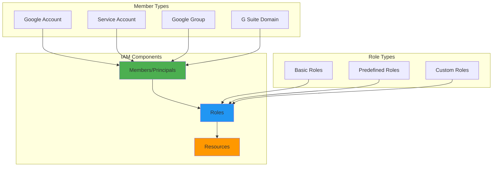
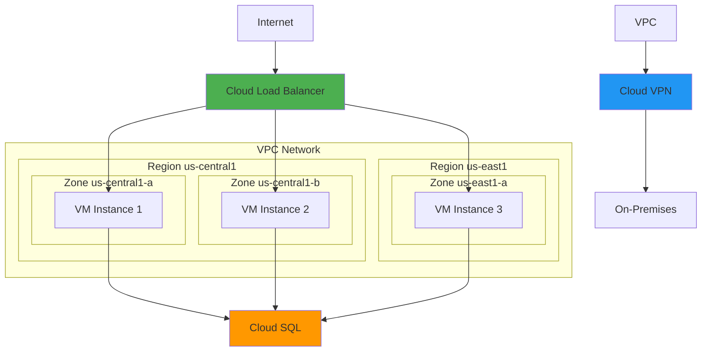
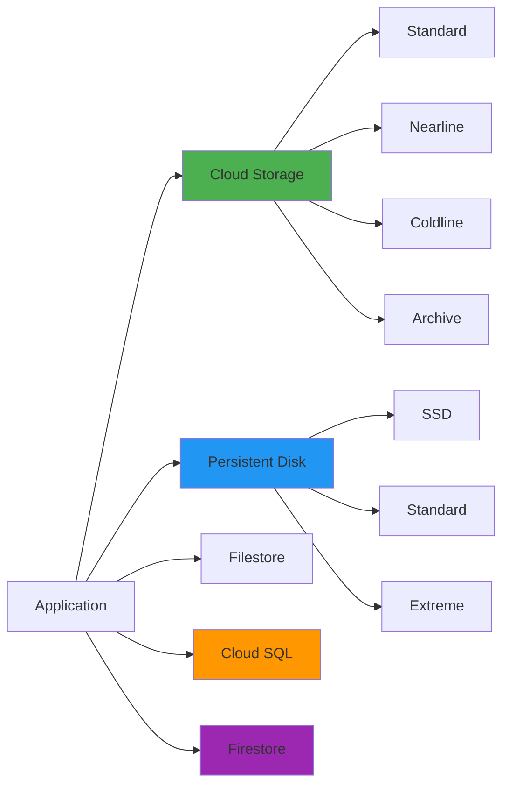
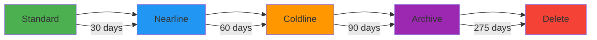
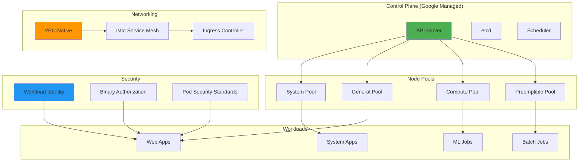
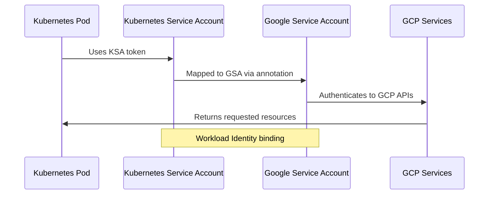
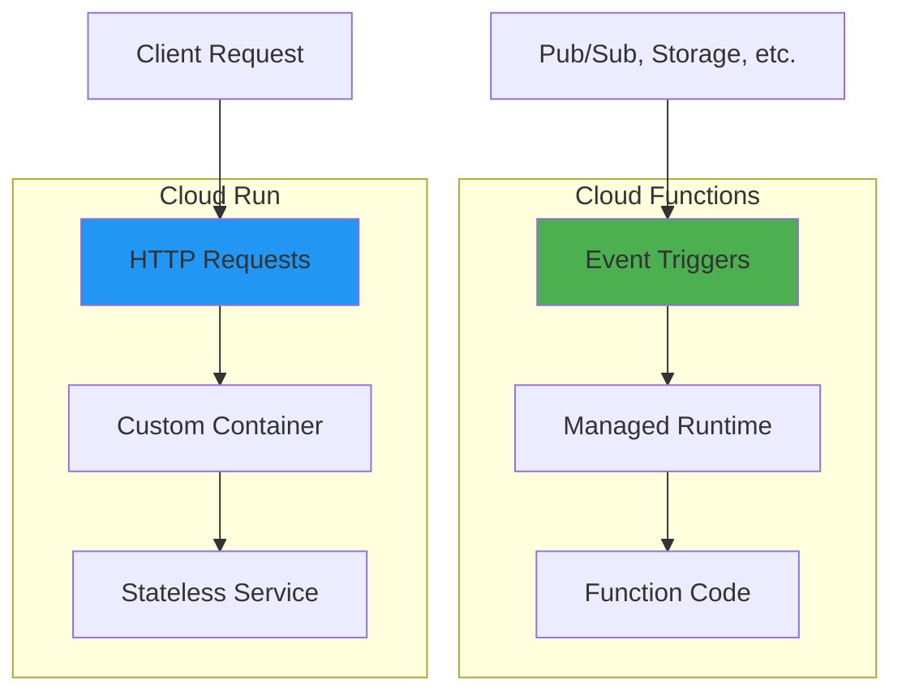
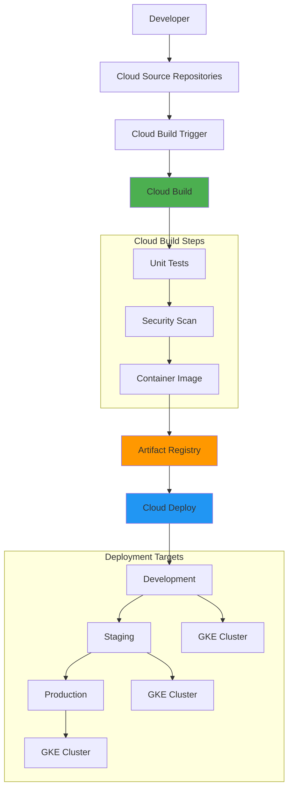
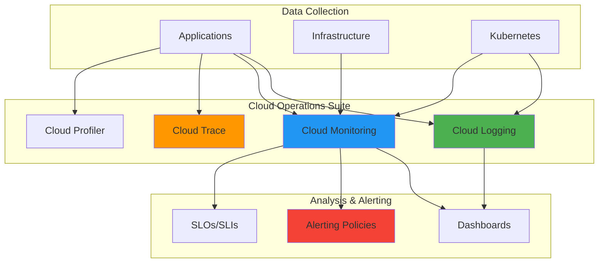
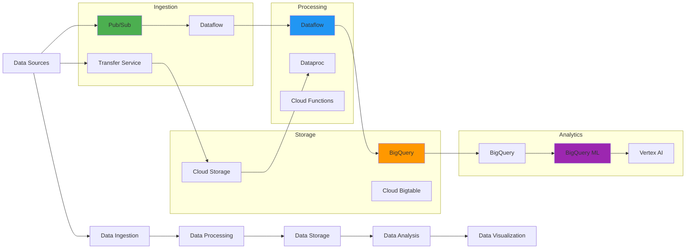

# Google Cloud Platform (GCP) Interview Questions 🏗️

## Core GCP Services

### 1. Explain GCP's compute services and their use cases

**Answer:**

| Service | Type | Use Case | Management | Scaling |
|---------|------|----------|------------|---------|
| **Compute Engine** | IaaS | VMs, custom configs | High | Instance Groups |
| **App Engine** | PaaS | Web apps, auto-scaling | Low | Automatic |
| **Cloud Run** | CaaS | Containerized apps | Low | Request-based |
| **GKE** | CaaS | Kubernetes orchestration | Medium | HPA/VPA/CA |
| **Cloud Functions** | FaaS | Event-driven functions | Minimal | Automatic |

**Compute Engine Instance:**
```yaml
# gcloud command to create instance
instance_config:
  name: "web-server"
  machine_type: "e2-medium"
  zone: "us-central1-a"
  image_family: "ubuntu-2004-lts"
  image_project: "ubuntu-os-cloud"
  boot_disk_size: "20GB"
  boot_disk_type: "pd-ssd"
  tags: ["http-server", "https-server"]
  metadata:
    startup_script: |
      #!/bin/bash
      apt-get update
      apt-get install -y nginx
      systemctl start nginx
```

### 2. What is Google Cloud IAM and how does it work?

**Answer:**

GCP IAM (Identity and Access Management) controls access to GCP resources using the principle of least privilege.



**IAM Policy Example:**
```json
{
  "bindings": [
    {
      "role": "roles/compute.instanceAdmin.v1",
      "members": [
        "user:alice@example.com",
        "serviceAccount:my-service@project.iam.gserviceaccount.com",
        "group:admins@example.com"
      ],
      "condition": {
        "title": "Time-based access",
        "description": "Only allow access during business hours",
        "expression": "request.time.getHours() >= 9 && request.time.getHours() <= 17"
      }
    }
  ],
  "etag": "BwWWja0YfJA=",
  "version": 3
}
```

### 3. Explain GCP networking architecture

**Answer:**



**VPC Configuration:**
```yaml
# gcloud commands for VPC setup
vpc_config:
  network:
    name: "production-vpc"
    subnet_mode: "custom"
    
  subnets:
    - name: "web-subnet"
      region: "us-central1"
      range: "10.1.0.0/24"
      
    - name: "app-subnet"
      region: "us-central1"
      range: "10.2.0.0/24"
      
    - name: "db-subnet"
      region: "us-central1"
      range: "10.3.0.0/24"
      
  firewall_rules:
    - name: "allow-http"
      direction: "INGRESS"
      priority: 1000
      source_ranges: ["0.0.0.0/0"]
      target_tags: ["http-server"]
      allowed:
        - protocol: "tcp"
          ports: ["80"]
```

## GCP Storage Services

### 4. Compare GCP storage options and their use cases

**Answer:**

| Storage Type | Performance | Use Case | Consistency | Pricing |
|--------------|-------------|----------|-------------|---------|
| **Cloud Storage** | Standard/Nearline/Coldline/Archive | Object storage, CDN | Strong | Tiered |
| **Persistent Disk** | Standard/SSD/Extreme | VM storage | Strong | Fixed |
| **Filestore** | Standard/High Scale | NFS file shares | Strong | Provisioned |
| **Cloud SQL** | Standard/High Availability | Relational databases | Strong | Instance-based |
| **Firestore** | Multi-region | NoSQL documents | Eventual/Strong | Usage-based |



### 5. How do you implement Cloud Storage lifecycle management?

**Answer:**

```json
{
  "lifecycle": {
    "rule": [
      {
        "action": {
          "type": "SetStorageClass",
          "storageClass": "NEARLINE"
        },
        "condition": {
          "age": 30,
          "matchesStorageClass": ["STANDARD"]
        }
      },
      {
        "action": {
          "type": "SetStorageClass",
          "storageClass": "COLDLINE"
        },
        "condition": {
          "age": 90,
          "matchesStorageClass": ["NEARLINE"]
        }
      },
      {
        "action": {
          "type": "Delete"
        },
        "condition": {
          "age": 365,
          "matchesStorageClass": ["COLDLINE"]
        }
      }
    ]
  }
}
```



## Google Kubernetes Engine (GKE)

### 6. Design a production-ready GKE cluster architecture

**Answer:**



**GKE Cluster Configuration:**
```yaml
apiVersion: container.v1
kind: Cluster
metadata:
  name: production-cluster
spec:
  location: us-central1
  initialNodeCount: 1
  
  # Network configuration
  network: projects/my-project/global/networks/production-vpc
  subnetwork: projects/my-project/regions/us-central1/subnetworks/gke-subnet
  ipAllocationPolicy:
    useIpAliases: true
    clusterSecondaryRangeName: pods
    servicesSecondaryRangeName: services
  
  # Security
  masterAuth:
    clientCertificateConfig:
      issueClientCertificate: false
  
  workloadIdentityConfig:
    workloadPool: my-project.svc.id.goog
  
  binaryAuthorization:
    enabled: true
  
  # Node pools
  nodePools:
  - name: system-pool
    initialNodeCount: 3
    config:
      machineType: e2-standard-2
      diskSizeGb: 100
      diskType: pd-ssd
      imageType: COS_CONTAINERD
      
      workloadMetadataConfig:
        mode: GKE_METADATA
      
      shieldedInstanceConfig:
        enableSecureBoot: true
        enableIntegrityMonitoring: true
    
    management:
      autoRepair: true
      autoUpgrade: true
    
    autoscaling:
      enabled: true
      minNodeCount: 1
      maxNodeCount: 5
```

### 7. How do you implement Workload Identity in GKE?

**Answer:**



**Workload Identity Setup:**
```bash
# Create Google Service Account
gcloud iam service-accounts create workload-identity-sa \
    --display-name "Workload Identity Service Account"

# Create Kubernetes Service Account
kubectl create serviceaccount kubernetes-sa

# Bind the accounts
gcloud iam service-accounts add-iam-policy-binding \
    workload-identity-sa@PROJECT.iam.gserviceaccount.com \
    --role roles/iam.workloadIdentityUser \
    --member "serviceAccount:PROJECT.svc.id.goog[NAMESPACE/kubernetes-sa]"

# Annotate the Kubernetes Service Account
kubectl annotate serviceaccount kubernetes-sa \
    iam.gke.io/gcp-service-account=workload-identity-sa@PROJECT.iam.gserviceaccount.com
```

## Cloud Functions and Cloud Run

### 8. Compare Cloud Functions vs Cloud Run and their use cases

**Answer:**

| Feature | Cloud Functions | Cloud Run |
|---------|----------------|-----------|
| **Runtime** | Specific runtimes | Any container |
| **Request Duration** | 9 minutes max | 60 minutes max |
| **Concurrency** | 1000 per instance | 1000 per instance |
| **Cold Start** | Higher | Lower |
| **Use Case** | Event-driven | HTTP services |



**Cloud Function Example:**
```python
import functions_framework
from google.cloud import storage

@functions_framework.cloud_event
def process_image(cloud_event):
    """Process uploaded image"""
    
    data = cloud_event.data
    bucket_name = data['bucket']
    file_name = data['name']
    
    # Initialize storage client
    client = storage.Client()
    bucket = client.bucket(bucket_name)
    
    # Process the image
    if file_name.endswith(('.jpg', '.png', '.jpeg')):
        # Trigger image processing pipeline
        process_image_pipeline(bucket_name, file_name)
        
    return 'OK'

def process_image_pipeline(bucket, filename):
    """Image processing logic"""
    print(f"Processing {filename} from {bucket}")
```

**Cloud Run Service:**
```dockerfile
FROM python:3.9-slim

WORKDIR /app
COPY requirements.txt .
RUN pip install -r requirements.txt

COPY . .

CMD exec gunicorn --bind :$PORT --workers 1 --threads 8 --timeout 0 main:app
```

```yaml
apiVersion: serving.knative.dev/v1
kind: Service
metadata:
  name: image-service
  annotations:
    run.googleapis.com/ingress: all
spec:
  template:
    metadata:
      annotations:
        autoscaling.knative.dev/maxScale: "100"
        run.googleapis.com/cpu-throttling: "false"
    spec:
      containerConcurrency: 80
      containers:
      - image: gcr.io/project/image-service
        ports:
        - containerPort: 8080
        env:
        - name: PROJECT_ID
          value: "my-project"
        resources:
          limits:
            cpu: "2"
            memory: "2Gi"
```

## GCP DevOps and CI/CD

### 9. Design a complete CI/CD pipeline using Google Cloud tools

**Answer:**



**Cloud Build Configuration:**
```yaml
# cloudbuild.yaml
steps:
# Build the application
- name: 'gcr.io/cloud-builders/docker'
  args: ['build', '-t', 'gcr.io/$PROJECT_ID/myapp:${SHORT_SHA}', '.']

# Run unit tests
- name: 'gcr.io/cloud-builders/docker'
  args: ['run', '--rm', 'gcr.io/$PROJECT_ID/myapp:${SHORT_SHA}', 'npm', 'test']

# Security scanning
- name: 'gcr.io/cloud-builders/gcloud'
  args: ['beta', 'container', 'images', 'scan', 'gcr.io/$PROJECT_ID/myapp:${SHORT_SHA}']

# Push to registry
- name: 'gcr.io/cloud-builders/docker'
  args: ['push', 'gcr.io/$PROJECT_ID/myapp:${SHORT_SHA}']

# Deploy to GKE
- name: 'gcr.io/cloud-builders/gke-deploy'
  args:
  - run
  - --filename=k8s/
  - --image=gcr.io/$PROJECT_ID/myapp:${SHORT_SHA}
  - --location=us-central1-a
  - --cluster=production-cluster

options:
  logging: CLOUD_LOGGING_ONLY
  machineType: 'E2_HIGHCPU_8'
  
timeout: '1600s'

substitutions:
  _ENVIRONMENT: 'production'
```

### 10. How do you implement monitoring and observability in GCP?

**Answer:**



**Monitoring Configuration:**
```yaml
# monitoring.yaml
alertPolicy:
  displayName: "High CPU Usage"
  conditions:
  - displayName: "CPU usage above 80%"
    conditionThreshold:
      filter: 'resource.type="gce_instance"'
      comparison: COMPARISON_GREATER_THAN
      thresholdValue: 0.8
      duration: 300s
      aggregations:
      - alignmentPeriod: 60s
        perSeriesAligner: ALIGN_MEAN
        crossSeriesReducer: REDUCE_MEAN
        groupByFields:
        - "resource.instance_id"

notificationChannels:
- type: "slack"
  displayName: "DevOps Slack"
  labels:
    channel_name: "#alerts"
    
slo:
  serviceLevelIndicator:
    requestBased:
      goodTotalRatio:
        totalServiceFilter: 'service="my-service"'
        goodServiceFilter: 'service="my-service" AND response_code<500'
  goal: 0.999  # 99.9% availability
  period: 2592000s  # 30 days
```

## BigQuery and Data Analytics

### 11. How do you design a data pipeline using GCP services?

**Answer:**



**BigQuery Table Schema:**
```sql
-- Create partitioned and clustered table
CREATE TABLE `project.dataset.events`
(
  event_id STRING NOT NULL,
  user_id STRING,
  event_timestamp TIMESTAMP,
  event_type STRING,
  properties JSON,
  session_id STRING,
  device_info STRUCT<
    type STRING,
    os STRING,
    browser STRING
  >
)
PARTITION BY DATE(event_timestamp)
CLUSTER BY user_id, event_type
OPTIONS(
  description="User events table with partitioning and clustering",
  partition_expiration_days=90
);

-- Query with optimization
SELECT 
  event_type,
  COUNT(*) as event_count,
  COUNT(DISTINCT user_id) as unique_users
FROM `project.dataset.events`
WHERE DATE(event_timestamp) BETWEEN '2024-01-01' AND '2024-01-31'
  AND event_type IN ('page_view', 'click', 'purchase')
GROUP BY event_type
ORDER BY event_count DESC;
```

This comprehensive GCP section covers compute services, IAM, networking, storage, GKE, serverless computing, DevOps, monitoring, and data analytics. Each topic includes practical examples, code snippets, and Mermaid diagrams to help with interview preparation and real-world implementation.