# Cloud Monitoring and Observability 📊

## Monitoring Fundamentals

### 1. What are the three pillars of observability?

**Answer:**

**The Three Pillars of Observability:**

```mermaid
graph TB
    subgraph "Observability Pillars"
        Metrics[📈 Metrics]
        Logs[📝 Logs]
        Traces[🔍 Traces]
    end
    
    subgraph "Metrics Details"
        Counters[Counters]
        Gauges[Gauges]
        Histograms[Histograms]
        Summaries[Summaries]
    end
    
    subgraph "Logs Details"
        Structured[Structured Logs]
        Unstructured[Unstructured Logs]
        Events[Event Logs]
        Audit[Audit Logs]
    end
    
    subgraph "Traces Details"
        Spans[Spans]
        Baggage[Baggage]
        Context[Context Propagation]
        Sampling[Sampling]
    end
    
    Metrics --> Counters
    Metrics --> Gauges
    Logs --> Structured
    Logs --> Events
    Traces --> Spans
    Traces --> Context
    
    style Metrics fill:#4caf50
    style Logs fill:#2196f3
    style Traces fill:#ff9800
```



**1. Metrics:**
```yaml
metrics_overview:
  definition: "Numerical data points measured over time"
  
  types:
    counters:
      description: "Monotonically increasing values"
      examples: ["Request count", "Error count", "Total sales"]
      
    gauges:
      description: "Values that can go up or down"
      examples: ["CPU usage", "Memory usage", "Active connections"]
      
    histograms:
      description: "Distribution of values over time"
      examples: ["Response times", "Request sizes", "Queue depths"]
      
    summaries:
      description: "Similar to histograms with quantiles"
      examples: ["95th percentile response time", "Average request duration"]
  
  characteristics:
    - "Low storage overhead"
    - "Efficient for alerting"
    - "Good for trending and aggregation"
    - "Limited context information"
```

**2. Logs:**
```yaml
logs_overview:
  definition: "Timestamped text records of events"
  
  types:
    application_logs:
      description: "Application-generated events"
      examples: ["Error messages", "Debug information", "Business events"]
      
    system_logs:
      description: "Operating system events"
      examples: ["System startup", "User login", "Service status"]
      
    audit_logs:
      description: "Security and compliance events"
      examples: ["Access attempts", "Configuration changes", "Data access"]
  
  formats:
    structured:
      description: "Machine-readable format (JSON, XML)"
      benefits: ["Easy parsing", "Consistent fields", "Better searchability"]
      
    unstructured:
      description: "Human-readable text format"
      benefits: ["Easy to read", "Familiar format", "Simple to generate"]
  
  characteristics:
    - "Rich contextual information"
    - "High storage overhead"
    - "Excellent for debugging"
    - "Requires aggregation for trending"
```

**3. Traces:**
```yaml
traces_overview:
  definition: "Records of request paths through distributed systems"
  
  components:
    trace:
      description: "Complete journey of a request"
      contains: ["Multiple spans", "Unique trace ID", "Duration"]
      
    span:
      description: "Individual operation within a trace"
      contains: ["Operation name", "Start/end time", "Tags", "Logs"]
      
    context:
      description: "Metadata propagated across services"
      contains: ["Trace ID", "Span ID", "Baggage"]
  
  benefits:
    - "End-to-end request visibility"
    - "Performance bottleneck identification"
    - "Service dependency mapping"
    - "Error root cause analysis"
  
  sampling_strategies:
    head_based:
      description: "Decision made at trace start"
      pros: ["Consistent sampling", "Predictable overhead"]
      cons: ["May miss interesting traces"]
      
    tail_based:
      description: "Decision made after trace completion"
      pros: ["Intelligent sampling", "Catches errors"]
      cons: ["Higher complexity", "Storage overhead"]
```

### 2. What is the difference between monitoring and observability?

**Answer:**

**Monitoring vs Observability:**


**Key Differences:**
```yaml
monitoring_vs_observability:
  traditional_monitoring:
    scope: "Known problems and metrics"
    approach: "Dashboard and alert-driven"
    questions: "Is the system working as expected?"
    limitations:
      - "Limited to predefined scenarios"
      - "Reactive problem solving"
      - "Difficult to correlate data"
      - "High signal-to-noise ratio"
    
    tools:
      - "Nagios, Zabbix"
      - "Simple metric collectors"
      - "Basic alerting systems"
  
  modern_observability:
    scope: "Understanding system behavior"
    approach: "Data-driven exploration"
    questions: "Why is the system behaving this way?"
    capabilities:
      - "Unknown problem discovery"
      - "Proactive issue identification"
      - "Correlation across data types"
      - "Context-rich investigation"
    
    tools:
      - "Prometheus + Grafana"
      - "Elastic Stack (ELK)"
      - "Jaeger, Zipkin"
      - "Datadog, New Relic"
      - "OpenTelemetry"
```

## Cloud-Native Monitoring Tools

### 3. How do you implement monitoring with Prometheus and Grafana?

**Answer:**

**Prometheus Architecture:**


**Prometheus Configuration:**
```yaml
# prometheus.yml
global:
  scrape_interval: 15s
  evaluation_interval: 15s
  external_labels:
    cluster: 'production'
    region: 'us-west-2'

rule_files:
  - "rules/*.yml"

scrape_configs:
  # Prometheus itself
  - job_name: 'prometheus'
    static_configs:
      - targets: ['localhost:9090']

  # Node Exporter for system metrics
  - job_name: 'node-exporter'
    static_configs:
      - targets: ['node-exporter:9100']
    scrape_interval: 30s
    metrics_path: '/metrics'

  # Application metrics
  - job_name: 'webapp'
    static_configs:
      - targets: ['webapp:8080']
    metrics_path: '/metrics'
    scrape_interval: 15s

  # Kubernetes pods
  - job_name: 'kubernetes-pods'
    kubernetes_sd_configs:
      - role: pod
    relabel_configs:
      - source_labels: [__meta_kubernetes_pod_annotation_prometheus_io_scrape]
        action: keep
        regex: true
      - source_labels: [__meta_kubernetes_pod_annotation_prometheus_io_path]
        action: replace
        target_label: __metrics_path__
        regex: (.+)

  # AWS CloudWatch metrics
  - job_name: 'cloudwatch'
    ec2_sd_configs:
      - region: us-west-2
        port: 9100
    relabel_configs:
      - source_labels: [__meta_ec2_tag_Name]
        target_label: instance_name

alerting:
  alertmanagers:
    - static_configs:
        - targets:
          - alertmanager:9093

# Recording rules
recording_rules.yml:
groups:
  - name: performance.rules
    interval: 30s
    rules:
      - record: instance:cpu_usage:rate5m
        expr: 100 - (avg by (instance) (irate(node_cpu_seconds_total{mode="idle"}[5m])) * 100)
      
      - record: instance:memory_usage:ratio
        expr: (node_memory_MemTotal_bytes - node_memory_MemAvailable_bytes) / node_memory_MemTotal_bytes
      
      - record: instance:disk_usage:ratio
        expr: (node_filesystem_size_bytes - node_filesystem_free_bytes) / node_filesystem_size_bytes

# Alert rules
alert_rules.yml:
groups:
  - name: system.alerts
    rules:
      - alert: HighCPUUsage
        expr: instance:cpu_usage:rate5m > 80
        for: 5m
        labels:
          severity: warning
        annotations:
          summary: "High CPU usage on {{ $labels.instance }}"
          description: "CPU usage is above 80% for more than 5 minutes"

      - alert: HighMemoryUsage
        expr: instance:memory_usage:ratio > 0.9
        for: 2m
        labels:
          severity: critical
        annotations:
          summary: "High memory usage on {{ $labels.instance }}"
          description: "Memory usage is above 90%"

      - alert: DiskSpaceWarning
        expr: instance:disk_usage:ratio > 0.8
        for: 5m
        labels:
          severity: warning
        annotations:
          summary: "Low disk space on {{ $labels.instance }}"
          description: "Disk usage is above 80%"

      - alert: ServiceDown
        expr: up == 0
        for: 1m
        labels:
          severity: critical
        annotations:
          summary: "Service {{ $labels.job }} is down"
          description: "Service has been down for more than 1 minute"
```

**Application Instrumentation:**
```python
# Python Flask application with Prometheus metrics
from flask import Flask, request, jsonify
from prometheus_client import Counter, Histogram, Gauge, generate_latest
import time
import random

app = Flask(__name__)

# Prometheus metrics
REQUEST_COUNT = Counter(
    'app_requests_total',
    'Total app requests',
    ['method', 'endpoint', 'status']
)

REQUEST_DURATION = Histogram(
    'app_request_duration_seconds',
    'Request duration in seconds',
    ['method', 'endpoint']
)

ACTIVE_USERS = Gauge(
    'app_active_users',
    'Number of active users'
)

DATABASE_CONNECTIONS = Gauge(
    'app_database_connections',
    'Number of database connections'
)

def track_metrics(f):
    """Decorator to track request metrics"""
    def wrapper(*args, **kwargs):
        start_time = time.time()
        
        try:
            response = f(*args, **kwargs)
            status_code = getattr(response, 'status_code', 200)
            
            REQUEST_COUNT.labels(
                method=request.method,
                endpoint=request.endpoint,
                status=status_code
            ).inc()
            
            return response
            
        except Exception as e:
            REQUEST_COUNT.labels(
                method=request.method,
                endpoint=request.endpoint,
                status=500
            ).inc()
            raise
            
        finally:
            REQUEST_DURATION.labels(
                method=request.method,
                endpoint=request.endpoint
            ).observe(time.time() - start_time)
    
    wrapper.__name__ = f.__name__
    return wrapper

@app.route('/api/users')
@track_metrics
def get_users():
    # Simulate processing time
    time.sleep(random.uniform(0.1, 0.5))
    
    # Update active users gauge
    ACTIVE_USERS.set(random.randint(50, 200))
    
    return jsonify({'users': ['user1', 'user2', 'user3']})

@app.route('/api/health')
@track_metrics
def health_check():
    # Update database connections
    DATABASE_CONNECTIONS.set(random.randint(5, 20))
    
    return jsonify({'status': 'healthy'})

@app.route('/metrics')
def metrics():
    """Prometheus metrics endpoint"""
    return generate_latest()

# Custom business metrics
ORDERS_TOTAL = Counter(
    'business_orders_total',
    'Total number of orders',
    ['product_category', 'payment_method']
)

REVENUE_TOTAL = Counter(
    'business_revenue_total',
    'Total revenue in dollars'
)

ORDER_VALUE = Histogram(
    'business_order_value_dollars',
    'Order value distribution',
    buckets=[10, 25, 50, 100, 250, 500, 1000]
)

@app.route('/api/orders', methods=['POST'])
@track_metrics
def create_order():
    order_data = request.get_json()
    
    # Track business metrics
    ORDERS_TOTAL.labels(
        product_category=order_data.get('category', 'unknown'),
        payment_method=order_data.get('payment_method', 'unknown')
    ).inc()
    
    order_value = order_data.get('value', 0)
    REVENUE_TOTAL.inc(order_value)
    ORDER_VALUE.observe(order_value)
    
    return jsonify({'order_id': '12345', 'status': 'created'})

if __name__ == '__main__':
    app.run(host='0.0.0.0', port=8080)
```

**Grafana Dashboard Configuration:**
```json
{
  "dashboard": {
    "title": "Application Performance Dashboard",
    "panels": [
      {
        "title": "Request Rate",
        "type": "graph",
        "targets": [
          {
            "expr": "rate(app_requests_total[5m])",
            "legendFormat": "{{method}} {{endpoint}}"
          }
        ],
        "yAxes": [
          {
            "label": "Requests/sec"
          }
        ]
      },
      {
        "title": "Response Time",
        "type": "graph",
        "targets": [
          {
            "expr": "histogram_quantile(0.95, rate(app_request_duration_seconds_bucket[5m]))",
            "legendFormat": "95th percentile"
          },
          {
            "expr": "histogram_quantile(0.50, rate(app_request_duration_seconds_bucket[5m]))",
            "legendFormat": "50th percentile"
          }
        ],
        "yAxes": [
          {
            "label": "Duration (seconds)"
          }
        ]
      },
      {
        "title": "Error Rate",
        "type": "singlestat",
        "targets": [
          {
            "expr": "rate(app_requests_total{status=~\"5..\"}[5m]) / rate(app_requests_total[5m]) * 100",
            "legendFormat": "Error Rate %"
          }
        ],
        "thresholds": "1,5",
        "colorBackground": true
      },
      {
        "title": "Active Users",
        "type": "singlestat",
        "targets": [
          {
            "expr": "app_active_users",
            "legendFormat": "Active Users"
          }
        ]
      },
      {
        "title": "System Resources",
        "type": "graph",
        "targets": [
          {
            "expr": "instance:cpu_usage:rate5m",
            "legendFormat": "CPU Usage %"
          },
          {
            "expr": "instance:memory_usage:ratio * 100",
            "legendFormat": "Memory Usage %"
          }
        ]
      }
    ],
    "time": {
      "from": "now-1h",
      "to": "now"
    },
    "refresh": "30s"
  }
}
```

### 4. How do you implement centralized logging with the ELK stack?

**Answer:**

**ELK Stack Architecture:**


**Logstash Configuration:**
```ruby
# logstash.conf
input {
  # Beats input for log shipping
  beats {
    port => 5044
  }
  
  # Direct syslog input
  syslog {
    port => 514
  }
  
  # Kafka input for high-volume logs
  kafka {
    bootstrap_servers => "kafka:9092"
    topics => ["application-logs", "security-logs"]
    codec => json
  }
}

filter {
  # Parse application logs
  if [fields][log_type] == "application" {
    # Parse JSON logs
    if [message] =~ /^\{.*\}$/ {
      json {
        source => "message"
      }
    }
    
    # Parse Apache/Nginx access logs
    if [fields][service] == "nginx" {
      grok {
        match => { 
          "message" => "%{COMBINEDAPACHELOG}" 
        }
      }
      
      # Convert response time to number
      mutate {
        convert => { "response" => "integer" }
        convert => { "bytes" => "integer" }
      }
      
      # Parse user agent
      if [agent] {
        useragent {
          source => "agent"
          target => "user_agent"
        }
      }
      
      # GeoIP lookup
      if [clientip] {
        geoip {
          source => "clientip"
          target => "geoip"
        }
      }
    }
  }
  
  # Parse system logs
  if [fields][log_type] == "system" {
    grok {
      match => { 
        "message" => "%{SYSLOGTIMESTAMP:timestamp} %{IPORHOST:host} %{DATA:program}(?:\[%{POSINT:pid}\])?: %{GREEDYDATA:system_message}" 
      }
    }
    
    date {
      match => [ "timestamp", "MMM  d HH:mm:ss", "MMM dd HH:mm:ss" ]
    }
  }
  
  # Parse Docker logs
  if [fields][log_type] == "docker" {
    # Remove Docker timestamp prefix
    grok {
      match => { 
        "message" => "^%{TIMESTAMP_ISO8601:docker_timestamp} %{GREEDYDATA:actual_message}" 
      }
    }
    
    if [actual_message] {
      mutate {
        replace => { "message" => "%{actual_message}" }
      }
    }
    
    # Try to parse as JSON
    if [message] =~ /^\{.*\}$/ {
      json {
        source => "message"
      }
    }
  }
  
  # Security log parsing
  if [fields][log_type] == "security" {
    # Parse SSH logs
    if [message] =~ /sshd/ {
      grok {
        match => {
          "message" => "%{SYSLOGTIMESTAMP:timestamp} %{IPORHOST:host} sshd\[%{POSINT:pid}\]: %{GREEDYDATA:ssh_message}"
        }
      }
      
      # Extract failed login attempts
      if [ssh_message] =~ /Failed password/ {
        grok {
          match => {
            "ssh_message" => "Failed password for %{USER:username} from %{IPORHOST:source_ip} port %{POSINT:source_port}"
          }
        }
        
        mutate {
          add_tag => ["failed_login"]
        }
      }
    }
  }
  
  # Add common fields
  mutate {
    add_field => { "[@metadata][index_name]" => "logs-%{[fields][environment]}-%{+YYYY.MM.dd}" }
  }
  
  # Remove sensitive fields
  mutate {
    remove_field => ["@version", "agent", "ecs", "input", "log"]
  }
}

output {
  # Output to Elasticsearch
  elasticsearch {
    hosts => ["elasticsearch:9200"]
    index => "%{[@metadata][index_name]}"
    template_name => "custom_template"
    template => "/usr/share/logstash/templates/custom_template.json"
    template_overwrite => true
  }
  
  # Debug output
  if [fields][debug] == "true" {
    stdout {
      codec => rubydebug
    }
  }
  
  # Send critical errors to alerting
  if [level] == "ERROR" or "failed_login" in [tags] {
    http {
      url => "https://alerting-service.example.com/webhook"
      http_method => "post"
      format => "json"
      mapping => {
        "alert_type" => "log_alert"
        "severity" => "%{level}"
        "message" => "%{message}"
        "host" => "%{host}"
        "timestamp" => "%{@timestamp}"
      }
    }
  }
}
```

**Filebeat Configuration:**
```yaml
# filebeat.yml
filebeat.inputs:
  # Application logs
  - type: log
    enabled: true
    paths:
      - /var/log/app/*.log
      - /var/log/app/archive/*.log
    fields:
      log_type: application
      service: webapp
      environment: production
    fields_under_root: false
    multiline.pattern: '^\d{4}-\d{2}-\d{2}'
    multiline.negate: true
    multiline.match: after
    exclude_lines: ['^DEBUG']
    
  # Nginx access logs
  - type: log
    enabled: true
    paths:
      - /var/log/nginx/access.log
    fields:
      log_type: application
      service: nginx
      environment: production
    
  # System logs
  - type: log
    enabled: true
    paths:
      - /var/log/syslog
      - /var/log/auth.log
    fields:
      log_type: system
      environment: production
    
  # Docker logs
  - type: docker
    containers.ids: "*"
    fields:
      log_type: docker
      environment: production

# Modules
filebeat.modules:
  - module: nginx
    access:
      enabled: true
      var.paths: ["/var/log/nginx/access.log"]
    error:
      enabled: true
      var.paths: ["/var/log/nginx/error.log"]
      
  - module: system
    syslog:
      enabled: true
    auth:
      enabled: true

# Output to Logstash
output.logstash:
  hosts: ["logstash:5044"]
  
# Output directly to Elasticsearch (alternative)
# output.elasticsearch:
#   hosts: ["elasticsearch:9200"]
#   index: "filebeat-%{[agent.version]}-%{+yyyy.MM.dd}"

# Logging configuration
logging.level: info
logging.to_files: true
logging.files:
  path: /var/log/filebeat
  name: filebeat
  keepfiles: 7
  permissions: 0644

# Monitoring
monitoring.enabled: true
monitoring.elasticsearch:
  hosts: ["elasticsearch:9200"]
```

**Python Application with Structured Logging:**
```python
import logging
import json
import time
from datetime import datetime
from flask import Flask, request, jsonify

app = Flask(__name__)

# Configure structured logging
class StructuredLogFormatter(logging.Formatter):
    def format(self, record):
        log_entry = {
            'timestamp': datetime.utcnow().isoformat() + 'Z',
            'level': record.levelname,
            'logger': record.name,
            'message': record.getMessage(),
            'module': record.module,
            'function': record.funcName,
            'line': record.lineno
        }
        
        # Add extra fields if present
        if hasattr(record, 'user_id'):
            log_entry['user_id'] = record.user_id
        if hasattr(record, 'request_id'):
            log_entry['request_id'] = record.request_id
        if hasattr(record, 'response_time'):
            log_entry['response_time'] = record.response_time
        if hasattr(record, 'status_code'):
            log_entry['status_code'] = record.status_code
            
        return json.dumps(log_entry)

# Setup logger
logger = logging.getLogger('webapp')
logger.setLevel(logging.INFO)

# File handler with structured format
file_handler = logging.FileHandler('/var/log/app/webapp.log')
file_handler.setFormatter(StructuredLogFormatter())

# Console handler for debugging
console_handler = logging.StreamHandler()
console_handler.setFormatter(StructuredLogFormatter())

logger.addHandler(file_handler)
logger.addHandler(console_handler)

# Request middleware for logging
@app.before_request
def before_request():
    request.start_time = time.time()
    request.request_id = f"req_{int(time.time() * 1000)}"
    
    logger.info(
        "Request started",
        extra={
            'request_id': request.request_id,
            'method': request.method,
            'url': request.url,
            'remote_addr': request.remote_addr,
            'user_agent': request.headers.get('User-Agent', ''),
        }
    )

@app.after_request
def after_request(response):
    response_time = time.time() - request.start_time
    
    logger.info(
        "Request completed",
        extra={
            'request_id': request.request_id,
            'status_code': response.status_code,
            'response_time': round(response_time * 1000, 2),  # milliseconds
            'response_size': len(response.get_data())
        }
    )
    
    return response

@app.route('/api/users/<user_id>')
def get_user(user_id):
    try:
        logger.info(
            "Fetching user",
            extra={
                'request_id': request.request_id,
                'user_id': user_id
            }
        )
        
        # Simulate user lookup
        if user_id == "invalid":
            logger.warning(
                "Invalid user ID provided",
                extra={
                    'request_id': request.request_id,
                    'user_id': user_id
                }
            )
            return jsonify({'error': 'Invalid user ID'}), 400
            
        # Simulate database error
        if user_id == "error":
            raise Exception("Database connection failed")
        
        user_data = {
            'id': user_id,
            'name': f'User {user_id}',
            'email': f'user{user_id}@example.com'
        }
        
        logger.info(
            "User fetched successfully",
            extra={
                'request_id': request.request_id,
                'user_id': user_id
            }
        )
        
        return jsonify(user_data)
        
    except Exception as e:
        logger.error(
            f"Error fetching user: {str(e)}",
            extra={
                'request_id': request.request_id,
                'user_id': user_id,
                'error_type': type(e).__name__
            },
            exc_info=True
        )
        return jsonify({'error': 'Internal server error'}), 500

@app.route('/api/health')
def health_check():
    logger.info(
        "Health check requested",
        extra={'request_id': request.request_id}
    )
    return jsonify({'status': 'healthy', 'timestamp': datetime.utcnow().isoformat()})

if __name__ == '__main__':
    logger.info("Application starting")
    app.run(host='0.0.0.0', port=8080, debug=False)
```

## AWS CloudWatch Monitoring

### 5. How do you implement comprehensive monitoring with AWS CloudWatch?

**Answer:**

**CloudWatch Components:**


**CloudWatch Implementation with Terraform:**
```terraform
# CloudWatch Log Groups
resource "aws_cloudwatch_log_group" "application_logs" {
  name              = "/aws/application/webapp"
  retention_in_days = 30
  
  tags = {
    Environment = "production"
    Application = "webapp"
  }
}

resource "aws_cloudwatch_log_group" "lambda_logs" {
  name              = "/aws/lambda/data-processor"
  retention_in_days = 14
}

# Custom CloudWatch Metrics
resource "aws_cloudwatch_metric_alarm" "high_cpu" {
  alarm_name          = "high-cpu-utilization"
  comparison_operator = "GreaterThanThreshold"
  evaluation_periods  = "2"
  metric_name         = "CPUUtilization"
  namespace           = "AWS/EC2"
  period              = "300"
  statistic           = "Average"
  threshold           = "80"
  alarm_description   = "This metric monitors ec2 cpu utilization"
  insufficient_data_actions = []

  dimensions = {
    InstanceId = aws_instance.web.id
  }

  alarm_actions = [aws_sns_topic.alerts.arn]
  ok_actions    = [aws_sns_topic.alerts.arn]
}

resource "aws_cloudwatch_metric_alarm" "high_memory" {
  alarm_name          = "high-memory-utilization"
  comparison_operator = "GreaterThanThreshold"
  evaluation_periods  = "2"
  metric_name         = "MemoryUtilization"
  namespace           = "CWAgent"
  period              = "300"
  statistic           = "Average"
  threshold           = "85"
  alarm_description   = "This metric monitors memory utilization"

  dimensions = {
    InstanceId = aws_instance.web.id
  }

  alarm_actions = [aws_sns_topic.alerts.arn]
}

# Application-specific metrics
resource "aws_cloudwatch_metric_alarm" "application_errors" {
  alarm_name          = "application-error-rate"
  comparison_operator = "GreaterThanThreshold"
  evaluation_periods  = "1"
  metric_name         = "ErrorRate"
  namespace           = "WebApp/Performance"
  period              = "300"
  statistic           = "Average"
  threshold           = "5"
  alarm_description   = "High application error rate"
  treat_missing_data  = "notBreaching"

  alarm_actions = [aws_sns_topic.alerts.arn]
}

# Composite Alarm
resource "aws_cloudwatch_composite_alarm" "system_health" {
  alarm_name        = "system-health-composite"
  alarm_description = "Composite alarm for overall system health"
  
  alarm_rule = join(" OR ", [
    "ALARM(${aws_cloudwatch_metric_alarm.high_cpu.alarm_name})",
    "ALARM(${aws_cloudwatch_metric_alarm.high_memory.alarm_name})",
    "ALARM(${aws_cloudwatch_metric_alarm.application_errors.alarm_name})"
  ])
  
  actions_enabled = true
  alarm_actions   = [aws_sns_topic.critical_alerts.arn]
}

# CloudWatch Dashboard
resource "aws_cloudwatch_dashboard" "webapp_dashboard" {
  dashboard_name = "WebApp-Performance"

  dashboard_body = jsonencode({
    widgets = [
      {
        type   = "metric"
        x      = 0
        y      = 0
        width  = 12
        height = 6

        properties = {
          metrics = [
            ["AWS/EC2", "CPUUtilization", "InstanceId", aws_instance.web.id],
            ["CWAgent", "MemoryUtilization", "InstanceId", aws_instance.web.id]
          ]
          view    = "timeSeries"
          stacked = false
          region  = "us-west-2"
          title   = "System Resources"
          period  = 300
        }
      },
      {
        type   = "metric"
        x      = 0
        y      = 6
        width  = 12
        height = 6

        properties = {
          metrics = [
            ["WebApp/Performance", "RequestCount"],
            [".", "ErrorRate"],
            [".", "ResponseTime"]
          ]
          view    = "timeSeries"
          stacked = false
          region  = "us-west-2"
          title   = "Application Performance"
          period  = 300
        }
      },
      {
        type   = "log"
        x      = 0
        y      = 12
        width  = 24
        height = 6

        properties = {
          query   = "SOURCE '/aws/application/webapp'\n| filter @message like /ERROR/\n| sort @timestamp desc\n| limit 100"
          region  = "us-west-2"
          title   = "Recent Errors"
        }
      }
    ]
  })
}

# SNS Topics for alerting
resource "aws_sns_topic" "alerts" {
  name = "cloudwatch-alerts"
}

resource "aws_sns_topic" "critical_alerts" {
  name = "critical-alerts"
}

# SNS subscriptions
resource "aws_sns_topic_subscription" "email_alerts" {
  topic_arn = aws_sns_topic.alerts.arn
  protocol  = "email"
  endpoint  = "devops@example.com"
}

resource "aws_sns_topic_subscription" "slack_alerts" {
  topic_arn = aws_sns_topic.critical_alerts.arn
  protocol  = "https"
  endpoint  = "https://hooks.slack.com/services/YOUR/SLACK/WEBHOOK"
}

# CloudWatch Events Rule
resource "aws_cloudwatch_event_rule" "instance_state_change" {
  name        = "instance-state-change"
  description = "Capture each EC2 instance state change"

  event_pattern = jsonencode({
    source      = ["aws.ec2"]
    detail-type = ["EC2 Instance State-change Notification"]
  })
}

resource "aws_cloudwatch_event_target" "sns" {
  rule      = aws_cloudwatch_event_rule.instance_state_change.name
  target_id = "SendToSNS"
  arn       = aws_sns_topic.alerts.arn
}
```

**Custom Metrics with Python:**
```python
import boto3
import json
import time
from datetime import datetime, timezone
from flask import Flask, request, jsonify
import psutil
import threading

app = Flask(__name__)

class CloudWatchMetrics:
    def __init__(self, namespace='WebApp/Performance'):
        self.cloudwatch = boto3.client('cloudwatch')
        self.namespace = namespace
        self.metrics_buffer = []
        self.buffer_size = 20
        
        # Start background thread for metric publishing
        self.start_background_publishing()
    
    def put_metric(self, metric_name, value, unit='Count', dimensions=None):
        """Add metric to buffer for batch publishing"""
        metric_data = {
            'MetricName': metric_name,
            'Value': value,
            'Unit': unit,
            'Timestamp': datetime.now(timezone.utc)
        }
        
        if dimensions:
            metric_data['Dimensions'] = [
                {'Name': k, 'Value': v} for k, v in dimensions.items()
            ]
        
        self.metrics_buffer.append(metric_data)
        
        # Publish if buffer is full
        if len(self.metrics_buffer) >= self.buffer_size:
            self.publish_metrics()
    
    def publish_metrics(self):
        """Publish buffered metrics to CloudWatch"""
        if not self.metrics_buffer:
            return
        
        try:
            # CloudWatch allows up to 20 metrics per request
            chunks = [self.metrics_buffer[i:i+20] for i in range(0, len(self.metrics_buffer), 20)]
            
            for chunk in chunks:
                self.cloudwatch.put_metric_data(
                    Namespace=self.namespace,
                    MetricData=chunk
                )
            
            print(f"Published {len(self.metrics_buffer)} metrics to CloudWatch")
            self.metrics_buffer.clear()
            
        except Exception as e:
            print(f"Error publishing metrics: {e}")
    
    def start_background_publishing(self):
        """Start background thread to publish metrics every 60 seconds"""
        def publish_loop():
            while True:
                time.sleep(60)
                self.publish_metrics()
        
        thread = threading.Thread(target=publish_loop, daemon=True)
        thread.start()
    
    def put_system_metrics(self):
        """Publish system metrics"""
        # CPU utilization
        cpu_percent = psutil.cpu_percent(interval=1)
        self.put_metric('CPUUtilization', cpu_percent, 'Percent')
        
        # Memory utilization
        memory = psutil.virtual_memory()
        memory_percent = memory.percent
        self.put_metric('MemoryUtilization', memory_percent, 'Percent')
        
        # Disk utilization
        disk = psutil.disk_usage('/')
        disk_percent = (disk.used / disk.total) * 100
        self.put_metric('DiskUtilization', disk_percent, 'Percent')
        
        # Network I/O
        network = psutil.net_io_counters()
        self.put_metric('NetworkBytesIn', network.bytes_recv, 'Bytes')
        self.put_metric('NetworkBytesOut', network.bytes_sent, 'Bytes')

# Initialize CloudWatch metrics
cw_metrics = CloudWatchMetrics()

# Request tracking
request_count = 0
error_count = 0

@app.before_request
def before_request():
    request.start_time = time.time()

@app.after_request
def after_request(response):
    global request_count, error_count
    
    # Calculate response time
    response_time = (time.time() - request.start_time) * 1000  # milliseconds
    
    # Update counters
    request_count += 1
    if response.status_code >= 400:
        error_count += 1
    
    # Send metrics to CloudWatch
    cw_metrics.put_metric('RequestCount', 1, 'Count', {
        'Method': request.method,
        'Endpoint': request.endpoint or 'unknown'
    })
    
    cw_metrics.put_metric('ResponseTime', response_time, 'Milliseconds', {
        'Method': request.method,
        'Endpoint': request.endpoint or 'unknown'
    })
    
    if response.status_code >= 400:
        cw_metrics.put_metric('ErrorCount', 1, 'Count', {
            'StatusCode': str(response.status_code),
            'Endpoint': request.endpoint or 'unknown'
        })
    
    # Calculate error rate
    error_rate = (error_count / request_count) * 100 if request_count > 0 else 0
    cw_metrics.put_metric('ErrorRate', error_rate, 'Percent')
    
    return response

@app.route('/api/users')
def get_users():
    # Simulate some processing
    time.sleep(0.1)
    
    users = [
        {'id': 1, 'name': 'User 1'},
        {'id': 2, 'name': 'User 2'}
    ]
    
    return jsonify(users)

@app.route('/api/error')
def trigger_error():
    # Intentional error for testing
    raise Exception("Test error")

@app.route('/metrics/system')
def publish_system_metrics():
    """Endpoint to trigger system metrics publication"""
    cw_metrics.put_system_metrics()
    return jsonify({'status': 'System metrics published'})

# Background task to publish system metrics every 5 minutes
def system_metrics_task():
    while True:
        time.sleep(300)  # 5 minutes
        cw_metrics.put_system_metrics()

# Start system metrics background task
system_thread = threading.Thread(target=system_metrics_task, daemon=True)
system_thread.start()

if __name__ == '__main__':
    app.run(host='0.0.0.0', port=8080)
```

This comprehensive monitoring guide covers observability fundamentals, Prometheus/Grafana implementation, ELK stack setup, and AWS CloudWatch integration with practical examples and configurations for effective cloud monitoring and observability.