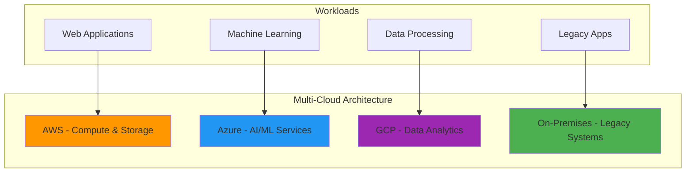
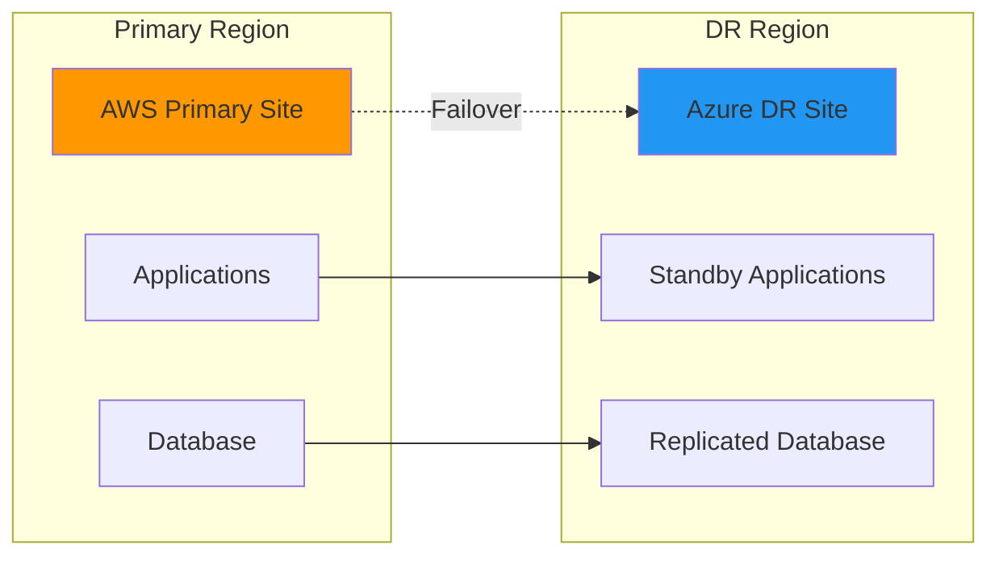
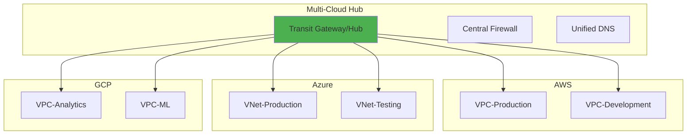
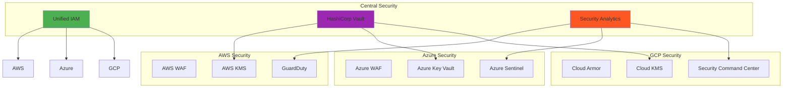
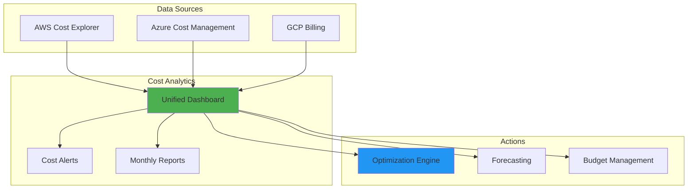
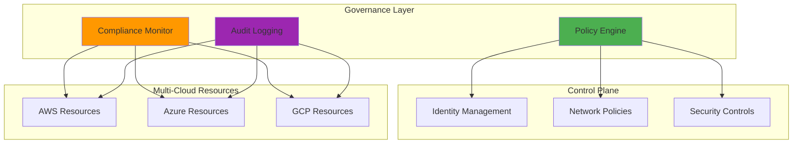

# Multi-Cloud Strategies and Management 🔄

## Multi-Cloud Fundamentals

### 1. What is multi-cloud and why would organizations adopt it?

**Answer:**

**Multi-Cloud Definition:**
Multi-cloud is a strategy where organizations use services from multiple cloud providers simultaneously to meet different business requirements.

**Key Benefits:**
- **Avoid Vendor Lock-in**: Reduces dependency on single provider
- **Best-of-Breed Services**: Choose optimal services from each provider
- **Risk Mitigation**: Distributed infrastructure reduces single points of failure
- **Cost Optimization**: Leverage competitive pricing across providers
- **Compliance**: Meet regulatory requirements across different regions
- **Performance**: Optimize latency by using regional providers

**Common Multi-Cloud Scenarios:**


### 2. What are the challenges of multi-cloud management?

**Answer:**

**Technical Challenges:**
- **Complexity**: Managing multiple APIs, tools, and interfaces
- **Integration**: Connecting services across different clouds
- **Data Transfer**: Network latency and bandwidth costs
- **Security**: Consistent security policies across platforms
- **Monitoring**: Unified observability across environments

**Operational Challenges:**
- **Skill Requirements**: Teams need expertise in multiple platforms
- **Cost Management**: Tracking expenses across providers
- **Governance**: Maintaining compliance and standards
- **Vendor Relationships**: Managing multiple contracts and SLAs

**Solutions:**
```yaml
multi_cloud_solutions:
  orchestration:
    - Terraform for unified infrastructure
    - Kubernetes for container orchestration
    - Ansible for configuration management
  
  monitoring:
    - Prometheus + Grafana for metrics
    - ELK stack for centralized logging
    - Third-party tools (Datadog, New Relic)
  
  security:
    - HashiCorp Vault for secrets management
    - Cloud security posture management tools
    - Unified identity management (Azure AD, Okta)
  
  cost_management:
    - CloudHealth or CloudCheckr
    - Native cost management tools
    - Custom billing dashboards
```

## Multi-Cloud Architecture Patterns

### 3. What are common multi-cloud architecture patterns?

**Answer:**

**1. Cloud Bursting:**
```yaml
cloud_bursting:
  scenario: "Handle traffic spikes"
  implementation:
    primary: "On-premises or private cloud"
    secondary: "Public cloud for overflow"
  example:
    - "E-commerce site during Black Friday"
    - "Video streaming during major events"
```

**2. Data Residency Pattern:**
```yaml
data_residency:
  scenario: "Compliance requirements"
  implementation:
    europe: "Azure EU regions"
    usa: "AWS US regions"
    asia: "GCP APAC regions"
  benefits:
    - "GDPR compliance"
    - "Data sovereignty"
    - "Reduced latency"
```

**3. Best-of-Breed Pattern:**
```yaml
best_of_breed:
  compute: "AWS EC2 - mature and cost-effective"
  ai_ml: "Azure Cognitive Services - advanced AI"
  data_analytics: "GCP BigQuery - powerful analytics"
  storage: "AWS S3 - industry standard"
```

**4. Disaster Recovery Pattern:**


### 4. How do you implement multi-cloud networking?

**Answer:**

**Network Connectivity Options:**

**1. VPN Connections:**
```hcl
# AWS VPN Gateway
resource "aws_vpn_gateway" "main" {
  vpc_id = aws_vpc.main.id
  tags = {
    Name = "multi-cloud-vpn"
  }
}

# Azure VPN Gateway
resource "azurerm_virtual_network_gateway" "main" {
  name                = "multi-cloud-vpn"
  location            = azurerm_resource_group.main.location
  resource_group_name = azurerm_resource_group.main.name
  
  type     = "Vpn"
  vpn_type = "RouteBased"
  
  active_active = false
  enable_bgp    = false
  sku           = "Basic"
  
  ip_configuration {
    name                          = "vnetGatewayConfig"
    public_ip_address_id          = azurerm_public_ip.vpn.id
    private_ip_address_allocation = "Dynamic"
    subnet_id                     = azurerm_subnet.gateway.id
  }
}
```

**2. Dedicated Connections:**
```yaml
dedicated_connections:
  aws:
    service: "AWS Direct Connect"
    bandwidth: "1Gbps to 100Gbps"
    latency: "Low, consistent"
  
  azure:
    service: "Azure ExpressRoute"
    bandwidth: "50Mbps to 10Gbps"
    latency: "Low, predictable"
  
  gcp:
    service: "Cloud Interconnect"
    bandwidth: "10Gbps to 200Gbps"
    latency: "Low, dedicated"
```

**3. Multi-Cloud Transit:**


## Multi-Cloud Management Tools

### 5. What tools are used for multi-cloud management?

**Answer:**

**Infrastructure as Code:**
```yaml
terraform:
  description: "Universal infrastructure provisioning"
  providers:
    - aws
    - azurerm
    - google
    - kubernetes
  benefits:
    - "Single configuration language"
    - "State management"
    - "Provider ecosystem"

pulumi:
  description: "Modern IaC with programming languages"
  languages:
    - TypeScript
    - Python
    - Go
    - C#
  benefits:
    - "Familiar programming constructs"
    - "Rich testing capabilities"
    - "Strong typing"
```

**Container Orchestration:**
```yaml
kubernetes:
  multi_cloud_benefits:
    - "Consistent application deployment"
    - "Workload portability"
    - "Unified management"
  
  implementations:
    aws: "Amazon EKS"
    azure: "Azure AKS"
    gcp: "Google GKE"
    hybrid: "Red Hat OpenShift"
```

**Monitoring and Observability:**
```yaml
monitoring_tools:
  cloud_native:
    aws: "CloudWatch"
    azure: "Azure Monitor"
    gcp: "Cloud Monitoring"
  
  third_party:
    - name: "Datadog"
      benefits: ["Unified dashboards", "APM", "Log management"]
    - name: "New Relic"
      benefits: ["Full-stack observability", "AI insights"]
    - name: "Splunk"
      benefits: ["Enterprise logging", "Security analytics"]
  
  open_source:
    - name: "Prometheus + Grafana"
      benefits: ["Cost-effective", "Customizable", "Kubernetes native"]
    - name: "ELK Stack"
      benefits: ["Powerful search", "Log analytics", "Visualization"]
```

### 6. How do you implement multi-cloud security?

**Answer:**

**Identity and Access Management:**
```yaml
unified_iam:
  strategy: "Federated Identity"
  implementation:
    - "Azure Active Directory as identity provider"
    - "SAML/OIDC federation to AWS"
    - "Google Cloud Identity integration"
  
  tools:
    - "Okta Universal Directory"
    - "Ping Identity"
    - "Auth0"
```

**Security Architecture:**


**Security Best Practices:**
```yaml
security_practices:
  encryption:
    - "Consistent encryption standards across clouds"
    - "Centralized key management with Vault"
    - "TLS everywhere for data in transit"
  
  network_security:
    - "Zero-trust network architecture"
    - "Micro-segmentation across clouds"
    - "Unified firewall policies"
  
  compliance:
    - "Policy as code (Open Policy Agent)"
    - "Continuous compliance monitoring"
    - "Automated remediation"
  
  secrets_management:
    - "Centralized secrets with Vault"
    - "Dynamic secrets where possible"
    - "Rotation policies across all clouds"
```

## Multi-Cloud Cost Management

### 7. How do you manage costs across multiple cloud providers?

**Answer:**

**Cost Visibility Strategy:**
```yaml
cost_management:
  unified_billing:
    tools:
      - "CloudHealth"
      - "CloudCheckr" 
      - "Flexera Optima"
    benefits:
      - "Single pane of glass"
      - "Cross-cloud cost comparison"
      - "Optimization recommendations"
  
  tagging_strategy:
    required_tags:
      - "Environment: prod/dev/test"
      - "Project: project-name"
      - "Owner: team-name"
      - "CostCenter: department"
    automation:
      - "Tag enforcement policies"
      - "Auto-tagging with Terraform"
      - "Cost allocation reports"
```

**Cost Optimization Techniques:**
```yaml
optimization_strategies:
  workload_placement:
    criteria:
      - "Compute costs per region"
      - "Data transfer costs"
      - "Service availability and pricing"
    tools:
      - "Cloud pricing APIs"
      - "Cost calculators"
      - "Benchmarking tools"
  
  resource_scheduling:
    dev_environments:
      - "Auto-shutdown after hours"
      - "Weekend hibernation"
      - "Scheduled scaling"
    
    production:
      - "Right-sizing recommendations"
      - "Reserved instance planning"
      - "Spot instance utilization"
```

**Multi-Cloud Cost Dashboard:**


## Multi-Cloud Migration Strategies

### 8. What are the approaches for multi-cloud migration?

**Answer:**

**Migration Patterns:**

**1. Phased Migration:**
```yaml
phased_approach:
  phase_1:
    scope: "Non-critical applications"
    clouds: ["Single cloud provider"]
    duration: "3-6 months"
    
  phase_2:
    scope: "Core business applications"
    clouds: ["Primary + secondary cloud"]
    duration: "6-12 months"
    
  phase_3:
    scope: "Critical systems"
    clouds: ["Full multi-cloud"]
    duration: "12-18 months"
```

**2. Application-Based Distribution:**
```yaml
application_distribution:
  by_function:
    web_tier: "AWS (mature load balancing)"
    application_tier: "Azure (enterprise integration)"
    data_tier: "GCP (advanced analytics)"
  
  by_environment:
    development: "AWS (cost-effective)"
    testing: "Azure (enterprise tools)"
    production: "Multi-cloud (high availability)"
```

**Migration Tools:**
```yaml
migration_tools:
  aws:
    - "AWS Migration Hub"
    - "AWS Database Migration Service"
    - "AWS Server Migration Service"
  
  azure:
    - "Azure Migrate"
    - "Azure Site Recovery"
    - "Azure Database Migration Service"
  
  gcp:
    - "Migrate for Compute Engine"
    - "Database Migration Service"
    - "Transfer Appliance"
  
  third_party:
    - "CloudEndure"
    - "Carbonite"
    - "Zerto"
```

### 9. How do you ensure data consistency across multiple clouds?

**Answer:**

**Data Consistency Strategies:**

**1. Event-Driven Architecture:**
```yaml
event_driven:
  pattern: "Event Sourcing"
  implementation:
    - "Apache Kafka for event streaming"
    - "Cloud event routers (AWS EventBridge, Azure Event Grid)"
    - "Eventual consistency across clouds"
  
  benefits:
    - "Loose coupling"
    - "Audit trail"
    - "Replay capability"
```

**2. Database Replication:**
```yaml
replication_strategies:
  synchronous:
    use_case: "Financial transactions"
    latency: "High"
    consistency: "Strong"
    
  asynchronous:
    use_case: "Content distribution"
    latency: "Low"
    consistency: "Eventual"
    
  multi_master:
    use_case: "Global applications"
    complexity: "High"
    conflict_resolution: "Required"
```

**Data Synchronization Example:**
```python
# Multi-cloud data synchronization with Apache Airflow
from airflow import DAG
from airflow.operators.python import PythonOperator
import boto3
import azure.storage.blob
from google.cloud import storage

def sync_data_across_clouds(**context):
    # AWS S3 to Azure Blob
    s3_client = boto3.client('s3')
    blob_client = azure.storage.blob.BlobServiceClient()
    
    # List objects in S3
    objects = s3_client.list_objects_v2(Bucket='source-bucket')
    
    for obj in objects.get('Contents', []):
        # Download from S3
        s3_object = s3_client.get_object(
            Bucket='source-bucket',
            Key=obj['Key']
        )
        
        # Upload to Azure Blob
        blob_client.get_blob_client(
            container='target-container',
            blob=obj['Key']
        ).upload_blob(
            s3_object['Body'].read(),
            overwrite=True
        )
    
    # Sync to GCP Cloud Storage
    gcp_client = storage.Client()
    bucket = gcp_client.bucket('target-bucket')
    
    for obj in objects.get('Contents', []):
        blob = bucket.blob(obj['Key'])
        blob.upload_from_file(s3_object['Body'])

# DAG definition for scheduled sync
dag = DAG(
    'multi_cloud_data_sync',
    schedule_interval='@hourly',
    catchup=False
)

sync_task = PythonOperator(
    task_id='sync_data',
    python_callable=sync_data_across_clouds,
    dag=dag
)
```

### 10. What are the governance considerations for multi-cloud?

**Answer:**

**Governance Framework:**
```yaml
governance_pillars:
  policy_management:
    tools:
      - "Open Policy Agent (OPA)"
      - "HashiCorp Sentinel"
      - "Cloud Custodian"
    policies:
      - "Resource tagging enforcement"
      - "Security compliance"
      - "Cost controls"
  
  compliance:
    frameworks:
      - "SOC 2"
      - "GDPR"
      - "HIPAA"
      - "PCI DSS"
    automation:
      - "Continuous compliance scanning"
      - "Automated remediation"
      - "Audit reporting"
  
  risk_management:
    assessments:
      - "Vendor risk evaluation"
      - "Data sovereignty analysis"
      - "Service dependency mapping"
    mitigation:
      - "Multi-cloud disaster recovery"
      - "Vendor diversification"
      - "Exit strategy planning"
```

**Governance Architecture:**


This comprehensive multi-cloud section covers strategies, challenges, architecture patterns, management tools, security, cost optimization, migration approaches, data consistency, and governance considerations. Each topic includes practical examples, code snippets, and diagrams to help with interview preparation and real-world implementation.