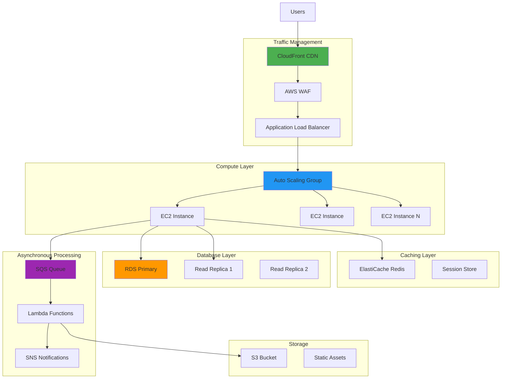
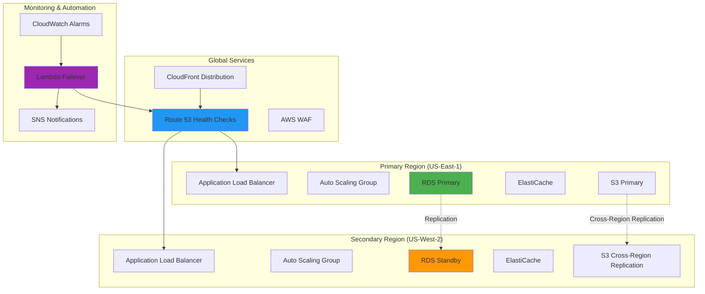
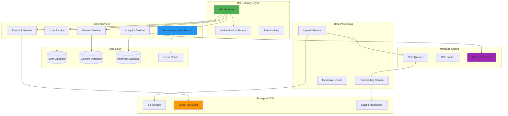
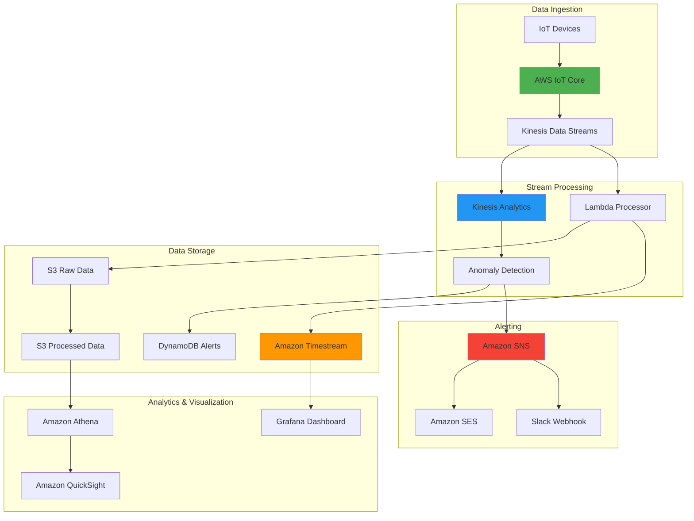

# Real-World Cloud Architecture Scenarios 🎯

## E-Commerce Platform Scenarios

### 1. Design a scalable e-commerce platform for Black Friday traffic

**Scenario:**
Your e-commerce platform normally handles 10,000 concurrent users but expects 100,000+ users during Black Friday. Design a cloud architecture that can handle this traffic spike while maintaining performance and availability.

**Solution Architecture:**



**Implementation Details:**

```yaml
architecture_components:
  frontend:
    cdn: "CloudFront with global edge locations"
    static_hosting: "S3 for static assets (images, CSS, JS)"
    cache_policy: "1 hour for dynamic content, 24h for static"
    
  load_balancing:
    waf: "AWS WAF for DDoS protection and bot filtering"
    alb: "Application Load Balancer with sticky sessions"
    health_checks: "Custom health endpoints with 30s intervals"
    
  compute:
    auto_scaling:
      min_instances: 4
      max_instances: 50
      target_cpu: 70
      scale_out_cooldown: 300
      scale_in_cooldown: 600
    instance_types: ["c5.xlarge", "c5.2xlarge", "c5.4xlarge"]
    availability_zones: 3
    
  caching:
    redis_cluster:
      node_type: "cache.r6g.2xlarge"
      num_nodes: 3
      failover: "automatic"
      backup: "daily snapshots"
    cache_strategies:
      - "Product catalog (1 hour TTL)"
      - "User sessions (30 min TTL)"
      - "Shopping carts (24 hour TTL)"
      - "Inventory counts (5 min TTL)"
    
  database:
    primary:
      instance_class: "db.r5.4xlarge"
      storage: "20TB GP3 SSD"
      multi_az: true
      backup_retention: 7
    read_replicas:
      count: 3
      instance_class: "db.r5.2xlarge"
      regions: ["us-west-2", "us-east-1"]
    connection_pooling:
      max_connections: 1000
      pool_size: 20
      
  async_processing:
    order_processing: "SQS FIFO queue for order consistency"
    inventory_updates: "SQS standard queue for inventory"
    notifications: "SNS for email/SMS alerts"
    image_processing: "Lambda for product image optimization"
```

**Terraform Implementation:**
```terraform
# Auto Scaling Group for Black Friday
resource "aws_autoscaling_group" "ecommerce_asg" {
  name                = "ecommerce-blackfriday-asg"
  vpc_zone_identifier = var.private_subnet_ids
  target_group_arns   = [aws_lb_target_group.ecommerce.arn]
  health_check_type   = "ELB"
  health_check_grace_period = 300

  min_size                  = 4
  max_size                  = 50
  desired_capacity          = 8
  default_cooldown          = 300
  termination_policies      = ["OldestInstance"]
  
  # Mixed instances for cost optimization
  mixed_instances_policy {
    launch_template {
      launch_template_specification {
        launch_template_id = aws_launch_template.ecommerce.id
        version           = "$Latest"
      }
      
      override {
        instance_type = "c5.xlarge"
      }
      override {
        instance_type = "c5.2xlarge"
      }
      override {
        instance_type = "m5.xlarge"
      }
    }
    
    instances_distribution {
      on_demand_base_capacity                  = 4
      on_demand_percentage_above_base_capacity = 25
      spot_allocation_strategy                 = "diversified"
    }
  }

  # Scaling policies
  tag {
    key                 = "Name"
    value               = "ecommerce-instance"
    propagate_at_launch = true
  }
}

# Target tracking scaling policy
resource "aws_autoscaling_policy" "cpu_target_tracking" {
  name                   = "cpu-target-tracking"
  autoscaling_group_name = aws_autoscaling_group.ecommerce_asg.name
  policy_type           = "TargetTrackingScaling"

  target_tracking_configuration {
    predefined_metric_specification {
      predefined_metric_type = "ASGAverageCPUUtilization"
    }
    target_value = 70.0
  }
}

# ElastiCache Redis Cluster
resource "aws_elasticache_replication_group" "ecommerce_redis" {
  replication_group_id       = "ecommerce-redis"
  description                = "Redis cluster for e-commerce caching"
  
  node_type                  = "cache.r6g.2xlarge"
  port                       = 6379
  parameter_group_name       = "default.redis6.x.cluster.on"
  
  num_cache_clusters         = 3
  automatic_failover_enabled = true
  multi_az_enabled          = true
  
  subnet_group_name = aws_elasticache_subnet_group.ecommerce.name
  security_group_ids = [aws_security_group.redis.id]
  
  at_rest_encryption_enabled = true
  transit_encryption_enabled = true
  auth_token                 = var.redis_auth_token
  
  log_delivery_configuration {
    destination      = aws_cloudwatch_log_group.redis_slow.name
    destination_type = "cloudwatch-logs"
    log_format       = "text"
    log_type         = "slow-log"
  }
  
  tags = {
    Name = "ecommerce-redis-cluster"
    Event = "black-friday"
  }
}

# RDS Aurora with read replicas
resource "aws_rds_cluster" "ecommerce_aurora" {
  cluster_identifier      = "ecommerce-aurora-cluster"
  engine                 = "aurora-mysql"
  engine_version         = "8.0.mysql_aurora.3.02.0"
  engine_mode            = "provisioned"
  
  database_name          = var.database_name
  master_username        = var.database_username
  master_password        = var.database_password
  
  backup_retention_period = 7
  preferred_backup_window = "03:00-04:00"
  preferred_maintenance_window = "sun:04:00-sun:05:00"
  
  vpc_security_group_ids = [aws_security_group.rds.id]
  db_subnet_group_name   = aws_db_subnet_group.ecommerce.name
  
  storage_encrypted = true
  kms_key_id       = aws_kms_key.rds.arn
  
  enabled_cloudwatch_logs_exports = ["error", "general", "slowquery"]
  
  serverlessv2_scaling_configuration {
    max_capacity = 64
    min_capacity = 2
  }
  
  tags = {
    Name = "ecommerce-aurora-cluster"
    Event = "black-friday"
  }
}

# Aurora instances
resource "aws_rds_cluster_instance" "ecommerce_aurora_instances" {
  count              = 3
  identifier         = "ecommerce-aurora-${count.index}"
  cluster_identifier = aws_rds_cluster.ecommerce_aurora.id
  instance_class     = "db.serverless"
  engine             = aws_rds_cluster.ecommerce_aurora.engine
  engine_version     = aws_rds_cluster.ecommerce_aurora.engine_version
  
  performance_insights_enabled = true
  monitoring_interval          = 60
  monitoring_role_arn         = aws_iam_role.rds_monitoring.arn
  
  tags = {
    Name = "ecommerce-aurora-instance-${count.index}"
  }
}
```

**Cost Optimization Strategy:**
```yaml
cost_optimization:
  compute:
    - "Use Spot Instances for 75% of fleet during peak"
    - "Reserved Instances for baseline capacity"
    - "Scheduled scaling based on historical patterns"
    
  storage:
    - "S3 Intelligent Tiering for static assets"
    - "CloudFront edge caching to reduce origin requests"
    - "Compress and optimize images automatically"
    
  database:
    - "Aurora Serverless v2 for automatic scaling"
    - "Read replicas in same AZ for low latency"
    - "Connection pooling to reduce connection overhead"
    
  monitoring:
    - "CloudWatch custom metrics for business KPIs"
    - "Auto-scaling based on queue depth and response time"
    - "Predictive scaling for known traffic patterns"
```

### 2. Design a multi-region disaster recovery solution for a financial application

**Scenario:**
Design a disaster recovery solution for a financial trading application that requires:
- RTO (Recovery Time Objective): 15 minutes
- RPO (Recovery Point Objective): 5 minutes
- 99.99% availability
- Compliance with financial regulations

**Solution Architecture:**



**Implementation:**
```terraform
# Multi-region setup with Route 53 health checks
resource "aws_route53_health_check" "primary_region" {
  fqdn                            = aws_lb.primary.dns_name
  port                            = 443
  type                            = "HTTPS"
  resource_path                   = "/health"
  failure_threshold               = 3
  request_interval                = 30
  
  tags = {
    Name = "Primary Region Health Check"
  }
}

resource "aws_route53_health_check" "secondary_region" {
  fqdn                            = aws_lb.secondary.dns_name
  port                            = 443
  type                            = "HTTPS"
  resource_path                   = "/health"
  failure_threshold               = 3
  request_interval                = 30
  
  tags = {
    Name = "Secondary Region Health Check"
  }
}

# Route 53 records with failover routing
resource "aws_route53_record" "primary" {
  zone_id = var.hosted_zone_id
  name    = "trading.example.com"
  type    = "A"
  
  set_identifier = "primary"
  failover_routing_policy {
    type = "PRIMARY"
  }
  
  health_check_id = aws_route53_health_check.primary_region.id
  
  alias {
    name                   = aws_lb.primary.dns_name
    zone_id               = aws_lb.primary.zone_id
    evaluate_target_health = true
  }
}

resource "aws_route53_record" "secondary" {
  zone_id = var.hosted_zone_id
  name    = "trading.example.com"
  type    = "A"
  
  set_identifier = "secondary"
  failover_routing_policy {
    type = "SECONDARY"
  }
  
  alias {
    name                   = aws_lb.secondary.dns_name
    zone_id               = aws_lb.secondary.zone_id
    evaluate_target_health = true
  }
}

# RDS Cross-Region Automated Backups
resource "aws_rds_cluster" "primary" {
  cluster_identifier = "trading-primary"
  engine            = "aurora-mysql"
  
  backup_retention_period   = 35
  preferred_backup_window   = "03:00-04:00"
  copy_tags_to_snapshot    = true
  deletion_protection      = true
  
  # Enable automated backups to secondary region
  s3_import {
    source_engine         = "mysql"
    source_engine_version = "8.0"
    bucket_name          = aws_s3_bucket.backups.bucket
    bucket_prefix        = "database-backups/"
    ingestion_role       = aws_iam_role.s3_import.arn
  }
}

# Automated failover Lambda function
resource "aws_lambda_function" "failover_automation" {
  filename         = "failover.zip"
  function_name    = "trading-failover-automation"
  role            = aws_iam_role.lambda_failover.arn
  handler         = "failover.handler"
  runtime         = "python3.9"
  timeout         = 300
  
  environment {
    variables = {
      PRIMARY_REGION   = "us-east-1"
      SECONDARY_REGION = "us-west-2"
      RDS_CLUSTER_ID   = aws_rds_cluster.primary.cluster_identifier
      SNS_TOPIC_ARN    = aws_sns_topic.disaster_recovery.arn
    }
  }
}

# CloudWatch alarm for automated failover
resource "aws_cloudwatch_metric_alarm" "rds_failure" {
  alarm_name          = "rds-primary-failure"
  comparison_operator = "LessThanThreshold"
  evaluation_periods  = "2"
  metric_name         = "DatabaseConnections"
  namespace           = "AWS/RDS"
  period              = "60"
  statistic           = "Average"
  threshold           = "1"
  alarm_description   = "RDS primary cluster failure"
  
  insufficient_data_actions = []
  alarm_actions            = [aws_sns_topic.disaster_recovery.arn]
  
  dimensions = {
    DBClusterIdentifier = aws_rds_cluster.primary.cluster_identifier
  }
}
```

**Failover Automation Script:**
```python
import boto3
import json
import logging
import os
from datetime import datetime

logger = logging.getLogger()
logger.setLevel(logging.INFO)

def handler(event, context):
    """Automated disaster recovery failover"""
    
    primary_region = os.environ['PRIMARY_REGION']
    secondary_region = os.environ['SECONDARY_REGION']
    rds_cluster_id = os.environ['RDS_CLUSTER_ID']
    sns_topic_arn = os.environ['SNS_TOPIC_ARN']
    
    # Initialize AWS clients
    route53 = boto3.client('route53')
    rds_primary = boto3.client('rds', region_name=primary_region)
    rds_secondary = boto3.client('rds', region_name=secondary_region)
    sns = boto3.client('sns')
    
    try:
        # Check primary RDS cluster status
        primary_status = check_rds_cluster_status(rds_primary, rds_cluster_id)
        
        if primary_status != 'available':
            logger.info(f"Primary RDS cluster is {primary_status}, initiating failover")
            
            # Promote read replica in secondary region
            promote_read_replica(rds_secondary, f"{rds_cluster_id}-replica")
            
            # Update Route 53 to point to secondary region
            update_route53_failover(route53)
            
            # Scale up secondary region ASG
            scale_secondary_region()
            
            # Send notification
            send_notification(sns, sns_topic_arn, "Disaster recovery failover initiated")
            
            return {
                'statusCode': 200,
                'body': json.dumps('Failover completed successfully')
            }
        else:
            logger.info("Primary region is healthy, no action needed")
            return {
                'statusCode': 200,
                'body': json.dumps('Primary region healthy')
            }
            
    except Exception as e:
        logger.error(f"Failover failed: {str(e)}")
        send_notification(sns, sns_topic_arn, f"Failover failed: {str(e)}")
        raise

def check_rds_cluster_status(rds_client, cluster_id):
    """Check RDS cluster status"""
    try:
        response = rds_client.describe_db_clusters(
            DBClusterIdentifier=cluster_id
        )
        return response['DBClusters'][0]['Status']
    except Exception as e:
        logger.error(f"Error checking RDS status: {e}")
        return 'unavailable'

def promote_read_replica(rds_client, replica_id):
    """Promote read replica to primary"""
    try:
        rds_client.promote_read_replica_db_cluster(
            DBClusterIdentifier=replica_id
        )
        logger.info(f"Promoted read replica {replica_id}")
    except Exception as e:
        logger.error(f"Error promoting replica: {e}")
        raise

def update_route53_failover(route53_client):
    """Update Route 53 records for failover"""
    try:
        # This would update DNS records to point to secondary region
        # Implementation depends on specific DNS configuration
        logger.info("Updated Route 53 records for failover")
    except Exception as e:
        logger.error(f"Error updating Route 53: {e}")
        raise

def scale_secondary_region():
    """Scale up Auto Scaling Group in secondary region"""
    try:
        asg = boto3.client('autoscaling', region_name=os.environ['SECONDARY_REGION'])
        asg.set_desired_capacity(
            AutoScalingGroupName='trading-secondary-asg',
            DesiredCapacity=6,
            HonorCooldown=False
        )
        logger.info("Scaled up secondary region ASG")
    except Exception as e:
        logger.error(f"Error scaling secondary region: {e}")
        raise

def send_notification(sns_client, topic_arn, message):
    """Send SNS notification"""
    try:
        sns_client.publish(
            TopicArn=topic_arn,
            Message=message,
            Subject="Disaster Recovery Alert"
        )
        logger.info("Notification sent")
    except Exception as e:
        logger.error(f"Error sending notification: {e}")
```

## Microservices Architecture Scenarios

### 3. Design a microservices architecture for a video streaming platform

**Scenario:**
Design a microservices architecture for a video streaming platform like Netflix that can handle:
- 10 million concurrent users
- Global content delivery
- Personalized recommendations
- Real-time analytics
- Content upload and processing

**Solution Architecture:**



**Microservices Implementation:**

```yaml
microservices_architecture:
  api_gateway:
    technology: "AWS API Gateway / Kong"
    responsibilities:
      - "Request routing"
      - "Authentication/Authorization"
      - "Rate limiting"
      - "Request/Response transformation"
      - "API versioning"
    
  user_service:
    technology: "Node.js / Express"
    database: "Amazon RDS (PostgreSQL)"
    responsibilities:
      - "User registration/login"
      - "Profile management"
      - "Subscription management"
      - "User preferences"
    
  content_service:
    technology: "Java / Spring Boot"
    database: "Amazon DynamoDB"
    responsibilities:
      - "Content metadata management"
      - "Content catalog"
      - "Search functionality"
      - "Content categorization"
    
  recommendation_service:
    technology: "Python / Flask"
    database: "Amazon ElastiCache (Redis)"
    ml_platform: "Amazon SageMaker"
    responsibilities:
      - "Personalized recommendations"
      - "Content similarity"
      - "Collaborative filtering"
      - "A/B testing for recommendations"
    
  playback_service:
    technology: "Go / Gin"
    cdn: "Amazon CloudFront"
    responsibilities:
      - "Video streaming URLs"
      - "Quality adaptation"
      - "Playback analytics"
      - "DRM integration"
    
  upload_service:
    technology: "Python / FastAPI"
    storage: "Amazon S3"
    queue: "Amazon SQS"
    responsibilities:
      - "Content upload"
      - "File validation"
      - "Metadata extraction"
      - "Transcoding job initiation"
```

**Recommendation Service Implementation:**
```python
from flask import Flask, request, jsonify
import redis
import boto3
import json
import logging
from datetime import datetime, timedelta

app = Flask(__name__)

class RecommendationService:
    def __init__(self):
        self.redis_client = redis.Redis(
            host='recommendation-cache.cluster.amazonaws.com',
            port=6379,
            decode_responses=True
        )
        self.sagemaker = boto3.client('sagemaker-runtime')
        self.dynamodb = boto3.resource('dynamodb')
        self.user_interactions = self.dynamodb.Table('user-interactions')
        self.content_features = self.dynamodb.Table('content-features')
        
    def get_recommendations(self, user_id, count=20):
        """Get personalized recommendations for user"""
        
        # Check cache first
        cache_key = f"recommendations:{user_id}"
        cached_recs = self.redis_client.get(cache_key)
        
        if cached_recs:
            return json.loads(cached_recs)
        
        # Get user interaction history
        user_history = self.get_user_history(user_id)
        
        # Get recommendations from ML model
        recommendations = self.call_recommendation_model(user_id, user_history, count)
        
        # Apply business rules and filtering
        filtered_recs = self.apply_business_rules(recommendations, user_id)
        
        # Cache recommendations for 1 hour
        self.redis_client.setex(
            cache_key, 
            3600, 
            json.dumps(filtered_recs)
        )
        
        return filtered_recs
    
    def get_user_history(self, user_id):
        """Get user's viewing history and interactions"""
        try:
            response = self.user_interactions.query(
                KeyConditionExpression='user_id = :uid',
                ExpressionAttributeValues={':uid': user_id},
                ScanIndexForward=False,
                Limit=100
            )
            return response['Items']
        except Exception as e:
            logging.error(f"Error getting user history: {e}")
            return []
    
    def call_recommendation_model(self, user_id, user_history, count):
        """Call SageMaker recommendation model"""
        try:
            # Prepare input data
            input_data = {
                'user_id': user_id,
                'user_history': user_history,
                'count': count,
                'timestamp': datetime.now().isoformat()
            }
            
            # Call SageMaker endpoint
            response = self.sagemaker.invoke_endpoint(
                EndpointName='recommendation-model-endpoint',
                ContentType='application/json',
                Body=json.dumps(input_data)
            )
            
            result = json.loads(response['Body'].read().decode())
            return result.get('recommendations', [])
            
        except Exception as e:
            logging.error(f"Error calling recommendation model: {e}")
            # Fallback to popular content
            return self.get_popular_content(count)
    
    def apply_business_rules(self, recommendations, user_id):
        """Apply business rules and content filtering"""
        filtered_recs = []
        
        for rec in recommendations:
            content_id = rec['content_id']
            
            # Check if user has already watched
            if not self.has_user_watched(user_id, content_id):
                # Check content availability
                if self.is_content_available(content_id):
                    # Check user's subscription tier
                    if self.has_access_to_content(user_id, content_id):
                        filtered_recs.append(rec)
        
        return filtered_recs[:20]  # Return top 20
    
    def has_user_watched(self, user_id, content_id):
        """Check if user has already watched content"""
        cache_key = f"watched:{user_id}:{content_id}"
        return self.redis_client.exists(cache_key)
    
    def is_content_available(self, content_id):
        """Check if content is available for streaming"""
        try:
            response = self.content_features.get_item(
                Key={'content_id': content_id}
            )
            item = response.get('Item', {})
            return item.get('status') == 'available'
        except Exception as e:
            logging.error(f"Error checking content availability: {e}")
            return False
    
    def has_access_to_content(self, user_id, content_id):
        """Check if user's subscription allows access to content"""
        # Implementation would check user subscription tier
        # against content access requirements
        return True
    
    def get_popular_content(self, count):
        """Fallback to popular content"""
        # Implementation would return trending/popular content
        return []
    
    def record_interaction(self, user_id, content_id, interaction_type, metadata=None):
        """Record user interaction for future recommendations"""
        try:
            interaction = {
                'user_id': user_id,
                'content_id': content_id,
                'interaction_type': interaction_type,
                'timestamp': datetime.now().isoformat(),
                'metadata': metadata or {}
            }
            
            # Store in DynamoDB
            self.user_interactions.put_item(Item=interaction)
            
            # Update cache
            if interaction_type == 'watch':
                cache_key = f"watched:{user_id}:{content_id}"
                self.redis_client.setex(cache_key, 86400, "1")  # 24 hours
            
            # Invalidate recommendations cache
            rec_cache_key = f"recommendations:{user_id}"
            self.redis_client.delete(rec_cache_key)
            
        except Exception as e:
            logging.error(f"Error recording interaction: {e}")

# Initialize service
rec_service = RecommendationService()

@app.route('/recommendations/<user_id>')
def get_recommendations(user_id):
    """Get recommendations for user"""
    count = request.args.get('count', 20, type=int)
    
    try:
        recommendations = rec_service.get_recommendations(user_id, count)
        return jsonify({
            'user_id': user_id,
            'recommendations': recommendations,
            'count': len(recommendations)
        })
    except Exception as e:
        return jsonify({'error': str(e)}), 500

@app.route('/interactions', methods=['POST'])
def record_interaction():
    """Record user interaction"""
    data = request.get_json()
    
    try:
        rec_service.record_interaction(
            user_id=data['user_id'],
            content_id=data['content_id'],
            interaction_type=data['interaction_type'],
            metadata=data.get('metadata')
        )
        return jsonify({'status': 'success'})
    except Exception as e:
        return jsonify({'error': str(e)}), 500

@app.route('/health')
def health_check():
    return jsonify({'status': 'healthy'})

if __name__ == '__main__':
    app.run(host='0.0.0.0', port=8080)
```

### 4. Design a serverless data processing pipeline for IoT data

**Scenario:**
Design a serverless architecture to process IoT sensor data from 100,000 devices sending data every 30 seconds. The system needs to:
- Ingest and validate sensor data
- Detect anomalies in real-time
- Store historical data for analytics
- Send alerts for critical conditions
- Provide real-time dashboards

**Solution Architecture:**



**Implementation:**

```yaml
serverless_pipeline:
  data_ingestion:
    iot_core:
      device_certificates: "X.509 certificates for device authentication"
      message_broker: "MQTT broker for device communication"
      device_shadow: "Device state synchronization"
      rules_engine: "Route messages to Kinesis"
    
    kinesis_streams:
      shard_count: 100
      retention_period: "24 hours"
      encryption: "Server-side encryption with KMS"
      
  stream_processing:
    lambda_functions:
      runtime: "Python 3.9"
      memory: "1024 MB"
      timeout: "5 minutes"
      concurrency: "1000"
      dlq: "Dead letter queue for failed messages"
    
    kinesis_analytics:
      windowing: "Tumbling windows of 1 minute"
      anomaly_detection: "Random Cut Forest algorithm"
      aggregations: "MIN, MAX, AVG, COUNT per device"
      
  data_storage:
    timestream:
      memory_retention: "24 hours"
      magnetic_retention: "1 year"
      auto_scaling: "Enabled"
    
    s3_storage:
      raw_data: "s3://iot-data-raw/year/month/day/hour/"
      processed_data: "s3://iot-data-processed/year/month/day/"
      lifecycle_policy: "Transition to IA after 30 days, Glacier after 90 days"
      
  alerting:
    alert_rules:
      - "Temperature > 80°C"
      - "Humidity < 10% or > 90%"
      - "Device offline > 5 minutes"
      - "Battery level < 10%"
      - "Anomaly score > 0.8"
```

**Lambda Data Processor:**
```python
import json
import boto3
import logging
from datetime import datetime
from decimal import Decimal

logger = logging.getLogger()
logger.setLevel(logging.INFO)

# Initialize AWS clients
timestream = boto3.client('timestream-write')
s3 = boto3.client('s3')
sns = boto3.client('sns')

# Configuration
DATABASE_NAME = 'IoTSensorData'
TABLE_NAME = 'DeviceMetrics'
S3_BUCKET = 'iot-data-raw'
SNS_TOPIC_ARN = 'arn:aws:sns:us-west-2:123456789012:iot-alerts'

def lambda_handler(event, context):
    """Process IoT sensor data from Kinesis stream"""
    
    processed_records = []
    failed_records = []
    
    for record in event['Records']:
        try:
            # Decode Kinesis data
            payload = json.loads(
                boto3.client('kinesis').get_record(
                    ShardIterator=record['kinesis']['data']
                )['Record']['Data']
            )
            
            # Validate and process sensor data
            processed_data = validate_and_process_data(payload)
            
            if processed_data:
                # Store in Timestream
                store_in_timestream(processed_data)
                
                # Store raw data in S3
                store_in_s3(processed_data)
                
                # Check for alerts
                check_for_alerts(processed_data)
                
                processed_records.append(record['recordId'])
            else:
                failed_records.append(record['recordId'])
                
        except Exception as e:
            logger.error(f"Error processing record {record['recordId']}: {e}")
            failed_records.append(record['recordId'])
    
    return {
        'batchItemFailures': [
            {'itemIdentifier': record_id} for record_id in failed_records
        ]
    }

def validate_and_process_data(payload):
    """Validate and enrich sensor data"""
    
    required_fields = ['device_id', 'timestamp', 'metrics']
    
    # Validate required fields
    for field in required_fields:
        if field not in payload:
            logger.warning(f"Missing required field: {field}")
            return None
    
    device_id = payload['device_id']
    timestamp = payload['timestamp']
    metrics = payload['metrics']
    
    # Validate device_id format
    if not device_id or len(device_id) < 5:
        logger.warning(f"Invalid device_id: {device_id}")
        return None
    
    # Validate timestamp
    try:
        dt = datetime.fromisoformat(timestamp.replace('Z', '+00:00'))
    except ValueError:
        logger.warning(f"Invalid timestamp format: {timestamp}")
        return None
    
    # Validate metrics
    valid_metrics = {}
    for metric_name, value in metrics.items():
        if isinstance(value, (int, float)) and not isinstance(value, bool):
            valid_metrics[metric_name] = value
        else:
            logger.warning(f"Invalid metric value: {metric_name}={value}")
    
    if not valid_metrics:
        logger.warning("No valid metrics found")
        return None
    
    # Enrich data
    enriched_data = {
        'device_id': device_id,
        'timestamp': timestamp,
        'metrics': valid_metrics,
        'device_type': get_device_type(device_id),
        'location': get_device_location(device_id),
        'processed_at': datetime.utcnow().isoformat()
    }
    
    return enriched_data

def store_in_timestream(data):
    """Store processed data in Amazon Timestream"""
    
    try:
        records = []
        
        for metric_name, value in data['metrics'].items():
            record = {
                'Time': data['timestamp'],
                'TimeUnit': 'MILLISECONDS',
                'Dimensions': [
                    {'Name': 'DeviceId', 'Value': data['device_id']},
                    {'Name': 'DeviceType', 'Value': data['device_type']},
                    {'Name': 'Location', 'Value': data['location']}
                ],
                'MeasureName': metric_name,
                'MeasureValue': str(value),
                'MeasureValueType': 'DOUBLE'
            }
            records.append(record)
        
        # Write to Timestream
        response = timestream.write_records(
            DatabaseName=DATABASE_NAME,
            TableName=TABLE_NAME,
            Records=records
        )
        
        logger.info(f"Stored {len(records)} records in Timestream for device {data['device_id']}")
        
    except Exception as e:
        logger.error(f"Error storing data in Timestream: {e}")
        raise

def store_in_s3(data):
    """Store raw data in S3 for batch processing"""
    
    try:
        # Create S3 key with partitioning
        dt = datetime.fromisoformat(data['timestamp'].replace('Z', '+00:00'))
        s3_key = f"year={dt.year}/month={dt.month:02d}/day={dt.day:02d}/hour={dt.hour:02d}/{data['device_id']}-{int(dt.timestamp())}.json"
        
        # Upload to S3
        s3.put_object(
            Bucket=S3_BUCKET,
            Key=s3_key,
            Body=json.dumps(data),
            ContentType='application/json'
        )
        
        logger.debug(f"Stored data in S3: {s3_key}")
        
    except Exception as e:
        logger.error(f"Error storing data in S3: {e}")
        # Don't raise exception for S3 errors as Timestream is primary storage

def check_for_alerts(data):
    """Check sensor data against alert rules"""
    
    device_id = data['device_id']
    metrics = data['metrics']
    alerts = []
    
    # Temperature alerts
    if 'temperature' in metrics:
        temp = metrics['temperature']
        if temp > 80:
            alerts.append({
                'type': 'HIGH_TEMPERATURE',
                'severity': 'CRITICAL',
                'message': f"High temperature detected: {temp}°C",
                'threshold': 80
            })
        elif temp < -20:
            alerts.append({
                'type': 'LOW_TEMPERATURE',
                'severity': 'WARNING',
                'message': f"Low temperature detected: {temp}°C",
                'threshold': -20
            })
    
    # Humidity alerts
    if 'humidity' in metrics:
        humidity = metrics['humidity']
        if humidity > 90:
            alerts.append({
                'type': 'HIGH_HUMIDITY',
                'severity': 'WARNING',
                'message': f"High humidity detected: {humidity}%",
                'threshold': 90
            })
        elif humidity < 10:
            alerts.append({
                'type': 'LOW_HUMIDITY',
                'severity': 'WARNING',
                'message': f"Low humidity detected: {humidity}%",
                'threshold': 10
            })
    
    # Battery alerts
    if 'battery_level' in metrics:
        battery = metrics['battery_level']
        if battery < 10:
            alerts.append({
                'type': 'LOW_BATTERY',
                'severity': 'WARNING',
                'message': f"Low battery level: {battery}%",
                'threshold': 10
            })
    
    # Send alerts via SNS
    for alert in alerts:
        send_alert(device_id, alert, data)

def send_alert(device_id, alert, data):
    """Send alert notification via SNS"""
    
    try:
        alert_message = {
            'device_id': device_id,
            'alert_type': alert['type'],
            'severity': alert['severity'],
            'message': alert['message'],
            'timestamp': data['timestamp'],
            'location': data['location'],
            'metrics': data['metrics']
        }
        
        sns.publish(
            TopicArn=SNS_TOPIC_ARN,
            Message=json.dumps(alert_message),
            Subject=f"IoT Alert: {alert['type']} - {device_id}",
            MessageAttributes={
                'AlertType': {
                    'DataType': 'String',
                    'StringValue': alert['type']
                },
                'Severity': {
                    'DataType': 'String',
                    'StringValue': alert['severity']
                }
            }
        )
        
        logger.info(f"Alert sent for device {device_id}: {alert['type']}")
        
    except Exception as e:
        logger.error(f"Error sending alert: {e}")

def get_device_type(device_id):
    """Get device type from device_id (simplified)"""
    if device_id.startswith('TEMP'):
        return 'temperature_sensor'
    elif device_id.startswith('HUM'):
        return 'humidity_sensor'
    elif device_id.startswith('MULTI'):
        return 'multi_sensor'
    else:
        return 'unknown'

def get_device_location(device_id):
    """Get device location (simplified - would query from database)"""
    # In production, this would lookup location from DynamoDB or cache
    return 'unknown'
```

This comprehensive scenarios guide provides real-world cloud architecture examples with detailed implementations, covering e-commerce platforms, disaster recovery, microservices, and serverless IoT data processing pipelines.