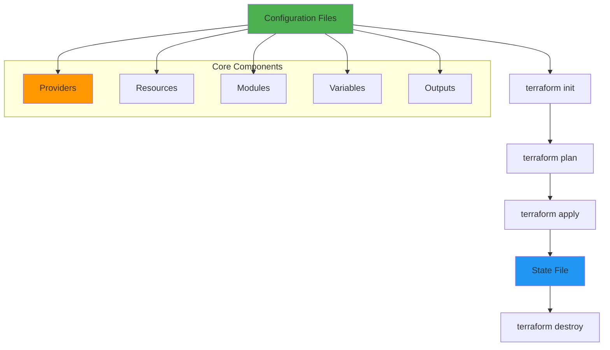
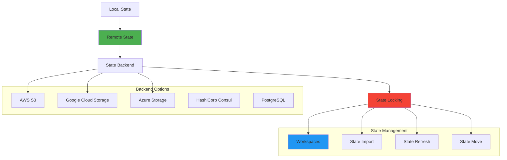
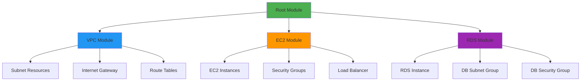
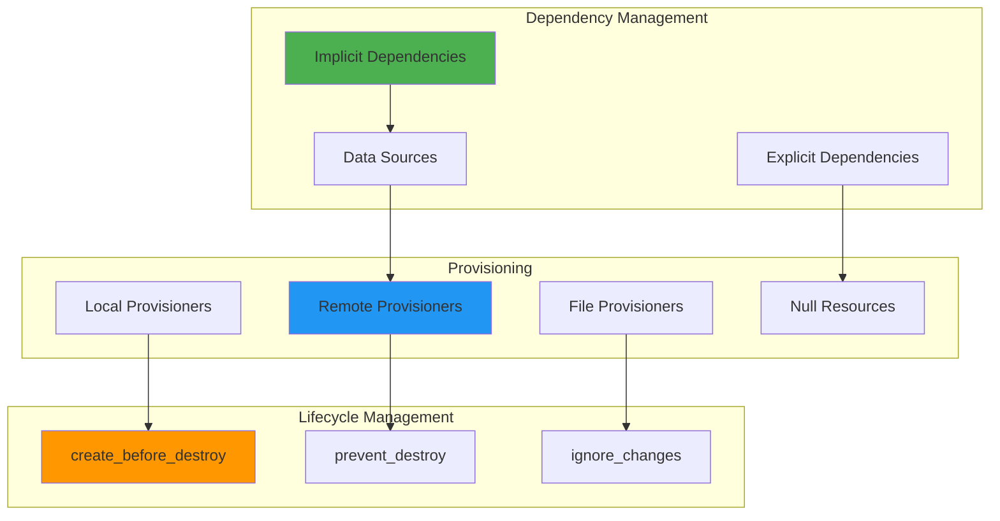
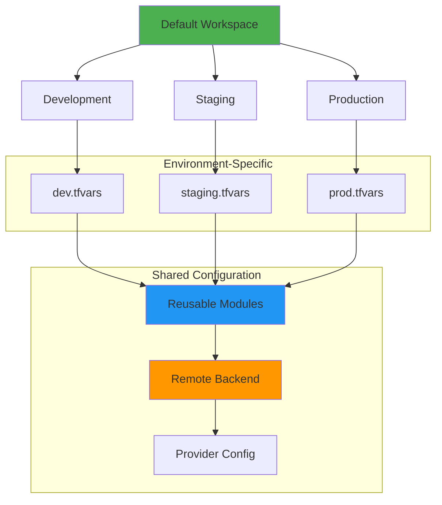
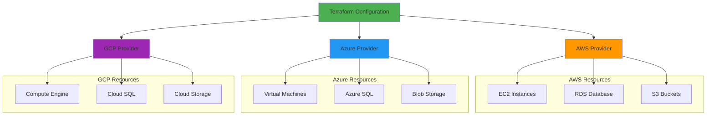
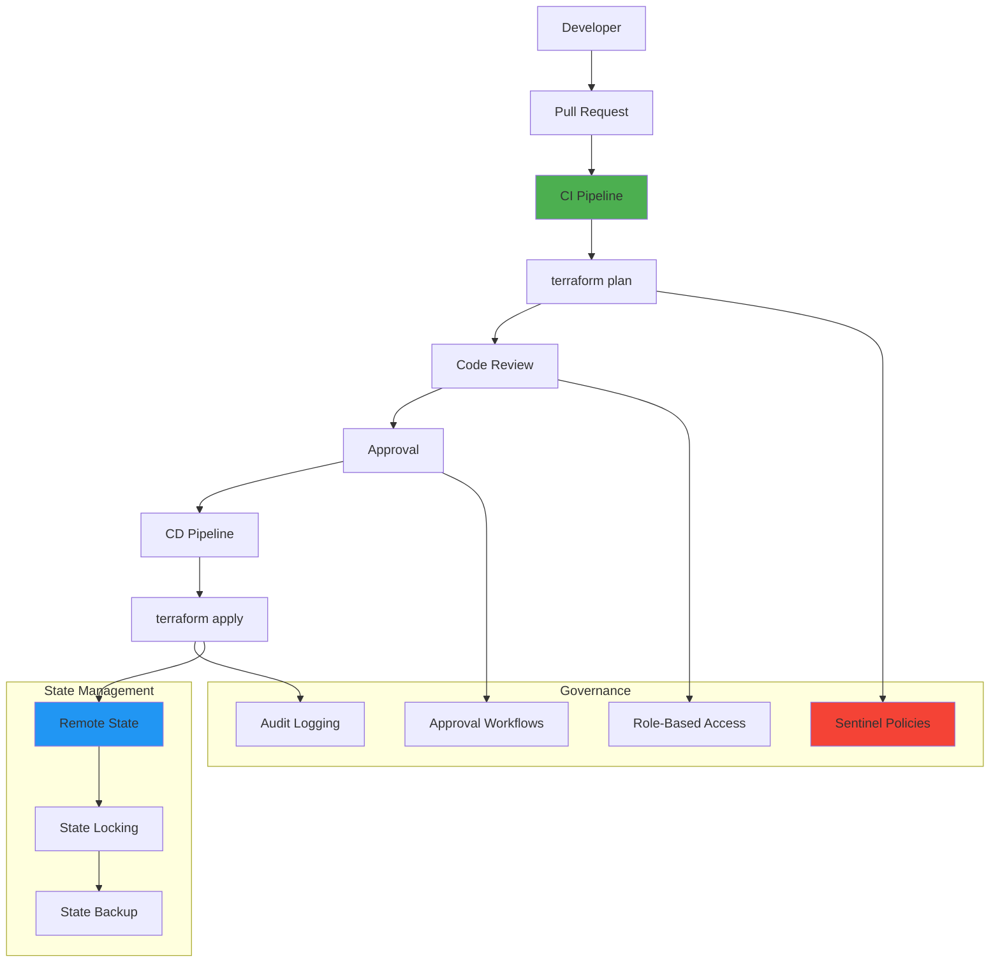

# Terraform Infrastructure as Code Interview Questions 🚀

## Terraform Fundamentals

### 1. Explain Terraform's core concepts and workflow

**Answer:**

Terraform is an Infrastructure as Code (IaC) tool that allows you to define and provision infrastructure using declarative configuration files.



**Basic Terraform Structure:**
```hcl
# main.tf
terraform {
  required_version = ">= 1.0"
  required_providers {
    aws = {
      source  = "hashicorp/aws"
      version = "~> 5.0"
    }
  }
  
  backend "s3" {
    bucket = "terraform-state-bucket"
    key    = "infrastructure/terraform.tfstate"
    region = "us-west-2"
  }
}

provider "aws" {
  region = var.aws_region
  
  default_tags {
    tags = {
      Environment = var.environment
      Project     = var.project_name
      ManagedBy   = "Terraform"
    }
  }
}

# variables.tf
variable "aws_region" {
  description = "AWS region for resources"
  type        = string
  default     = "us-west-2"
}

variable "environment" {
  description = "Environment name"
  type        = string
  validation {
    condition     = contains(["dev", "staging", "prod"], var.environment)
    error_message = "Environment must be dev, staging, or prod."
  }
}

# outputs.tf
output "vpc_id" {
  description = "ID of the VPC"
  value       = aws_vpc.main.id
}
```

### 2. How do you manage Terraform state effectively?

**Answer:**



**Remote State Configuration:**
```hcl
# backend.tf
terraform {
  backend "s3" {
    bucket         = "terraform-state-${var.environment}"
    key            = "infrastructure/terraform.tfstate"
    region         = "us-west-2"
    encrypt        = true
    dynamodb_table = "terraform-state-lock"
    
    # Prevent accidental state file deletion
    versioning = true
  }
}

# DynamoDB table for state locking
resource "aws_dynamodb_table" "terraform_state_lock" {
  name           = "terraform-state-lock"
  billing_mode   = "PAY_PER_REQUEST"
  hash_key       = "LockID"

  attribute {
    name = "LockID"
    type = "S"
  }

  tags = {
    Name = "Terraform State Lock Table"
  }
}

# S3 bucket for state storage
resource "aws_s3_bucket" "terraform_state" {
  bucket = "terraform-state-${var.environment}-${random_id.bucket_suffix.hex}"
}

resource "aws_s3_bucket_versioning" "terraform_state" {
  bucket = aws_s3_bucket.terraform_state.id
  versioning_configuration {
    status = "Enabled"
  }
}

resource "aws_s3_bucket_server_side_encryption_configuration" "terraform_state" {
  bucket = aws_s3_bucket.terraform_state.id

  rule {
    apply_server_side_encryption_by_default {
      sse_algorithm = "AES256"
    }
  }
}
```

### 3. Explain Terraform modules and their best practices

**Answer:**



**Module Structure:**
```
modules/
├── vpc/
│   ├── main.tf
│   ├── variables.tf
│   ├── outputs.tf
│   └── README.md
├── ec2/
│   ├── main.tf
│   ├── variables.tf
│   ├── outputs.tf
│   └── README.md
└── rds/
    ├── main.tf
    ├── variables.tf
    ├── outputs.tf
    └── README.md
```

**VPC Module Example:**
```hcl
# modules/vpc/main.tf
resource "aws_vpc" "main" {
  cidr_block           = var.vpc_cidr
  enable_dns_hostnames = var.enable_dns_hostnames
  enable_dns_support   = var.enable_dns_support

  tags = merge(var.tags, {
    Name = "${var.name_prefix}-vpc"
  })
}

resource "aws_subnet" "public" {
  count = length(var.public_subnet_cidrs)
  
  vpc_id                  = aws_vpc.main.id
  cidr_block              = var.public_subnet_cidrs[count.index]
  availability_zone       = var.availability_zones[count.index]
  map_public_ip_on_launch = true

  tags = merge(var.tags, {
    Name = "${var.name_prefix}-public-${count.index + 1}"
    Type = "Public"
  })
}

resource "aws_internet_gateway" "main" {
  vpc_id = aws_vpc.main.id

  tags = merge(var.tags, {
    Name = "${var.name_prefix}-igw"
  })
}

# modules/vpc/variables.tf
variable "vpc_cidr" {
  description = "CIDR block for the VPC"
  type        = string
  default     = "10.0.0.0/16"
}

variable "public_subnet_cidrs" {
  description = "CIDR blocks for public subnets"
  type        = list(string)
  default     = ["10.0.1.0/24", "10.0.2.0/24"]
}

variable "availability_zones" {
  description = "Availability zones"
  type        = list(string)
}

variable "name_prefix" {
  description = "Prefix for resource names"
  type        = string
}

variable "tags" {
  description = "Common tags for all resources"
  type        = map(string)
  default     = {}
}

# modules/vpc/outputs.tf
output "vpc_id" {
  description = "ID of the VPC"
  value       = aws_vpc.main.id
}

output "public_subnet_ids" {
  description = "IDs of the public subnets"
  value       = aws_subnet.public[*].id
}

output "internet_gateway_id" {
  description = "ID of the Internet Gateway"
  value       = aws_internet_gateway.main.id
}
```

**Using the Module:**
```hcl
# main.tf (root module)
module "vpc" {
  source = "./modules/vpc"
  
  vpc_cidr             = "10.0.0.0/16"
  public_subnet_cidrs  = ["10.0.1.0/24", "10.0.2.0/24"]
  availability_zones   = ["us-west-2a", "us-west-2b"]
  name_prefix          = "production"
  
  tags = {
    Environment = "production"
    Project     = "web-app"
  }
}

module "ec2" {
  source = "./modules/ec2"
  
  vpc_id            = module.vpc.vpc_id
  subnet_ids        = module.vpc.public_subnet_ids
  instance_type     = "t3.medium"
  key_name          = "production-key"
  
  tags = {
    Environment = "production"
    Project     = "web-app"
  }
}
```

## Advanced Terraform Concepts

### 4. How do you handle complex resource dependencies and provisioning?

**Answer:**



**Complex Dependencies Example:**
```hcl
# Data source for existing resources
data "aws_ami" "ubuntu" {
  most_recent = true
  owners      = ["099720109477"] # Canonical

  filter {
    name   = "name"
    values = ["ubuntu/images/hvm-ssd/ubuntu-focal-20.04-amd64-server-*"]
  }
}

# Resource with explicit dependencies
resource "aws_instance" "web" {
  count = var.instance_count
  
  ami                    = data.aws_ami.ubuntu.id
  instance_type          = var.instance_type
  key_name              = aws_key_pair.deployer.key_name
  vpc_security_group_ids = [aws_security_group.web.id]
  subnet_id             = element(aws_subnet.public.*.id, count.index)
  
  # Explicit dependency
  depends_on = [
    aws_internet_gateway.main,
    aws_route_table_association.public
  ]
  
  # Lifecycle management
  lifecycle {
    create_before_destroy = true
    ignore_changes        = [ami]
  }
  
  # User data provisioning
  user_data = templatefile("${path.module}/user_data.sh", {
    db_endpoint = aws_db_instance.main.endpoint
    app_version = var.app_version
  })
  
  tags = {
    Name = "web-server-${count.index + 1}"
  }
}

# Null resource for custom provisioning
resource "null_resource" "web_provisioning" {
  count = length(aws_instance.web)
  
  triggers = {
    instance_id = aws_instance.web[count.index].id
    app_version = var.app_version
  }
  
  connection {
    type        = "ssh"
    user        = "ubuntu"
    private_key = file(var.private_key_path)
    host        = aws_instance.web[count.index].public_ip
  }
  
  provisioner "remote-exec" {
    inline = [
      "sudo apt-get update",
      "sudo apt-get install -y docker.io",
      "sudo systemctl start docker",
      "sudo systemctl enable docker",
      "sudo docker run -d -p 80:8080 myapp:${var.app_version}"
    ]
  }
  
  provisioner "local-exec" {
    command = "echo 'Instance ${aws_instance.web[count.index].id} provisioned'"
  }
}
```

### 5. How do you implement Terraform workspaces and environment management?

**Answer:**



**Workspace Configuration:**
```hcl
# main.tf with workspace-aware configuration
locals {
  environment = terraform.workspace
  
  # Environment-specific configurations
  config = {
    dev = {
      instance_type = "t3.micro"
      instance_count = 1
      db_instance_class = "db.t3.micro"
      multi_az = false
    }
    staging = {
      instance_type = "t3.small"
      instance_count = 2
      db_instance_class = "db.t3.small"
      multi_az = false
    }
    prod = {
      instance_type = "t3.medium"
      instance_count = 3
      db_instance_class = "db.t3.large"
      multi_az = true
    }
  }
  
  current_config = local.config[local.environment]
}

# Environment-specific resource naming
resource "aws_instance" "web" {
  count = local.current_config.instance_count
  
  ami           = data.aws_ami.ubuntu.id
  instance_type = local.current_config.instance_type
  
  tags = {
    Name        = "${local.environment}-web-${count.index + 1}"
    Environment = local.environment
  }
}

# Conditional resource creation
resource "aws_db_instance" "main" {
  count = local.environment == "prod" ? 1 : 0
  
  identifier     = "${local.environment}-database"
  engine         = "mysql"
  engine_version = "8.0"
  instance_class = local.current_config.db_instance_class
  multi_az       = local.current_config.multi_az
  
  allocated_storage = 20
  storage_encrypted = true
  
  db_name  = "app_db"
  username = "admin"
  password = var.db_password
  
  tags = {
    Name        = "${local.environment}-database"
    Environment = local.environment
  }
}
```

**Environment Variable Files:**
```hcl
# environments/dev.tfvars
aws_region = "us-west-2"
environment = "dev"
instance_type = "t3.micro"
min_size = 1
max_size = 2
desired_capacity = 1

# environments/staging.tfvars
aws_region = "us-west-2"
environment = "staging"
instance_type = "t3.small"
min_size = 2
max_size = 4
desired_capacity = 2

# environments/prod.tfvars
aws_region = "us-west-2"
environment = "prod"
instance_type = "t3.medium"
min_size = 3
max_size = 10
desired_capacity = 3
```

**Workspace Management Commands:**
```bash
# Create and switch to workspaces
terraform workspace new dev
terraform workspace new staging
terraform workspace new prod

# List workspaces
terraform workspace list

# Switch workspace
terraform workspace select prod

# Plan with environment-specific variables
terraform plan -var-file="environments/prod.tfvars"

# Apply with workspace
terraform apply -var-file="environments/prod.tfvars"
```

## Multi-Cloud Terraform

### 6. How do you implement multi-cloud infrastructure with Terraform?

**Answer:**



**Multi-Cloud Configuration:**
```hcl
# providers.tf
terraform {
  required_providers {
    aws = {
      source  = "hashicorp/aws"
      version = "~> 5.0"
    }
    azurerm = {
      source  = "hashicorp/azurerm"
      version = "~> 3.0"
    }
    google = {
      source  = "hashicorp/google"
      version = "~> 4.0"
    }
  }
}

# Configure AWS Provider
provider "aws" {
  alias  = "us_west"
  region = "us-west-2"
}

provider "aws" {
  alias  = "us_east"
  region = "us-east-1"
}

# Configure Azure Provider
provider "azurerm" {
  features {}
  subscription_id = var.azure_subscription_id
}

# Configure GCP Provider
provider "google" {
  project = var.gcp_project_id
  region  = "us-central1"
}

# Multi-cloud resources
module "aws_infrastructure" {
  source = "./modules/aws"
  
  providers = {
    aws = aws.us_west
  }
  
  environment = var.environment
  region      = "us-west-2"
}

module "azure_infrastructure" {
  source = "./modules/azure"
  
  environment      = var.environment
  location         = "East US"
  resource_group   = "rg-${var.environment}"
}

module "gcp_infrastructure" {
  source = "./modules/gcp"
  
  project_id  = var.gcp_project_id
  region      = "us-central1"
  environment = var.environment
}

# Cross-cloud networking (example with VPN)
resource "aws_customer_gateway" "azure_gateway" {
  bgp_asn    = 65000
  ip_address = module.azure_infrastructure.vpn_gateway_ip
  type       = "ipsec.1"
  
  tags = {
    Name = "Azure-Gateway"
  }
}

# Data sharing between clouds
data "aws_s3_bucket_object" "shared_config" {
  bucket = module.aws_infrastructure.config_bucket
  key    = "shared/config.json"
}

resource "google_storage_bucket_object" "shared_config" {
  name   = "shared-config.json"
  bucket = module.gcp_infrastructure.config_bucket
  source = data.aws_s3_bucket_object.shared_config.body
}
```

### 7. How do you implement Terraform testing and validation?

**Answer:**

```mermaid
graph TB
    Code[Terraform Code] --> Validate[terraform validate]
    Validate --> Format[terraform fmt]
    Format --> Plan[terraform plan]
    Plan --> Test[Terratest]
    Test --> Security[Security Scan]
    Security --> Deploy[terraform apply]
    
    subgraph "Testing Tools"
        TTest[Terratest (Go)]
        Kitchen[Test Kitchen]
        Inspec[InSpec]
        Conftest[Conftest/OPA]
    end
    
    subgraph "Security Tools"
        TFSec[tfsec]
        Checkov[Checkov]
        Terrascan[Terrascan]
        Sentinel[Sentinel]
    end
    
    Test --> TTest
    Test --> Kitchen
    Test --> Inspec
    
    Security --> TFSec
    Security --> Checkov
    Security --> Terrascan
    Security --> Sentinel
    
    style Code fill:#4caf50
    style Test fill:#2196f3
    style Security fill:#f44336
```

**Terratest Example:**
```go
// test/terraform_aws_vpc_test.go
package test

import (
    "testing"
    "github.com/gruntwork-io/terratest/modules/terraform"
    "github.com/gruntwork-io/terratest/modules/aws"
    "github.com/stretchr/testify/assert"
)

func TestTerraformAwsVpc(t *testing.T) {
    t.Parallel()

    // Configure Terraform options
    terraformOptions := terraform.WithDefaultRetryableErrors(t, &terraform.Options{
        TerraformDir: "../examples/vpc",
        Vars: map[string]interface{}{
            "vpc_cidr": "10.0.0.0/16",
            "environment": "test",
        },
        EnvVars: map[string]string{
            "AWS_DEFAULT_REGION": "us-west-2",
        },
    })

    // Clean up resources with "terraform destroy" at the end of the test
    defer terraform.Destroy(t, terraformOptions)

    // Run "terraform init" and "terraform apply"
    terraform.InitAndApply(t, terraformOptions)

    // Get the VPC ID from Terraform outputs
    vpcId := terraform.Output(t, terraformOptions, "vpc_id")
    
    // Verify the VPC exists and has expected properties
    vpc := aws.GetVpcById(t, vpcId, "us-west-2")
    assert.Equal(t, "10.0.0.0/16", vpc.CidrBlock)
    
    // Test subnet creation
    publicSubnetIds := terraform.OutputList(t, terraformOptions, "public_subnet_ids")
    assert.Len(t, publicSubnetIds, 2)
    
    // Verify subnets are in different AZs
    for _, subnetId := range publicSubnetIds {
        subnet := aws.GetSubnetById(t, subnetId, "us-west-2")
        assert.True(t, subnet.MapPublicIpOnLaunch)
    }
}
```

**Validation and Security:**
```hcl
# validation.tf
variable "instance_type" {
  description = "EC2 instance type"
  type        = string
  
  validation {
    condition = contains([
      "t3.micro", "t3.small", "t3.medium",
      "t3.large", "m5.large", "m5.xlarge"
    ], var.instance_type)
    error_message = "Instance type must be a valid EC2 instance type."
  }
}

variable "environment" {
  description = "Environment name"
  type        = string
  
  validation {
    condition     = can(regex("^(dev|staging|prod)$", var.environment))
    error_message = "Environment must be dev, staging, or prod."
  }
}

# Custom validation function
locals {
  validate_cidr = can(cidrhost(var.vpc_cidr, 0))
}

resource "null_resource" "validate_cidr" {
  count = local.validate_cidr ? 0 : 1
  
  provisioner "local-exec" {
    command = "echo 'Invalid CIDR block: ${var.vpc_cidr}' && exit 1"
  }
}
```

**Security Scanning with tfsec:**
```yaml
# .tfsec.yml
exclude:
  - aws-ec2-no-public-ingress-sgr
  - aws-s3-encryption-customer-key

severity_overrides:
  aws-s3-enable-bucket-logging: ERROR
  aws-ec2-enforce-http-token-imds: HIGH

minimum_severity: MEDIUM

custom_checks:
  - check: "CUS001"
    description: "Ensure all resources are tagged with Environment"
    impact: "Resources without environment tags cannot be tracked"
    resolution: "Add Environment tag to all resources"
    severity: "HIGH"
    frameworks:
      - terraform
    terraform:
      requires_providers:
        - aws
      custom_check:
        RequiredLabels:
          - "Environment"
```

## Terraform Enterprise and Team Workflows

### 8. How do you implement Terraform in a team environment with proper governance?

**Answer:**



**GitHub Actions Workflow:**
```yaml
# .github/workflows/terraform.yml
name: Terraform

on:
  push:
    branches: [ main ]
  pull_request:
    branches: [ main ]

env:
  TF_VERSION: 1.5.0
  AWS_REGION: us-west-2

jobs:
  terraform:
    name: Terraform
    runs-on: ubuntu-latest
    
    permissions:
      contents: read
      pull-requests: write
      
    steps:
    - name: Checkout
      uses: actions/checkout@v3
      
    - name: Setup Terraform
      uses: hashicorp/setup-terraform@v2
      with:
        terraform_version: ${{ env.TF_VERSION }}
        
    - name: Configure AWS Credentials
      uses: aws-actions/configure-aws-credentials@v2
      with:
        aws-access-key-id: ${{ secrets.AWS_ACCESS_KEY_ID }}
        aws-secret-access-key: ${{ secrets.AWS_SECRET_ACCESS_KEY }}
        aws-region: ${{ env.AWS_REGION }}
        
    - name: Terraform Format
      id: fmt
      run: terraform fmt -check -recursive
      continue-on-error: true
      
    - name: Terraform Init
      id: init
      run: terraform init
      
    - name: Terraform Validate
      id: validate
      run: terraform validate -no-color
      
    - name: Terraform Plan
      id: plan
      if: github.event_name == 'pull_request'
      run: terraform plan -no-color -out=tfplan
      continue-on-error: true
      
    - name: Update Pull Request
      uses: actions/github-script@v6
      if: github.event_name == 'pull_request'
      env:
        PLAN: "terraform\n${{ steps.plan.outputs.stdout }}"
      with:
        script: |
          const output = `#### Terraform Format and Style 🖌\`${{ steps.fmt.outcome }}\`
          #### Terraform Initialization ⚙️\`${{ steps.init.outcome }}\`
          #### Terraform Validation 🤖\`${{ steps.validate.outcome }}\`
          #### Terraform Plan 📖\`${{ steps.plan.outcome }}\`
          
          <details><summary>Show Plan</summary>
          
          \`\`\`\n
          ${process.env.PLAN}
          \`\`\`
          
          </details>
          
          *Pushed by: @${{ github.actor }}, Action: \`${{ github.event_name }}\`*`;
          
          github.rest.issues.createComment({
            issue_number: context.issue.number,
            owner: context.repo.owner,
            repo: context.repo.repo,
            body: output
          })
          
    - name: Terraform Plan Status
      if: steps.plan.outcome == 'failure'
      run: exit 1
      
    - name: Terraform Apply
      if: github.ref == 'refs/heads/main' && github.event_name == 'push'
      run: terraform apply -auto-approve tfplan
      
    - name: Security Scan
      uses: aquasecurity/tfsec-action@v1.0.0
      with:
        soft_fail: true
```

**Terraform Cloud/Enterprise Configuration:**
```hcl
# versions.tf
terraform {
  cloud {
    organization = "my-org"
    
    workspaces {
      tags = ["production", "web-app"]
    }
  }
  
  required_providers {
    aws = {
      source  = "hashicorp/aws"
      version = "~> 5.0"
    }
  }
}

# Sentinel policy example
# policy.sentinel
import "tfplan/v2" as tfplan

# Deny if any S3 bucket is created without encryption
deny_unencrypted_s3_buckets = rule {
    all tfplan.resource_changes as _, resource_changes {
        resource_changes.type is not "aws_s3_bucket" or
        resource_changes.change.after.server_side_encryption_configuration is not null
    }
}

main = rule {
    deny_unencrypted_s3_buckets
}
```

This comprehensive Terraform section covers fundamentals, state management, modules, advanced concepts, multi-cloud deployment, testing, validation, and team workflows. Each topic includes practical examples, code snippets, and Mermaid diagrams to help with interview preparation and real-world implementation.