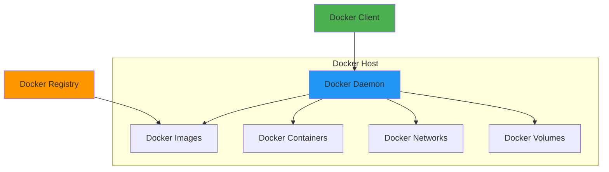
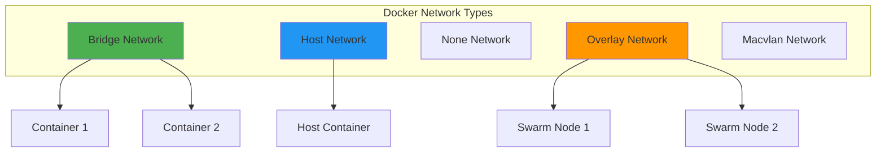
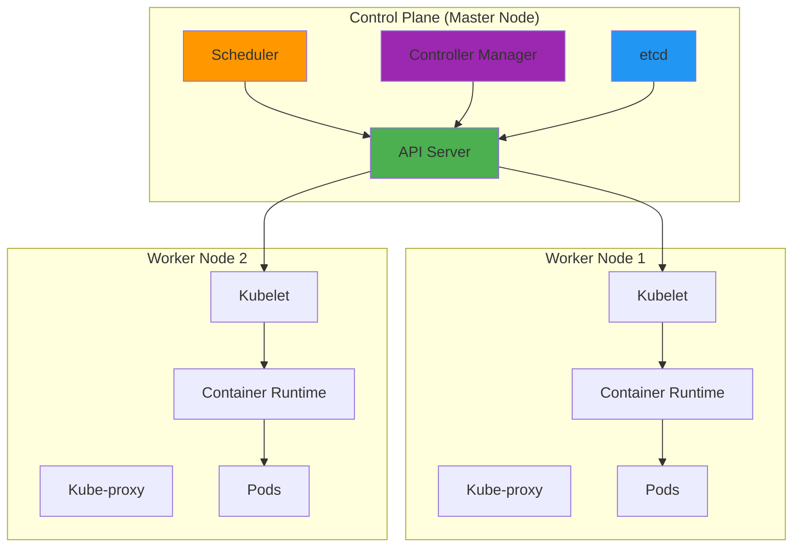
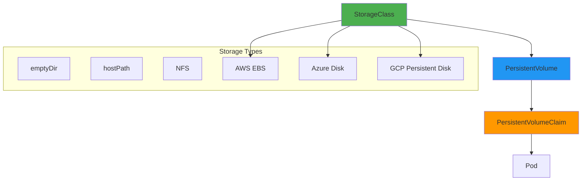

# Containerization Interview Questions 🐳☸️

## Docker, Kubernetes, and Container Orchestration

## Docker Fundamentals

### 1. Explain Docker architecture and key components

**Answer:**

Docker uses a client-server architecture with the following key components:



**Key Components:**
- **Docker Client**: Command-line interface that communicates with Docker daemon
- **Docker Daemon**: Background service that manages containers, images, networks, and volumes
- **Docker Images**: Read-only templates used to create containers
- **Docker Containers**: Running instances of Docker images
- **Dockerfile**: Text file containing instructions to build Docker images
- **Docker Registry**: Service that stores and distributes Docker images

**Basic Docker Commands:**
```bash
# Build an image from Dockerfile
docker build -t myapp:v1.0 .

# Run a container
docker run -d --name myapp-container -p 8080:80 myapp:v1.0

# List running containers
docker ps

# View container logs
docker logs myapp-container

# Execute commands in running container
docker exec -it myapp-container /bin/bash

# Stop and remove container
docker stop myapp-container
docker rm myapp-container

# Push image to registry
docker tag myapp:v1.0 myregistry/myapp:v1.0
docker push myregistry/myapp:v1.0
```

### 2. Create a multi-stage Dockerfile for a Python application

**Answer:**

```dockerfile
# Multi-stage Dockerfile for Python Flask application
# Stage 1: Build stage
FROM python:3.11-slim as builder

WORKDIR /app

# Install build dependencies
RUN apt-get update && apt-get install -y \
    gcc \
    && rm -rf /var/lib/apt/lists/*

# Copy requirements and install Python dependencies
COPY requirements.txt .
RUN pip install --no-cache-dir --user -r requirements.txt

# Stage 2: Production stage
FROM python:3.11-slim

# Create non-root user
RUN groupadd -r appuser && useradd -r -g appuser appuser

WORKDIR /app

# Copy Python packages from builder stage
COPY --from=builder /root/.local /home/appuser/.local

# Copy application code
COPY --chown=appuser:appuser . .

# Set environment variables
ENV PATH=/home/appuser/.local/bin:$PATH
ENV PYTHONPATH=/app
ENV FLASK_APP=app.py
ENV FLASK_ENV=production

# Switch to non-root user
USER appuser

# Expose port
EXPOSE 8000

# Health check
HEALTHCHECK --interval=30s --timeout=3s --start-period=5s --retries=3 \
    CMD curl -f http://localhost:8000/health || exit 1

# Start application
CMD ["gunicorn", "--bind", "0.0.0.0:8000", "--workers", "4", "app:app"]
```

**Python Flask Application Example:**
```python
# app.py
from flask import Flask, jsonify
import os
import logging

app = Flask(__name__)

# Configure logging
logging.basicConfig(level=logging.INFO)
logger = logging.getLogger(__name__)

@app.route('/')
def hello():
    return jsonify({
        "message": "Hello from containerized Flask app!",
        "version": os.getenv("APP_VERSION", "1.0.0"),
        "environment": os.getenv("ENVIRONMENT", "development")
    })

@app.route('/health')
def health_check():
    return jsonify({"status": "healthy"}), 200

@app.route('/metrics')
def metrics():
    return jsonify({
        "requests_total": 100,
        "memory_usage": "50MB",
        "cpu_usage": "0.5%"
    })

if __name__ == '__main__':
    port = int(os.getenv("PORT", 8000))
    app.run(host='0.0.0.0', port=port, debug=False)
```

**Requirements.txt:**
```txt
Flask==2.3.3
gunicorn==21.2.0
requests==2.31.0
```

**Docker Compose for Development:**
```yaml
# docker-compose.yml
version: '3.8'

services:
  web:
    build: .
    ports:
      - "8000:8000"
    environment:
      - ENVIRONMENT=development
      - APP_VERSION=1.0.0
    volumes:
      - ./app:/app
    depends_on:
      - redis
      - postgres

  redis:
    image: redis:7-alpine
    ports:
      - "6379:6379"
    volumes:
      - redis_data:/data

  postgres:
    image: postgres:15-alpine
    environment:
      POSTGRES_DB: myapp
      POSTGRES_USER: postgres
      POSTGRES_PASSWORD: password
    ports:
      - "5432:5432"
    volumes:
      - postgres_data:/var/lib/postgresql/data

volumes:
  redis_data:
  postgres_data:
```

### 3. Explain Docker networking modes and provide examples

**Answer:**

Docker supports several networking modes:



**1. Bridge Network (Default):**
```bash
# Create custom bridge network
docker network create --driver bridge myapp-network

# Run containers on custom network
docker run -d --name web --network myapp-network nginx
docker run -d --name db --network myapp-network postgres

# Containers can communicate using container names
docker exec -it web ping db
```

**2. Host Network:**
```bash
# Container uses host network stack
docker run -d --name nginx-host --network host nginx

# Container accessible on host's IP
curl http://localhost:80
```

**3. Overlay Network (Docker Swarm):**
```bash
# Initialize Docker Swarm
docker swarm init

# Create overlay network
docker network create --driver overlay --attachable myapp-overlay

# Deploy service using overlay network
docker service create --name web --network myapp-overlay --replicas 3 nginx
```

**Docker Network Troubleshooting Script:**
```bash
#!/bin/bash
# docker-network-debug.sh

echo "=== Docker Network Debugging ==="

# List all networks
echo "Docker Networks:"
docker network ls

# Inspect specific network
NETWORK_NAME=${1:-bridge}
echo -e "\nInspecting network: $NETWORK_NAME"
docker network inspect $NETWORK_NAME

# List containers and their networks
echo -e "\nContainer Network Information:"
docker ps --format "table {{.Names}}\t{{.Networks}}\t{{.Ports}}"

# Test connectivity between containers
if [ "$2" ] && [ "$3" ]; then
    echo -e "\nTesting connectivity from $2 to $3:"
    docker exec $2 ping -c 3 $3
fi

# Show network statistics
echo -e "\nNetwork Interface Statistics:"
docker exec ${2:-$(docker ps -q | head -1)} cat /proc/net/dev
```

## Kubernetes Fundamentals

### 4. Explain Kubernetes architecture and core components

**Answer:**

Kubernetes follows a master-worker architecture:



**Control Plane Components:**
- **API Server**: Front-end for the Kubernetes control plane
- **etcd**: Consistent and highly-available key-value store
- **Scheduler**: Assigns pods to worker nodes
- **Controller Manager**: Runs controller processes

**Worker Node Components:**
- **Kubelet**: Agent that communicates with control plane
- **Kube-proxy**: Network proxy maintaining network rules
- **Container Runtime**: Runs containers (Docker, containerd, CRI-O)

### 5. Create a complete Kubernetes application deployment with service and ingress

**Answer:**

**Namespace Configuration:**
```yaml
# namespace.yaml
apiVersion: v1
kind: Namespace
metadata:
  name: myapp
  labels:
    environment: production
    app: myapp
```

**ConfigMap for Application Configuration:**
```yaml
# configmap.yaml
apiVersion: v1
kind: ConfigMap
metadata:
  name: myapp-config
  namespace: myapp
data:
  app.properties: |
    database.host=postgres-service
    database.port=5432
    database.name=myapp
    cache.enabled=true
    cache.ttl=3600
  nginx.conf: |
    server {
        listen 80;
        location / {
            proxy_pass http://backend-service:8000;
            proxy_set_header Host $host;
            proxy_set_header X-Real-IP $remote_addr;
        }
    }
```

**Secret for Database Credentials:**
```yaml
# secret.yaml
apiVersion: v1
kind: Secret
metadata:
  name: myapp-secrets
  namespace: myapp
type: Opaque
data:
  database-username: cG9zdGdyZXM=  # postgres (base64 encoded)
  database-password: cGFzc3dvcmQ=  # password (base64 encoded)
  jwt-secret: bXlzZWNyZXRqd3RrZXk=  # mysecretjwtkey (base64 encoded)
```

**Deployment Configuration:**
```yaml
# deployment.yaml
apiVersion: apps/v1
kind: Deployment
metadata:
  name: myapp-deployment
  namespace: myapp
  labels:
    app: myapp
    version: v1.0.0
spec:
  replicas: 3
  strategy:
    type: RollingUpdate
    rollingUpdate:
      maxUnavailable: 1
      maxSurge: 1
  selector:
    matchLabels:
      app: myapp
  template:
    metadata:
      labels:
        app: myapp
        version: v1.0.0
    spec:
      containers:
      - name: myapp
        image: myregistry/myapp:v1.0.0
        ports:
        - containerPort: 8000
          name: http
        env:
        - name: DATABASE_HOST
          valueFrom:
            configMapKeyRef:
              name: myapp-config
              key: database.host
        - name: DATABASE_USERNAME
          valueFrom:
            secretKeyRef:
              name: myapp-secrets
              key: database-username
        - name: DATABASE_PASSWORD
          valueFrom:
            secretKeyRef:
              name: myapp-secrets
              key: database-password
        volumeMounts:
        - name: config-volume
          mountPath: /app/config
        - name: logs-volume
          mountPath: /app/logs
        resources:
          requests:
            memory: "256Mi"
            cpu: "250m"
          limits:
            memory: "512Mi"
            cpu: "500m"
        livenessProbe:
          httpGet:
            path: /health
            port: 8000
          initialDelaySeconds: 30
          periodSeconds: 10
        readinessProbe:
          httpGet:
            path: /ready
            port: 8000
          initialDelaySeconds: 5
          periodSeconds: 5
      volumes:
      - name: config-volume
        configMap:
          name: myapp-config
      - name: logs-volume
        emptyDir: {}
      imagePullSecrets:
      - name: registry-secret
```

**Service Configuration:**
```yaml
# service.yaml
apiVersion: v1
kind: Service
metadata:
  name: myapp-service
  namespace: myapp
  labels:
    app: myapp
spec:
  type: ClusterIP
  selector:
    app: myapp
  ports:
  - port: 80
    targetPort: 8000
    protocol: TCP
    name: http

---
apiVersion: v1
kind: Service
metadata:
  name: myapp-headless
  namespace: myapp
spec:
  type: ClusterIP
  clusterIP: None
  selector:
    app: myapp
  ports:
  - port: 8000
    targetPort: 8000
```

**Ingress Configuration:**
```yaml
# ingress.yaml
apiVersion: networking.k8s.io/v1
kind: Ingress
metadata:
  name: myapp-ingress
  namespace: myapp
  annotations:
    kubernetes.io/ingress.class: nginx
    nginx.ingress.kubernetes.io/rewrite-target: /
    nginx.ingress.kubernetes.io/ssl-redirect: "true"
    cert-manager.io/cluster-issuer: letsencrypt-prod
    nginx.ingress.kubernetes.io/rate-limit: "100"
spec:
  tls:
  - hosts:
    - myapp.example.com
    secretName: myapp-tls
  rules:
  - host: myapp.example.com
    http:
      paths:
      - path: /
        pathType: Prefix
        backend:
          service:
            name: myapp-service
            port:
              number: 80
      - path: /api
        pathType: Prefix
        backend:
          service:
            name: myapp-api-service
            port:
              number: 8080
```

**HorizontalPodAutoscaler:**
```yaml
# hpa.yaml
apiVersion: autoscaling/v2
kind: HorizontalPodAutoscaler
metadata:
  name: myapp-hpa
  namespace: myapp
spec:
  scaleTargetRef:
    apiVersion: apps/v1
    kind: Deployment
    name: myapp-deployment
  minReplicas: 3
  maxReplicas: 10
  metrics:
  - type: Resource
    resource:
      name: cpu
      target:
        type: Utilization
        averageUtilization: 70
  - type: Resource
    resource:
      name: memory
      target:
        type: Utilization
        averageUtilization: 80
  behavior:
    scaleDown:
      stabilizationWindowSeconds: 300
      policies:
      - type: Percent
        value: 10
        periodSeconds: 60
    scaleUp:
      stabilizationWindowSeconds: 0
      policies:
      - type: Percent
        value: 100
        periodSeconds: 15
```

**Deployment Script:**
```bash
#!/bin/bash
# deploy.sh - Kubernetes deployment script

set -e

NAMESPACE="myapp"
KUBECTL_CMD="kubectl"

echo "🚀 Deploying application to Kubernetes..."

# Function to check if namespace exists
check_namespace() {
    if ! $KUBECTL_CMD get namespace $NAMESPACE >/dev/null 2>&1; then
        echo "Creating namespace: $NAMESPACE"
        $KUBECTL_CMD apply -f namespace.yaml
    else
        echo "Namespace $NAMESPACE already exists"
    fi
}

# Function to apply configurations
apply_configs() {
    echo "Applying configurations..."
    $KUBECTL_CMD apply -f configmap.yaml
    $KUBECTL_CMD apply -f secret.yaml
    
    echo "Deploying application..."
    $KUBECTL_CMD apply -f deployment.yaml
    $KUBECTL_CMD apply -f service.yaml
    $KUBECTL_CMD apply -f ingress.yaml
    $KUBECTL_CMD apply -f hpa.yaml
}

# Function to wait for deployment
wait_for_deployment() {
    echo "Waiting for deployment to be ready..."
    $KUBECTL_CMD rollout status deployment/myapp-deployment -n $NAMESPACE --timeout=300s
}

# Function to verify deployment
verify_deployment() {
    echo "Verifying deployment..."
    echo "Pods status:"
    $KUBECTL_CMD get pods -n $NAMESPACE -l app=myapp
    
    echo -e "\nService status:"
    $KUBECTL_CMD get svc -n $NAMESPACE
    
    echo -e "\nIngress status:"
    $KUBECTL_CMD get ingress -n $NAMESPACE
    
    echo -e "\nHPA status:"
    $KUBECTL_CMD get hpa -n $NAMESPACE
}

# Main deployment flow
main() {
    check_namespace
    apply_configs
    wait_for_deployment
    verify_deployment
    
    echo "✅ Deployment completed successfully!"
    echo "Application should be accessible at: https://myapp.example.com"
}

# Execute main function
main "$@"
```

### 6. Explain Kubernetes storage concepts and provide PersistentVolume examples

**Answer:**

Kubernetes storage hierarchy:



**StorageClass Definition:**
```yaml
# storageclass.yaml
apiVersion: storage.k8s.io/v1
kind: StorageClass
metadata:
  name: fast-ssd
provisioner: kubernetes.io/aws-ebs
parameters:
  type: gp3
  fsType: ext4
  encrypted: "true"
reclaimPolicy: Delete
allowVolumeExpansion: true
volumeBindingMode: WaitForFirstConsumer
```

**PersistentVolume and PersistentVolumeClaim:**
```yaml
# pv-pvc.yaml
apiVersion: v1
kind: PersistentVolume
metadata:
  name: postgres-pv
  labels:
    type: local
spec:
  storageClassName: fast-ssd
  capacity:
    storage: 10Gi
  accessModes:
    - ReadWriteOnce
  persistentVolumeReclaimPolicy: Retain
  awsElasticBlockStore:
    volumeID: vol-1234567890abcdef0
    fsType: ext4

---
apiVersion: v1
kind: PersistentVolumeClaim
metadata:
  name: postgres-pvc
  namespace: myapp
spec:
  storageClassName: fast-ssd
  accessModes:
    - ReadWriteOnce
  resources:
    requests:
      storage: 10Gi
```

**StatefulSet with Persistent Storage:**
```yaml
# statefulset.yaml
apiVersion: apps/v1
kind: StatefulSet
metadata:
  name: postgres
  namespace: myapp
spec:
  serviceName: postgres-headless
  replicas: 1
  selector:
    matchLabels:
      app: postgres
  template:
    metadata:
      labels:
        app: postgres
    spec:
      containers:
      - name: postgres
        image: postgres:15
        env:
        - name: POSTGRES_DB
          value: myapp
        - name: POSTGRES_USER
          value: postgres
        - name: POSTGRES_PASSWORD
          valueFrom:
            secretKeyRef:
              name: postgres-secret
              key: password
        - name: PGDATA
          value: /var/lib/postgresql/data/pgdata
        ports:
        - containerPort: 5432
          name: postgres
        volumeMounts:
        - name: postgres-storage
          mountPath: /var/lib/postgresql/data
        - name: postgres-config
          mountPath: /etc/postgresql/postgresql.conf
          subPath: postgresql.conf
        livenessProbe:
          exec:
            command:
            - /bin/sh
            - -c
            - pg_isready -U postgres
          initialDelaySeconds: 30
          periodSeconds: 10
        readinessProbe:
          exec:
            command:
            - /bin/sh
            - -c
            - pg_isready -U postgres
          initialDelaySeconds: 5
          periodSeconds: 5
      volumes:
      - name: postgres-config
        configMap:
          name: postgres-config
  volumeClaimTemplates:
  - metadata:
      name: postgres-storage
    spec:
      accessModes: ["ReadWriteOnce"]
      storageClassName: fast-ssd
      resources:
        requests:
          storage: 20Gi
```

### 7. Kubernetes troubleshooting with Python scripts

**Answer:**

**Kubernetes Diagnostic Python Script:**
```python
#!/usr/bin/env python3
# k8s_diagnostics.py
import subprocess
import json
import sys
from datetime import datetime
from typing import Dict, List, Any

class KubernetesDiagnostics:
    def __init__(self, namespace: str = "default"):
        self.namespace = namespace
        self.kubectl_cmd = ["kubectl"]
    
    def run_kubectl(self, args: List[str]) -> Dict[str, Any]:
        """Run kubectl command and return JSON output"""
        try:
            cmd = self.kubectl_cmd + args
            result = subprocess.run(cmd, capture_output=True, text=True, check=True)
            return json.loads(result.stdout) if result.stdout.strip() else {}
        except subprocess.CalledProcessError as e:
            print(f"Error running kubectl: {e}")
            return {}
        except json.JSONDecodeError as e:
            print(f"Error parsing JSON: {e}")
            return {}
    
    def check_pods_health(self) -> None:
        """Check pod health status"""
        print("🔍 Checking Pod Health...")
        pods = self.run_kubectl([
            "get", "pods", "-n", self.namespace, "-o", "json"
        ])
        
        if not pods.get("items"):
            print(f"No pods found in namespace: {self.namespace}")
            return
        
        unhealthy_pods = []
        for pod in pods["items"]:
            name = pod["metadata"]["name"]
            status = pod["status"]["phase"]
            
            if status != "Running":
                unhealthy_pods.append({
                    "name": name,
                    "status": status,
                    "reason": pod["status"].get("reason", "Unknown")
                })
                
                # Get pod events
                events = self.run_kubectl([
                    "get", "events", "-n", self.namespace,
                    "--field-selector", f"involvedObject.name={name}",
                    "-o", "json"
                ])
                
                print(f"❌ Pod {name}: {status}")
                if events.get("items"):
                    for event in events["items"][-3:]:  # Last 3 events
                        print(f"   Event: {event['reason']} - {event['message']}")
        
        if not unhealthy_pods:
            print("✅ All pods are healthy")
    
    def check_resource_usage(self) -> None:
        """Check resource usage"""
        print("\n📊 Checking Resource Usage...")
        
        # Get node resource usage
        try:
            nodes_result = subprocess.run([
                "kubectl", "top", "nodes"
            ], capture_output=True, text=True, check=True)
            print("Node Resource Usage:")
            print(nodes_result.stdout)
        except subprocess.CalledProcessError:
            print("kubectl top nodes not available (metrics-server required)")
        
        # Get pod resource usage
        try:
            pods_result = subprocess.run([
                "kubectl", "top", "pods", "-n", self.namespace
            ], capture_output=True, text=True, check=True)
            print(f"Pod Resource Usage (namespace: {self.namespace}):")
            print(pods_result.stdout)
        except subprocess.CalledProcessError:
            print("kubectl top pods not available (metrics-server required)")
    
    def check_services_endpoints(self) -> None:
        """Check services and endpoints"""
        print("\n🌐 Checking Services and Endpoints...")
        
        services = self.run_kubectl([
            "get", "services", "-n", self.namespace, "-o", "json"
        ])
        
        for service in services.get("items", []):
            name = service["metadata"]["name"]
            service_type = service["spec"]["type"]
            
            print(f"Service: {name} (Type: {service_type})")
            
            # Check endpoints
            endpoints = self.run_kubectl([
                "get", "endpoints", name, "-n", self.namespace, "-o", "json"
            ])
            
            if endpoints.get("subsets"):
                ready_addresses = sum(
                    len(subset.get("addresses", [])) 
                    for subset in endpoints["subsets"]
                )
                not_ready_addresses = sum(
                    len(subset.get("notReadyAddresses", [])) 
                    for subset in endpoints["subsets"]
                )
                print(f"  ✅ Ready endpoints: {ready_addresses}")
                if not_ready_addresses > 0:
                    print(f"  ❌ Not ready endpoints: {not_ready_addresses}")
            else:
                print(f"  ❌ No endpoints available for service {name}")
    
    def check_storage(self) -> None:
        """Check persistent volume claims"""
        print("\n💾 Checking Storage...")
        
        pvcs = self.run_kubectl([
            "get", "pvc", "-n", self.namespace, "-o", "json"
        ])
        
        for pvc in pvcs.get("items", []):
            name = pvc["metadata"]["name"]
            status = pvc["status"]["phase"]
            capacity = pvc["status"].get("capacity", {}).get("storage", "Unknown")
            
            if status == "Bound":
                print(f"✅ PVC {name}: {status} ({capacity})")
            else:
                print(f"❌ PVC {name}: {status}")
    
    def generate_report(self) -> None:
        """Generate comprehensive diagnostic report"""
        print(f"🔧 Kubernetes Diagnostics Report - {datetime.now()}")
        print(f"Namespace: {self.namespace}")
        print("=" * 60)
        
        self.check_pods_health()
        self.check_resource_usage()
        self.check_services_endpoints()
        self.check_storage()
        
        print("\n" + "=" * 60)
        print("Diagnostic report completed")

def main():
    import argparse
    
    parser = argparse.ArgumentParser(description="Kubernetes Diagnostics Tool")
    parser.add_argument("-n", "--namespace", default="default",
                       help="Kubernetes namespace to check")
    
    args = parser.parse_args()
    
    diagnostics = KubernetesDiagnostics(args.namespace)
    diagnostics.generate_report()

if __name__ == "__main__":
    main()
```

**Pod Log Analyzer Script:**
```python
#!/usr/bin/env python3
# pod_log_analyzer.py
import subprocess
import re
import json
from collections import Counter, defaultdict
from datetime import datetime
from typing import Dict, List, Tuple

class PodLogAnalyzer:
    def __init__(self, namespace: str = "default"):
        self.namespace = namespace
        self.error_patterns = [
            r'ERROR',
            r'FATAL',
            r'Exception',
            r'failed',
            r'timeout',
            r'connection refused',
            r'out of memory',
            r'disk full'
        ]
    
    def get_pods(self) -> List[str]:
        """Get list of pods in namespace"""
        try:
            result = subprocess.run([
                "kubectl", "get", "pods", "-n", self.namespace,
                "-o", "jsonpath={.items[*].metadata.name}"
            ], capture_output=True, text=True, check=True)
            return result.stdout.split()
        except subprocess.CalledProcessError:
            return []
    
    def get_pod_logs(self, pod_name: str, lines: int = 1000) -> str:
        """Get logs from a specific pod"""
        try:
            result = subprocess.run([
                "kubectl", "logs", pod_name, "-n", self.namespace,
                "--tail", str(lines)
            ], capture_output=True, text=True, check=True)
            return result.stdout
        except subprocess.CalledProcessError:
            return ""
    
    def analyze_logs(self, logs: str) -> Dict[str, any]:
        """Analyze logs for errors and patterns"""
        lines = logs.split('\n')
        total_lines = len(lines)
        
        errors = defaultdict(int)
        timestamps = []
        
        for line in lines:
            if not line.strip():
                continue
                
            # Extract timestamp if present
            timestamp_match = re.search(r'\d{4}-\d{2}-\d{2}[T ]\d{2}:\d{2}:\d{2}', line)
            if timestamp_match:
                timestamps.append(timestamp_match.group())
            
            # Check for error patterns
            for pattern in self.error_patterns:
                if re.search(pattern, line, re.IGNORECASE):
                    errors[pattern] += 1
        
        return {
            'total_lines': total_lines,
            'errors': dict(errors),
            'timestamps': timestamps,
            'error_rate': sum(errors.values()) / max(total_lines, 1) * 100
        }
    
    def generate_report(self) -> None:
        """Generate log analysis report"""
        print("📋 Pod Log Analysis Report")
        print("=" * 50)
        
        pods = self.get_pods()
        if not pods:
            print(f"No pods found in namespace: {self.namespace}")
            return
        
        for pod_name in pods:
            print(f"\n🔍 Analyzing pod: {pod_name}")
            logs = self.get_pod_logs(pod_name)
            
            if not logs:
                print("  No logs available")
                continue
            
            analysis = self.analyze_logs(logs)
            
            print(f"  Total log lines: {analysis['total_lines']}")
            print(f"  Error rate: {analysis['error_rate']:.2f}%")
            
            if analysis['errors']:
                print("  Error patterns found:")
                for pattern, count in analysis['errors'].items():
                    print(f"    {pattern}: {count} occurrences")
            else:
                print("  ✅ No error patterns detected")

def main():
    import argparse
    
    parser = argparse.ArgumentParser(description="Pod Log Analyzer")
    parser.add_argument("-n", "--namespace", default="default",
                       help="Kubernetes namespace")
    
    args = parser.parse_args()
    
    analyzer = PodLogAnalyzer(args.namespace)
    analyzer.generate_report()

if __name__ == "__main__":
    main()
```

**Usage Examples:**
```bash
# Run diagnostics
python3 k8s_diagnostics.py -n myapp

# Analyze logs
python3 pod_log_analyzer.py -n production

# Make scripts executable
chmod +x k8s_diagnostics.py pod_log_analyzer.py
```

## Container Orchestration Best Practices

### 8. Implement blue-green deployment strategy in Kubernetes

**Answer:**

```yaml
# blue-green-deployment.yaml
apiVersion: v1
kind: Service
metadata:
  name: myapp-service
  namespace: myapp
spec:
  selector:
    app: myapp
    version: blue  # Initially pointing to blue
  ports:
  - port: 80
    targetPort: 8000

---
# Blue Deployment
apiVersion: apps/v1
kind: Deployment
metadata:
  name: myapp-blue
  namespace: myapp
  labels:
    app: myapp
    version: blue
spec:
  replicas: 3
  selector:
    matchLabels:
      app: myapp
      version: blue
  template:
    metadata:
      labels:
        app: myapp
        version: blue
    spec:
      containers:
      - name: myapp
        image: myregistry/myapp:v1.0.0
        ports:
        - containerPort: 8000

---
# Green Deployment (initially with 0 replicas)
apiVersion: apps/v1
kind: Deployment
metadata:
  name: myapp-green
  namespace: myapp
  labels:
    app: myapp
    version: green
spec:
  replicas: 0
  selector:
    matchLabels:
      app: myapp
      version: green
  template:
    metadata:
      labels:
        app: myapp
        version: green
    spec:
      containers:
      - name: myapp
        image: myregistry/myapp:v2.0.0
        ports:
        - containerPort: 8000
```

**Blue-Green Deployment Script:**
```bash
#!/bin/bash
# blue-green-deploy.sh

set -e

NAMESPACE="myapp"
SERVICE_NAME="myapp-service"
NEW_VERSION="$1"
NEW_IMAGE="myregistry/myapp:${NEW_VERSION}"

if [ -z "$NEW_VERSION" ]; then
    echo "Usage: $0 <new-version>"
    exit 1
fi

# Get current active version
CURRENT_VERSION=$(kubectl get service $SERVICE_NAME -n $NAMESPACE -o jsonpath='{.spec.selector.version}')
echo "Current active version: $CURRENT_VERSION"

# Determine new version slot
if [ "$CURRENT_VERSION" = "blue" ]; then
    NEW_VERSION_SLOT="green"
    OLD_VERSION_SLOT="blue"
else
    NEW_VERSION_SLOT="blue"
    OLD_VERSION_SLOT="green"
fi

echo "Deploying to $NEW_VERSION_SLOT slot..."

# Update the inactive deployment with new image
kubectl set image deployment/myapp-${NEW_VERSION_SLOT} \
    myapp=$NEW_IMAGE -n $NAMESPACE

# Scale up the new version
kubectl scale deployment myapp-${NEW_VERSION_SLOT} --replicas=3 -n $NAMESPACE

# Wait for deployment to be ready
kubectl rollout status deployment/myapp-${NEW_VERSION_SLOT} -n $NAMESPACE

# Run health checks
echo "Running health checks..."
kubectl run health-check --rm -i --restart=Never --image=curlimages/curl \
    -- curl -f http://myapp-${NEW_VERSION_SLOT}:8000/health

# Switch traffic to new version
echo "Switching traffic to $NEW_VERSION_SLOT..."
kubectl patch service $SERVICE_NAME -n $NAMESPACE \
    -p '{"spec":{"selector":{"version":"'$NEW_VERSION_SLOT'"}}}'

# Verify traffic switch
sleep 10
kubectl get service $SERVICE_NAME -n $NAMESPACE -o yaml

# Scale down old version
echo "Scaling down old version ($OLD_VERSION_SLOT)..."
kubectl scale deployment myapp-${OLD_VERSION_SLOT} --replicas=0 -n $NAMESPACE

echo "✅ Blue-green deployment completed successfully!"
echo "Active version: $NEW_VERSION_SLOT"
```

**Rollback Script:**
```bash
#!/bin/bash
# rollback.sh

NAMESPACE="myapp"
SERVICE_NAME="myapp-service"

# Get current active version
CURRENT_VERSION=$(kubectl get service $SERVICE_NAME -n $NAMESPACE -o jsonpath='{.spec.selector.version}')

# Determine rollback version
if [ "$CURRENT_VERSION" = "blue" ]; then
    ROLLBACK_VERSION="green"
else
    ROLLBACK_VERSION="blue"
fi

echo "Rolling back from $CURRENT_VERSION to $ROLLBACK_VERSION..."

# Scale up rollback version
kubectl scale deployment myapp-${ROLLBACK_VERSION} --replicas=3 -n $NAMESPACE

# Wait for rollback deployment
kubectl rollout status deployment/myapp-${ROLLBACK_VERSION} -n $NAMESPACE

# Switch traffic
kubectl patch service $SERVICE_NAME -n $NAMESPACE \
    -p '{"spec":{"selector":{"version":"'$ROLLBACK_VERSION'"}}}'

# Scale down current version
kubectl scale deployment myapp-${CURRENT_VERSION} --replicas=0 -n $NAMESPACE

echo "✅ Rollback completed to $ROLLBACK_VERSION"
```

This comprehensive section covers Docker and Kubernetes fundamentals with practical examples, configuration files, and automation scripts that are commonly asked about in DevOps interviews. The content includes architectural diagrams, real-world scenarios, and troubleshooting approaches that demonstrate production-ready knowledge.