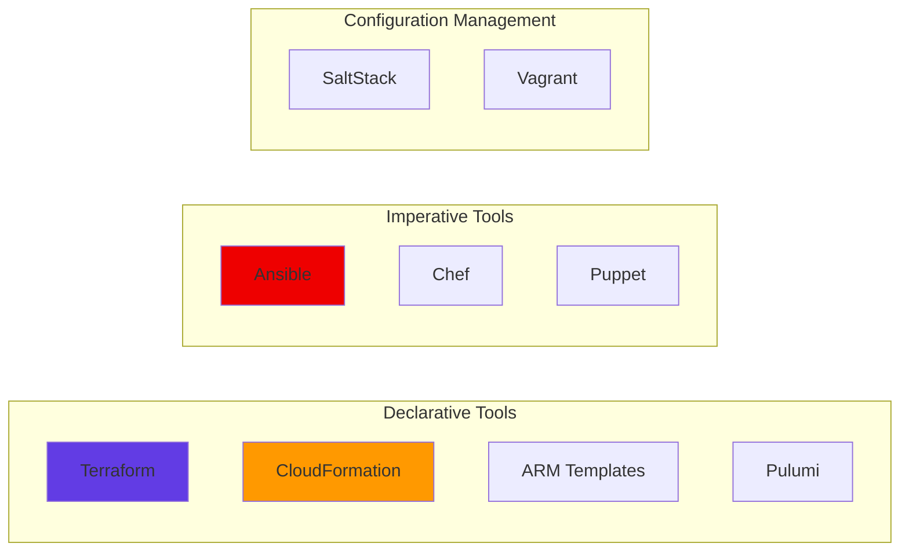
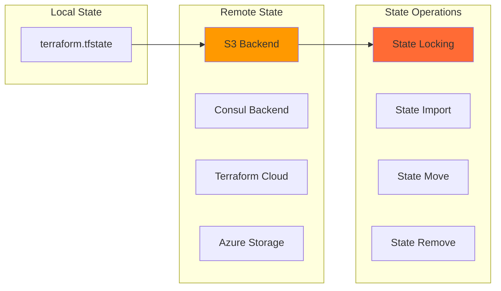

# Infrastructure as Code Interview Questions 🏗️

## Terraform, CloudFormation, and IaC Practices

### 1. What is Infrastructure as Code (IaC) and why is it important?

**Answer:**

Infrastructure as Code (IaC) is the practice of managing and provisioning computing infrastructure through machine-readable definition files, rather than through physical hardware configuration or interactive configuration tools.

**Key Benefits:**
- **Version Control**: Infrastructure changes can be tracked and rolled back
- **Consistency**: Eliminates configuration drift and manual errors
- **Repeatability**: Same infrastructure can be created multiple times
- **Collaboration**: Teams can review and approve infrastructure changes
- **Documentation**: Infrastructure is self-documenting through code
- **Cost Optimization**: Resources can be automatically scaled and destroyed

**IaC Tools Comparison:**



### 2. Explain Terraform architecture and core concepts

**Answer:**

Terraform uses a plugin-based architecture to manage infrastructure across multiple cloud providers.

**Core Components:**

```mermaid
graph TB
    subgraph "Terraform Core"
        Core[Terraform Core]
        State[State Management]
        Graph[Resource Graph]
        Plan[Execution Plan]
    end
    
    subgraph "Providers"
        AWS[AWS Provider]
        Azure[Azure Provider]
        GCP[GCP Provider]
        K8s[Kubernetes Provider]
    end
    
    subgraph "Configuration"
        HCL[HCL Files (.tf)]
        Variables[Variables (.tfvars)]
        Modules[Modules]
    end
    
    Core --> AWS
    Core --> Azure
    Core --> GCP
    Core --> K8s
    
    HCL --> Core
    Variables --> Core
    Modules --> Core
    
    style Core fill:#623ce4
    style State fill:#ff6b35
```

**Key Concepts:**

1. **Resources**: Infrastructure objects (EC2 instances, S3 buckets, etc.)
2. **Providers**: Plugins that interact with APIs (AWS, Azure, GCP)
3. **State**: Current state of infrastructure stored in terraform.tfstate
4. **Configuration**: HCL files defining desired infrastructure
5. **Modules**: Reusable configuration packages
6. **Workspaces**: Multiple environments using same configuration

**Basic Terraform Workflow:**

```bash
# Initialize Terraform
terraform init

# Plan changes
terraform plan

# Apply changes
terraform apply

# Destroy infrastructure
terraform destroy
```

### 3. How do you structure a Terraform project for multiple environments?

**Answer:**

**Directory Structure:**

```
terraform-project/
├── environments/
│   ├── dev/
│   │   ├── main.tf
│   │   ├── variables.tf
│   │   ├── terraform.tfvars
│   │   └── outputs.tf
│   ├── staging/
│   │   ├── main.tf
│   │   ├── variables.tf
│   │   ├── terraform.tfvars
│   │   └── outputs.tf
│   └── prod/
│       ├── main.tf
│       ├── variables.tf
│       ├── terraform.tfvars
│       └── outputs.tf
├── modules/
│   ├── networking/
│   │   ├── main.tf
│   │   ├── variables.tf
│   │   └── outputs.tf
│   ├── compute/
│   │   ├── main.tf
│   │   ├── variables.tf
│   │   └── outputs.tf
│   └── database/
│       ├── main.tf
│       ├── variables.tf
│       └── outputs.tf
├── shared/
│   ├── backend.tf
│   └── provider.tf
└── scripts/
    ├── deploy.sh
    └── destroy.sh
```

**Environment-specific configuration:**

```hcl
# environments/dev/main.tf
terraform {
  backend "s3" {
    bucket = "terraform-state-dev"
    key    = "dev/terraform.tfstate"
    region = "us-west-2"
  }
}

module "networking" {
  source = "../../modules/networking"
  
  environment = "dev"
  vpc_cidr    = "10.0.0.0/16"
  az_count    = 2
}

module "compute" {
  source = "../../modules/compute"
  
  environment    = "dev"
  instance_type  = "t3.micro"
  min_size       = 1
  max_size       = 3
  vpc_id         = module.networking.vpc_id
  subnet_ids     = module.networking.private_subnet_ids
}
```

**Workspace Strategy:**

```bash
# Create and select workspace
terraform workspace new dev
terraform workspace select dev

# Different state files per workspace
terraform workspace list
```

### 4. Explain Terraform state management and best practices

**Answer:**

**State File Purpose:**
- Maps configuration to real-world resources
- Stores resource metadata and dependencies
- Enables performance optimization through caching

**State Management Strategies:**



**Remote State Configuration:**

```hcl
# backend.tf
terraform {
  backend "s3" {
    bucket         = "terraform-state-bucket"
    key            = "infrastructure/terraform.tfstate"
    region         = "us-west-2"
    encrypt        = true
    dynamodb_table = "terraform-lock"
  }
}
```

**State Best Practices:**

```bash
# Never edit state file manually
# Use terraform commands for state operations

# Import existing resource
terraform import aws_instance.example i-1234567890abcdef0

# Move resource in state
terraform state mv aws_instance.old aws_instance.new

# Remove resource from state (doesn't destroy)
terraform state rm aws_instance.example

# List resources in state
terraform state list

# Show specific resource
terraform state show aws_instance.example
```

**State Locking with DynamoDB:**

```hcl
resource "aws_dynamodb_table" "terraform_lock" {
  name           = "terraform-lock"
  billing_mode   = "PAY_PER_REQUEST"
  hash_key       = "LockID"

  attribute {
    name = "LockID"
    type = "S"
  }

  tags = {
    Name = "Terraform State Lock"
  }
}
```

### 5. How do you manage secrets and sensitive data in Terraform?

**Answer:**

**Sensitive Variable Declaration:**

```hcl
variable "database_password" {
  description = "Database password"
  type        = string
  sensitive   = true
}

output "database_endpoint" {
  value     = aws_db_instance.main.endpoint
  sensitive = false
}

output "database_password" {
  value     = var.database_password
  sensitive = true
}
```

**External Secret Management:**

```hcl
# Using AWS Secrets Manager
data "aws_secretsmanager_secret" "db_password" {
  name = "prod/database/password"
}

data "aws_secretsmanager_secret_version" "db_password" {
  secret_id = data.aws_secretsmanager_secret.db_password.id
}

resource "aws_db_instance" "main" {
  # ... other configuration
  password = data.aws_secretsmanager_secret_version.db_password.secret_string
}
```

**HashiCorp Vault Integration:**

```hcl
# Configure Vault provider
provider "vault" {
  address = "https://vault.company.com"
}

# Read secret from Vault
data "vault_generic_secret" "db_credentials" {
  path = "secret/database"
}

resource "aws_db_instance" "main" {
  # ... other configuration
  username = data.vault_generic_secret.db_credentials.data["username"]
  password = data.vault_generic_secret.db_credentials.data["password"]
}
```

**Environment Variables:**

```bash
# Set sensitive variables via environment
export TF_VAR_database_password="super-secret-password"

# Or use .tfvars file (never commit to git)
echo 'database_password = "super-secret-password"' > secrets.tfvars
terraform apply -var-file="secrets.tfvars"
```

### 6. Explain AWS CloudFormation and its key features

**Answer:**

AWS CloudFormation is Amazon's native IaC service that uses JSON or YAML templates to model and provision AWS resources.

**CloudFormation Architecture:**

```mermaid
graph TB
    subgraph "CloudFormation Service"
        Template[CloudFormation Template]
        Stack[CloudFormation Stack]
        Engine[CloudFormation Engine]
    end
    
    subgraph "AWS Resources"
        EC2[EC2 Instances]
        S3[S3 Buckets]
        RDS[RDS Databases]
        VPC[VPC Networks]
    end
    
    Template --> Stack
    Stack --> Engine
    Engine --> EC2
    Engine --> S3
    Engine --> RDS
    Engine --> VPC
    
    style Template fill:#ff9900
    style Stack fill:#232f3e
```



**Key Features:**

1. **Template-driven**: JSON/YAML templates define infrastructure
2. **Stack Management**: Resources grouped in stacks
3. **Change Sets**: Preview changes before applying
4. **Rollback**: Automatic rollback on failure
5. **Cross-region**: Deploy across multiple regions
6. **Nested Stacks**: Modular template composition

**CloudFormation Template Structure:**

```yaml
AWSTemplateFormatVersion: '2010-09-09'
Description: 'Web application infrastructure'

Parameters:
  InstanceType:
    Type: String
    Default: t3.micro
    AllowedValues:
      - t3.micro
      - t3.small
      - t3.medium
    Description: EC2 instance type

Mappings:
  RegionMap:
    us-east-1:
      AMI: ami-0abcdef1234567890
    us-west-2:
      AMI: ami-0fedcba0987654321

Conditions:
  IsProdEnvironment: !Equals [!Ref Environment, 'prod']

Resources:
  WebServerInstance:
    Type: AWS::EC2::Instance
    Properties:
      ImageId: !FindInMap [RegionMap, !Ref 'AWS::Region', AMI]
      InstanceType: !Ref InstanceType
      SecurityGroupIds:
        - !Ref WebServerSecurityGroup
      UserData:
        Fn::Base64: !Sub |
          #!/bin/bash
          yum update -y
          yum install -y httpd
          systemctl start httpd
          systemctl enable httpd

  WebServerSecurityGroup:
    Type: AWS::EC2::SecurityGroup
    Properties:
      GroupDescription: Security group for web server
      SecurityGroupIngress:
        - IpProtocol: tcp
          FromPort: 80
          ToPort: 80
          CidrIp: 0.0.0.0/0
        - IpProtocol: tcp
          FromPort: 443
          ToPort: 443
          CidrIp: 0.0.0.0/0

Outputs:
  WebServerPublicIP:
    Description: Public IP of the web server
    Value: !GetAtt WebServerInstance.PublicIp
    Export:
      Name: !Sub '${AWS::StackName}-WebServerIP'
```

### 7. What are CloudFormation StackSets and when would you use them?

**Answer:**

StackSets enable you to create, update, or delete stacks across multiple accounts and regions with a single operation.

**StackSet Architecture:**

```mermaid
graph TB
    subgraph "Administrator Account"
        StackSet[StackSet]
        Template[CF Template]
    end
    
    subgraph "Target Account 1"
        Stack1[Stack Instance 1]
        Resources1[AWS Resources]
    end
    
    subgraph "Target Account 2"
        Stack2[Stack Instance 2]
        Resources2[AWS Resources]
    end
    
    subgraph "Target Account 3"
        Stack3[Stack Instance 3]
        Resources3[AWS Resources]
    end
    
    StackSet --> Stack1
    StackSet --> Stack2
    StackSet --> Stack3
    
    Stack1 --> Resources1
    Stack2 --> Resources2
    Stack3 --> Resources3
    
    style StackSet fill:#ff9900
    style Stack1 fill:#232f3e
    style Stack2 fill:#232f3e
    style Stack3 fill:#232f3e
```



**Use Cases:**
- **Multi-account governance**: Deploy security policies across all accounts
- **Baseline configuration**: Set up logging, monitoring, and compliance
- **Regional deployment**: Deploy applications across multiple regions
- **Organizational standards**: Enforce consistent configurations

**StackSet Operations:**

```bash
# Create StackSet
aws cloudformation create-stack-set \
    --stack-set-name security-baseline \
    --template-body file://security-baseline.yaml \
    --capabilities CAPABILITY_IAM

# Create stack instances
aws cloudformation create-stack-instances \
    --stack-set-name security-baseline \
    --accounts 123456789012 210987654321 \
    --regions us-east-1 us-west-2

# Update StackSet
aws cloudformation update-stack-set \
    --stack-set-name security-baseline \
    --template-body file://security-baseline-v2.yaml

# Delete stack instances
aws cloudformation delete-stack-instances \
    --stack-set-name security-baseline \
    --accounts 123456789012 \
    --regions us-east-1 \
    --retain-stacks
```

### 8. Compare Terraform vs CloudFormation

**Answer:**

| Feature | Terraform | CloudFormation |
|---------|-----------|----------------|
| **Cloud Support** | Multi-cloud (AWS, Azure, GCP, etc.) | AWS only |
| **Syntax** | HCL (Human-readable) | JSON/YAML |
| **State Management** | External state file | AWS managed |
| **Planning** | terraform plan | Change sets |
| **Modularity** | Modules | Nested stacks |
| **Import** | terraform import | Limited import |
| **Community** | Large ecosystem | AWS supported |
| **Learning Curve** | Moderate | Steeper for complex scenarios |

**When to use Terraform:**
- Multi-cloud environments
- Complex module reuse
- Advanced state management needs
- Large community ecosystem

**When to use CloudFormation:**
- AWS-only infrastructure
- Deep AWS service integration
- AWS-native tooling preference
- Compliance requirements for AWS tools

### 9. How do you implement blue-green deployments with IaC?

**Answer:**

**Terraform Blue-Green Strategy:**

```hcl
# variables.tf
variable "environment_color" {
  description = "Current active environment (blue or green)"
  type        = string
  default     = "blue"
}

variable "blue_instance_count" {
  description = "Number of instances in blue environment"
  type        = number
  default     = 3
}

variable "green_instance_count" {
  description = "Number of instances in green environment"
  type        = number
  default     = 0
}

# main.tf
resource "aws_launch_template" "blue" {
  name_prefix   = "web-blue-"
  image_id      = var.blue_ami_id
  instance_type = var.instance_type
  
  vpc_security_group_ids = [aws_security_group.web.id]
  
  user_data = base64encode(templatefile("${path.module}/userdata.sh", {
    environment = "blue"
  }))
  
  tag_specifications {
    resource_type = "instance"
    tags = {
      Name        = "web-blue"
      Environment = "blue"
    }
  }
}

resource "aws_launch_template" "green" {
  name_prefix   = "web-green-"
  image_id      = var.green_ami_id
  instance_type = var.instance_type
  
  vpc_security_group_ids = [aws_security_group.web.id]
  
  user_data = base64encode(templatefile("${path.module}/userdata.sh", {
    environment = "green"
  }))
  
  tag_specifications {
    resource_type = "instance"
    tags = {
      Name        = "web-green"
      Environment = "green"
    }
  }
}

resource "aws_autoscaling_group" "blue" {
  name                = "web-blue-asg"
  vpc_zone_identifier = var.private_subnet_ids
  target_group_arns   = var.environment_color == "blue" ? [aws_lb_target_group.main.arn] : []
  health_check_type   = "ELB"
  min_size            = var.blue_instance_count
  max_size            = var.blue_instance_count
  desired_capacity    = var.blue_instance_count

  launch_template {
    id      = aws_launch_template.blue.id
    version = "$Latest"
  }

  tag {
    key                 = "Name"
    value               = "web-blue-asg"
    propagate_at_launch = false
  }
}

resource "aws_autoscaling_group" "green" {
  name                = "web-green-asg"
  vpc_zone_identifier = var.private_subnet_ids
  target_group_arns   = var.environment_color == "green" ? [aws_lb_target_group.main.arn] : []
  health_check_type   = "ELB"
  min_size            = var.green_instance_count
  max_size            = var.green_instance_count
  desired_capacity    = var.green_instance_count

  launch_template {
    id      = aws_launch_template.green.id
    version = "$Latest"
  }

  tag {
    key                 = "Name"
    value               = "web-green-asg"
    propagate_at_launch = false
  }
}

# Load balancer targets active environment
resource "aws_lb_target_group" "main" {
  name     = "web-main-tg"
  port     = 80
  protocol = "HTTP"
  vpc_id   = var.vpc_id

  health_check {
    enabled             = true
    healthy_threshold   = 2
    unhealthy_threshold = 2
    timeout             = 5
    interval            = 30
    path                = "/health"
    matcher             = "200"
  }
}
```

**Deployment Script:**

```bash
#!/bin/bash

# blue-green-deploy.sh
CURRENT_COLOR=$(terraform output -raw current_environment_color)
NEW_COLOR="green"

if [ "$CURRENT_COLOR" = "green" ]; then
    NEW_COLOR="blue"
fi

echo "Current environment: $CURRENT_COLOR"
echo "Deploying to: $NEW_COLOR"

# Step 1: Deploy new version to inactive environment
if [ "$NEW_COLOR" = "green" ]; then
    terraform apply -var="green_instance_count=3" -auto-approve
else
    terraform apply -var="blue_instance_count=3" -auto-approve
fi

# Step 2: Wait for health checks
echo "Waiting for health checks..."
sleep 300

# Step 3: Switch traffic
terraform apply -var="environment_color=$NEW_COLOR" -auto-approve

# Step 4: Verify deployment
echo "Verifying deployment..."
sleep 60

# Step 5: Scale down old environment
if [ "$NEW_COLOR" = "green" ]; then
    terraform apply -var="blue_instance_count=0" -auto-approve
else
    terraform apply -var="green_instance_count=0" -auto-approve
fi

echo "Deployment completed successfully!"
```

### 10. How do you handle IaC testing and validation?

**Answer:**

**Testing Pyramid for IaC:**

```mermaid
pyramid TB
    subgraph "Unit Tests"
        Syntax[Syntax Validation]
        Lint[Linting]
        Format[Code Formatting]
    end
    
    subgraph "Integration Tests"
        Plan[Plan Validation]
        Security[Security Scanning]
        Compliance[Compliance Checks]
    end
    
    subgraph "End-to-End Tests"
        Deploy[Deployment Tests]
        Functional[Functional Tests]
        Performance[Performance Tests]
    end
    
    style Syntax fill:#4caf50
    style Plan fill:#ff9800
    style Deploy fill:#f44336
```

**1. Syntax and Linting:**

```bash
# Terraform validation
terraform fmt -check -diff
terraform validate

# tflint for additional checks
tflint --init
tflint .

# terragrunt validation
terragrunt validate-all
```

**2. Security Scanning:**

```bash
# Checkov security scanning
checkov -d . --framework terraform

# tfsec security scanner
tfsec .

# Terrascan
terrascan scan -d .

# Example .checkov.yml
framework:
  - terraform
  - cloudformation
quiet: true
download-external-modules: true
skip-check:
  - CKV_AWS_79  # Skip S3 encryption check for demo
```

**3. Policy as Code:**

```hcl
# sentinel policy (Terraform Enterprise)
import "tfplan"

main = rule {
    all tfplan.resource_changes as _, changes {
        changes.type is not "aws_instance" or
        changes.after.instance_type in ["t3.micro", "t3.small"]
    }
}
```

**4. Terratest for Integration Testing:**

```go
// test/terraform_test.go
package test

import (
    "testing"
    "github.com/gruntwork-io/terratest/modules/terraform"
    "github.com/stretchr/testify/assert"
)

func TestTerraformInfrastructure(t *testing.T) {
    terraformOptions := &terraform.Options{
        TerraformDir: "../",
        Vars: map[string]interface{}{
            "environment": "test",
            "instance_type": "t3.micro",
        },
    }

    defer terraform.Destroy(t, terraformOptions)
    terraform.InitAndApply(t, terraformOptions)

    // Validate outputs
    instanceId := terraform.Output(t, terraformOptions, "instance_id")
    assert.NotEmpty(t, instanceId)

    // Validate resource properties
    publicIp := terraform.Output(t, terraformOptions, "public_ip")
    assert.Regexp(t, `^\d+\.\d+\.\d+\.\d+$`, publicIp)
}
```

**5. Kitchen-Terraform for Testing:**

```yaml
# .kitchen.yml
driver:
  name: terraform

provisioner:
  name: terraform

verifier:
  name: terraform
  systems:
    - name: basic
      backend: ssh
      sudo: true

platforms:
  - name: aws

suites:
  - name: default
    driver:
      root_module_directory: test/fixtures/wrapper
    verifier:
      systems:
        - name: basic
          backend: ssh
          sudo: true
          controls:
            - operating_system
```

**6. CI/CD Pipeline Integration:**

```yaml
# .github/workflows/terraform.yml
name: Terraform CI/CD

on:
  push:
    branches: [main]
  pull_request:
    branches: [main]

jobs:
  validate:
    runs-on: ubuntu-latest
    steps:
      - uses: actions/checkout@v3
      
      - name: Setup Terraform
        uses: hashicorp/setup-terraform@v2
        with:
          terraform_version: 1.5.0
      
      - name: Terraform Format
        run: terraform fmt -check -diff
      
      - name: Terraform Init
        run: terraform init
      
      - name: Terraform Validate
        run: terraform validate
      
      - name: Security Scan
        run: |
          docker run --rm -v $(pwd):/src \
            bridgecrew/checkov:latest -d /src
      
      - name: Terraform Plan
        run: terraform plan
        
  test:
    runs-on: ubuntu-latest
    needs: validate
    steps:
      - uses: actions/checkout@v3
      
      - name: Setup Go
        uses: actions/setup-go@v4
        with:
          go-version: '1.19'
      
      - name: Run Terratest
        run: |
          cd test
          go mod download
          go test -v -timeout 30m
```

### 11. How do you implement disaster recovery with IaC?

**Answer:**

**Multi-Region DR Strategy:**

```hcl
# disaster-recovery.tf
locals {
  primary_region   = "us-east-1"
  secondary_region = "us-west-2"
  
  common_tags = {
    Project     = "disaster-recovery"
    Environment = var.environment
  }
}

# Primary region provider
provider "aws" {
  alias  = "primary"
  region = local.primary_region
}

# Secondary region provider
provider "aws" {
  alias  = "secondary"
  region = local.secondary_region
}

# Primary region infrastructure
module "primary_infrastructure" {
  source = "./modules/infrastructure"
  
  providers = {
    aws = aws.primary
  }
  
  region      = local.primary_region
  environment = var.environment
  is_primary  = true
  
  # Database configuration
  rds_backup_retention_period = 7
  rds_backup_window          = "03:00-04:00"
  rds_maintenance_window     = "sun:04:00-sun:05:00"
  
  tags = local.common_tags
}

# Secondary region infrastructure
module "secondary_infrastructure" {
  source = "./modules/infrastructure"
  
  providers = {
    aws = aws.secondary
  }
  
  region      = local.secondary_region
  environment = var.environment
  is_primary  = false
  
  # Read replica configuration
  rds_read_replica_source = module.primary_infrastructure.rds_instance_id
  
  tags = local.common_tags
}

# Cross-region replication for S3
resource "aws_s3_bucket_replication_configuration" "main" {
  provider = aws.primary
  
  role   = aws_iam_role.replication.arn
  bucket = module.primary_infrastructure.s3_bucket_id

  rule {
    id     = "replicate-to-secondary"
    status = "Enabled"

    destination {
      bucket        = module.secondary_infrastructure.s3_bucket_arn
      storage_class = "STANDARD_IA"
      
      encryption_configuration {
        replica_kms_key_id = module.secondary_infrastructure.kms_key_arn
      }
    }
  }

  depends_on = [aws_s3_bucket_versioning.main]
}

# Route53 health checks and failover
resource "aws_route53_health_check" "primary" {
  fqdn                            = module.primary_infrastructure.load_balancer_dns
  port                            = 443
  type                            = "HTTPS"
  resource_path                   = "/health"
  failure_threshold               = 3
  request_interval                = 30
  insufficient_data_health_status = "Failure"

  tags = merge(local.common_tags, {
    Name = "primary-health-check"
  })
}

resource "aws_route53_record" "primary" {
  zone_id = var.hosted_zone_id
  name    = var.domain_name
  type    = "A"

  set_identifier = "primary"
  
  failover_routing_policy {
    type = "PRIMARY"
  }

  health_check_id = aws_route53_health_check.primary.id

  alias {
    name                   = module.primary_infrastructure.load_balancer_dns
    zone_id                = module.primary_infrastructure.load_balancer_zone_id
    evaluate_target_health = true
  }
}

resource "aws_route53_record" "secondary" {
  zone_id = var.hosted_zone_id
  name    = var.domain_name
  type    = "A"

  set_identifier = "secondary"
  
  failover_routing_policy {
    type = "SECONDARY"
  }

  alias {
    name                   = module.secondary_infrastructure.load_balancer_dns
    zone_id                = module.secondary_infrastructure.load_balancer_zone_id
    evaluate_target_health = true
  }
}
```

**Backup and Recovery Module:**

```hcl
# modules/backup/main.tf
resource "aws_backup_vault" "main" {
  name        = "${var.environment}-backup-vault"
  kms_key_arn = aws_kms_key.backup.arn

  tags = var.tags
}

resource "aws_backup_plan" "main" {
  name = "${var.environment}-backup-plan"

  rule {
    rule_name         = "daily_backup"
    target_vault_name = aws_backup_vault.main.name
    schedule          = "cron(0 5 ? * * *)"  # Daily at 5 AM

    lifecycle {
      cold_storage_after = 30
      delete_after       = 365
    }

    recovery_point_tags = var.tags
  }

  rule {
    rule_name         = "weekly_backup"
    target_vault_name = aws_backup_vault.main.name
    schedule          = "cron(0 2 ? * SUN *)"  # Weekly on Sunday at 2 AM

    lifecycle {
      cold_storage_after = 90
      delete_after       = 1825  # 5 years
    }

    recovery_point_tags = var.tags
  }
}

resource "aws_backup_selection" "main" {
  iam_role_arn = aws_iam_role.backup.arn
  name         = "${var.environment}-backup-selection"
  plan_id      = aws_backup_plan.main.id

  resources = [
    module.rds.db_instance_arn,
    module.ebs.volume_arn,
    module.efs.file_system_arn
  ]

  condition {
    string_equals {
      key   = "aws:ResourceTag/Environment"
      value = var.environment
    }
  }
}
```

**DR Automation Scripts:**

```bash
#!/bin/bash
# scripts/failover.sh

set -e

ENVIRONMENT=$1
REGION=$2

if [ "$REGION" = "us-east-1" ]; then
    DR_REGION="us-west-2"
else
    DR_REGION="us-east-1"
fi

echo "Initiating failover from $REGION to $DR_REGION for environment: $ENVIRONMENT"

# 1. Promote read replica to master
echo "Promoting read replica in $DR_REGION..."
aws rds promote-read-replica \
    --db-instance-identifier "$ENVIRONMENT-db-replica" \
    --region $DR_REGION

# 2. Update DNS records to point to DR region
echo "Updating Route53 records..."
aws route53 change-resource-record-sets \
    --hosted-zone-id $HOSTED_ZONE_ID \
    --change-batch file://dns-failover.json

# 3. Scale up DR environment
echo "Scaling up DR environment..."
terraform workspace select $ENVIRONMENT-dr
terraform apply \
    -var="dr_region=$DR_REGION" \
    -var="scale_up=true" \
    -auto-approve

# 4. Verify application health
echo "Verifying application health..."
for i in {1..10}; do
    if curl -f https://app.$ENVIRONMENT.company.com/health; then
        echo "Application is healthy in DR region"
        break
    else
        echo "Waiting for application to be healthy... ($i/10)"
        sleep 30
    fi
done

echo "Failover completed successfully!"
```

**Recovery Testing:**

```yaml
# .github/workflows/dr-test.yml
name: Disaster Recovery Test

on:
  schedule:
    - cron: '0 2 * * 6'  # Every Saturday at 2 AM
  workflow_dispatch:

jobs:
  dr-test:
    runs-on: ubuntu-latest
    steps:
      - uses: actions/checkout@v3
      
      - name: Setup Terraform
        uses: hashicorp/setup-terraform@v2
      
      - name: Create DR environment
        run: |
          terraform workspace new dr-test-$(date +%Y%m%d)
          terraform init
          terraform apply -var="environment=dr-test" -auto-approve
      
      - name: Test failover process
        run: |
          ./scripts/test-failover.sh dr-test
      
      - name: Verify data consistency
        run: |
          ./scripts/verify-data.sh dr-test
      
      - name: Cleanup DR test environment
        run: |
          terraform destroy -var="environment=dr-test" -auto-approve
```

This comprehensive infrastructure guide covers Terraform, CloudFormation, and IaC best practices with practical examples for interview preparation and real-world implementation.