# Monitoring & Logging Interview Questions 📊

## Observability, Metrics, and Logging Strategies

### 1. Explain the three pillars of observability

**Answer:**

Observability consists of three fundamental pillars that provide comprehensive insight into system behavior:

```mermaid
graph TB
    subgraph "Observability Pillars"
        Metrics[📊 Metrics]
        Logs[📝 Logs]
        Traces[🔍 Traces]
    end
    
    subgraph "Metrics Details"
        Metrics --> Counters[Counters]
        Metrics --> Gauges[Gauges]
        Metrics --> Histograms[Histograms]
        Metrics --> Summaries[Summaries]
    end
    
    subgraph "Logs Details"
        Logs --> Structured[Structured Logs]
        Logs --> Unstructured[Unstructured Logs]
        Logs --> Events[Event Logs]
    end
    
    subgraph "Traces Details"
        Traces --> Spans[Spans]
        Traces --> Context[Context Propagation]
        Traces --> Correlation[Correlation IDs]
    end
    
    style Metrics fill:#4caf50
    style Logs fill:#ff9800
    style Traces fill:#2196f3
```



**1. Metrics:**
- **Purpose**: Numerical data aggregated over time
- **Characteristics**: Time-series data, pre-aggregated, low storage cost
- **Use Cases**: Alerting, dashboards, capacity planning, SLA monitoring

```prometheus
# Example Prometheus metrics
http_requests_total{method="GET", status="200"} 1547
http_request_duration_seconds{quantile="0.95"} 0.234
memory_usage_bytes 1073741824
cpu_utilization_percent 67.5
```

**2. Logs:**
- **Purpose**: Discrete events with contextual information
- **Characteristics**: High cardinality, detailed context, event-driven
- **Use Cases**: Debugging, audit trails, error analysis, business intelligence

```json
{
  "timestamp": "2024-01-15T10:30:00Z",
  "level": "ERROR",
  "service": "payment-service",
  "traceId": "abc123def456",
  "userId": "user_12345",
  "message": "Payment processing failed",
  "error": "insufficient_funds",
  "amount": 99.99,
  "currency": "USD"
}
```

**3. Traces:**
- **Purpose**: Request flow across distributed systems
- **Characteristics**: End-to-end visibility, latency breakdown, dependency mapping
- **Use Cases**: Performance optimization, bottleneck identification, service dependency analysis

```yaml
# OpenTelemetry trace example
trace:
  traceId: "abc123def456"
  spans:
    - spanId: "span001"
      operationName: "checkout-process"
      duration: 850ms
      childSpans:
        - spanId: "span002"
          operationName: "validate-payment"
          duration: 120ms
        - spanId: "span003"
          operationName: "inventory-check"
          duration: 300ms
        - spanId: "span004"
          operationName: "process-payment"
          duration: 400ms
```

### 2. What are the four golden signals and how do you implement them?

**Answer:**

The Four Golden Signals are key metrics for monitoring any user-facing system:

**1. Latency** - Time to process requests
**2. Traffic** - Demand on the system
**3. Errors** - Rate of failed requests
**4. Saturation** - Resource utilization

```mermaid
graph LR
    subgraph "Golden Signals"
        Latency[⏱️ Latency]
        Traffic[🚦 Traffic]
        Errors[❌ Errors]
        Saturation[📊 Saturation]
    end
    
    subgraph "Implementation"
        Latency --> L1[Response Time]
        Latency --> L2[Queue Time]
        
        Traffic --> T1[RPS]
        Traffic --> T2[Concurrent Users]
        
        Errors --> E1[HTTP 4xx/5xx]
        Errors --> E2[Exceptions]
        
        Saturation --> S1[CPU/Memory]
        Saturation --> S2[Disk/Network I/O]
    end
    
    style Latency fill:#4caf50
    style Traffic fill:#ff9800
    style Errors fill:#f44336
    style Saturation fill:#9c27b0
```



**Implementation with Prometheus:**

```yaml
# prometheus-rules.yml
groups:
  - name: golden-signals
    rules:
      # Latency
      - record: http_request_duration_95th_percentile
        expr: histogram_quantile(0.95, sum(rate(http_request_duration_seconds_bucket[5m])) by (le, service))
      
      # Traffic
      - record: http_requests_per_second
        expr: sum(rate(http_requests_total[5m])) by (service)
      
      # Errors
      - record: http_error_rate
        expr: sum(rate(http_requests_total{status=~"4..|5.."}[5m])) by (service) / sum(rate(http_requests_total[5m])) by (service)
      
      # Saturation
      - record: cpu_utilization
        expr: 100 - (avg(irate(node_cpu_seconds_total{mode="idle"}[5m])) by (instance) * 100)
      
      - record: memory_utilization
        expr: (1 - (node_memory_MemAvailable_bytes / node_memory_MemTotal_bytes)) * 100
```

**Application Instrumentation:**

```python
# Python Flask application with Prometheus metrics
from flask import Flask, request
from prometheus_client import Counter, Histogram, Gauge, generate_latest
import time

app = Flask(__name__)

# Golden Signals Metrics
REQUEST_COUNT = Counter(
    'http_requests_total',
    'Total HTTP requests',
    ['method', 'endpoint', 'status']
)

REQUEST_LATENCY = Histogram(
    'http_request_duration_seconds',
    'HTTP request latency',
    ['method', 'endpoint']
)

ACTIVE_REQUESTS = Gauge(
    'http_requests_active',
    'Active HTTP requests',
    ['method', 'endpoint']
)

@app.before_request
def before_request():
    request.start_time = time.time()
    ACTIVE_REQUESTS.labels(
        method=request.method,
        endpoint=request.endpoint or 'unknown'
    ).inc()

@app.after_request
def after_request(response):
    request_latency = time.time() - request.start_time
    
    REQUEST_LATENCY.labels(
        method=request.method,
        endpoint=request.endpoint or 'unknown'
    ).observe(request_latency)
    
    REQUEST_COUNT.labels(
        method=request.method,
        endpoint=request.endpoint or 'unknown',
        status=response.status_code
    ).inc()
    
    ACTIVE_REQUESTS.labels(
        method=request.method,
        endpoint=request.endpoint or 'unknown'
    ).dec()
    
    return response

@app.route('/metrics')
def metrics():
    return generate_latest()

@app.route('/health')
def health():
    return {'status': 'healthy', 'timestamp': time.time()}

@app.route('/api/users/<user_id>')
def get_user(user_id):
    # Simulate some processing time
    time.sleep(0.1)
    return {'user_id': user_id, 'name': 'John Doe'}
```

### 3. How do you design an effective alerting strategy?

**Answer:**

**Alerting Pyramid:**

```mermaid
pyramid TB
    subgraph "Alert Severity"
        Critical[🔴 Critical - Page immediately]
        Warning[🟡 Warning - Investigate during business hours]
        Info[🔵 Info - For awareness only]
    end
    
    subgraph "Alert Criteria"
        SLO[SLO Violations]
        Symptoms[Symptoms vs Causes]
        Actionable[Actionable Alerts]
    end
    
    style Critical fill:#f44336
    style Warning fill:#ff9800
    style Info fill:#2196f3
```

**Alert Classification:**

```yaml
# alertmanager.yml
global:
  smtp_smarthost: 'localhost:587'
  smtp_from: 'alerts@company.com'

route:
  group_by: ['alertname', 'cluster', 'service']
  group_wait: 10s
  group_interval: 10s
  repeat_interval: 1h
  receiver: 'web.hook'
  routes:
    - match:
        severity: critical
      receiver: 'pager-duty'
      repeat_interval: 5m
    - match:
        severity: warning
      receiver: 'slack-warnings'
      repeat_interval: 30m
    - match:
        severity: info
      receiver: 'email-team'
      repeat_interval: 24h

receivers:
  - name: 'pager-duty'
    pagerduty_configs:
      - service_key: 'your-pagerduty-key'
        description: '{{ range .Alerts }}{{ .Annotations.summary }}{{ end }}'
        
  - name: 'slack-warnings'
    slack_configs:
      - api_url: 'https://hooks.slack.com/services/your/slack/webhook'
        channel: '#alerts'
        title: 'Warning Alert'
        text: '{{ range .Alerts }}{{ .Annotations.description }}{{ end }}'
        
  - name: 'email-team'
    email_configs:
      - to: 'team@company.com'
        subject: 'Info Alert: {{ .GroupLabels.alertname }}'
        body: '{{ range .Alerts }}{{ .Annotations.description }}{{ end }}'
```

**SLO-based Alerting:**

```yaml
# slo-alerts.yml
groups:
  - name: slo-alerts
    rules:
      # Error budget burn rate alert
      - alert: HighErrorBudgetBurnRate
        expr: |
          (
            1 - (
              sum(rate(http_requests_total{job="api", status!~"5.."}[1h])) /
              sum(rate(http_requests_total{job="api"}[1h]))
            )
          ) > (1 - 0.999) * 14.4  # 14.4x burn rate for 99.9% SLO
        for: 2m
        labels:
          severity: critical
        annotations:
          summary: "High error budget burn rate"
          description: "Error budget is burning 14.4x faster than expected"
          
      # Latency SLO violation
      - alert: HighLatencySLOViolation
        expr: |
          histogram_quantile(0.95, 
            sum(rate(http_request_duration_seconds_bucket{job="api"}[5m])) by (le)
          ) > 0.5
        for: 5m
        labels:
          severity: warning
        annotations:
          summary: "95th percentile latency SLO violation"
          description: "95th percentile latency is {{ $value }}s, exceeding 0.5s SLO"
          
      # Availability SLO prediction
      - alert: SLOBudgetExhaustionPrediction
        expr: |
          predict_linear(
            slo_error_budget_remaining[6h], 4 * 24 * 3600
          ) < 0
        for: 15m
        labels:
          severity: warning
        annotations:
          summary: "SLO budget will be exhausted"
          description: "At current burn rate, SLO budget will be exhausted in 4 days"
```

**Alert Best Practices:**

```python
# Python script for alert validation
def validate_alert_rules():
    """Validate alert rules against best practices"""
    
    best_practices = {
        'actionable': 'Every alert should have a clear action',
        'symptoms_not_causes': 'Alert on user-visible symptoms',
        'multiple_severity_levels': 'Use different severity levels',
        'proper_thresholds': 'Avoid flapping with proper thresholds',
        'context_in_description': 'Include debugging context',
        'runbook_link': 'Link to runbooks for resolution'
    }
    
    alert_template = {
        'alert': 'ServiceDown',
        'expr': 'up{job="web-service"} == 0',
        'for': '5m',
        'labels': {
            'severity': 'critical',
            'team': 'platform'
        },
        'annotations': {
            'summary': 'Web service is down',
            'description': 'Web service {{ $labels.instance }} has been down for more than 5 minutes',
            'runbook_url': 'https://wiki.company.com/runbooks/web-service-down',
            'dashboard_url': 'https://grafana.company.com/d/web-service'
        }
    }
    
    return alert_template
```

### 4. Explain distributed tracing and how to implement it

**Answer:**

Distributed tracing tracks requests as they flow through multiple services in a distributed system.

**Tracing Architecture:**


**OpenTelemetry Implementation:**

```python
# Python service with OpenTelemetry tracing
from opentelemetry import trace
from opentelemetry.exporter.jaeger.thrift import JaegerExporter
from opentelemetry.sdk.trace import TracerProvider
from opentelemetry.sdk.trace.export import BatchSpanProcessor
from opentelemetry.instrumentation.flask import FlaskInstrumentor
from opentelemetry.instrumentation.requests import RequestsInstrumentor
from opentelemetry.instrumentation.sqlalchemy import SQLAlchemyInstrumentor
from flask import Flask
import requests

# Initialize tracing
trace.set_tracer_provider(TracerProvider())
tracer = trace.get_tracer(__name__)

# Configure Jaeger exporter
jaeger_exporter = JaegerExporter(
    agent_host_name="jaeger-agent",
    agent_port=6831,
)

span_processor = BatchSpanProcessor(jaeger_exporter)
trace.get_tracer_provider().add_span_processor(span_processor)

app = Flask(__name__)

# Auto-instrument Flask, requests, and SQLAlchemy
FlaskInstrumentor().instrument_app(app)
RequestsInstrumentor().instrument()
SQLAlchemyInstrumentor().instrument(engine=db.engine)

@app.route('/api/orders', methods=['POST'])
def create_order():
    # Current span is automatically created by FlaskInstrumentor
    current_span = trace.get_current_span()
    current_span.set_attribute("user.id", request.json.get('user_id'))
    current_span.set_attribute("order.amount", request.json.get('amount'))
    
    try:
        # Child span for validation
        with tracer.start_as_current_span("validate_order") as span:
            span.set_attribute("validation.type", "business_rules")
            is_valid = validate_order(request.json)
            span.set_attribute("validation.result", is_valid)
            
            if not is_valid:
                span.record_exception(ValueError("Invalid order"))
                raise ValueError("Invalid order")
        
        # Child span for payment processing
        with tracer.start_as_current_span("process_payment") as span:
            span.set_attribute("payment.method", request.json.get('payment_method'))
            payment_result = process_payment(request.json)
            span.set_attribute("payment.transaction_id", payment_result['transaction_id'])
        
        # Child span for inventory update
        with tracer.start_as_current_span("update_inventory") as span:
            span.set_attribute("inventory.item_id", request.json.get('item_id'))
            inventory_result = update_inventory(request.json)
            span.set_attribute("inventory.remaining", inventory_result['remaining'])
        
        current_span.set_attribute("order.status", "completed")
        return {"order_id": "12345", "status": "completed"}
        
    except Exception as e:
        current_span.record_exception(e)
        current_span.set_status(trace.Status(trace.StatusCode.ERROR, str(e)))
        raise

def process_payment(order_data):
    """Call external payment service"""
    with tracer.start_as_current_span("external_payment_api") as span:
        span.set_attribute("http.method", "POST")
        span.set_attribute("http.url", "https://payment-service/api/charge")
        
        response = requests.post(
            "https://payment-service/api/charge",
            json=order_data
        )
        
        span.set_attribute("http.status_code", response.status_code)
        span.set_attribute("http.response_size", len(response.content))
        
        if response.status_code >= 400:
            span.set_status(trace.Status(trace.StatusCode.ERROR))
        
        return response.json()
```

**Jaeger Configuration:**

```yaml
# docker-compose.yml for Jaeger
version: '3.8'
services:
  jaeger-all-in-one:
    image: jaegertracing/all-in-one:latest
    ports:
      - "16686:16686"  # Jaeger UI
      - "14268:14268"  # Jaeger collector HTTP
      - "14250:14250"  # Jaeger collector gRPC
      - "6831:6831/udp"  # Jaeger agent UDP
    environment:
      - COLLECTOR_OTLP_ENABLED=true
      - LOG_LEVEL=debug
    volumes:
      - jaeger-data:/tmp

  otel-collector:
    image: otel/opentelemetry-collector:latest
    command: ["--config=/etc/otel-collector-config.yaml"]
    volumes:
      - ./otel-collector-config.yaml:/etc/otel-collector-config.yaml
    ports:
      - "4317:4317"   # OTLP gRPC receiver
      - "4318:4318"   # OTLP HTTP receiver
      - "8889:8889"   # Prometheus metrics
    depends_on:
      - jaeger-all-in-one

volumes:
  jaeger-data:
```

**OpenTelemetry Collector Configuration:**

```yaml
# otel-collector-config.yaml
receivers:
  otlp:
    protocols:
      grpc:
        endpoint: 0.0.0.0:4317
      http:
        endpoint: 0.0.0.0:4318

processors:
  batch:
    timeout: 1s
    send_batch_size: 1024
  
  memory_limiter:
    limit_mib: 512
  
  resource:
    attributes:
      - key: service.version
        value: "1.0.0"
        action: upsert

exporters:
  jaeger:
    endpoint: jaeger-all-in-one:14250
    tls:
      insecure: true
  
  prometheus:
    endpoint: "0.0.0.0:8889"
  
  logging:
    loglevel: debug

service:
  pipelines:
    traces:
      receivers: [otlp]
      processors: [memory_limiter, batch, resource]
      exporters: [jaeger, logging]
    
    metrics:
      receivers: [otlp]
      processors: [memory_limiter, batch, resource]
      exporters: [prometheus, logging]
```

### 5. How do you implement centralized logging with the ELK stack?

**Answer:**

**ELK Stack Architecture:**


**Docker Compose ELK Stack:**

```yaml
# docker-compose.elk.yml
version: '3.8'
services:
  elasticsearch:
    image: docker.elastic.co/elasticsearch/elasticsearch:8.11.0
    container_name: elasticsearch
    environment:
      - discovery.type=single-node
      - bootstrap.memory_lock=true
      - "ES_JAVA_OPTS=-Xms2g -Xmx2g"
      - xpack.security.enabled=false
      - xpack.security.http.ssl.enabled=false
    ulimits:
      memlock:
        soft: -1
        hard: -1
    volumes:
      - elasticsearch-data:/usr/share/elasticsearch/data
    ports:
      - "9200:9200"
    networks:
      - elk

  logstash:
    image: docker.elastic.co/logstash/logstash:8.11.0
    container_name: logstash
    volumes:
      - ./logstash/config/logstash.yml:/usr/share/logstash/config/logstash.yml
      - ./logstash/pipeline:/usr/share/logstash/pipeline
    ports:
      - "5044:5044"  # Beats input
      - "9600:9600"  # API endpoint
    environment:
      LS_JAVA_OPTS: "-Xmx1g -Xms1g"
    networks:
      - elk
    depends_on:
      - elasticsearch

  kibana:
    image: docker.elastic.co/kibana/kibana:8.11.0
    container_name: kibana
    ports:
      - "5601:5601"
    environment:
      ELASTICSEARCH_URL: http://elasticsearch:9200
      ELASTICSEARCH_HOSTS: '["http://elasticsearch:9200"]'
    networks:
      - elk
    depends_on:
      - elasticsearch

  filebeat:
    image: docker.elastic.co/beats/filebeat:8.11.0
    container_name: filebeat
    user: root
    volumes:
      - ./filebeat/filebeat.yml:/usr/share/filebeat/filebeat.yml
      - /var/lib/docker/containers:/var/lib/docker/containers:ro
      - /var/run/docker.sock:/var/run/docker.sock:ro
      - /var/log:/var/log:ro
    networks:
      - elk
    depends_on:
      - logstash

networks:
  elk:
    driver: bridge

volumes:
  elasticsearch-data:
```

**Logstash Configuration:**

```ruby
# logstash/pipeline/logstash.conf
input {
  beats {
    port => 5044
  }
  
  http {
    port => 8080
    codec => json
  }
}

filter {
  # Parse JSON logs
  if [fields][log_type] == "application" {
    json {
      source => "message"
    }
    
    # Parse timestamp
    date {
      match => [ "timestamp", "ISO8601" ]
    }
    
    # Extract log level
    mutate {
      uppercase => [ "level" ]
    }
    
    # Add hostname
    mutate {
      add_field => { "hostname" => "%{[agent][hostname]}" }
    }
  }
  
  # Parse Nginx access logs
  if [fields][log_type] == "nginx" {
    grok {
      match => { 
        "message" => "%{NGINXACCESS}"
      }
    }
    
    # Convert response time to number
    mutate {
      convert => { "response_time" => "float" }
      convert => { "bytes" => "integer" }
    }
    
    # GeoIP lookup
    geoip {
      source => "clientip"
      target => "geoip"
    }
  }
  
  # Parse Docker container logs
  if [docker][container] {
    mutate {
      add_field => {
        "container_name" => "%{[docker][container][name]}"
        "container_image" => "%{[docker][container][image]}"
      }
    }
  }
  
  # Add environment tags
  if [fields][environment] {
    mutate {
      add_tag => [ "env:%{[fields][environment]}" ]
    }
  }
  
  # Remove sensitive fields
  mutate {
    remove_field => [ "password", "secret", "token" ]
  }
}

output {
  elasticsearch {
    hosts => ["elasticsearch:9200"]
    index => "logs-%{+YYYY.MM.dd}"
    
    # Create index template
    template_name => "logs"
    template => "/usr/share/logstash/templates/logs.json"
    template_overwrite => true
  }
  
  # Debug output
  stdout {
    codec => rubydebug
  }
}
```

**Filebeat Configuration:**

```yaml
# filebeat/filebeat.yml
filebeat.inputs:
  # Application logs
  - type: log
    enabled: true
    paths:
      - /var/log/app/*.log
    fields:
      log_type: application
      environment: production
    fields_under_root: true
    multiline.pattern: '^\d{4}-\d{2}-\d{2}'
    multiline.negate: true
    multiline.match: after

  # Nginx logs
  - type: log
    enabled: true
    paths:
      - /var/log/nginx/access.log
    fields:
      log_type: nginx
      service: web
    exclude_lines: ['/health', '/metrics']

  # Docker container logs
  - type: container
    enabled: true
    paths:
      - '/var/lib/docker/containers/*/*.log'
    processors:
      - add_docker_metadata:
          host: "unix:///var/run/docker.sock"

# Output to Logstash
output.logstash:
  hosts: ["logstash:5044"]
  compression_level: 3
  bulk_max_size: 2048

# Monitoring
monitoring.enabled: true
monitoring.elasticsearch:
  hosts: ["elasticsearch:9200"]

# Logging
logging.level: info
logging.to_files: true
logging.files:
  path: /var/log/filebeat
  name: filebeat
  keepfiles: 7
  permissions: 0644

# Processors
processors:
  - add_host_metadata:
      when.not.contains.tags: forwarded
  - add_kubernetes_metadata:
      host: ${NODE_NAME}
      matchers:
        - logs_path:
            logs_path: "/var/log/containers/"
```

**Structured Logging Best Practices:**

```python
# Python structured logging
import json
import logging
import traceback
from datetime import datetime
from flask import Flask, request, g
import uuid

class StructuredFormatter(logging.Formatter):
    def format(self, record):
        log_entry = {
            'timestamp': datetime.utcnow().isoformat() + 'Z',
            'level': record.levelname,
            'logger': record.name,
            'message': record.getMessage(),
            'module': record.module,
            'function': record.funcName,
            'line': record.lineno
        }
        
        # Add exception info
        if record.exc_info:
            log_entry['exception'] = {
                'type': record.exc_info[0].__name__,
                'message': str(record.exc_info[1]),
                'traceback': traceback.format_exception(*record.exc_info)
            }
        
        # Add request context if available
        if hasattr(g, 'request_id'):
            log_entry['request_id'] = g.request_id
        
        if request:
            log_entry['request'] = {
                'method': request.method,
                'url': request.url,
                'user_agent': request.headers.get('User-Agent'),
                'remote_addr': request.remote_addr
            }
        
        # Add custom fields
        if hasattr(record, 'extra_fields'):
            log_entry.update(record.extra_fields)
        
        return json.dumps(log_entry)

# Configure logging
logger = logging.getLogger(__name__)
handler = logging.StreamHandler()
handler.setFormatter(StructuredFormatter())
logger.addHandler(handler)
logger.setLevel(logging.INFO)

app = Flask(__name__)

@app.before_request
def before_request():
    g.request_id = str(uuid.uuid4())
    g.start_time = datetime.utcnow()

@app.after_request
def after_request(response):
    duration = (datetime.utcnow() - g.start_time).total_seconds()
    
    logger.info(
        "Request completed",
        extra={
            'extra_fields': {
                'request_id': g.request_id,
                'duration_seconds': duration,
                'status_code': response.status_code,
                'response_size': len(response.get_data())
            }
        }
    )
    
    return response

@app.route('/api/users/<user_id>')
def get_user(user_id):
    try:
        logger.info(
            "Fetching user",
            extra={'extra_fields': {'user_id': user_id}}
        )
        
        # Simulate business logic
        user = fetch_user_from_db(user_id)
        
        if not user:
            logger.warning(
                "User not found",
                extra={'extra_fields': {'user_id': user_id}}
            )
            return {'error': 'User not found'}, 404
        
        logger.info(
            "User fetched successfully",
            extra={
                'extra_fields': {
                    'user_id': user_id,
                    'user_email': user.get('email')
                }
            }
        )
        
        return user
        
    except Exception as e:
        logger.error(
            "Failed to fetch user",
            exc_info=True,
            extra={'extra_fields': {'user_id': user_id}}
        )
        return {'error': 'Internal server error'}, 500
```

This comprehensive monitoring and logging guide covers observability fundamentals, metrics implementation, alerting strategies, distributed tracing, and centralized logging with practical examples for DevOps interviews and real-world implementation.