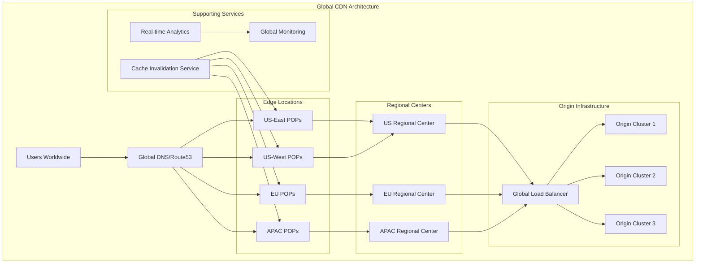
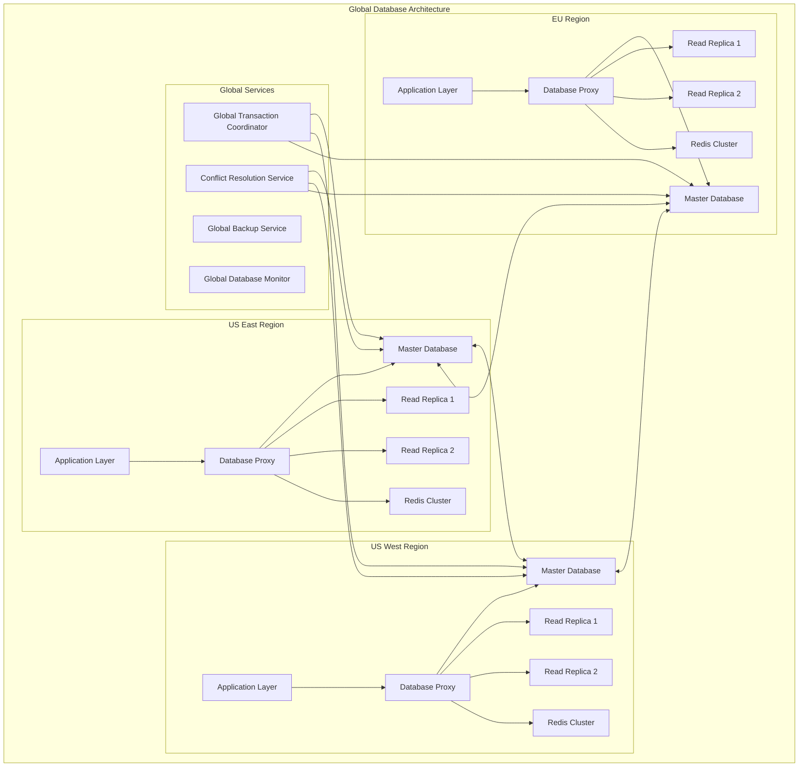

# System Design Challenges 🎯

Architecture design challenges and system design exercises for DevOps and infrastructure roles.

## 📋 Design Categories

- [🏗️ Distributed Systems](#distributed-systems) - Scalable, resilient distributed architectures
- [🌐 Web Scale Systems](#web-scale-systems) - High-traffic web applications and APIs
- [📊 Data Processing](#data-processing) - Big data and real-time analytics systems
- [🔄 Event-Driven Architecture](#event-driven-architecture) - Microservices and messaging systems
- [☁️ Cloud Native](#cloud-native) - Kubernetes and serverless architectures
- [🛡️ Security Architecture](#security-architecture) - Zero trust and secure system design

---

## Distributed Systems

### Challenge 1: Global Content Delivery Network

**Scenario**: Design a global CDN system that can serve 10 million requests per second with 99.99% availability

**Requirements**:
- Global edge locations (100+ POPs)
- Real-time cache invalidation
- Origin failover and load balancing
- Analytics and monitoring
- Cost optimization

**Time Limit**: 45 minutes

**Solution Approach**:



**Technical Implementation**:

```yaml
# cdn-infrastructure.yaml
apiVersion: argoproj.io/v1alpha1
kind: Application
metadata:
  name: global-cdn
  namespace: argocd
spec:
  project: infrastructure
  source:
    repoURL: https://github.com/company/cdn-infrastructure
    targetRevision: HEAD
    path: terraform/global-cdn
  destination:
    server: https://kubernetes.default.svc
    namespace: cdn-system
  syncPolicy:
    automated:
      prune: true
      selfHeal: true
---
# Edge location configuration
apiVersion: v1
kind: ConfigMap
metadata:
  name: edge-config
data:
  edge-locations.yaml: |
    regions:
      us-east:
        locations:
          - name: "us-east-1a"
            capacity: "1000Gbps"
            cache_size: "100TB"
          - name: "us-east-1b"
            capacity: "1000Gbps"
            cache_size: "100TB"
      us-west:
        locations:
          - name: "us-west-2a"
            capacity: "1000Gbps"
            cache_size: "100TB"
      europe:
        locations:
          - name: "eu-west-1a"
            capacity: "1000Gbps"
            cache_size: "100TB"
          - name: "eu-central-1a"
            capacity: "1000Gbps"
            cache_size: "100TB"
      asia:
        locations:
          - name: "ap-southeast-1a"
            capacity: "1000Gbps"
            cache_size: "100TB"
          - name: "ap-northeast-1a"
            capacity: "1000Gbps"
            cache_size: "100TB"
```

```python
# cdn-controller.py
import asyncio
import aiohttp
import time
from dataclasses import dataclass
from typing import Dict, List, Optional
import logging

@dataclass
class EdgeLocation:
    name: str
    region: str
    capacity_gbps: int
    cache_size_tb: int
    current_load: float
    health_status: str
    latency_ms: Dict[str, float]

@dataclass
class CacheEntry:
    key: str
    size_bytes: int
    ttl: int
    last_accessed: float
    hit_count: int

class CDNController:
    def __init__(self):
        self.edge_locations: Dict[str, EdgeLocation] = {}
        self.cache_entries: Dict[str, Dict[str, CacheEntry]] = {}
        self.origin_servers = []
        self.dns_resolver = GlobalDNSResolver()
        
    async def route_request(self, user_ip: str, request_path: str) -> str:
        """Route user request to optimal edge location"""
        
        # Determine user location
        user_location = await self.geolocate_ip(user_ip)
        
        # Find best edge locations for user
        candidate_edges = self.find_optimal_edges(user_location)
        
        # Check cache hit probability
        best_edge = None
        for edge in candidate_edges:
            if self.has_cached_content(edge.name, request_path):
                best_edge = edge
                break
        
        # Fallback to closest edge with capacity
        if not best_edge:
            best_edge = min(candidate_edges, 
                          key=lambda e: e.current_load / e.capacity_gbps)
        
        return best_edge.name
    
    def find_optimal_edges(self, user_location: Dict) -> List[EdgeLocation]:
        """Find optimal edge locations for user"""
        edges_with_distance = []
        
        for edge in self.edge_locations.values():
            if edge.health_status != 'healthy':
                continue
                
            # Calculate distance (simplified)
            distance = self.calculate_distance(user_location, edge.region)
            edges_with_distance.append((distance, edge))
        
        # Sort by distance and return top 3
        edges_with_distance.sort(key=lambda x: x[0])
        return [edge for _, edge in edges_with_distance[:3]]
    
    async def handle_cache_miss(self, edge_name: str, request_path: str) -> bytes:
        """Handle cache miss by fetching from origin"""
        
        # Try regional cache first
        regional_content = await self.fetch_from_regional_cache(edge_name, request_path)
        if regional_content:
            await self.store_in_edge_cache(edge_name, request_path, regional_content)
            return regional_content
        
        # Fetch from origin
        origin_content = await self.fetch_from_origin(request_path)
        
        # Store in both regional and edge cache
        await self.store_in_regional_cache(edge_name, request_path, origin_content)
        await self.store_in_edge_cache(edge_name, request_path, origin_content)
        
        return origin_content
    
    async def invalidate_cache(self, cache_key: str, regions: List[str] = None):
        """Invalidate cache globally or in specific regions"""
        
        invalidation_tasks = []
        
        for edge_name, edge in self.edge_locations.items():
            if regions and edge.region not in regions:
                continue
                
            task = self.invalidate_edge_cache(edge_name, cache_key)
            invalidation_tasks.append(task)
        
        # Execute invalidations in parallel
        results = await asyncio.gather(*invalidation_tasks, return_exceptions=True)
        
        # Log results
        success_count = sum(1 for r in results if not isinstance(r, Exception))
        logging.info(f"Cache invalidation: {success_count}/{len(results)} successful")
    
    async def monitor_edge_health(self):
        """Monitor health of all edge locations"""
        
        while True:
            health_tasks = []
            
            for edge_name in self.edge_locations:
                task = self.check_edge_health(edge_name)
                health_tasks.append(task)
            
            health_results = await asyncio.gather(*health_tasks, return_exceptions=True)
            
            # Update edge health status
            for i, (edge_name, result) in enumerate(zip(self.edge_locations.keys(), health_results)):
                if isinstance(result, Exception):
                    self.edge_locations[edge_name].health_status = 'unhealthy'
                else:
                    self.edge_locations[edge_name].health_status = 'healthy'
                    self.edge_locations[edge_name].current_load = result['load']
            
            await asyncio.sleep(30)  # Check every 30 seconds
    
    async def optimize_cache_placement(self):
        """Optimize cache placement based on access patterns"""
        
        while True:
            # Analyze cache hit patterns
            for edge_name, cache in self.cache_entries.items():
                # Identify cold content
                cold_content = [
                    key for key, entry in cache.items()
                    if time.time() - entry.last_accessed > 3600  # 1 hour
                ]
                
                # Remove cold content to make space
                for key in cold_content[:len(cold_content)//2]:  # Remove half
                    del cache[key]
                
                # Pre-populate popular content
                await self.prefetch_popular_content(edge_name)
            
            await asyncio.sleep(3600)  # Run every hour

class GlobalDNSResolver:
    def __init__(self):
        self.geo_database = {}  # Would use MaxMind GeoIP2 or similar
        
    async def resolve_optimal_edge(self, user_ip: str, edges: List[str]) -> str:
        """Resolve to optimal edge based on user location and edge health"""
        
        user_location = await self.geolocate_ip(user_ip)
        
        # Use GeoDNS to return closest healthy edge
        edge_distances = []
        for edge in edges:
            distance = self.calculate_distance(user_location, edge)
            edge_distances.append((distance, edge))
        
        # Return closest edge
        edge_distances.sort(key=lambda x: x[0])
        return edge_distances[0][1]

# Monitoring and analytics
class CDNAnalytics:
    def __init__(self):
        self.metrics_collector = MetricsCollector()
        
    async def collect_metrics(self):
        """Collect CDN performance metrics"""
        
        metrics = {
            'requests_per_second': await self.get_request_rate(),
            'cache_hit_ratio': await self.get_cache_hit_ratio(),
            'origin_load': await self.get_origin_load(),
            'edge_performance': await self.get_edge_performance(),
            'user_experience': await self.get_user_experience_metrics()
        }
        
        # Send to monitoring system
        await self.metrics_collector.send_metrics(metrics)
        
    async def detect_anomalies(self):
        """Detect performance anomalies"""
        
        # Check for unusual patterns
        current_metrics = await self.collect_metrics()
        
        anomalies = []
        
        # Check cache hit ratio drop
        if current_metrics['cache_hit_ratio'] < 0.85:
            anomalies.append('Low cache hit ratio detected')
        
        # Check origin overload
        if current_metrics['origin_load'] > 0.8:
            anomalies.append('Origin servers under high load')
        
        # Check edge performance degradation
        for edge, perf in current_metrics['edge_performance'].items():
            if perf['response_time'] > 100:  # 100ms
                anomalies.append(f'High response time at {edge}')
        
        if anomalies:
            await self.send_alerts(anomalies)
```

**Key Design Decisions**:

1. **Edge Placement**: 100+ POPs worldwide with tiered caching (edge → regional → origin)
2. **DNS Strategy**: GeoDNS with health-aware routing
3. **Cache Strategy**: LRU with intelligent pre-fetching
4. **Invalidation**: Real-time global cache invalidation
5. **Monitoring**: Real-time analytics with anomaly detection

**Scaling Considerations**:
- Handle 10M RPS across all POPs
- 99.99% availability (52 minutes downtime/year)
- Sub-50ms latency for 95% of requests
- Automatic failover and traffic shifting

---

### Challenge 2: Distributed Database System

**Scenario**: Design a globally distributed database system for a social media platform with 1 billion users

**Requirements**:
- ACID transactions where needed
- Eventual consistency for social feeds
- Multi-region active-active setup
- Automatic sharding and rebalancing
- Disaster recovery and backup

**Time Limit**: 45 minutes

**Solution Architecture**:



---

## Web Scale Systems

### Challenge 3: Real-Time Chat System

**Scenario**: Design a real-time chat system like WhatsApp that can handle 50 billion messages per day

**Requirements**:
- Real-time message delivery
- Support for 2 billion users
- Message history and search
- Media sharing capabilities
- End-to-end encryption

**Time Limit**: 45 minutes

**Architecture Design**:

```python
# chat-system-architecture.py
from dataclasses import dataclass
from typing import Dict, List, Optional
from enum import Enum
import asyncio
import websockets
import json

class MessageType(Enum):
    TEXT = "text"
    IMAGE = "image"
    VIDEO = "video"
    AUDIO = "audio"

@dataclass
class Message:
    id: str
    chat_id: str
    sender_id: str
    content: str
    message_type: MessageType
    timestamp: float
    encrypted: bool = True

class ChatSystem:
    def __init__(self):
        self.connection_manager = ConnectionManager()
        self.message_router = MessageRouter()
        self.encryption_service = EncryptionService()
        self.storage_service = MessageStorageService()
        
    async def handle_new_connection(self, websocket, user_id: str):
        """Handle new WebSocket connection"""
        await self.connection_manager.add_connection(user_id, websocket)
        
        # Send pending messages
        pending_messages = await self.storage_service.get_pending_messages(user_id)
        for message in pending_messages:
            await self.send_message_to_user(user_id, message)
    
    async def handle_message(self, sender_id: str, message_data: Dict):
        """Handle incoming message"""
        
        # Create message object
        message = Message(
            id=message_data['id'],
            chat_id=message_data['chat_id'],
            sender_id=sender_id,
            content=message_data['content'],
            message_type=MessageType(message_data['type']),
            timestamp=time.time()
        )
        
        # Encrypt message
        if message.message_type == MessageType.TEXT:
            message.content = await self.encryption_service.encrypt(
                message.content, message.chat_id
            )
        
        # Store message
        await self.storage_service.store_message(message)
        
        # Route to recipients
        await self.message_router.route_message(message)
    
    async def send_message_to_user(self, user_id: str, message: Message):
        """Send message to specific user"""
        
        # Decrypt message for recipient
        if message.encrypted:
            message.content = await self.encryption_service.decrypt(
                message.content, message.chat_id, user_id
            )
        
        # Get user connections
        connections = await self.connection_manager.get_user_connections(user_id)
        
        if connections:
            # User is online, send immediately
            message_json = json.dumps({
                'id': message.id,
                'chat_id': message.chat_id,
                'sender_id': message.sender_id,
                'content': message.content,
                'type': message.message_type.value,
                'timestamp': message.timestamp
            })
            
            for connection in connections:
                try:
                    await connection.send(message_json)
                except websockets.exceptions.ConnectionClosed:
                    await self.connection_manager.remove_connection(user_id, connection)
        else:
            # User is offline, queue for delivery
            await self.storage_service.queue_message_for_user(user_id, message)

class ConnectionManager:
    """Manages WebSocket connections for users"""
    
    def __init__(self):
        self.connections: Dict[str, List[websockets.WebSocketServerProtocol]] = {}
        self.connection_pools = {}  # For horizontal scaling
    
    async def add_connection(self, user_id: str, websocket):
        """Add new connection for user"""
        if user_id not in self.connections:
            self.connections[user_id] = []
        self.connections[user_id].append(websocket)
        
        # Update presence
        await self.update_user_presence(user_id, 'online')
    
    async def remove_connection(self, user_id: str, websocket):
        """Remove connection for user"""
        if user_id in self.connections:
            self.connections[user_id].remove(websocket)
            
            if not self.connections[user_id]:
                del self.connections[user_id]
                await self.update_user_presence(user_id, 'offline')
    
    async def get_user_connections(self, user_id: str) -> List:
        """Get all connections for user"""
        return self.connections.get(user_id, [])

class MessageRouter:
    """Routes messages to appropriate recipients"""
    
    def __init__(self):
        self.chat_service = ChatService()
        self.push_service = PushNotificationService()
    
    async def route_message(self, message: Message):
        """Route message to all chat participants"""
        
        # Get chat participants
        participants = await self.chat_service.get_chat_participants(message.chat_id)
        
        # Send to each participant
        for participant_id in participants:
            if participant_id != message.sender_id:  # Don't send to sender
                await self.send_to_participant(participant_id, message)
    
    async def send_to_participant(self, user_id: str, message: Message):
        """Send message to specific participant"""
        
        # Try real-time delivery first
        success = await self.attempt_realtime_delivery(user_id, message)
        
        if not success:
            # User offline, send push notification
            await self.push_service.send_notification(user_id, message)

class MessageStorageService:
    """Handles message storage and retrieval"""
    
    def __init__(self):
        self.cassandra_client = CassandraClient()
        self.elasticsearch_client = ElasticsearchClient()
        self.redis_client = RedisClient()
    
    async def store_message(self, message: Message):
        """Store message in multiple storage systems"""
        
        # Store in Cassandra for durability
        await self.cassandra_client.insert_message(message)
        
        # Index in Elasticsearch for search
        await self.elasticsearch_client.index_message(message)
        
        # Cache recent messages in Redis
        await self.redis_client.cache_recent_message(message)
    
    async def get_chat_history(self, chat_id: str, limit: int = 50, offset: int = 0):
        """Get chat history"""
        
        # Try Redis cache first
        cached_messages = await self.redis_client.get_recent_messages(chat_id, limit)
        
        if len(cached_messages) >= limit:
            return cached_messages[offset:offset+limit]
        
        # Fallback to Cassandra
        return await self.cassandra_client.get_chat_messages(chat_id, limit, offset)
    
    async def search_messages(self, user_id: str, query: str):
        """Search messages using Elasticsearch"""
        return await self.elasticsearch_client.search_user_messages(user_id, query)

# Deployment configuration
class ChatSystemDeployment:
    def __init__(self):
        self.regions = ['us-east', 'us-west', 'eu-west', 'ap-southeast']
        self.services_per_region = {
            'websocket_gateways': 100,  # Handle WebSocket connections
            'message_processors': 50,   # Process and route messages
            'storage_nodes': 20,        # Cassandra nodes
            'cache_nodes': 30,          # Redis nodes
            'search_nodes': 10          # Elasticsearch nodes
        }
    
    def calculate_capacity(self):
        """Calculate system capacity"""
        
        # 50 billion messages per day = ~578K messages per second
        # Assume peak traffic is 5x average = ~2.9M messages per second
        
        messages_per_second = 2_900_000
        connections_per_gateway = 10_000
        total_connections = 500_000_000  # 500M concurrent users
        
        gateways_needed = total_connections // connections_per_gateway
        processors_needed = messages_per_second // 1000  # 1K messages per processor
        
        return {
            'websocket_gateways': gateways_needed,
            'message_processors': processors_needed,
            'estimated_bandwidth': f"{messages_per_second * 1024}MB/s",  # Assuming 1KB per message
            'storage_requirements': "50PB for 1 year of messages"
        }
```

**Scaling Strategy**:

```yaml
# kubernetes-deployment.yaml
apiVersion: apps/v1
kind: Deployment
metadata:
  name: websocket-gateway
spec:
  replicas: 100
  selector:
    matchLabels:
      app: websocket-gateway
  template:
    metadata:
      labels:
        app: websocket-gateway
    spec:
      containers:
      - name: gateway
        image: chat-system/websocket-gateway:v1.0
        ports:
        - containerPort: 8080
        env:
        - name: MAX_CONNECTIONS
          value: "10000"
        - name: REDIS_CLUSTER
          value: "redis-cluster:6379"
        resources:
          requests:
            memory: "1Gi"
            cpu: "500m"
          limits:
            memory: "2Gi"
            cpu: "1000m"
---
apiVersion: v1
kind: Service
metadata:
  name: websocket-gateway-service
spec:
  selector:
    app: websocket-gateway
  ports:
  - port: 80
    targetPort: 8080
  type: LoadBalancer
---
# Horizontal Pod Autoscaler
apiVersion: autoscaling/v2
kind: HorizontalPodAutoscaler
metadata:
  name: websocket-gateway-hpa
spec:
  scaleTargetRef:
    apiVersion: apps/v1
    kind: Deployment
    name: websocket-gateway
  minReplicas: 100
  maxReplicas: 500
  metrics:
  - type: Resource
    resource:
      name: cpu
      target:
        type: Utilization
        averageUtilization: 70
  - type: Pods
    pods:
      metric:
        name: active_connections
      target:
        type: AverageValue
        averageValue: "8000"
```

---

## Data Processing

### Challenge 4: Real-Time Analytics Pipeline

**Scenario**: Design a real-time analytics system for an e-commerce platform processing 100M events per hour

**Requirements**:
- Real-time dashboards (sub-second latency)
- Complex event processing
- Machine learning feature generation
- Historical data analysis
- Data quality monitoring

**Expected Solution Components**:
- Stream processing (Kafka, Flink)
- Real-time databases (ClickHouse, Druid)
- ML feature stores
- Data quality frameworks
- Monitoring and alerting

---

## Event-Driven Architecture

### Challenge 5: Microservices Event System

**Scenario**: Design an event-driven microservices architecture for an online banking system

**Requirements**:
- Strict consistency for transactions
- Event sourcing for audit trails
- Saga pattern for distributed transactions
- Real-time fraud detection
- Regulatory compliance

**Expected Solution Components**:
- Event sourcing implementation
- CQRS pattern
- Saga orchestration
- Event streaming platform
- Compliance and audit systems

---

## Cloud Native

### Challenge 6: Kubernetes Platform

**Scenario**: Design a multi-tenant Kubernetes platform for a company with 100+ development teams

**Requirements**:
- Namespace isolation and resource quotas
- GitOps deployment workflows
- Service mesh implementation
- Monitoring and observability
- Security and compliance

**Expected Solution Components**:
- Multi-cluster architecture
- GitOps workflows (ArgoCD)
- Service mesh (Istio)
- Observability stack
- Security policies

---

## Security Architecture

### Challenge 7: Zero Trust Network

**Scenario**: Design a Zero Trust network architecture for a financial services company

**Requirements**:
- Identity-based access control
- Micro-segmentation
- Continuous monitoring
- Compliance reporting
- Incident response

**Expected Solution Components**:
- Identity and access management
- Network security controls
- Monitoring and analytics
- Compliance automation
- Incident response systems

---

## 🎯 System Design Interview Tips

### 1. **Clarifying Questions (5 minutes)**
Always start by asking clarifying questions:
- Scale requirements (users, data, requests)
- Functional requirements (features)
- Non-functional requirements (latency, availability)
- Technical constraints
- Budget considerations

### 2. **High-Level Design (15 minutes)**
- Draw the main components
- Show data flow
- Identify major services
- Discuss API design
- Consider client-server interactions

### 3. **Detailed Design (15 minutes)**
- Deep dive into critical components
- Database schema design
- Algorithm choices
- Technology stack decisions
- Error handling strategies

### 4. **Scale and Optimize (10 minutes)**
- Identify bottlenecks
- Discuss scaling strategies
- Caching strategies
- Database sharding
- Load balancing
- CDN usage

### 5. **Common Design Patterns**

**Caching Strategies**:
- Cache-aside
- Write-through
- Write-behind
- Refresh-ahead

**Database Patterns**:
- Master-slave replication
- Sharding strategies
- CQRS (Command Query Responsibility Segregation)
- Event sourcing

**Microservices Patterns**:
- API Gateway
- Service discovery
- Circuit breaker
- Bulkhead
- Saga pattern

**Scalability Patterns**:
- Horizontal scaling
- Vertical scaling
- Database federation
- Denormalization
- SQL tuning

### 6. **Technology Choices**

**Databases**:
- **SQL**: PostgreSQL, MySQL (ACID, structured data)
- **NoSQL**: MongoDB, Cassandra, DynamoDB (scale, flexibility)
- **Cache**: Redis, Memcached (speed)
- **Search**: Elasticsearch, Solr (full-text search)

**Message Queues**:
- **Kafka**: High throughput, distributed
- **RabbitMQ**: Reliability, complex routing
- **Amazon SQS**: Managed, simple
- **Redis Pub/Sub**: Speed, simplicity

**Load Balancers**:
- **Layer 4**: TCP/UDP load balancing
- **Layer 7**: HTTP load balancing, routing
- **Tools**: HAProxy, NGINX, AWS ALB

**CDN**:
- CloudFront, CloudFlare, Akamai
- Edge caching, global distribution

### 7. **Capacity Estimation**

**Read/Write Ratios**:
- Social media: 100:1 (read heavy)
- Messaging: 1:1 (balanced)
- Analytics: 1:100 (write heavy)

**Storage Calculations**:
- Text: 1KB per message
- Images: 200KB average
- Videos: 2MB average

**Bandwidth Calculations**:
- Consider peak traffic (5-10x average)
- Plan for growth (2-3x per year)

### 8. **Reliability Patterns**

**Fault Tolerance**:
- Graceful degradation
- Circuit breakers
- Bulkhead isolation
- Timeouts and retries

**High Availability**:
- Redundancy
- Failover mechanisms
- Health checks
- Disaster recovery

### 9. **Security Considerations**

**Authentication & Authorization**:
- OAuth 2.0, JWT tokens
- RBAC (Role-Based Access Control)
- API keys and rate limiting

**Data Protection**:
- Encryption at rest and in transit
- Data anonymization
- Compliance (GDPR, HIPAA)

**Network Security**:
- VPCs, security groups
- DDoS protection
- Web Application Firewalls

### 10. **Monitoring and Observability**

**Metrics**:
- System metrics (CPU, memory, disk)
- Application metrics (response time, throughput)
- Business metrics (conversions, revenue)

**Logging**:
- Centralized logging
- Structured logs
- Log aggregation and analysis

**Tracing**:
- Distributed tracing
- Performance monitoring
- Error tracking

---

## 📚 Study Resources

### Books
- "Designing Data-Intensive Applications" by Martin Kleppmann
- "System Design Interview" by Alex Xu
- "Building Microservices" by Sam Newman
- "Site Reliability Engineering" by Google

### Online Resources
- [High Scalability](http://highscalability.com/)
- [AWS Architecture Center](https://aws.amazon.com/architecture/)
- [System Design Primer](https://github.com/donnemartin/system-design-primer)
- [Microservices.io](https://microservices.io/)

### Practice Platforms
- LeetCode System Design
- Pramp
- InterviewBit
- Grokking the System Design Interview