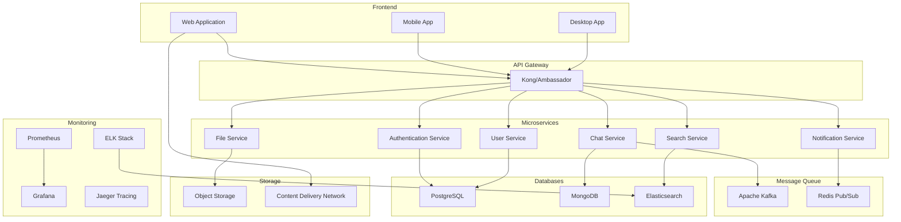

# Take-Home Projects 📝

Comprehensive project assignments that simulate real-world DevOps scenarios and challenges.

## 📋 Project Categories

- [🏗️ Infrastructure Projects](#infrastructure-projects) - Complete infrastructure automation
- [🔄 CI/CD Projects](#cicd-projects) - End-to-end pipeline implementations
- [☁️ Cloud Migration Projects](#cloud-migration-projects) - Legacy to cloud migrations
- [📊 Monitoring Projects](#monitoring-projects) - Observability and SRE implementations
- [🛡️ Security Projects](#security-projects) - DevSecOps and compliance projects
- [🎯 Full-Stack Projects](#full-stack-projects) - Complete application lifecycle projects

---

## Infrastructure Projects

### Project 1: Multi-Cloud Infrastructure Automation

**Duration**: 5-7 days

**Scenario**: Build a complete infrastructure automation solution that can deploy identical environments across AWS, Azure, and GCP.

**Requirements**:
- Infrastructure as Code using Terraform
- Multi-environment support (dev, staging, prod)
- Network security and VPC setup
- Database deployment and configuration
- Load balancers and auto-scaling
- Monitoring and alerting setup
- Cost optimization implementation
- Documentation and runbooks

**Deliverables**:

```
project-structure/
├── terraform/
│   ├── modules/
│   │   ├── network/
│   │   ├── compute/
│   │   ├── database/
│   │   └── monitoring/
│   ├── environments/
│   │   ├── dev/
│   │   ├── staging/
│   │   └── production/
│   └── providers/
│       ├── aws/
│       ├── azure/
│       └── gcp/
├── scripts/
│   ├── deploy.sh
│   ├── destroy.sh
│   └── validate.sh
├── docs/
│   ├── README.md
│   ├── architecture.md
│   └── runbooks/
├── tests/
│   ├── unit/
│   └── integration/
└── monitoring/
    ├── dashboards/
    └── alerts/
```

**Terraform Module Example**:

```hcl
# terraform/modules/network/main.tf
terraform {
  required_providers {
    aws = {
      source  = "hashicorp/aws"
      version = "~> 5.0"
    }
    azurerm = {
      source  = "hashicorp/azurerm"
      version = "~> 3.0"
    }
    google = {
      source  = "hashicorp/google"
      version = "~> 4.0"
    }
  }
}

locals {
  common_tags = {
    Environment = var.environment
    Project     = var.project_name
    ManagedBy   = "terraform"
    CreatedAt   = timestamp()
  }
}

# AWS VPC
resource "aws_vpc" "main" {
  count = var.cloud_provider == "aws" ? 1 : 0
  
  cidr_block           = var.vpc_cidr
  enable_dns_hostnames = true
  enable_dns_support   = true

  tags = merge(local.common_tags, {
    Name = "${var.project_name}-${var.environment}-vpc"
  })
}

resource "aws_subnet" "public" {
  count = var.cloud_provider == "aws" ? length(var.public_subnets) : 0
  
  vpc_id                  = aws_vpc.main[0].id
  cidr_block              = var.public_subnets[count.index]
  availability_zone       = data.aws_availability_zones.available.names[count.index]
  map_public_ip_on_launch = true

  tags = merge(local.common_tags, {
    Name = "${var.project_name}-${var.environment}-public-${count.index + 1}"
    Type = "public"
  })
}

resource "aws_subnet" "private" {
  count = var.cloud_provider == "aws" ? length(var.private_subnets) : 0
  
  vpc_id            = aws_vpc.main[0].id
  cidr_block        = var.private_subnets[count.index]
  availability_zone = data.aws_availability_zones.available.names[count.index]

  tags = merge(local.common_tags, {
    Name = "${var.project_name}-${var.environment}-private-${count.index + 1}"
    Type = "private"
  })
}

# Azure Virtual Network
resource "azurerm_virtual_network" "main" {
  count = var.cloud_provider == "azure" ? 1 : 0
  
  name                = "${var.project_name}-${var.environment}-vnet"
  address_space       = [var.vpc_cidr]
  location            = var.azure_location
  resource_group_name = var.azure_resource_group

  tags = local.common_tags
}

resource "azurerm_subnet" "public" {
  count = var.cloud_provider == "azure" ? length(var.public_subnets) : 0
  
  name                 = "${var.project_name}-${var.environment}-public-${count.index + 1}"
  resource_group_name  = var.azure_resource_group
  virtual_network_name = azurerm_virtual_network.main[0].name
  address_prefixes     = [var.public_subnets[count.index]]
}

resource "azurerm_subnet" "private" {
  count = var.cloud_provider == "azure" ? length(var.private_subnets) : 0
  
  name                 = "${var.project_name}-${var.environment}-private-${count.index + 1}"
  resource_group_name  = var.azure_resource_group
  virtual_network_name = azurerm_virtual_network.main[0].name
  address_prefixes     = [var.private_subnets[count.index]]
}

# GCP VPC
resource "google_compute_network" "main" {
  count = var.cloud_provider == "gcp" ? 1 : 0
  
  name                    = "${var.project_name}-${var.environment}-vpc"
  auto_create_subnetworks = false
  project                 = var.gcp_project
}

resource "google_compute_subnetwork" "public" {
  count = var.cloud_provider == "gcp" ? length(var.public_subnets) : 0
  
  name          = "${var.project_name}-${var.environment}-public-${count.index + 1}"
  ip_cidr_range = var.public_subnets[count.index]
  region        = var.gcp_region
  network       = google_compute_network.main[0].id
  project       = var.gcp_project
}

resource "google_compute_subnetwork" "private" {
  count = var.cloud_provider == "gcp" ? length(var.private_subnets) : 0
  
  name          = "${var.project_name}-${var.environment}-private-${count.index + 1}"
  ip_cidr_range = var.private_subnets[count.index]
  region        = var.gcp_region
  network       = google_compute_network.main[0].id
  project       = var.gcp_project
}

# Data sources
data "aws_availability_zones" "available" {
  count = var.cloud_provider == "aws" ? 1 : 0
  state = "available"
}
```

**Deployment Script**:

```bash
#!/bin/bash
# scripts/deploy.sh

set -e

ENVIRONMENT=${1:-dev}
CLOUD_PROVIDER=${2:-aws}
PROJECT_NAME=${3:-multi-cloud-project}

echo "🚀 Deploying infrastructure for $ENVIRONMENT environment on $CLOUD_PROVIDER"

# Validate inputs
if [[ ! "$ENVIRONMENT" =~ ^(dev|staging|production)$ ]]; then
    echo "❌ Invalid environment. Use: dev, staging, or production"
    exit 1
fi

if [[ ! "$CLOUD_PROVIDER" =~ ^(aws|azure|gcp)$ ]]; then
    echo "❌ Invalid cloud provider. Use: aws, azure, or gcp"
    exit 1
fi

# Set up environment variables
export TF_VAR_environment=$ENVIRONMENT
export TF_VAR_cloud_provider=$CLOUD_PROVIDER
export TF_VAR_project_name=$PROJECT_NAME

# Navigate to environment directory
cd "terraform/environments/$ENVIRONMENT"

# Initialize Terraform
echo "📦 Initializing Terraform..."
terraform init -upgrade

# Validate configuration
echo "✅ Validating Terraform configuration..."
terraform validate

# Plan deployment
echo "📋 Planning deployment..."
terraform plan -var="cloud_provider=$CLOUD_PROVIDER" -out=tfplan

# Apply if plan is successful
echo "🏗️ Applying infrastructure changes..."
terraform apply tfplan

# Clean up plan file
rm tfplan

# Run post-deployment tests
echo "🧪 Running post-deployment tests..."
cd ../../../tests/integration
./test-infrastructure.sh $ENVIRONMENT $CLOUD_PROVIDER

echo "✅ Deployment completed successfully!"
echo "📊 Dashboard: $(terraform output dashboard_url)"
echo "🔗 Load Balancer: $(terraform output load_balancer_url)"
```

**Cost Optimization Module**:

```python
# scripts/cost-optimizer.py
import boto3
import json
from datetime import datetime, timedelta
import logging

class MultiCloudCostOptimizer:
    def __init__(self):
        self.aws_client = boto3.client('ce')  # Cost Explorer
        self.recommendations = []
        
    def analyze_aws_costs(self, days=30):
        """Analyze AWS costs and provide optimization recommendations"""
        
        end_date = datetime.now()
        start_date = end_date - timedelta(days=days)
        
        # Get cost and usage data
        response = self.aws_client.get_cost_and_usage(
            TimePeriod={
                'Start': start_date.strftime('%Y-%m-%d'),
                'End': end_date.strftime('%Y-%m-%d')
            },
            Granularity='DAILY',
            Metrics=['BlendedCost'],
            GroupBy=[
                {'Type': 'DIMENSION', 'Key': 'SERVICE'},
                {'Type': 'DIMENSION', 'Key': 'INSTANCE_TYPE'}
            ]
        )
        
        # Analyze usage patterns
        self.analyze_ec2_usage()
        self.analyze_storage_usage()
        self.analyze_data_transfer()
        
        return self.recommendations
    
    def analyze_ec2_usage(self):
        """Analyze EC2 usage for right-sizing opportunities"""
        
        ec2 = boto3.client('ec2')
        cloudwatch = boto3.client('cloudwatch')
        
        # Get all running instances
        instances = ec2.describe_instances(
            Filters=[{'Name': 'instance-state-name', 'Values': ['running']}]
        )
        
        for reservation in instances['Reservations']:
            for instance in reservation['Instances']:
                instance_id = instance['InstanceId']
                instance_type = instance['InstanceType']
                
                # Get CPU utilization
                cpu_metrics = cloudwatch.get_metric_statistics(
                    Namespace='AWS/EC2',
                    MetricName='CPUUtilization',
                    Dimensions=[
                        {'Name': 'InstanceId', 'Value': instance_id}
                    ],
                    StartTime=datetime.now() - timedelta(days=14),
                    EndTime=datetime.now(),
                    Period=3600,
                    Statistics=['Average']
                )
                
                if cpu_metrics['Datapoints']:
                    avg_cpu = sum(dp['Average'] for dp in cpu_metrics['Datapoints']) / len(cpu_metrics['Datapoints'])
                    
                    if avg_cpu < 10:
                        self.recommendations.append({
                            'type': 'right-sizing',
                            'resource': instance_id,
                            'current_type': instance_type,
                            'recommendation': 'Consider downsizing or terminating',
                            'potential_savings': self.calculate_instance_savings(instance_type, 'downsize'),
                            'reason': f'Average CPU utilization: {avg_cpu:.1f}%'
                        })
    
    def generate_cost_report(self):
        """Generate comprehensive cost optimization report"""
        
        report = {
            'timestamp': datetime.now().isoformat(),
            'total_recommendations': len(self.recommendations),
            'potential_monthly_savings': sum(r.get('potential_savings', 0) for r in self.recommendations),
            'recommendations': self.recommendations,
            'next_review_date': (datetime.now() + timedelta(days=30)).isoformat()
        }
        
        # Save report
        with open(f'cost-optimization-report-{datetime.now().strftime("%Y%m%d")}.json', 'w') as f:
            json.dump(report, f, indent=2)
        
        return report

if __name__ == "__main__":
    optimizer = MultiCloudCostOptimizer()
    recommendations = optimizer.analyze_aws_costs()
    report = optimizer.generate_cost_report()
    
    print(f"💰 Found {len(recommendations)} cost optimization opportunities")
    print(f"💵 Potential monthly savings: ${report['potential_monthly_savings']:.2f}")
```

**Evaluation Criteria**:
- Infrastructure code quality and modularity
- Multi-cloud compatibility and consistency
- Security best practices implementation
- Cost optimization effectiveness
- Documentation quality and completeness
- Test coverage and validation
- Monitoring and alerting setup
- Disaster recovery planning

---

## CI/CD Projects

### Project 2: Enterprise CI/CD Pipeline

**Duration**: 4-6 days

**Scenario**: Build a complete CI/CD pipeline for a microservices application with advanced features like automated testing, security scanning, and progressive deployment.

**Requirements**:
- Multi-branch pipeline strategy
- Automated testing (unit, integration, E2E)
- Security scanning (SAST, DAST, dependency check)
- Container building and scanning
- Progressive deployment (canary, blue-green)
- Rollback mechanisms
- Approval workflows
- Metrics and monitoring integration

**Deliverables**:

```yaml
# .github/workflows/advanced-cicd.yml
name: Advanced CI/CD Pipeline

on:
  push:
    branches: [ main, develop, 'feature/*', 'release/*', 'hotfix/*' ]
  pull_request:
    branches: [ main, develop ]

env:
  REGISTRY: ghcr.io
  IMAGE_NAME: ${{ github.repository }}

jobs:
  # Security and Quality Gates
  security-analysis:
    runs-on: ubuntu-latest
    steps:
    - name: Checkout code
      uses: actions/checkout@v4
      with:
        fetch-depth: 0

    - name: Run Semgrep SAST
      uses: returntocorp/semgrep-action@v1
      with:
        config: >-
          p/security-audit
          p/secrets
          p/owasp-top-ten
          p/dockerfile
        generateSarif: "1"

    - name: Upload SARIF results
      uses: github/codeql-action/upload-sarif@v2
      if: always()
      with:
        sarif_file: semgrep.sarif

    - name: Secret scanning
      uses: trufflesecurity/trufflehog@main
      with:
        path: ./
        base: ${{ github.event.repository.default_branch }}
        head: HEAD

    - name: Dependency check
      uses: dependency-check/Dependency-Check_Action@main
      with:
        project: 'enterprise-app'
        path: '.'
        format: 'ALL'
        args: >
          --enableRetired
          --enableExperimental
          --failOnCVSS 7

  # Code Quality Analysis
  code-quality:
    runs-on: ubuntu-latest
    steps:
    - name: Checkout code
      uses: actions/checkout@v4

    - name: Setup Node.js
      uses: actions/setup-node@v3
      with:
        node-version: '18'
        cache: 'npm'

    - name: Install dependencies
      run: npm ci

    - name: ESLint analysis
      run: npm run lint:report

    - name: SonarCloud analysis
      uses: SonarSource/sonarcloud-github-action@master
      env:
        GITHUB_TOKEN: ${{ secrets.GITHUB_TOKEN }}
        SONAR_TOKEN: ${{ secrets.SONAR_TOKEN }}

  # Unit and Integration Tests
  test-suite:
    runs-on: ubuntu-latest
    strategy:
      matrix:
        node-version: [16, 18, 20]
        test-type: [unit, integration]
    steps:
    - name: Checkout code
      uses: actions/checkout@v4

    - name: Setup Node.js ${{ matrix.node-version }}
      uses: actions/setup-node@v3
      with:
        node-version: ${{ matrix.node-version }}
        cache: 'npm'

    - name: Install dependencies
      run: npm ci

    - name: Run ${{ matrix.test-type }} tests
      run: npm run test:${{ matrix.test-type }}

    - name: Upload coverage
      uses: codecov/codecov-action@v3
      with:
        file: ./coverage/lcov.info
        flags: ${{ matrix.test-type }}

  # Build and Security Scan Container
  build-and-scan:
    needs: [security-analysis, code-quality, test-suite]
    runs-on: ubuntu-latest
    outputs:
      image-digest: ${{ steps.build.outputs.digest }}
    steps:
    - name: Checkout code
      uses: actions/checkout@v4

    - name: Set up Docker Buildx
      uses: docker/setup-buildx-action@v3

    - name: Log in to Container Registry
      uses: docker/login-action@v2
      with:
        registry: ${{ env.REGISTRY }}
        username: ${{ github.actor }}
        password: ${{ secrets.GITHUB_TOKEN }}

    - name: Build and push image
      id: build
      uses: docker/build-push-action@v4
      with:
        context: .
        push: true
        tags: |
          ${{ env.REGISTRY }}/${{ env.IMAGE_NAME }}:${{ github.sha }}
          ${{ env.REGISTRY }}/${{ env.IMAGE_NAME }}:latest
        cache-from: type=gha
        cache-to: type=gha,mode=max

    - name: Run Trivy vulnerability scanner
      uses: aquasecurity/trivy-action@master
      with:
        image-ref: ${{ env.REGISTRY }}/${{ env.IMAGE_NAME }}:${{ github.sha }}
        format: 'sarif'
        output: 'trivy-results.sarif'

    - name: Upload Trivy scan results
      uses: github/codeql-action/upload-sarif@v2
      with:
        sarif_file: 'trivy-results.sarif'

    - name: Sign container image
      uses: sigstore/cosign-installer@v3
    - name: Sign the published Docker image
      run: cosign sign --yes ${{ env.REGISTRY }}/${{ env.IMAGE_NAME }}:${{ github.sha }}

  # Deploy to Development
  deploy-dev:
    if: github.ref == 'refs/heads/develop'
    needs: build-and-scan
    runs-on: ubuntu-latest
    environment: development
    steps:
    - name: Deploy to Development
      uses: azure/k8s-deploy@v1
      with:
        manifests: |
          k8s/base
          k8s/overlays/development
        images: |
          ${{ env.REGISTRY }}/${{ env.IMAGE_NAME }}:${{ github.sha }}

    - name: Run E2E tests
      run: |
        kubectl wait --for=condition=available deployment/app --timeout=300s
        npm run test:e2e

  # Deploy to Staging with Approval
  deploy-staging:
    if: github.ref == 'refs/heads/main'
    needs: build-and-scan
    runs-on: ubuntu-latest
    environment: staging
    steps:
    - name: Deploy to Staging
      uses: azure/k8s-deploy@v1
      with:
        manifests: |
          k8s/base
          k8s/overlays/staging
        images: |
          ${{ env.REGISTRY }}/${{ env.IMAGE_NAME }}:${{ github.sha }}

    - name: Run DAST scan
      uses: zaproxy/action-full-scan@v0.4.0
      with:
        target: 'https://staging.company.com'

  # Canary Deployment to Production
  deploy-canary:
    if: github.ref == 'refs/heads/main'
    needs: deploy-staging
    runs-on: ubuntu-latest
    environment: production
    steps:
    - name: Deploy Canary (10%)
      uses: azure/k8s-deploy@v1
      with:
        manifests: |
          k8s/base
          k8s/overlays/production/canary
        images: |
          ${{ env.REGISTRY }}/${{ env.IMAGE_NAME }}:${{ github.sha }}

    - name: Monitor Canary
      run: |
        echo "Monitoring canary deployment for 10 minutes..."
        sleep 600

    - name: Check Canary Metrics
      id: canary-check
      run: |
        # Check error rate, latency, and other metrics
        ERROR_RATE=$(curl -s "http://prometheus:9090/api/v1/query?query=rate(http_requests_total{status=~'5..'}[5m])" | jq -r '.data.result[0].value[1]')
        if (( $(echo "$ERROR_RATE > 0.01" | bc -l) )); then
          echo "canary-success=false" >> $GITHUB_OUTPUT
        else
          echo "canary-success=true" >> $GITHUB_OUTPUT
        fi

    - name: Promote or Rollback
      if: steps.canary-check.outputs.canary-success == 'true'
      uses: azure/k8s-deploy@v1
      with:
        manifests: |
          k8s/base
          k8s/overlays/production
        images: |
          ${{ env.REGISTRY }}/${{ env.IMAGE_NAME }}:${{ github.sha }}

    - name: Rollback Canary
      if: steps.canary-check.outputs.canary-success == 'false'
      run: |
        kubectl rollout undo deployment/app
        echo "❌ Canary deployment failed and was rolled back"
        exit 1

  # Notification and Reporting
  notify:
    if: always()
    needs: [deploy-canary]
    runs-on: ubuntu-latest
    steps:
    - name: Notify Slack
      uses: 8398a7/action-slack@v3
      with:
        status: ${{ job.status }}
        channel: '#deployments'
        webhook_url: ${{ secrets.SLACK_WEBHOOK }}
        
    - name: Update deployment status
      uses: actions/github-script@v6
      with:
        script: |
          github.rest.repos.createDeploymentStatus({
            owner: context.repo.owner,
            repo: context.repo.repo,
            deployment_id: context.payload.deployment.id,
            state: '${{ job.status }}',
            description: 'Production deployment completed'
          });
```

**Progressive Deployment Strategy**:

```python
# deployment-controller.py
import time
import requests
from dataclasses import dataclass
from typing import Dict, List
import logging
import asyncio

@dataclass
class DeploymentMetrics:
    error_rate: float
    response_time_p95: float
    throughput: float
    cpu_usage: float
    memory_usage: float

class ProgressiveDeploymentController:
    def __init__(self, prometheus_url: str, kubectl_config: str):
        self.prometheus_url = prometheus_url
        self.kubectl_config = kubectl_config
        self.deployment_stages = [
            {'percentage': 10, 'duration_minutes': 10},
            {'percentage': 25, 'duration_minutes': 15},
            {'percentage': 50, 'duration_minutes': 20},
            {'percentage': 100, 'duration_minutes': 0}
        ]
        
    async def deploy_canary(self, image: str, namespace: str = 'default'):
        """Execute progressive canary deployment"""
        
        for stage in self.deployment_stages:
            logging.info(f"Deploying {stage['percentage']}% of traffic to new version")
            
            # Update traffic routing
            await self.update_traffic_split(
                namespace, 
                stage['percentage'], 
                100 - stage['percentage']
            )
            
            # Monitor for specified duration
            if stage['duration_minutes'] > 0:
                await self.monitor_deployment(
                    duration_minutes=stage['duration_minutes'],
                    stage_percentage=stage['percentage']
                )
            
            # Check if deployment should continue
            if not await self.should_continue_deployment():
                await self.rollback_deployment(namespace)
                raise Exception("Deployment rolled back due to metrics threshold breach")
        
        logging.info("Canary deployment completed successfully")
    
    async def update_traffic_split(self, namespace: str, canary_percentage: int, stable_percentage: int):
        """Update Istio VirtualService to split traffic"""
        
        virtual_service_yaml = f"""
apiVersion: networking.istio.io/v1beta1
kind: VirtualService
metadata:
  name: app-vs
  namespace: {namespace}
spec:
  http:
  - match:
    - headers:
        canary:
          exact: "true"
    route:
    - destination:
        host: app-service
        subset: canary
      weight: 100
  - route:
    - destination:
        host: app-service
        subset: canary
      weight: {canary_percentage}
    - destination:
        host: app-service
        subset: stable
      weight: {stable_percentage}
"""
        
        # Apply the configuration
        with open('/tmp/virtual-service.yaml', 'w') as f:
            f.write(virtual_service_yaml)
        
        subprocess.run(['kubectl', 'apply', '-f', '/tmp/virtual-service.yaml'])
    
    async def monitor_deployment(self, duration_minutes: int, stage_percentage: int):
        """Monitor deployment metrics during the specified duration"""
        
        end_time = time.time() + (duration_minutes * 60)
        
        while time.time() < end_time:
            metrics = await self.get_deployment_metrics()
            
            # Check thresholds
            if self.check_failure_conditions(metrics):
                raise Exception(f"Deployment failure detected at {stage_percentage}% stage")
            
            logging.info(f"Stage {stage_percentage}%: Error rate: {metrics.error_rate:.3f}, "
                        f"P95 latency: {metrics.response_time_p95:.0f}ms")
            
            await asyncio.sleep(30)  # Check every 30 seconds
    
    async def get_deployment_metrics(self) -> DeploymentMetrics:
        """Fetch deployment metrics from Prometheus"""
        
        queries = {
            'error_rate': 'rate(http_requests_total{status=~"5.."}[5m]) / rate(http_requests_total[5m])',
            'response_time_p95': 'histogram_quantile(0.95, rate(http_request_duration_seconds_bucket[5m])) * 1000',
            'throughput': 'rate(http_requests_total[5m])',
            'cpu_usage': 'avg(rate(container_cpu_usage_seconds_total{pod=~"app-.*"}[5m])) * 100',
            'memory_usage': 'avg(container_memory_working_set_bytes{pod=~"app-.*"}) / 1024 / 1024'
        }
        
        metrics = {}
        for metric_name, query in queries.items():
            response = requests.get(
                f"{self.prometheus_url}/api/v1/query",
                params={'query': query}
            )
            
            result = response.json()
            if result['data']['result']:
                metrics[metric_name] = float(result['data']['result'][0]['value'][1])
            else:
                metrics[metric_name] = 0.0
        
        return DeploymentMetrics(**metrics)
    
    def check_failure_conditions(self, metrics: DeploymentMetrics) -> bool:
        """Check if metrics exceed failure thresholds"""
        
        thresholds = {
            'error_rate': 0.01,        # 1% error rate
            'response_time_p95': 1000, # 1000ms P95 latency
            'cpu_usage': 80,           # 80% CPU usage
            'memory_usage': 1024       # 1GB memory usage
        }
        
        if metrics.error_rate > thresholds['error_rate']:
            logging.error(f"Error rate {metrics.error_rate:.3f} exceeds threshold {thresholds['error_rate']}")
            return True
            
        if metrics.response_time_p95 > thresholds['response_time_p95']:
            logging.error(f"P95 latency {metrics.response_time_p95:.0f}ms exceeds threshold {thresholds['response_time_p95']}ms")
            return True
            
        if metrics.cpu_usage > thresholds['cpu_usage']:
            logging.error(f"CPU usage {metrics.cpu_usage:.1f}% exceeds threshold {thresholds['cpu_usage']}%")
            return True
            
        return False
    
    async def rollback_deployment(self, namespace: str):
        """Rollback to previous stable version"""
        
        logging.info("Rolling back deployment...")
        
        # Reset traffic to 100% stable
        await self.update_traffic_split(namespace, 0, 100)
        
        # Scale down canary deployment
        subprocess.run([
            'kubectl', 'scale', 'deployment', 'app-canary',
            '--replicas=0', f'--namespace={namespace}'
        ])
        
        logging.info("Rollback completed")

# Feature Flag Integration
class FeatureFlagController:
    def __init__(self, flag_service_url: str):
        self.flag_service_url = flag_service_url
    
    async def enable_feature_gradually(self, feature_name: str, target_percentage: int):
        """Gradually enable feature flag during deployment"""
        
        current_percentage = 0
        step_size = 5  # Increase by 5% each step
        
        while current_percentage < target_percentage:
            current_percentage = min(current_percentage + step_size, target_percentage)
            
            await self.update_feature_flag(feature_name, current_percentage)
            
            # Wait and monitor
            await asyncio.sleep(60)  # Wait 1 minute between increases
            
            # Check if we should continue
            metrics = await self.get_feature_metrics(feature_name)
            if metrics['error_rate'] > 0.005:  # 0.5% error rate threshold
                await self.disable_feature(feature_name)
                raise Exception(f"Feature {feature_name} disabled due to high error rate")
    
    async def update_feature_flag(self, feature_name: str, percentage: int):
        """Update feature flag percentage"""
        response = requests.put(
            f"{self.flag_service_url}/flags/{feature_name}",
            json={'enabled_percentage': percentage}
        )
        response.raise_for_status()
```

**Evaluation Criteria**:
- Pipeline design and workflow efficiency
- Test coverage and quality
- Security integration effectiveness
- Deployment strategy sophistication
- Monitoring and observability
- Error handling and rollback mechanisms
- Documentation and maintenance

---

## Cloud Migration Projects

### Project 3: Legacy Application Modernization

**Duration**: 7-10 days

**Scenario**: Migrate a monolithic legacy application to a cloud-native microservices architecture with zero downtime.

**Legacy Application**: E-commerce platform with:
- PHP/MySQL monolith
- Local file storage
- Manual deployment process
- No containerization
- Limited monitoring

**Target Architecture**:
- Microservices on Kubernetes
- Cloud-native data stores
- Event-driven communication
- CI/CD automation
- Comprehensive observability

**Expected Deliverables**:
- Migration strategy and timeline
- Containerized microservices
- Infrastructure as Code
- Data migration scripts
- CI/CD pipelines
- Monitoring and alerting
- Performance benchmarks
- Security enhancements

---

## Monitoring Projects

### Project 4: Comprehensive Observability Platform

**Duration**: 5-7 days

**Scenario**: Build a complete observability platform for a microservices environment with custom metrics, distributed tracing, and intelligent alerting.

**Requirements**:
- Metrics collection and visualization
- Centralized logging with analysis
- Distributed tracing implementation
- Custom business metrics
- SLI/SLO monitoring
- Intelligent alerting with ML
- Incident response automation
- Cost optimization monitoring

**Expected Deliverables**:
- Observability stack deployment
- Custom dashboards and visualizations
- Alerting rules and escalation
- SLO definitions and tracking
- Automated incident response
- Performance optimization reports
- Cost monitoring and alerts

---

## Security Projects

### Project 5: DevSecOps Implementation

**Duration**: 6-8 days

**Scenario**: Implement comprehensive security throughout the software development lifecycle with automated scanning, compliance monitoring, and incident response.

**Requirements**:
- Secure CI/CD pipeline implementation
- Infrastructure security hardening
- Application security testing
- Compliance automation (SOC2, PCI DSS)
- Secret management system
- Incident response automation
- Security monitoring and SIEM
- Vulnerability management

**Expected Deliverables**:
- Secure pipeline implementation
- Security policy as code
- Compliance monitoring dashboard
- Incident response playbooks
- Security metrics and reporting
- Vulnerability management process

---

## Full-Stack Projects

### Project 6: Complete Application Lifecycle

**Duration**: 10-14 days

**Scenario**: Build and deploy a complete cloud-native application with all supporting infrastructure, monitoring, and operational processes.

**Application**: Real-time collaboration platform (like Slack/Discord)

**Requirements**:
- Microservices architecture design
- Infrastructure as Code
- CI/CD pipeline implementation
- Monitoring and observability
- Security implementation
- Disaster recovery planning
- Performance optimization
- Cost management

**Expected Architecture**:



**Detailed Implementation Requirements**:

1. **Infrastructure (Kubernetes + Terraform)**
   - Multi-environment setup (dev/staging/prod)
   - Auto-scaling and load balancing
   - Service mesh implementation (Istio)
   - Network security and policies

2. **Application Development**
   - RESTful APIs with OpenAPI documentation
   - WebSocket for real-time communication
   - Event-driven architecture
   - Database optimization

3. **CI/CD Pipeline**
   - Multi-stage pipeline with quality gates
   - Security scanning integration
   - Progressive deployment strategy
   - Automated testing (unit, integration, E2E)

4. **Monitoring and Observability**
   - Comprehensive metrics collection
   - Distributed tracing
   - Log aggregation and analysis
   - Custom business metrics

5. **Security**
   - Authentication and authorization
   - Data encryption
   - Network security
   - Compliance monitoring

6. **Operations**
   - Backup and disaster recovery
   - Capacity planning
   - Cost optimization
   - Incident response procedures

**Evaluation Criteria**:
- Architecture design quality
- Code quality and best practices
- Infrastructure automation
- Security implementation
- Monitoring and observability
- Performance and scalability
- Documentation quality
- Operational readiness

---

## 🎯 Project Evaluation Guidelines

### Technical Assessment

**Infrastructure (25%)**:
- Code quality and modularity
- Security best practices
- Scalability design
- Cost optimization
- Documentation

**Application Development (25%)**:
- Architecture design
- Code quality
- Testing coverage
- Performance optimization
- API design

**CI/CD and Automation (20%)**:
- Pipeline design
- Security integration
- Deployment strategies
- Automation quality
- Error handling

**Monitoring and Operations (20%)**:
- Observability implementation
- Alerting strategy
- Incident response
- SLO/SLA definition
- Operational procedures

**Security (10%)**:
- Security controls
- Compliance implementation
- Vulnerability management
- Access controls
- Data protection

### Presentation Requirements

**Technical Demo (20 minutes)**:
- Architecture overview
- Live demonstration
- Key technical decisions
- Challenges and solutions
- Performance metrics

**Q&A Session (15 minutes)**:
- Deep technical discussions
- Alternative approaches
- Scaling considerations
- Future improvements
- Lessons learned

**Documentation Review**:
- README and setup instructions
- Architecture diagrams
- API documentation
- Runbooks and procedures
- Code comments

---

## 📚 Success Tips

1. **Start with Planning**: Spend 20% of your time on planning and design
2. **Focus on MVP**: Build a working solution first, then enhance
3. **Document Everything**: Clear documentation is crucial
4. **Test Thoroughly**: Include comprehensive testing
5. **Think Production**: Consider monitoring, security, and scalability
6. **Show Your Work**: Demonstrate your thought process
7. **Be Prepared**: Anticipate questions and edge cases
8. **Time Management**: Allocate time wisely across all requirements

Remember: These projects are designed to showcase your real-world DevOps skills. Focus on building production-ready solutions that demonstrate your understanding of modern infrastructure, automation, and operational practices.