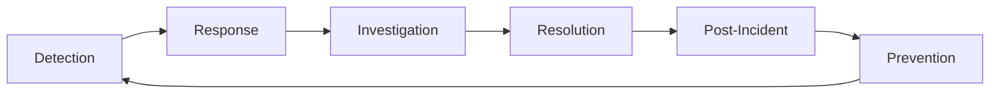

# Incident Management 🔧

## Incident Response Fundamentals

### 1. What are the key phases of incident management?

**Answer:**

The incident management lifecycle consists of several critical phases:

**1. Detection & Alert:**
- **Automated Detection**: Monitoring systems detect anomalies
- **Manual Reporting**: Users or teams report issues
- **Validation**: Confirm the incident is real and not a false positive

**2. Response & Mobilization:**
- **Incident Classification**: Severity and impact assessment
- **Team Assembly**: Gathering the right people
- **Communication Setup**: War room, channels, stakeholders

**3. Investigation & Diagnosis:**
- **Root Cause Analysis**: Understanding what went wrong
- **Impact Assessment**: Determining scope and user impact
- **Workaround Identification**: Quick fixes to restore service

**4. Resolution & Recovery:**
- **Fix Implementation**: Applying the solution
- **Service Restoration**: Bringing systems back online
- **Verification**: Confirming the fix works

**5. Post-Incident Activities:**
- **Post-mortem**: Learning from the incident
- **Action Items**: Preventing future occurrences
- **Documentation**: Updating runbooks and procedures



---

### 2. How do you classify incident severity and priority?

**Answer:**

**Incident Severity Matrix:**

| Severity | Impact | Examples | Response Time | Escalation |
|----------|--------|----------|---------------|------------|
| **Critical (P0)** | Complete service outage | Site down, payment processing failed | < 15 minutes | Immediate page |
| **High (P1)** | Major functionality impaired | Core features unavailable | < 1 hour | Page during hours |
| **Medium (P2)** | Minor functionality impacted | Non-critical features affected | < 4 hours | Email + Slack |
| **Low (P3)** | Minimal impact | Cosmetic issues, future risks | < 24 hours | Ticket queue |

**Severity Assessment Framework:**

```python
class IncidentClassifier:
    def __init__(self):
        self.severity_matrix = {
            'critical': {
                'user_impact': ['complete_outage', 'data_loss', 'security_breach'],
                'business_impact': ['revenue_loss', 'sla_breach', 'reputation_damage'],
                'response_time': 15,  # minutes
                'escalation': 'immediate'
            },
            'high': {
                'user_impact': ['major_degradation', 'feature_unavailable'],
                'business_impact': ['customer_complaints', 'revenue_impact'],
                'response_time': 60,  # minutes
                'escalation': 'during_hours'
            },
            'medium': {
                'user_impact': ['minor_degradation', 'slow_performance'],
                'business_impact': ['internal_impact', 'workaround_available'],
                'response_time': 240,  # minutes
                'escalation': 'email_slack'
            },
            'low': {
                'user_impact': ['cosmetic_issue', 'future_risk'],
                'business_impact': ['minimal_impact'],
                'response_time': 1440,  # minutes (24 hours)
                'escalation': 'ticket'
            }
        }
    
    def classify_incident(self, user_impact, business_impact, affected_users_pct):
        """Classify incident based on impact factors"""
        
        # Critical conditions
        if (user_impact in ['complete_outage', 'data_loss', 'security_breach'] or
            business_impact in ['revenue_loss', 'sla_breach'] or
            affected_users_pct > 50):
            return 'critical'
        
        # High conditions
        elif (user_impact in ['major_degradation', 'feature_unavailable'] or
              business_impact in ['customer_complaints', 'revenue_impact'] or
              affected_users_pct > 10):
            return 'high'
        
        # Medium conditions
        elif (user_impact in ['minor_degradation', 'slow_performance'] or
              affected_users_pct > 1):
            return 'medium'
        
        # Default to low
        else:
            return 'low'
```

---

### 3. What is the role of an Incident Commander?

**Answer:**

**Incident Commander (IC) Responsibilities:**

**1. Decision Making:**
- Final authority on incident decisions
- Coordinate response strategies
- Approve communication messages

**2. Communication:**
- Interface with stakeholders
- Provide regular status updates
- Manage external communications

**3. Resource Management:**
- Assign roles and responsibilities
- Bring in additional expertise
- Manage escalations

**4. Process Management:**
- Ensure proper procedures are followed
- Drive the incident to resolution
- Maintain incident timeline

**IC Rotation Model:**

```python
class IncidentCommander:
    def __init__(self, name, experience_level, specializations):
        self.name = name
        self.experience_level = experience_level  # junior, senior, expert
        self.specializations = specializations
        self.current_incidents = []
        self.max_concurrent = self._get_max_concurrent()
    
    def _get_max_concurrent(self):
        limits = {
            'junior': 1,
            'senior': 2,
            'expert': 3
        }
        return limits.get(self.experience_level, 1)
    
    def can_take_incident(self, incident_severity):
        # Check capacity
        if len(self.current_incidents) >= self.max_concurrent:
            return False
        
        # Check if handling critical incident (exclusive)
        if any(inc.severity == 'critical' for inc in self.current_incidents):
            return False
        
        # Juniors can't handle critical incidents
        if self.experience_level == 'junior' and incident_severity == 'critical':
            return False
        
        return True

class IncidentCommanderRotation:
    def __init__(self, commanders):
        self.commanders = commanders
        self.current_assignments = {}
    
    def assign_commander(self, incident):
        # Find available commander with appropriate experience
        available = [
            ic for ic in self.commanders 
            if ic.can_take_incident(incident.severity)
        ]
        
        if not available:
            # Escalate to senior management
            return self._escalate_assignment(incident)
        
        # Prefer commanders with relevant specialization
        specialized = [
            ic for ic in available 
            if incident.service in ic.specializations
        ]
        
        commander = specialized[0] if specialized else available[0]
        commander.current_incidents.append(incident)
        
        return commander
```

---

### 4. How do you conduct effective incident war rooms?

**Answer:**

**War Room Best Practices:**

**1. Physical/Virtual Space Setup:**
- Dedicated communication channel (Slack, Teams)
- Video conference bridge
- Shared documentation space
- Monitoring dashboards visible

**2. Role Assignments:**
- **Incident Commander**: Overall coordination
- **Technical Lead**: Investigation and fixes
- **Communications Manager**: Stakeholder updates
- **Scribe**: Documentation and timeline

**3. Communication Protocols:**
- Regular status updates (every 15-30 minutes)
- Clear escalation triggers
- Standardized update templates

**War Room Implementation:**

```python
class WarRoom:
    def __init__(self, incident_id, severity):
        self.incident_id = incident_id
        self.severity = severity
        self.participants = {}
        self.timeline = []
        self.status_updates = []
        self.communication_channels = {}
        
    def setup_channels(self):
        """Setup communication channels for the incident"""
        
        # Create Slack channel
        channel_name = f"incident-{self.incident_id}"
        self.communication_channels['slack'] = self._create_slack_channel(channel_name)
        
        # Setup video bridge
        if self.severity in ['critical', 'high']:
            self.communication_channels['video'] = self._create_video_bridge()
        
        # Create shared document
        self.communication_channels['doc'] = self._create_shared_doc()
    
    def assign_roles(self, people):
        """Assign incident response roles"""
        
        roles = {
            'incident_commander': None,
            'technical_lead': None,
            'communications_manager': None,
            'scribe': None
        }
        
        # Auto-assign based on on-call schedule and expertise
        for person in people:
            if not roles['incident_commander'] and person.can_be_ic:
                roles['incident_commander'] = person
            elif not roles['technical_lead'] and self._has_technical_expertise(person):
                roles['technical_lead'] = person
            elif not roles['communications_manager'] and person.can_communicate:
                roles['communications_manager'] = person
            elif not roles['scribe']:
                roles['scribe'] = person
        
        self.participants = roles
        return roles
    
    def send_status_update(self, update_text, channels=None):
        """Send standardized status update"""
        
        timestamp = datetime.utcnow()
        
        update = {
            'timestamp': timestamp,
            'incident_id': self.incident_id,
            'update': update_text,
            'next_update': timestamp + timedelta(minutes=30)
        }
        
        # Format message
        message = f"""
        🚨 INCIDENT UPDATE - {self.incident_id}
        
        Status: {update_text}
        Time: {timestamp.strftime('%H:%M UTC')}
        Next Update: {update['next_update'].strftime('%H:%M UTC')}
        
        War Room: #{self.communication_channels.get('slack', 'N/A')}
        """
        
        # Send to all relevant channels
        self._broadcast_update(message, channels)
        self.status_updates.append(update)
    
    def add_timeline_event(self, event, details=None):
        """Add event to incident timeline"""
        
        self.timeline.append({
            'timestamp': datetime.utcnow(),
            'event': event,
            'details': details or {},
            'added_by': self._get_current_user()
        })
    
    def close_war_room(self):
        """Clean up war room resources"""
        
        # Archive channels
        if 'slack' in self.communication_channels:
            self._archive_slack_channel(self.communication_channels['slack'])
        
        # End video bridge
        if 'video' in self.communication_channels:
            self._end_video_bridge(self.communication_channels['video'])
        
        # Generate incident summary
        summary = self._generate_incident_summary()
        
        return summary
```

**War Room Communication Template:**

```markdown
# Incident War Room - INC-{incident_id}

## Current Status
- **Severity**: {severity}
- **Impact**: {impact_description}
- **Started**: {start_time}
- **Duration**: {duration}

## Team
- **IC**: {incident_commander}
- **Tech Lead**: {technical_lead}
- **Comms**: {communications_manager}
- **Scribe**: {scribe}

## Current Actions
- [ ] {action_item_1} - {owner}
- [ ] {action_item_2} - {owner}

## Timeline
- {timestamp}: {event_description}

## Next Update: {next_update_time}
```

---

### 5. How do you write effective postmortems?

**Answer:**

**Postmortem Structure:**

**1. Executive Summary:**
- What happened
- Impact and duration
- Root cause (brief)
- Key action items

**2. Timeline:**
- Chronological sequence of events
- Key decisions and actions
- Communication points

**3. Root Cause Analysis:**
- Immediate cause
- Contributing factors
- Systemic issues

**4. Impact Assessment:**
- User impact (duration, scope)
- Business impact (revenue, reputation)
- Internal impact (team, operations)

**5. Action Items:**
- Preventive measures
- Detection improvements
- Response improvements

**Postmortem Template:**

```markdown
# Postmortem: {Service} Outage - {Date}

## Executive Summary

**What**: {Brief description of what happened}
**When**: {Start time} - {End time} ({Duration})
**Impact**: {Number of users affected, business impact}
**Root Cause**: {One-line root cause}

## Incident Details

### Timeline (All times in UTC)

| Time | Event | Actions Taken |
|------|-------|---------------|
| 14:00 | Initial symptom detected | Monitoring alert fired |
| 14:05 | Incident declared | War room established |
| 14:15 | Root cause identified | Investigation completed |
| 14:30 | Fix implemented | Service restored |
| 14:45 | Verification complete | Incident closed |

### Root Cause Analysis

**Immediate Cause**: {What directly caused the failure}

**Contributing Factors**:
1. {Factor 1 - e.g., insufficient monitoring}
2. {Factor 2 - e.g., lack of automated rollback}
3. {Factor 3 - e.g., deployment during peak hours}

**5 Whys Analysis**:
1. Why did the service fail? {Answer}
2. Why did {previous answer}? {Answer}
3. Why did {previous answer}? {Answer}
4. Why did {previous answer}? {Answer}
5. Why did {previous answer}? {Root cause}

### Impact Assessment

**User Impact**:
- {X} users affected ({Y}% of total users)
- {Duration} of degraded service
- {Number} of failed transactions

**Business Impact**:
- Estimated revenue loss: ${Amount}
- Customer support tickets: {Number}
- SLA breach: {Yes/No}

### What Went Well

1. {Positive aspect 1}
2. {Positive aspect 2}
3. {Positive aspect 3}

### What Could Be Improved

1. {Improvement area 1}
2. {Improvement area 2}
3. {Improvement area 3}

## Action Items

| Action | Owner | Due Date | Priority |
|--------|-------|----------|----------|
| Add monitoring for {metric} | {Name} | {Date} | High |
| Implement automated rollback | {Name} | {Date} | High |
| Update deployment procedures | {Name} | {Date} | Medium |
| Conduct chaos engineering test | {Name} | {Date} | Medium |

## Lessons Learned

1. {Lesson 1 - what we learned}
2. {Lesson 2 - what we learned}
3. {Lesson 3 - what we learned}

---
**Postmortem Owner**: {Name}
**Review Date**: {Date for follow-up}
**Status**: {Open/Closed}
```

**Postmortem Automation:**

```python
class PostmortemGenerator:
    def __init__(self, incident):
        self.incident = incident
        self.template_path = "templates/postmortem.md"
    
    def generate_postmortem(self):
        """Generate postmortem from incident data"""
        
        template_data = {
            'service': self.incident.affected_services[0],
            'date': self.incident.start_time.strftime('%Y-%m-%d'),
            'start_time': self.incident.start_time.strftime('%H:%M UTC'),
            'end_time': self.incident.end_time.strftime('%H:%M UTC'),
            'duration': self._calculate_duration(),
            'impact': self._calculate_impact(),
            'root_cause': self.incident.root_cause,
            'timeline': self._format_timeline(),
            'action_items': self._extract_action_items()
        }
        
        # Load and populate template
        with open(self.template_path, 'r') as f:
            template = f.read()
        
        postmortem = template.format(**template_data)
        
        # Save postmortem
        filename = f"postmortems/{self.incident.id}-{template_data['date']}.md"
        with open(filename, 'w') as f:
            f.write(postmortem)
        
        return filename
    
    def _calculate_duration(self):
        """Calculate incident duration"""
        delta = self.incident.end_time - self.incident.start_time
        hours = delta.total_seconds() / 3600
        
        if hours < 1:
            return f"{int(delta.total_seconds() / 60)} minutes"
        else:
            return f"{hours:.1f} hours"
    
    def _format_timeline(self):
        """Format timeline events for postmortem"""
        timeline_md = ""
        
        for event in self.incident.timeline:
            time_str = event['timestamp'].strftime('%H:%M')
            timeline_md += f"| {time_str} | {event['event']} | {event.get('action', 'N/A')} |\n"
        
        return timeline_md
```

---

### 6. How do you implement on-call rotations and escalation?

**Answer:**

**On-Call Management System:**

```python
from datetime import datetime, timedelta
import calendar

class OnCallSchedule:
    def __init__(self):
        self.rotations = {}
        self.escalation_chains = {}
        self.schedules = {}
    
    def create_rotation(self, name, members, rotation_type='weekly'):
        """Create an on-call rotation"""
        
        self.rotations[name] = {
            'members': members,
            'type': rotation_type,
            'current_index': 0,
            'last_rotation': datetime.now()
        }
    
    def get_current_oncall(self, rotation_name, timestamp=None):
        """Get current on-call person for a rotation"""
        
        if timestamp is None:
            timestamp = datetime.now()
        
        rotation = self.rotations.get(rotation_name)
        if not rotation:
            return None
        
        # Calculate current on-call based on rotation schedule
        start_of_week = timestamp - timedelta(days=timestamp.weekday())
        weeks_since_start = (start_of_week - rotation['last_rotation']).days // 7
        
        current_index = (rotation['current_index'] + weeks_since_start) % len(rotation['members'])
        
        return rotation['members'][current_index]
    
    def create_escalation_chain(self, name, levels):
        """Create escalation chain with timeouts"""
        
        self.escalation_chains[name] = {
            'levels': levels,  # [{'contacts': [...], 'timeout': 300}]
            'max_escalations': len(levels)
        }
    
    def escalate_incident(self, incident_id, escalation_chain_name):
        """Escalate incident through the chain"""
        
        chain = self.escalation_chains.get(escalation_chain_name)
        if not chain:
            raise ValueError(f"Escalation chain {escalation_chain_name} not found")
        
        for level_index, level in enumerate(chain['levels']):
            # Send notification to current level
            for contact in level['contacts']:
                self._send_notification(contact, incident_id, level_index)
            
            # Wait for acknowledgment or timeout
            if self._wait_for_acknowledgment(incident_id, level['timeout']):
                return level_index  # Acknowledged at this level
        
        # If we get here, all levels have been exhausted
        self._send_emergency_notification(incident_id)
        return -1

class AlertingSystem:
    def __init__(self, oncall_schedule):
        self.oncall_schedule = oncall_schedule
        self.notification_providers = {}
    
    def register_provider(self, name, provider):
        """Register notification provider (email, SMS, phone, Slack)"""
        self.notification_providers[name] = provider
    
    def send_alert(self, incident, rotation_name):
        """Send alert to on-call person"""
        
        oncall_person = self.oncall_schedule.get_current_oncall(rotation_name)
        if not oncall_person:
            raise Exception(f"No on-call person found for {rotation_name}")
        
        # Determine notification method based on severity
        notification_methods = self._get_notification_methods(incident.severity)
        
        for method in notification_methods:
            self._send_notification_via_method(oncall_person, incident, method)
    
    def _get_notification_methods(self, severity):
        """Get notification methods based on incident severity"""
        
        methods = {
            'critical': ['phone', 'sms', 'email', 'slack'],
            'high': ['sms', 'email', 'slack'],
            'medium': ['email', 'slack'],
            'low': ['slack']
        }
        
        return methods.get(severity, ['slack'])
    
    def _send_notification_via_method(self, person, incident, method):
        """Send notification using specific method"""
        
        provider = self.notification_providers.get(method)
        if not provider:
            return False
        
        message = self._format_alert_message(incident, method)
        
        try:
            provider.send(
                recipient=person.get_contact_info(method),
                message=message,
                priority=incident.severity
            )
            return True
        except Exception as e:
            print(f"Failed to send {method} notification: {e}")
            return False
```

**Escalation Policy Configuration:**

```yaml
# escalation-policies.yml
escalation_policies:
  production_alerts:
    levels:
      - name: "Primary On-Call"
        timeout: 300  # 5 minutes
        contacts:
          - type: "rotation"
            rotation: "sre_primary"
        notification_methods: ["phone", "sms", "email"]
      
      - name: "Secondary On-Call"
        timeout: 600  # 10 minutes
        contacts:
          - type: "rotation"
            rotation: "sre_secondary"
        notification_methods: ["phone", "sms"]
      
      - name: "Manager Escalation"
        timeout: 900  # 15 minutes
        contacts:
          - type: "user"
            user: "sre_manager"
        notification_methods: ["phone", "email"]
      
      - name: "Executive Escalation"
        timeout: 1800  # 30 minutes
        contacts:
          - type: "user"
            user: "cto"
        notification_methods: ["phone"]

rotations:
  sre_primary:
    type: "weekly"
    members:
      - name: "Alice"
        phone: "+1234567890"
        email: "alice@company.com"
      - name: "Bob"
        phone: "+1234567891"
        email: "bob@company.com"
    
  sre_secondary:
    type: "weekly"
    members:
      - name: "Charlie"
        phone: "+1234567892"
        email: "charlie@company.com"
      - name: "Diana"
        phone: "+1234567893"
        email: "diana@company.com"
```

---

### 7. How do you measure incident management effectiveness?

**Answer:**

**Key Incident Metrics:**

**1. Detection Metrics:**
- **Mean Time to Detection (MTTD)**: How quickly we detect incidents
- **Detection Source**: Monitoring vs. customer reports
- **False Positive Rate**: Percentage of alerts that aren't real incidents

**2. Response Metrics:**
- **Mean Time to Acknowledge (MTTA)**: Time to acknowledge an alert
- **Mean Time to Response (MTTR)**: Time to start working on the incident
- **Escalation Rate**: Percentage of incidents that require escalation

**3. Resolution Metrics:**
- **Mean Time to Resolution (MTTR)**: Total time to resolve incident
- **Mean Time to Recovery (MTTR)**: Time to restore service
- **First Call Resolution Rate**: Incidents resolved without escalation

**4. Learning Metrics:**
- **Postmortem Completion Rate**: Percentage of incidents with postmortems
- **Action Item Completion Rate**: Percentage of action items completed
- **Repeat Incident Rate**: Incidents caused by the same root cause

**Metrics Implementation:**

```python
class IncidentMetrics:
    def __init__(self, incident_store):
        self.incident_store = incident_store
    
    def calculate_mttd(self, time_period):
        """Calculate Mean Time to Detection"""
        
        incidents = self.incident_store.get_incidents_in_period(time_period)
        detection_times = []
        
        for incident in incidents:
            if incident.actual_start_time and incident.detected_time:
                detection_time = (incident.detected_time - incident.actual_start_time).total_seconds()
                detection_times.append(detection_time)
        
        if not detection_times:
            return 0
        
        return sum(detection_times) / len(detection_times)
    
    def calculate_mttr(self, time_period, metric_type='resolution'):
        """Calculate Mean Time to Resolution/Recovery"""
        
        incidents = self.incident_store.get_resolved_incidents_in_period(time_period)
        times = []
        
        for incident in incidents:
            if metric_type == 'resolution':
                if incident.start_time and incident.resolved_time:
                    time_diff = (incident.resolved_time - incident.start_time).total_seconds()
                    times.append(time_diff)
            elif metric_type == 'recovery':
                if incident.start_time and incident.service_restored_time:
                    time_diff = (incident.service_restored_time - incident.start_time).total_seconds()
                    times.append(time_diff)
        
        if not times:
            return 0
        
        return sum(times) / len(times)
    
    def calculate_escalation_rate(self, time_period):
        """Calculate escalation rate"""
        
        incidents = self.incident_store.get_incidents_in_period(time_period)
        total_incidents = len(incidents)
        escalated_incidents = len([i for i in incidents if i.escalated])
        
        if total_incidents == 0:
            return 0
        
        return (escalated_incidents / total_incidents) * 100
    
    def generate_metrics_report(self, time_period):
        """Generate comprehensive metrics report"""
        
        return {
            'period': time_period,
            'total_incidents': len(self.incident_store.get_incidents_in_period(time_period)),
            'mttd_seconds': self.calculate_mttd(time_period),
            'mttr_resolution_seconds': self.calculate_mttr(time_period, 'resolution'),
            'mttr_recovery_seconds': self.calculate_mttr(time_period, 'recovery'),
            'escalation_rate_percent': self.calculate_escalation_rate(time_period),
            'severity_breakdown': self._get_severity_breakdown(time_period),
            'top_root_causes': self._get_top_root_causes(time_period)
        }
    
    def _get_severity_breakdown(self, time_period):
        """Get incident breakdown by severity"""
        
        incidents = self.incident_store.get_incidents_in_period(time_period)
        severity_counts = {}
        
        for incident in incidents:
            severity = incident.severity
            severity_counts[severity] = severity_counts.get(severity, 0) + 1
        
        return severity_counts
```

**Incident Dashboard Metrics:**

```json
{
  "incident_metrics_dashboard": {
    "panels": [
      {
        "title": "MTTR Trend",
        "type": "graph",
        "metric": "avg(incident_mttr_seconds) by (severity)",
        "time_range": "30d"
      },
      {
        "title": "Incident Volume",
        "type": "bar_chart",
        "metric": "count(incidents) by (severity, day)",
        "time_range": "7d"
      },
      {
        "title": "Detection Source",
        "type": "pie_chart",
        "metric": "count(incidents) by (detection_source)",
        "time_range": "30d"
      },
      {
        "title": "Top Root Causes",
        "type": "table",
        "metric": "count(incidents) by (root_cause)",
        "limit": 10
      }
    ]
  }
}
```

---

## 🚨 Incident Response Playbooks

### Critical Service Outage Playbook

```markdown
# Critical Service Outage Response Playbook

## Immediate Actions (0-5 minutes)

1. **Confirm the outage**
   - Check monitoring dashboards
   - Verify with multiple data sources
   - Distinguish between partial and complete outage

2. **Declare incident**
   - Assign severity level
   - Create incident ticket
   - Set up war room

3. **Initial communication**
   - Notify stakeholders
   - Update status page
   - Inform customer support

## Investigation Phase (5-15 minutes)

1. **Gather information**
   - Recent deployments
   - Infrastructure changes
   - External dependencies status

2. **Initial triage**
   - Check application logs
   - Review system metrics
   - Verify database connectivity

3. **Form hypothesis**
   - Most likely cause based on symptoms
   - Recent changes correlation
   - Similar past incidents

## Resolution Phase (15+ minutes)

1. **Implement quick wins**
   - Restart services if safe
   - Scale resources if needed
   - Rollback recent changes

2. **Systematic investigation**
   - Follow hypothesis-driven approach
   - Gather evidence before making changes
   - Document findings

3. **Implement fix**
   - Test fix in safe environment if possible
   - Apply fix with monitoring
   - Verify resolution

## Recovery Verification

1. **Service validation**
   - Run health checks
   - Verify key user journeys
   - Monitor error rates

2. **Communication**
   - Notify incident resolution
   - Update status page
   - Thank responders

## Post-Incident

1. **Schedule postmortem**
2. **Document timeline**
3. **Identify action items**
```

### Database Performance Degradation Playbook

```markdown
# Database Performance Issues Playbook

## Immediate Triage

1. **Check current performance**
   ```sql
   -- Check active connections
   SELECT count(*) FROM pg_stat_activity WHERE state = 'active';
   
   -- Check slow queries
   SELECT query, mean_time, calls 
   FROM pg_stat_statements 
   ORDER BY mean_time DESC LIMIT 10;
   
   -- Check locks
   SELECT * FROM pg_locks WHERE NOT granted;
   ```

2. **Resource utilization**
   - CPU usage
   - Memory consumption
   - Disk I/O
   - Network bandwidth

3. **Recent changes**
   - New deployments
   - Schema changes
   - Configuration updates

## Common Remediation Steps

1. **Query optimization**
   - Identify and kill long-running queries
   - Check for missing indexes
   - Review query execution plans

2. **Resource scaling**
   - Increase instance size if needed
   - Add read replicas for read traffic
   - Enable connection pooling

3. **Cache warming**
   - Pre-warm frequently accessed data
   - Adjust cache sizes
   - Check cache hit ratios
```

---

## 📚 Templates and Checklists

### Incident Communication Template

```markdown
**INCIDENT NOTIFICATION - {SEVERITY}**

**Service**: {Affected Service}
**Status**: {Current Status}
**Impact**: {User Impact Description}
**Started**: {Start Time}
**ETA**: {Estimated Resolution Time}

**Current Actions**:
- {Action 1}
- {Action 2}

**Next Update**: {Next Update Time}

**War Room**: {Communication Channel}
**Incident Commander**: {IC Name}
```

### Postmortem Action Item Template

```markdown
## Action Item: {Title}

**Description**: {Detailed description of what needs to be done}
**Owner**: {Assigned person}
**Due Date**: {Target completion date}
**Priority**: {High/Medium/Low}
**Success Criteria**: {How to know it's complete}
**Dependencies**: {Any blockers or prerequisites}
**Status**: {Open/In Progress/Complete}

**Progress Updates**:
- {Date}: {Progress update}
```

---

This comprehensive incident management guide provides practical frameworks, tools, and processes for handling incidents effectively, with emphasis on learning and continuous improvement.