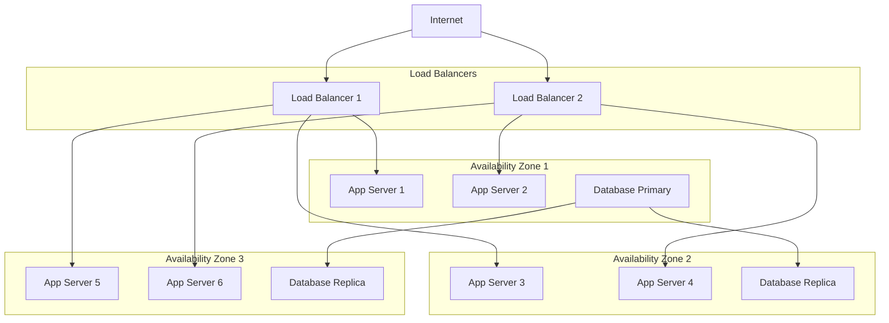

# System Design for Reliability 🏗️

## Scalable and Reliable Architecture Patterns

### 1. How do you design for high availability and fault tolerance?

**Answer:**

**High Availability Design Principles:**



**1. Redundancy and Elimination of Single Points of Failure:**

```python
from abc import ABC, abstractmethod
from enum import Enum
from typing import List, Dict, Optional
import random
import time

class AvailabilityZone(Enum):
    US_EAST_1A = "us-east-1a"
    US_EAST_1B = "us-east-1b"
    US_EAST_1C = "us-east-1c"

class ServiceStatus(Enum):
    HEALTHY = "healthy"
    DEGRADED = "degraded"
    UNHEALTHY = "unhealthy"

class HighAvailabilityService:
    def __init__(self, name: str, min_healthy_instances: int = 2):
        self.name = name
        self.min_healthy_instances = min_healthy_instances
        self.instances = {}
        self.load_balancer = LoadBalancer()
    
    def deploy_across_zones(self, instance_count_per_zone: int = 2):
        """Deploy service instances across multiple availability zones"""
        
        for zone in AvailabilityZone:
            for i in range(instance_count_per_zone):
                instance_id = f"{self.name}-{zone.value}-{i+1}"
                instance = ServiceInstance(
                    instance_id, 
                    zone, 
                    f"10.0.{list(AvailabilityZone).index(zone)}.{i+10}"
                )
                
                self.instances[instance_id] = instance
                self.load_balancer.register_instance(instance)
        
        return len(self.instances)
    
    def check_availability(self) -> Dict:
        """Check current availability status"""
        
        healthy_instances = [
            inst for inst in self.instances.values() 
            if inst.status == ServiceStatus.HEALTHY
        ]
        
        zones_with_healthy_instances = set(
            inst.availability_zone for inst in healthy_instances
        )
        
        is_highly_available = (
            len(healthy_instances) >= self.min_healthy_instances and
            len(zones_with_healthy_instances) >= 2
        )
        
        return {
            'service': self.name,
            'total_instances': len(self.instances),
            'healthy_instances': len(healthy_instances),
            'zones_with_healthy_instances': len(zones_with_healthy_instances),
            'is_highly_available': is_highly_available,
            'availability_zones': list(zones_with_healthy_instances)
        }

class ServiceInstance:
    def __init__(self, instance_id: str, zone: AvailabilityZone, ip_address: str):
        self.instance_id = instance_id
        self.availability_zone = zone
        self.ip_address = ip_address
        self.status = ServiceStatus.HEALTHY
        self.last_health_check = time.time()
    
    def health_check(self) -> bool:
        """Simulate health check"""
        # Simulate occasional failures
        is_healthy = random.random() > 0.05  # 5% failure rate
        
        if is_healthy:
            self.status = ServiceStatus.HEALTHY
        else:
            self.status = ServiceStatus.UNHEALTHY
        
        self.last_health_check = time.time()
        return is_healthy

class LoadBalancer:
    def __init__(self):
        self.instances = []
        self.health_check_interval = 30  # seconds
    
    def register_instance(self, instance: ServiceInstance):
        """Register service instance with load balancer"""
        self.instances.append(instance)
    
    def get_healthy_instances(self) -> List[ServiceInstance]:
        """Get list of healthy instances"""
        healthy = []
        
        for instance in self.instances:
            if instance.health_check():
                healthy.append(instance)
        
        return healthy
    
    def route_request(self) -> Optional[ServiceInstance]:
        """Route request to healthy instance using round-robin"""
        healthy_instances = self.get_healthy_instances()
        
        if not healthy_instances:
            return None
        
        # Simple round-robin selection
        return random.choice(healthy_instances)
```

**2. Circuit Breaker Pattern:**

```python
import time
from enum import Enum
from typing import Callable, Any
import threading

class CircuitState(Enum):
    CLOSED = "closed"      # Normal operation
    OPEN = "open"          # Failing, reject requests
    HALF_OPEN = "half_open" # Testing if service recovered

class CircuitBreaker:
    def __init__(self, 
                 failure_threshold: int = 5,
                 recovery_timeout: int = 60,
                 expected_exception: type = Exception):
        
        self.failure_threshold = failure_threshold
        self.recovery_timeout = recovery_timeout
        self.expected_exception = expected_exception
        
        self.failure_count = 0
        self.last_failure_time = None
        self.state = CircuitState.CLOSED
        self.lock = threading.Lock()
    
    def __call__(self, func: Callable) -> Callable:
        """Decorator to wrap functions with circuit breaker"""
        
        def wrapper(*args, **kwargs):
            return self._call(func, *args, **kwargs)
        
        return wrapper
    
    def _call(self, func: Callable, *args, **kwargs) -> Any:
        """Execute function with circuit breaker logic"""
        
        with self.lock:
            if self.state == CircuitState.OPEN:
                if self._should_attempt_reset():
                    self.state = CircuitState.HALF_OPEN
                    self.failure_count = 0
                else:
                    raise CircuitBreakerOpenException("Circuit breaker is OPEN")
            
            try:
                result = func(*args, **kwargs)
                
                # Success - reset failure count
                if self.state == CircuitState.HALF_OPEN:
                    self.state = CircuitState.CLOSED
                
                self.failure_count = 0
                return result
                
            except self.expected_exception as e:
                self._record_failure()
                raise e
    
    def _record_failure(self):
        """Record a failure and potentially open circuit"""
        
        self.failure_count += 1
        self.last_failure_time = time.time()
        
        if self.failure_count >= self.failure_threshold:
            self.state = CircuitState.OPEN
    
    def _should_attempt_reset(self) -> bool:
        """Check if we should attempt to reset the circuit"""
        
        return (self.last_failure_time and 
                time.time() - self.last_failure_time >= self.recovery_timeout)
    
    def get_state(self) -> Dict:
        """Get current circuit breaker state"""
        
        return {
            'state': self.state.value,
            'failure_count': self.failure_count,
            'failure_threshold': self.failure_threshold,
            'last_failure_time': self.last_failure_time
        }

class CircuitBreakerOpenException(Exception):
    pass

# Example usage
@CircuitBreaker(failure_threshold=3, recovery_timeout=30)
def call_external_service(data):
    """Function that might fail"""
    import requests
    response = requests.post("https://api.external.com/process", json=data, timeout=5)
    response.raise_for_status()
    return response.json()
```

**3. Bulkhead Pattern:**

```python
import threading
import queue
import time
from concurrent.futures import ThreadPoolExecutor, Future
from typing import Dict, Callable, Any

class BulkheadExecutor:
    def __init__(self, pools_config: Dict[str, int]):
        """
        Initialize bulkhead executor with separate thread pools
        
        pools_config: Dict mapping pool names to thread counts
        Example: {'critical': 10, 'non_critical': 5}
        """
        
        self.pools = {}
        self.queues = {}
        
        for pool_name, thread_count in pools_config.items():
            self.pools[pool_name] = ThreadPoolExecutor(
                max_workers=thread_count,
                thread_name_prefix=f"bulkhead-{pool_name}"
            )
            self.queues[pool_name] = queue.Queue()
    
    def submit_to_pool(self, pool_name: str, func: Callable, *args, **kwargs) -> Future:
        """Submit task to specific bulkhead pool"""
        
        if pool_name not in self.pools:
            raise ValueError(f"Pool {pool_name} not configured")
        
        return self.pools[pool_name].submit(func, *args, **kwargs)
    
    def get_pool_stats(self, pool_name: str) -> Dict:
        """Get statistics for a specific pool"""
        
        if pool_name not in self.pools:
            raise ValueError(f"Pool {pool_name} not configured")
        
        pool = self.pools[pool_name]
        
        return {
            'pool_name': pool_name,
            'max_workers': pool._max_workers,
            'active_threads': pool._threads and len(pool._threads) or 0,
            'pending_tasks': pool._work_queue.qsize()
        }
    
    def shutdown(self, wait: bool = True):
        """Shutdown all thread pools"""
        
        for pool in self.pools.values():
            pool.shutdown(wait=wait)

# Example: Separate pools for different service types
class ServiceBulkheads:
    def __init__(self):
        self.executor = BulkheadExecutor({
            'critical_apis': 15,      # Payment, authentication
            'user_facing': 10,        # User profile, notifications
            'background_tasks': 5,    # Analytics, reporting
            'external_integrations': 3 # Third-party APIs
        })
    
    def process_payment(self, payment_data):
        """Critical payment processing"""
        return self.executor.submit_to_pool(
            'critical_apis', 
            self._execute_payment, 
            payment_data
        )
    
    def fetch_user_profile(self, user_id):
        """User-facing functionality"""
        return self.executor.submit_to_pool(
            'user_facing',
            self._fetch_profile,
            user_id
        )
    
    def process_analytics(self, event_data):
        """Background processing"""
        return self.executor.submit_to_pool(
            'background_tasks',
            self._process_event,
            event_data
        )
    
    def call_external_api(self, api_call):
        """External service calls"""
        return self.executor.submit_to_pool(
            'external_integrations',
            self._make_external_call,
            api_call
        )
```

---

### 2. How do you design microservices for reliability?

**Answer:**

**Microservices Reliability Patterns:**

**1. Service Mesh Architecture:**

```yaml
# istio-service-mesh.yml
apiVersion: networking.istio.io/v1alpha3
kind: DestinationRule
metadata:
  name: user-service
spec:
  host: user-service
  trafficPolicy:
    circuitBreaker:
      consecutiveErrors: 3
      interval: 30s
      baseEjectionTime: 30s
      maxEjectionPercent: 50
    retryPolicy:
      attempts: 3
      perTryTimeout: 5s
    outlierDetection:
      consecutiveErrors: 5
      interval: 10s
      baseEjectionTime: 30s

---
apiVersion: networking.istio.io/v1alpha3
kind: VirtualService
metadata:
  name: user-service
spec:
  http:
  - match:
    - headers:
        canary:
          exact: "true"
    route:
    - destination:
        host: user-service
        subset: canary
      weight: 100
  - route:
    - destination:
        host: user-service
        subset: stable
      weight: 100
    timeout: 10s
    retries:
      attempts: 3
      perTryTimeout: 3s
```

**2. Microservice Communication Patterns:**

```python
from abc import ABC, abstractmethod
import asyncio
import aiohttp
import json
from typing import Dict, Optional, List
import logging
import time

class ResiliencePattern(ABC):
    @abstractmethod
    async def execute(self, func, *args, **kwargs):
        pass

class RetryPattern(ResiliencePattern):
    def __init__(self, max_attempts: int = 3, backoff_factor: float = 2.0):
        self.max_attempts = max_attempts
        self.backoff_factor = backoff_factor
    
    async def execute(self, func, *args, **kwargs):
        """Execute function with exponential backoff retry"""
        
        last_exception = None
        
        for attempt in range(self.max_attempts):
            try:
                return await func(*args, **kwargs)
            
            except Exception as e:
                last_exception = e
                
                if attempt < self.max_attempts - 1:
                    delay = (self.backoff_factor ** attempt)
                    logging.warning(f"Attempt {attempt + 1} failed, retrying in {delay}s: {str(e)}")
                    await asyncio.sleep(delay)
                else:
                    logging.error(f"All {self.max_attempts} attempts failed")
        
        raise last_exception

class TimeoutPattern(ResiliencePattern):
    def __init__(self, timeout_seconds: float = 10.0):
        self.timeout_seconds = timeout_seconds
    
    async def execute(self, func, *args, **kwargs):
        """Execute function with timeout"""
        
        try:
            return await asyncio.wait_for(
                func(*args, **kwargs), 
                timeout=self.timeout_seconds
            )
        except asyncio.TimeoutError:
            raise TimeoutError(f"Operation timed out after {self.timeout_seconds} seconds")

class MicroserviceClient:
    def __init__(self, base_url: str, service_name: str):
        self.base_url = base_url
        self.service_name = service_name
        self.session = None
        
        # Configure resilience patterns
        self.retry_pattern = RetryPattern(max_attempts=3)
        self.timeout_pattern = TimeoutPattern(timeout_seconds=10)
        
        # Circuit breaker (simplified)
        self.circuit_breaker = CircuitBreaker(
            failure_threshold=5,
            recovery_timeout=60
        )
    
    async def __aenter__(self):
        self.session = aiohttp.ClientSession(
            timeout=aiohttp.ClientTimeout(total=30)
        )
        return self
    
    async def __aexit__(self, exc_type, exc_val, exc_tb):
        if self.session:
            await self.session.close()
    
    async def get(self, endpoint: str, **params) -> Dict:
        """GET request with resilience patterns"""
        
        async def _make_request():
            url = f"{self.base_url}/{endpoint.lstrip('/')}"
            
            async with self.session.get(url, params=params) as response:
                response.raise_for_status()
                return await response.json()
        
        # Apply resilience patterns
        return await self.timeout_pattern.execute(
            lambda: self.retry_pattern.execute(_make_request)
        )
    
    async def post(self, endpoint: str, data: Dict) -> Dict:
        """POST request with resilience patterns"""
        
        async def _make_request():
            url = f"{self.base_url}/{endpoint.lstrip('/')}"
            
            async with self.session.post(url, json=data) as response:
                response.raise_for_status()
                return await response.json()
        
        return await self.timeout_pattern.execute(
            lambda: self.retry_pattern.execute(_make_request)
        )

class ServiceRegistry:
    def __init__(self):
        self.services = {}
        self.health_status = {}
    
    def register_service(self, service_name: str, instance_url: str):
        """Register service instance"""
        
        if service_name not in self.services:
            self.services[service_name] = []
        
        self.services[service_name].append(instance_url)
        self.health_status[instance_url] = True
    
    def get_healthy_instance(self, service_name: str) -> Optional[str]:
        """Get a healthy service instance"""
        
        if service_name not in self.services:
            return None
        
        healthy_instances = [
            url for url in self.services[service_name]
            if self.health_status.get(url, False)
        ]
        
        if not healthy_instances:
            return None
        
        # Simple round-robin
        import random
        return random.choice(healthy_instances)
    
    async def health_check_instances(self):
        """Periodic health check of service instances"""
        
        for service_name, instances in self.services.items():
            for instance_url in instances:
                try:
                    async with aiohttp.ClientSession() as session:
                        async with session.get(
                            f"{instance_url}/health",
                            timeout=aiohttp.ClientTimeout(total=5)
                        ) as response:
                            self.health_status[instance_url] = response.status == 200
                
                except Exception:
                    self.health_status[instance_url] = False
```

**3. Data Consistency Patterns:**

```python
from enum import Enum
from dataclasses import dataclass
from typing import List, Dict, Any
import uuid
import time

class SagaStatus(Enum):
    PENDING = "pending"
    COMPLETED = "completed"
    FAILED = "failed"
    COMPENSATING = "compensating"

@dataclass
class SagaStep:
    name: str
    service: str
    action: Dict[str, Any]
    compensation: Dict[str, Any]
    status: SagaStatus = SagaStatus.PENDING

class SagaOrchestrator:
    """Orchestrator pattern for distributed transactions"""
    
    def __init__(self):
        self.sagas = {}
        self.service_clients = {}
    
    def register_service_client(self, service_name: str, client):
        """Register service client for saga steps"""
        self.service_clients[service_name] = client
    
    async def execute_saga(self, saga_id: str, steps: List[SagaStep]) -> bool:
        """Execute saga with compensation logic"""
        
        self.sagas[saga_id] = {
            'steps': steps,
            'status': SagaStatus.PENDING,
            'completed_steps': [],
            'start_time': time.time()
        }
        
        saga = self.sagas[saga_id]
        
        try:
            # Execute forward steps
            for i, step in enumerate(steps):
                client = self.service_clients.get(step.service)
                if not client:
                    raise Exception(f"No client registered for service: {step.service}")
                
                # Execute step
                result = await client.execute_action(step.action)
                
                if result['success']:
                    step.status = SagaStatus.COMPLETED
                    saga['completed_steps'].append(i)
                else:
                    step.status = SagaStatus.FAILED
                    raise Exception(f"Step failed: {step.name}")
            
            saga['status'] = SagaStatus.COMPLETED
            return True
            
        except Exception as e:
            # Compensation logic
            saga['status'] = SagaStatus.COMPENSATING
            await self._compensate_saga(saga_id)
            saga['status'] = SagaStatus.FAILED
            return False
    
    async def _compensate_saga(self, saga_id: str):
        """Execute compensation for completed steps"""
        
        saga = self.sagas[saga_id]
        completed_steps = saga['completed_steps']
        
        # Execute compensations in reverse order
        for step_index in reversed(completed_steps):
            step = saga['steps'][step_index]
            client = self.service_clients.get(step.service)
            
            if client and step.compensation:
                try:
                    await client.execute_action(step.compensation)
                except Exception as e:
                    logging.error(f"Compensation failed for step {step.name}: {str(e)}")

# Event Sourcing Pattern
class Event:
    def __init__(self, event_type: str, entity_id: str, data: Dict[str, Any]):
        self.event_id = str(uuid.uuid4())
        self.event_type = event_type
        self.entity_id = entity_id
        self.data = data
        self.timestamp = time.time()

class EventStore:
    def __init__(self):
        self.events = []
        self.snapshots = {}
    
    def append_event(self, event: Event):
        """Append event to store"""
        self.events.append(event)
    
    def get_events(self, entity_id: str, from_version: int = 0) -> List[Event]:
        """Get events for entity"""
        return [
            event for event in self.events 
            if event.entity_id == entity_id and 
            self.events.index(event) >= from_version
        ]
    
    def create_snapshot(self, entity_id: str, state: Dict[str, Any], version: int):
        """Create state snapshot"""
        self.snapshots[entity_id] = {
            'state': state,
            'version': version,
            'timestamp': time.time()
        }
    
    def get_snapshot(self, entity_id: str) -> Optional[Dict]:
        """Get latest snapshot"""
        return self.snapshots.get(entity_id)

class EventSourcedEntity:
    def __init__(self, entity_id: str, event_store: EventStore):
        self.entity_id = entity_id
        self.event_store = event_store
        self.state = {}
        self.version = 0
    
    def apply_event(self, event: Event):
        """Apply event to entity state"""
        # This would be implemented based on event type
        if event.event_type == "user_created":
            self.state.update(event.data)
        elif event.event_type == "user_updated":
            self.state.update(event.data)
        
        self.version += 1
    
    def rebuild_from_events(self):
        """Rebuild entity state from events"""
        # Try to load from snapshot first
        snapshot = self.event_store.get_snapshot(self.entity_id)
        
        if snapshot:
            self.state = snapshot['state'].copy()
            self.version = snapshot['version']
            from_version = snapshot['version']
        else:
            self.state = {}
            self.version = 0
            from_version = 0
        
        # Apply events since snapshot
        events = self.event_store.get_events(self.entity_id, from_version)
        for event in events:
            self.apply_event(event)
```

---

### 3. How do you design for observability?

**Answer:**

**Observability by Design:**

**1. Structured Logging Framework:**

```python
import json
import logging
import threading
import time
from contextlib import contextmanager
from typing import Dict, Any, Optional
from datetime import datetime

class ObservabilityContext:
    """Thread-local context for observability data"""
    
    _local = threading.local()
    
    @classmethod
    def set_trace_id(cls, trace_id: str):
        cls._local.trace_id = trace_id
    
    @classmethod
    def get_trace_id(cls) -> Optional[str]:
        return getattr(cls._local, 'trace_id', None)
    
    @classmethod
    def set_span_id(cls, span_id: str):
        cls._local.span_id = span_id
    
    @classmethod
    def get_span_id(cls) -> Optional[str]:
        return getattr(cls._local, 'span_id', None)
    
    @classmethod
    def set_user_id(cls, user_id: str):
        cls._local.user_id = user_id
    
    @classmethod
    def get_user_id(cls) -> Optional[str]:
        return getattr(cls._local, 'user_id', None)

class StructuredLogger:
    def __init__(self, service_name: str, version: str):
        self.service_name = service_name
        self.version = version
        self.logger = logging.getLogger(service_name)
        
        # Configure JSON formatter
        handler = logging.StreamHandler()
        handler.setFormatter(self._create_json_formatter())
        self.logger.addHandler(handler)
        self.logger.setLevel(logging.INFO)
    
    def _create_json_formatter(self):
        """Create JSON log formatter"""
        
        class JSONFormatter(logging.Formatter):
            def format(self, record):
                log_entry = {
                    'timestamp': datetime.utcnow().isoformat(),
                    'level': record.levelname,
                    'service': self.service_name,
                    'version': self.version,
                    'message': record.getMessage(),
                    'logger': record.name,
                    'thread': record.thread,
                    'trace_id': ObservabilityContext.get_trace_id(),
                    'span_id': ObservabilityContext.get_span_id(),
                    'user_id': ObservabilityContext.get_user_id()
                }
                
                # Add extra fields if present
                if hasattr(record, 'extra_fields'):
                    log_entry.update(record.extra_fields)
                
                # Add exception info if present
                if record.exc_info:
                    log_entry['exception'] = self.formatException(record.exc_info)
                
                return json.dumps(log_entry)
        
        return JSONFormatter()
    
    def info(self, message: str, **extra_fields):
        """Log info message with extra fields"""
        self._log(logging.INFO, message, extra_fields)
    
    def error(self, message: str, exception: Exception = None, **extra_fields):
        """Log error message with exception details"""
        if exception:
            extra_fields['error_type'] = type(exception).__name__
            extra_fields['error_message'] = str(exception)
        
        self._log(logging.ERROR, message, extra_fields, exc_info=exception)
    
    def _log(self, level: int, message: str, extra_fields: Dict[str, Any], exc_info=None):
        """Internal logging method"""
        record = self.logger.makeRecord(
            self.logger.name, level, "", 0, message, (), exc_info
        )
        record.extra_fields = extra_fields
        self.logger.handle(record)

class MetricsCollector:
    """Application metrics collection"""
    
    def __init__(self):
        self.counters = {}
        self.histograms = {}
        self.gauges = {}
    
    def increment_counter(self, name: str, labels: Dict[str, str] = None, value: float = 1.0):
        """Increment counter metric"""
        key = self._make_key(name, labels)
        self.counters[key] = self.counters.get(key, 0) + value
    
    def observe_histogram(self, name: str, value: float, labels: Dict[str, str] = None):
        """Record histogram observation"""
        key = self._make_key(name, labels)
        if key not in self.histograms:
            self.histograms[key] = []
        self.histograms[key].append(value)
    
    def set_gauge(self, name: str, value: float, labels: Dict[str, str] = None):
        """Set gauge value"""
        key = self._make_key(name, labels)
        self.gauges[key] = value
    
    def _make_key(self, name: str, labels: Dict[str, str] = None) -> str:
        """Create metric key from name and labels"""
        if not labels:
            return name
        
        label_str = ",".join(f"{k}={v}" for k, v in sorted(labels.items()))
        return f"{name}{{{label_str}}}"

# Global instances
logger = StructuredLogger("user-service", "1.2.3")
metrics = MetricsCollector()

@contextmanager
def observability_context(trace_id: str, span_id: str = None, user_id: str = None):
    """Context manager for observability data"""
    
    # Set context
    ObservabilityContext.set_trace_id(trace_id)
    if span_id:
        ObservabilityContext.set_span_id(span_id)
    if user_id:
        ObservabilityContext.set_user_id(user_id)
    
    try:
        yield
    finally:
        # Clear context (simplified - in practice you'd restore previous values)
        pass

def instrumented_endpoint(endpoint_name: str):
    """Decorator for API endpoint instrumentation"""
    
    def decorator(func):
        def wrapper(*args, **kwargs):
            start_time = time.time()
            
            # Extract request context
            trace_id = kwargs.get('trace_id', 'unknown')
            user_id = kwargs.get('user_id', 'anonymous')
            
            with observability_context(trace_id=trace_id, user_id=user_id):
                try:
                    logger.info(
                        f"Request started: {endpoint_name}",
                        endpoint=endpoint_name,
                        method="POST"
                    )
                    
                    result = func(*args, **kwargs)
                    
                    duration = time.time() - start_time
                    
                    # Record metrics
                    metrics.increment_counter(
                        "http_requests_total",
                        {"endpoint": endpoint_name, "status": "success"}
                    )
                    metrics.observe_histogram(
                        "http_request_duration_seconds",
                        duration,
                        {"endpoint": endpoint_name}
                    )
                    
                    logger.info(
                        f"Request completed: {endpoint_name}",
                        endpoint=endpoint_name,
                        duration_ms=duration * 1000,
                        status="success"
                    )
                    
                    return result
                    
                except Exception as e:
                    duration = time.time() - start_time
                    
                    # Record error metrics
                    metrics.increment_counter(
                        "http_requests_total",
                        {"endpoint": endpoint_name, "status": "error"}
                    )
                    
                    logger.error(
                        f"Request failed: {endpoint_name}",
                        endpoint=endpoint_name,
                        duration_ms=duration * 1000,
                        status="error",
                        exception=e
                    )
                    
                    raise
        
        return wrapper
    return decorator

# Example usage
@instrumented_endpoint("create_user")
def create_user(user_data: Dict, trace_id: str, user_id: str = None):
    """Create new user with full observability"""
    
    logger.info(
        "Creating new user",
        email=user_data.get('email'),
        user_type=user_data.get('type', 'standard')
    )
    
    # Simulate user creation
    new_user_id = f"user_{int(time.time())}"
    
    logger.info(
        "User created successfully",
        new_user_id=new_user_id,
        email=user_data.get('email')
    )
    
    return {"user_id": new_user_id, "status": "created"}
```

**2. Distributed Tracing Integration:**

```python
from opentelemetry import trace
from opentelemetry.sdk.trace import TracerProvider
from opentelemetry.sdk.trace.export import BatchSpanProcessor
from opentelemetry.exporter.jaeger.thrift import JaegerExporter

# Configure OpenTelemetry
trace.set_tracer_provider(TracerProvider())
tracer = trace.get_tracer(__name__)

# Configure Jaeger exporter
jaeger_exporter = JaegerExporter(
    agent_host_name="jaeger",
    agent_port=6831,
)

span_processor = BatchSpanProcessor(jaeger_exporter)
trace.get_tracer_provider().add_span_processor(span_processor)

class TracedService:
    def __init__(self, service_name: str):
        self.service_name = service_name
        self.tracer = trace.get_tracer(service_name)
    
    @contextmanager
    def trace_operation(self, operation_name: str, **attributes):
        """Create traced operation"""
        
        with self.tracer.start_as_current_span(operation_name) as span:
            # Add service attributes
            span.set_attribute("service.name", self.service_name)
            
            # Add custom attributes
            for key, value in attributes.items():
                span.set_attribute(key, value)
            
            try:
                yield span
            except Exception as e:
                span.record_exception(e)
                span.set_status(trace.Status(trace.StatusCode.ERROR, str(e)))
                raise

# Example traced service
class UserService(TracedService):
    def __init__(self):
        super().__init__("user-service")
    
    async def get_user(self, user_id: str) -> Dict:
        """Get user with distributed tracing"""
        
        with self.trace_operation("get_user", user_id=user_id) as span:
            # Database query span
            with self.tracer.start_as_current_span("database_query") as db_span:
                db_span.set_attribute("db.statement", f"SELECT * FROM users WHERE id = {user_id}")
                db_span.set_attribute("db.name", "users_db")
                
                # Simulate database query
                await asyncio.sleep(0.05)
                user_data = {"id": user_id, "name": "John Doe"}
            
            # External API call span
            with self.tracer.start_as_current_span("profile_service_call") as api_span:
                api_span.set_attribute("http.method", "GET")
                api_span.set_attribute("http.url", f"https://profile-service/users/{user_id}")
                
                # Simulate API call
                await asyncio.sleep(0.1)
                profile_data = {"preferences": {"theme": "dark"}}
            
            # Combine results
            result = {**user_data, "profile": profile_data}
            span.set_attribute("user.found", True)
            
            return result
```

**3. Custom Metrics for Business Logic:**

```python
class BusinessMetrics:
    """Domain-specific metrics collection"""
    
    def __init__(self, metrics_collector: MetricsCollector):
        self.metrics = metrics_collector
    
    def track_user_signup(self, user_type: str, signup_method: str):
        """Track user signup events"""
        self.metrics.increment_counter(
            "user_signups_total",
            {"user_type": user_type, "method": signup_method}
        )
    
    def track_purchase(self, amount: float, currency: str, category: str):
        """Track purchase events"""
        self.metrics.increment_counter(
            "purchases_total",
            {"currency": currency, "category": category}
        )
        self.metrics.observe_histogram(
            "purchase_amount",
            amount,
            {"currency": currency, "category": category}
        )
    
    def track_feature_usage(self, feature_name: str, user_tier: str):
        """Track feature usage"""
        self.metrics.increment_counter(
            "feature_usage_total",
            {"feature": feature_name, "user_tier": user_tier}
        )

# SLI/SLO Metrics
class SLIMetrics:
    """Service Level Indicator metrics"""
    
    def __init__(self, metrics_collector: MetricsCollector):
        self.metrics = metrics_collector
    
    def record_request(self, endpoint: str, status_code: int, duration_seconds: float):
        """Record request for SLI calculation"""
        
        # Availability SLI
        is_success = 200 <= status_code < 400
        self.metrics.increment_counter(
            "http_requests_total",
            {"endpoint": endpoint, "status": "success" if is_success else "error"}
        )
        
        # Latency SLI
        self.metrics.observe_histogram(
            "http_request_duration_seconds",
            duration_seconds,
            {"endpoint": endpoint}
        )
        
        # Error rate SLI
        if not is_success:
            self.metrics.increment_counter(
                "http_errors_total",
                {"endpoint": endpoint, "status_code": str(status_code)}
            )
```

---

### 4. How do you design for horizontal scaling?

**Answer:**

**Horizontal Scaling Design Patterns:**

**1. Stateless Service Design:**

```python
from abc import ABC, abstractmethod
import redis
import json
from typing import Any, Optional

class StateStore(ABC):
    """Abstract state storage interface"""
    
    @abstractmethod
    def get(self, key: str) -> Optional[Any]:
        pass
    
    @abstractmethod
    def set(self, key: str, value: Any, ttl: Optional[int] = None):
        pass
    
    @abstractmethod
    def delete(self, key: str):
        pass

class RedisStateStore(StateStore):
    """Redis-based state storage"""
    
    def __init__(self, redis_url: str):
        self.redis_client = redis.from_url(redis_url)
    
    def get(self, key: str) -> Optional[Any]:
        value = self.redis_client.get(key)
        return json.loads(value) if value else None
    
    def set(self, key: str, value: Any, ttl: Optional[int] = None):
        serialized = json.dumps(value)
        if ttl:
            self.redis_client.setex(key, ttl, serialized)
        else:
            self.redis_client.set(key, serialized)
    
    def delete(self, key: str):
        self.redis_client.delete(key)

class StatelessService:
    """Stateless service that stores state externally"""
    
    def __init__(self, state_store: StateStore):
        self.state_store = state_store
    
    def create_session(self, user_id: str, session_data: dict) -> str:
        """Create user session"""
        
        session_id = f"session_{user_id}_{int(time.time())}"
        session_info = {
            'user_id': user_id,
            'created_at': time.time(),
            'data': session_data
        }
        
        # Store session in external state store
        self.state_store.set(session_id, session_info, ttl=3600)  # 1 hour TTL
        
        return session_id
    
    def get_session(self, session_id: str) -> Optional[dict]:
        """Retrieve session data"""
        return self.state_store.get(session_id)
    
    def update_session(self, session_id: str, updates: dict):
        """Update session data"""
        
        session = self.get_session(session_id)
        if session:
            session['data'].update(updates)
            session['updated_at'] = time.time()
            self.state_store.set(session_id, session, ttl=3600)
    
    def process_request(self, session_id: str, request_data: dict) -> dict:
        """Process request using session state"""
        
        # Get session state
        session = self.get_session(session_id)
        if not session:
            raise ValueError("Invalid session")
        
        # Process request (stateless operation)
        result = self._business_logic(session['data'], request_data)
        
        # Update session if needed
        if 'session_updates' in result:
            self.update_session(session_id, result['session_updates'])
            del result['session_updates']
        
        return result
    
    def _business_logic(self, session_data: dict, request_data: dict) -> dict:
        """Pure business logic without state"""
        # Implementation depends on specific business requirements
        return {"processed": True, "result": "success"}
```

**2. Database Sharding Strategy:**

```python
import hashlib
from typing import Dict, List, Any
from dataclasses import dataclass

@dataclass
class ShardConfig:
    shard_id: str
    connection_string: str
    weight: float = 1.0
    is_active: bool = True

class ShardingStrategy(ABC):
    @abstractmethod
    def get_shard(self, shard_key: str) -> str:
        pass

class HashBasedSharding(ShardingStrategy):
    """Hash-based sharding using consistent hashing"""
    
    def __init__(self, shards: List[ShardConfig], virtual_nodes: int = 150):
        self.shards = {shard.shard_id: shard for shard in shards}
        self.virtual_nodes = virtual_nodes
        self.hash_ring = self._build_hash_ring()
    
    def _build_hash_ring(self) -> Dict[int, str]:
        """Build consistent hash ring"""
        
        hash_ring = {}
        
        for shard in self.shards.values():
            if not shard.is_active:
                continue
            
            # Create virtual nodes for better distribution
            node_count = int(self.virtual_nodes * shard.weight)
            
            for i in range(node_count):
                virtual_key = f"{shard.shard_id}:{i}"
                hash_value = int(hashlib.md5(virtual_key.encode()).hexdigest(), 16)
                hash_ring[hash_value] = shard.shard_id
        
        return hash_ring
    
    def get_shard(self, shard_key: str) -> str:
        """Get shard for given key"""
        
        if not self.hash_ring:
            raise ValueError("No active shards available")
        
        # Hash the key
        key_hash = int(hashlib.md5(shard_key.encode()).hexdigest(), 16)
        
        # Find the next shard in the ring
        sorted_hashes = sorted(self.hash_ring.keys())
        
        for hash_value in sorted_hashes:
            if key_hash <= hash_value:
                return self.hash_ring[hash_value]
        
        # Wrap around to the first shard
        return self.hash_ring[sorted_hashes[0]]

class ShardedDatabase:
    """Database client with sharding support"""
    
    def __init__(self, sharding_strategy: ShardingStrategy):
        self.sharding_strategy = sharding_strategy
        self.connections = {}
    
    def get_connection(self, shard_id: str):
        """Get database connection for shard"""
        if shard_id not in self.connections:
            # Initialize connection to shard
            self.connections[shard_id] = self._create_connection(shard_id)
        
        return self.connections[shard_id]
    
    def insert_user(self, user_data: dict) -> str:
        """Insert user into appropriate shard"""
        
        user_id = user_data['user_id']
        shard_id = self.sharding_strategy.get_shard(user_id)
        
        connection = self.get_connection(shard_id)
        
        # Insert into sharded table
        query = """
        INSERT INTO users (user_id, email, name, created_at)
        VALUES (%(user_id)s, %(email)s, %(name)s, %(created_at)s)
        """
        
        # Execute insert (implementation depends on DB driver)
        # connection.execute(query, user_data)
        
        return shard_id
    
    def get_user(self, user_id: str) -> Optional[dict]:
        """Get user from appropriate shard"""
        
        shard_id = self.sharding_strategy.get_shard(user_id)
        connection = self.get_connection(shard_id)
        
        query = "SELECT * FROM users WHERE user_id = %(user_id)s"
        
        # Execute query (implementation depends on DB driver)
        # result = connection.execute(query, {'user_id': user_id})
        # return result.fetchone() if result else None
        
        return {"user_id": user_id, "shard": shard_id}  # Placeholder
    
    def query_across_shards(self, query: str, params: dict = None) -> List[dict]:
        """Execute query across all shards (scatter-gather)"""
        
        results = []
        
        for shard_id in self.sharding_strategy.shards:
            connection = self.get_connection(shard_id)
            
            try:
                # Execute query on each shard
                # shard_results = connection.execute(query, params)
                # results.extend(shard_results.fetchall())
                
                # Placeholder
                results.append({"shard": shard_id, "data": "sample"})
                
            except Exception as e:
                # Log error but continue with other shards
                print(f"Query failed on shard {shard_id}: {str(e)}")
        
        return results
```

**3. Auto-scaling Configuration:**

```yaml
# kubernetes-hpa.yml
apiVersion: autoscaling/v2
kind: HorizontalPodAutoscaler
metadata:
  name: web-service-hpa
spec:
  scaleTargetRef:
    apiVersion: apps/v1
    kind: Deployment
    name: web-service
  minReplicas: 3
  maxReplicas: 50
  metrics:
  - type: Resource
    resource:
      name: cpu
      target:
        type: Utilization
        averageUtilization: 70
  - type: Resource
    resource:
      name: memory
      target:
        type: Utilization
        averageUtilization: 80
  - type: Pods
    pods:
      metric:
        name: http_requests_per_second
      target:
        type: AverageValue
        averageValue: "100"
  behavior:
    scaleUp:
      stabilizationWindowSeconds: 60
      policies:
      - type: Percent
        value: 100
        periodSeconds: 15
      - type: Pods
        value: 5
        periodSeconds: 60
    scaleDown:
      stabilizationWindowSeconds: 300
      policies:
      - type: Percent
        value: 10
        periodSeconds: 60

---
# Custom metrics for scaling
apiVersion: v1
kind: Service
metadata:
  name: custom-metrics-api
  labels:
    app: custom-metrics-api
spec:
  selector:
    app: custom-metrics-api
  ports:
  - port: 443
    targetPort: 6443

---
apiVersion: apiregistration.k8s.io/v1beta1
kind: APIService
metadata:
  name: v1beta1.custom.metrics.k8s.io
spec:
  service:
    name: custom-metrics-api
    namespace: default
  group: custom.metrics.k8s.io
  version: v1beta1
  insecureSkipTLSVerify: true
  groupPriorityMinimum: 100
  versionPriority: 100
```

**4. Load Balancing Strategies:**

```python
from enum import Enum
import time
import random
from typing import List, Optional

class LoadBalancingAlgorithm(Enum):
    ROUND_ROBIN = "round_robin"
    WEIGHTED_ROUND_ROBIN = "weighted_round_robin" 
    LEAST_CONNECTIONS = "least_connections"
    WEIGHTED_RESPONSE_TIME = "weighted_response_time"

class ServerInstance:
    def __init__(self, host: str, port: int, weight: float = 1.0):
        self.host = host
        self.port = port
        self.weight = weight
        self.active_connections = 0
        self.total_requests = 0
        self.total_response_time = 0.0
        self.is_healthy = True
        self.last_health_check = time.time()
    
    @property
    def average_response_time(self) -> float:
        if self.total_requests == 0:
            return 0.0
        return self.total_response_time / self.total_requests
    
    def record_request(self, response_time: float):
        """Record request metrics"""
        self.total_requests += 1
        self.total_response_time += response_time
        self.active_connections += 1
    
    def complete_request(self):
        """Mark request as completed"""
        self.active_connections = max(0, self.active_connections - 1)

class LoadBalancer:
    def __init__(self, algorithm: LoadBalancingAlgorithm = LoadBalancingAlgorithm.ROUND_ROBIN):
        self.algorithm = algorithm
        self.servers: List[ServerInstance] = []
        self.current_index = 0
    
    def add_server(self, server: ServerInstance):
        """Add server to load balancer pool"""
        self.servers.append(server)
    
    def remove_server(self, host: str, port: int):
        """Remove server from pool"""
        self.servers = [
            server for server in self.servers 
            if not (server.host == host and server.port == port)
        ]
    
    def get_healthy_servers(self) -> List[ServerInstance]:
        """Get list of healthy servers"""
        return [server for server in self.servers if server.is_healthy]
    
    def select_server(self) -> Optional[ServerInstance]:
        """Select server based on configured algorithm"""
        
        healthy_servers = self.get_healthy_servers()
        if not healthy_servers:
            return None
        
        if self.algorithm == LoadBalancingAlgorithm.ROUND_ROBIN:
            return self._round_robin(healthy_servers)
        
        elif self.algorithm == LoadBalancingAlgorithm.WEIGHTED_ROUND_ROBIN:
            return self._weighted_round_robin(healthy_servers)
        
        elif self.algorithm == LoadBalancingAlgorithm.LEAST_CONNECTIONS:
            return self._least_connections(healthy_servers)
        
        elif self.algorithm == LoadBalancingAlgorithm.WEIGHTED_RESPONSE_TIME:
            return self._weighted_response_time(healthy_servers)
        
        else:
            return random.choice(healthy_servers)
    
    def _round_robin(self, servers: List[ServerInstance]) -> ServerInstance:
        """Simple round-robin selection"""
        server = servers[self.current_index % len(servers)]
        self.current_index += 1
        return server
    
    def _weighted_round_robin(self, servers: List[ServerInstance]) -> ServerInstance:
        """Weighted round-robin based on server weights"""
        
        # Create weighted list
        weighted_servers = []
        for server in servers:
            count = int(server.weight * 10)  # Scale weights
            weighted_servers.extend([server] * count)
        
        if weighted_servers:
            server = weighted_servers[self.current_index % len(weighted_servers)]
            self.current_index += 1
            return server
        
        return servers[0]
    
    def _least_connections(self, servers: List[ServerInstance]) -> ServerInstance:
        """Select server with least active connections"""
        return min(servers, key=lambda s: s.active_connections)
    
    def _weighted_response_time(self, servers: List[ServerInstance]) -> ServerInstance:
        """Select server based on weighted response time"""
        
        # Calculate inverse response time weights
        weights = []
        for server in servers:
            avg_response_time = server.average_response_time
            if avg_response_time > 0:
                weight = 1.0 / avg_response_time
            else:
                weight = 1.0  # Default weight for servers with no history
            weights.append(weight * server.weight)
        
        # Weighted random selection
        total_weight = sum(weights)
        if total_weight == 0:
            return servers[0]
        
        random_value = random.uniform(0, total_weight)
        cumulative_weight = 0
        
        for i, weight in enumerate(weights):
            cumulative_weight += weight
            if random_value <= cumulative_weight:
                return servers[i]
        
        return servers[-1]
```

---

## 📊 Performance Optimization Patterns

### Caching Strategies

```python
from abc import ABC, abstractmethod
import time
import threading
from typing import Any, Optional, Callable
from functools import wraps

class CacheStrategy(ABC):
    @abstractmethod
    def get(self, key: str) -> Optional[Any]:
        pass
    
    @abstractmethod
    def set(self, key: str, value: Any, ttl: Optional[int] = None):
        pass
    
    @abstractmethod
    def delete(self, key: str):
        pass

class MultiLevelCache:
    """Multi-level caching with L1 (memory) and L2 (Redis) caches"""
    
    def __init__(self, l1_cache: CacheStrategy, l2_cache: CacheStrategy):
        self.l1_cache = l1_cache  # Fast local cache
        self.l2_cache = l2_cache  # Shared distributed cache
    
    def get(self, key: str) -> Optional[Any]:
        """Get value with cache hierarchy"""
        
        # Try L1 cache first
        value = self.l1_cache.get(key)
        if value is not None:
            return value
        
        # Try L2 cache
        value = self.l2_cache.get(key)
        if value is not None:
            # Populate L1 cache
            self.l1_cache.set(key, value, ttl=300)  # 5 minute L1 TTL
            return value
        
        return None
    
    def set(self, key: str, value: Any, ttl: Optional[int] = None):
        """Set value in both cache levels"""
        
        # Set in both caches
        self.l1_cache.set(key, value, ttl=min(ttl or 3600, 300))  # Shorter L1 TTL
        self.l2_cache.set(key, value, ttl=ttl)
    
    def delete(self, key: str):
        """Delete from both cache levels"""
        self.l1_cache.delete(key)
        self.l2_cache.delete(key)

def cached(cache: CacheStrategy, ttl: int = 3600, key_func: Callable = None):
    """Caching decorator"""
    
    def decorator(func):
        @wraps(func)
        def wrapper(*args, **kwargs):
            # Generate cache key
            if key_func:
                cache_key = key_func(*args, **kwargs)
            else:
                cache_key = f"{func.__name__}:{hash(str(args) + str(sorted(kwargs.items())))}"
            
            # Try to get from cache
            cached_result = cache.get(cache_key)
            if cached_result is not None:
                return cached_result
            
            # Execute function and cache result
            result = func(*args, **kwargs)
            cache.set(cache_key, result, ttl=ttl)
            
            return result
        
        return wrapper
    return decorator
```

---

This comprehensive system design guide covers high availability, microservices reliability, observability, horizontal scaling, and performance optimization patterns with practical implementations for building scalable and reliable systems.